## 一、配置寄存器开发

### 1、新建工程

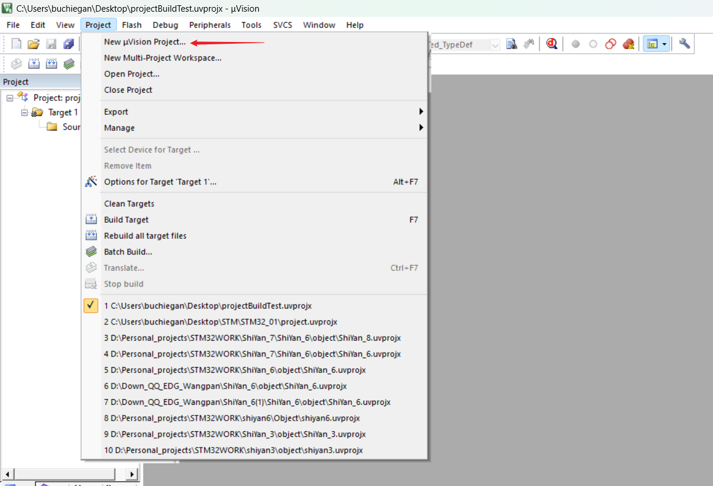

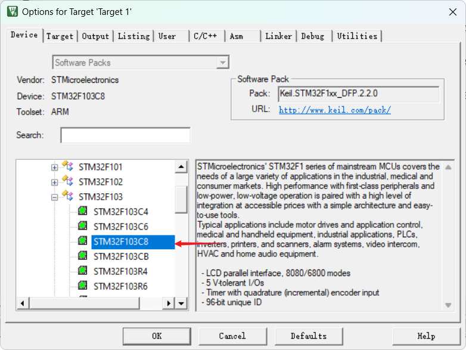

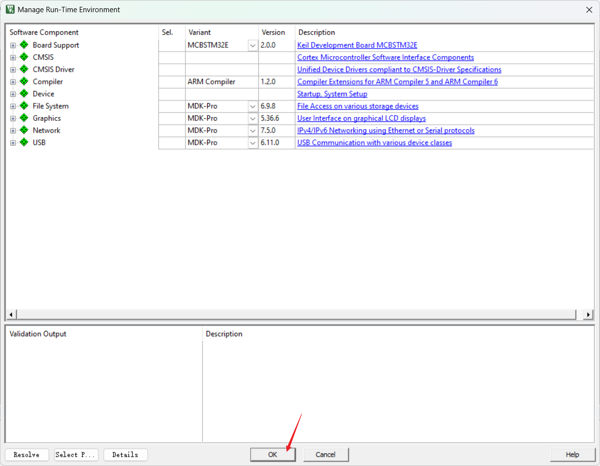

### 2、放置工程所需要的文件

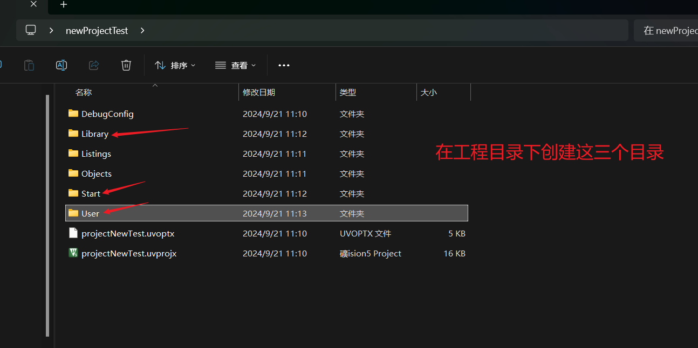
./assets/
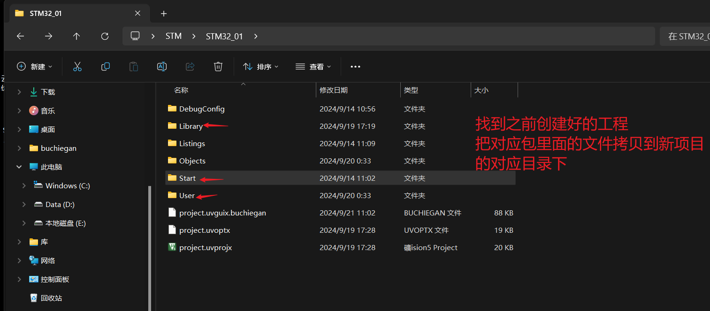

### 1. **Start 文件夹**：

- 这个文件夹通常包含由 STM32CubeMX 生成的初始化代码和配置文件。这些代码负责设置系统时钟、外设以及其他硬件配置，是项目的基础结构。

### 2. **Library 文件夹**：

- 该文件夹通常包含 STM32 HAL（硬件抽象层）库或其他标准外设库。它们提供了一系列用于控制和操作 STM32 外设的函数，方便开发者进行硬件控制。

### 3. **User 文件夹**：

- `User` 文件夹一般用于存放用户自定义的代码，包括应用程序逻辑、任务、驱动程序等。开发者在这里编写具体的业务逻辑，使用 `Start` 和 `Library` 中的功能。

### 3、将文件夹里面的内容，导入到软件的工程文件下，导入文件和我一致

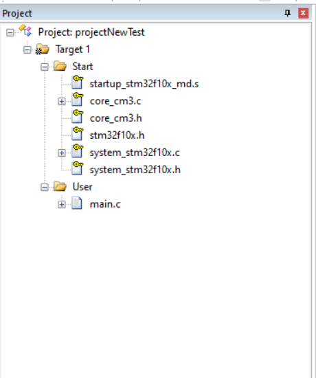


### 4、设置工程

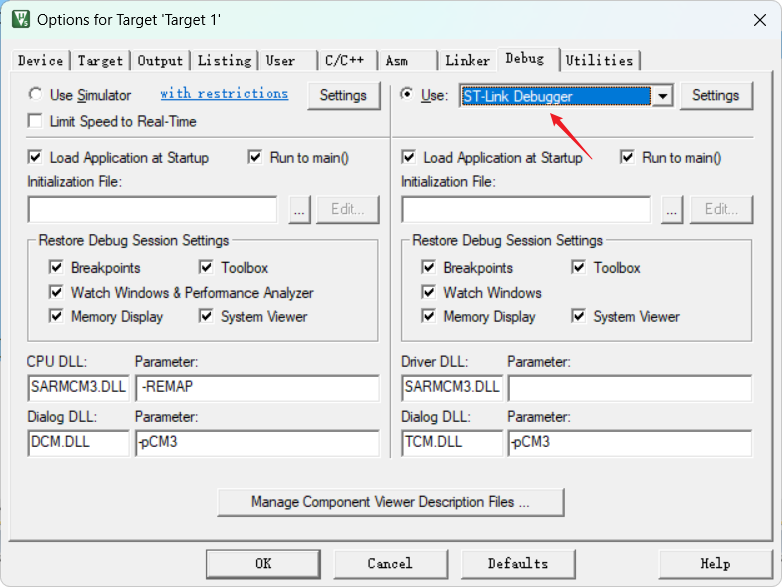

ST-Link Debugger 是 STMicroelectronics 提供的一种调试和编程工具，广泛用于 STM32 系列微控制器。它的主要功能和特点包括：

### 主要功能

1. **编程**：
   - ST-Link 可以将编译后的固件（.bin 或 .hex 文件）烧录到 STM32 微控制器的闪存中。
2. **调试**：
   - 支持单步调试、断点设置、变量监视等功能，允许开发者实时观察和修改程序的执行状态。
   - 可以通过 JTAG 或 SWD 接口与 MCU 进行连接，提供更高效的调试体验。
3. **仿真**：
   - 通过调试器，可以在运行时模拟外设和其他系统行为，帮助开发者快速发现和修复问题。

### 连接方式

- ST-Link 调试器通常通过 USB 接口连接到开发计算机，并通过 SWD 或 JTAG 接口连接到 STM32 微控制器。

### 兼容性

- ST-Link 兼容大部分 STM32 微控制器，并可与多种开发环境（如 STM32CubeIDE、Keil MDK、IAR Embedded Workbench 等）配合使用。

### 使用场景

- **开发**：在开发过程中，使用 ST-Link 进行代码的调试和测试。
- **量产**：在生产过程中，可以利用 ST-Link 对 MCU 进行批量编程。

### 总结

ST-Link Debugger 是一个强大的工具，极大地提高了 STM32 微控制器开发的效率和便利性。

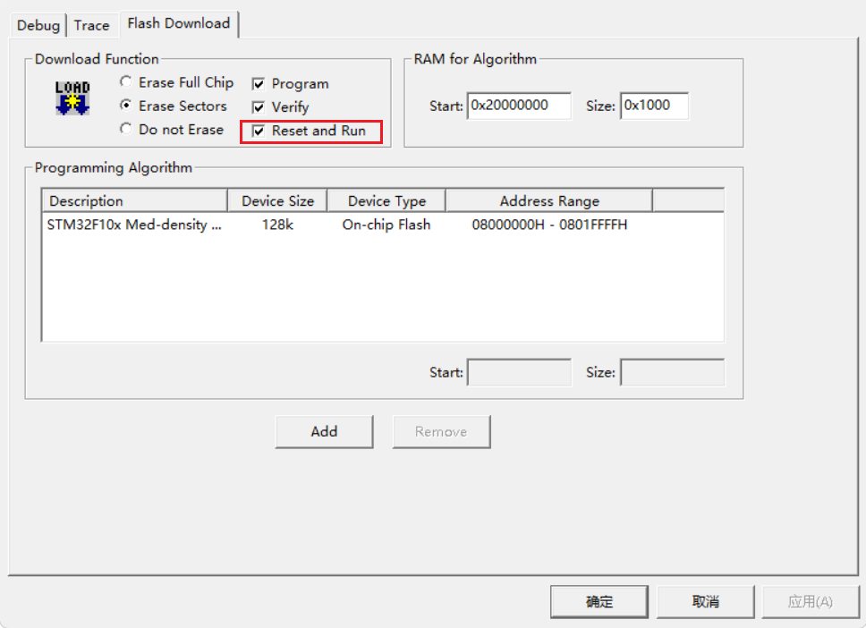

### 5、测试如何把程序，烧录进stm32中

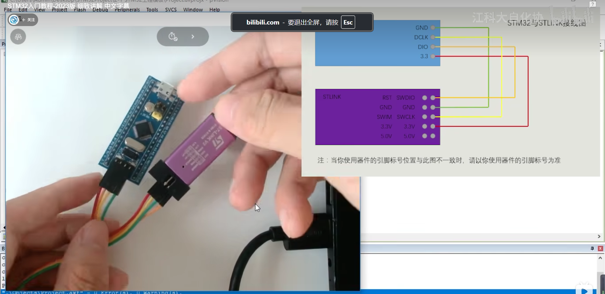

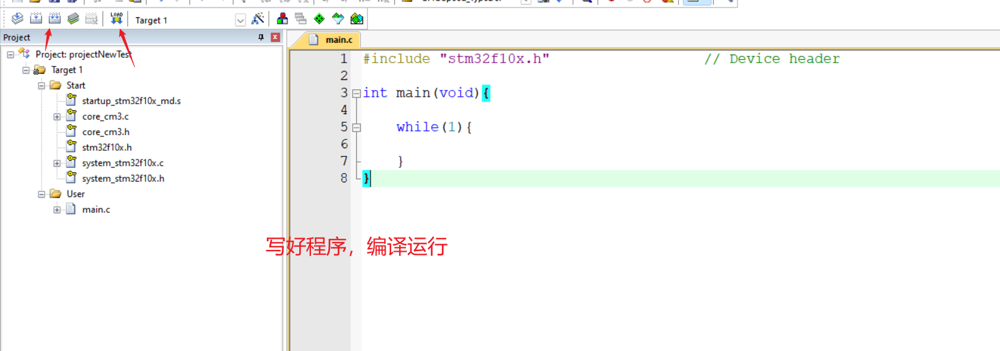

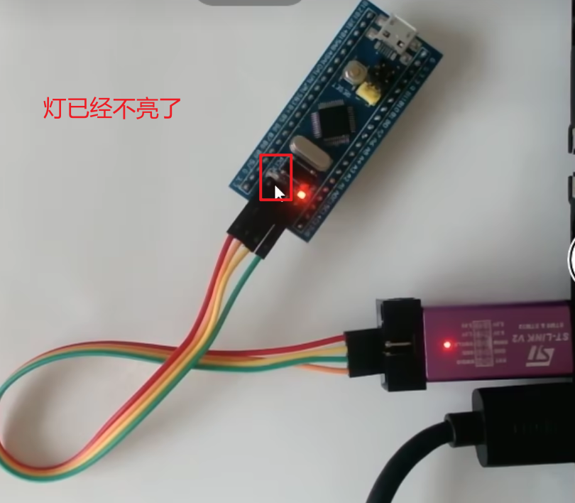

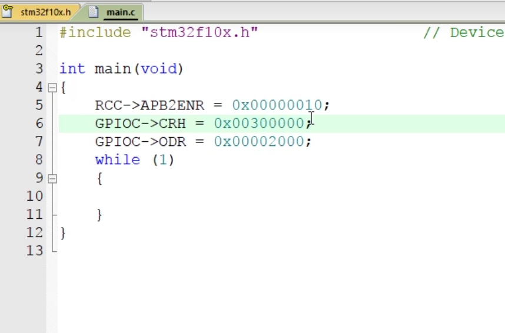

## 二、配置库函数开发

### 1、导入库函数

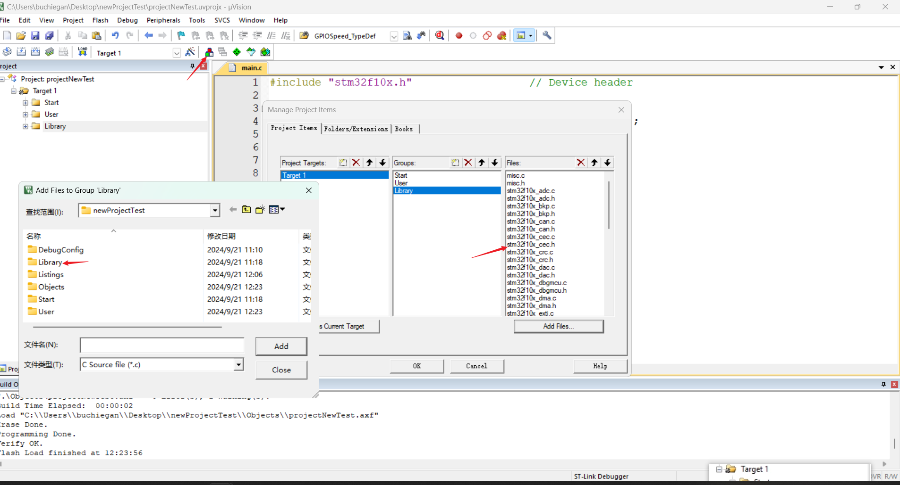

## 2、调整设置

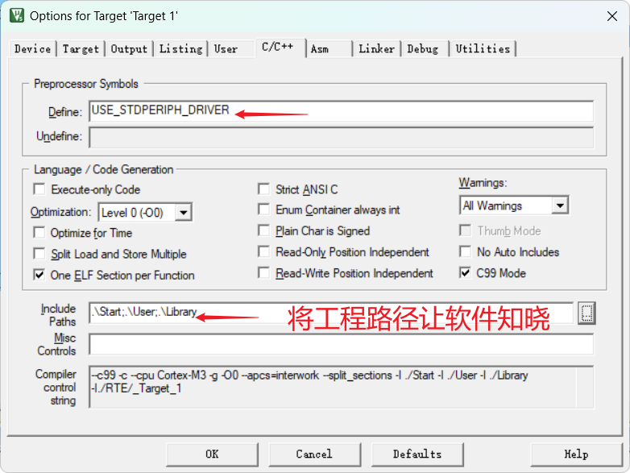

`USE_STDPERIPH_DRIVER` 是一个在 STM32 项目中常见的宏定义，用于选择是否使用标准外设库（Standard Peripheral Library）。具体来说：

### 作用

- **启用标准外设驱动**：当定义了 `USE_STDPERIPH_DRIVER`，项目会使用 STM32 的标准外设库函数来控制和配置外设。
- **禁用标准外设驱动**：如果不定义这个宏，通常意味着项目将使用 HAL 库（硬件抽象层）或直接寄存器操作。

### 使用场景

- **兼容性**：在一些旧的 STM32 项目中，可能使用标准外设库，这个宏的存在使得开发者能够选择继续使用它。
- **选择库**：开发者可以根据需求选择使用不同的库，提升代码的灵活性。

### 总结

通过定义或不定义 `USE_STDPERIPH_DRIVER`，开发者可以方便地控制项目中使用的库类型。

### 3、编写程序

```C
#include "stm32f10x.h"                  // Device header

int main(void){
	RCC_APB2PeriphClockCmd(RCC_APB2Periph_GPIOC, ENABLE);
	GPIO_InitTypeDef GPIO_InitStructure;
	GPIO_InitStructure.GPIO_Mode = GPIO_Mode_Out_PP;
	GPIO_InitStructure.GPIO_Pin = GPIO_Pin_13;
	GPIO_InitStructure.GPIO_Speed = GPIO_Speed_50MHz;
	GPIO_Init(GPIOC,&GPIO_InitStructure);
	//GPIO_SetBits(GPIOC,GPIO_Pin_13);
	GPIO_ResetBits(GPIOC,GPIO_Pin_13);
	while(1){
		
	}
}
```

### 3、编译运行

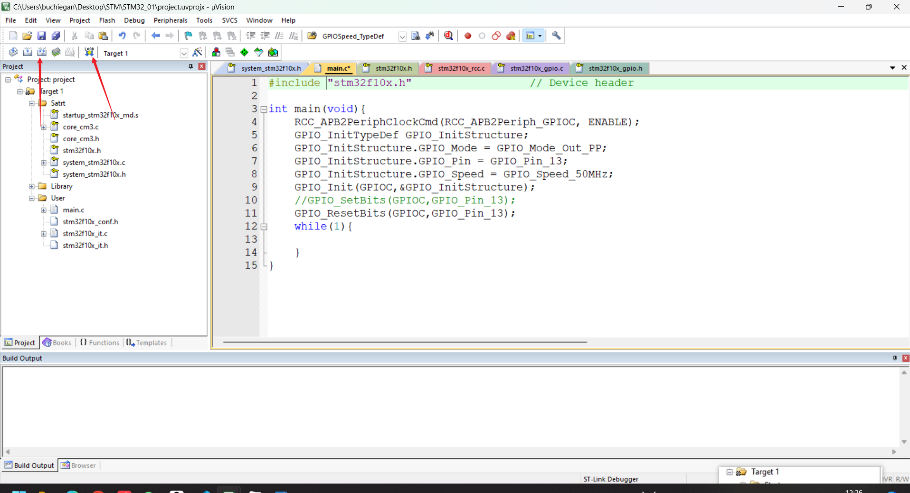