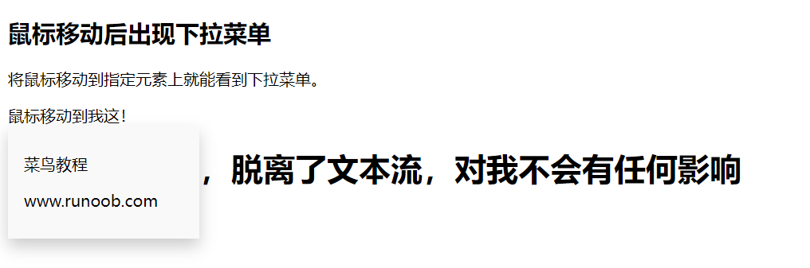

## 1、backgrounds

| Property                                                     | 描述                                         |
| :----------------------------------------------------------- | :------------------------------------------- |
| [background](https://www.runoob.com/cssref/css3-pr-background.html) | 简写属性，作用是将背景属性设置在一个声明中。 |
| [background-attachment](https://www.runoob.com/cssref/pr-background-attachment.html) | 背景图像是否固定或者随着页面的其余部分滚动。 |
| [background-color](https://www.runoob.com/cssref/pr-background-color.html) | 设置元素的背景颜色。                         |
| [background-image](https://www.runoob.com/cssref/pr-background-image.html) | 把图像设置为背景。                           |
| [background-position](https://www.runoob.com/cssref/pr-background-position.html) | 设置背景图像的起始位置。                     |
| [background-repeat](https://www.runoob.com/cssref/pr-background-repeat.html) | 设置背景图像是否及如何重复。                 |

### 1.1、CSS 属性定义背景效果:

- background-color

  - ``````
    body {background-color:#b0c4de;}
    ``````

- background-image

  - ```css
    body {
        backgroundimage:url('paper.gif');
        background-repeat:repeat-x; /**沿x轴平铺**/
        background-repeat:no-repeat;/**不平铺**/
        background-position:right top;/**调整背景图的位置**/  
        
        /**
        	flex：背景图像固定
        	scroll：背景图像随着内容滚动
        	local：背景图像在元素内部滚动
        **/
        background-attachment:flex;
    }
    
    ```

  - 默认：平铺重复显示

- background-repeat

- background-attachment

- background-position

**background合着**

```
body {background:#ffffff url('img_tree.png') no-repeat right top;}
```

## 2、文本（Text）

如果你要调整文本，可以查看下面表格内容

| [color](https://www.runoob.com/cssref/pr-text-color.html)    | 设置文本颜色             |
| ------------------------------------------------------------ | ------------------------ |
| [direction](https://www.runoob.com/cssref/pr-text-direction.html) | 设置文本方向。           |
| [letter-spacing](https://www.runoob.com/cssref/pr-text-letter-spacing.html) | 设置字符间距             |
| [line-height](https://www.runoob.com/cssref/pr-dim-line-height.html) | 设置行高                 |
| [text-align](https://www.runoob.com/cssref/pr-text-text-align.html) | 对齐元素中的文本         |
| [text-decoration](https://www.runoob.com/cssref/pr-text-text-decoration.html) | 向文本添加修饰           |
| [text-indent](https://www.runoob.com/cssref/pr-text-text-indent.html) | 缩进元素中文本的首行     |
| [text-shadow](https://www.runoob.com/cssref/css3-pr-text-shadow.html) | 设置文本阴影             |
| [text-transform](https://www.runoob.com/cssref/pr-text-text-transform.html) | 控制元素中的字母         |
| [unicode-bidi](https://www.runoob.com/cssref/pr-text-unicode-bidi.html) | 设置或返回文本是否被重写 |
| [vertical-align](https://www.runoob.com/cssref/pr-pos-vertical-align.html) | 设置元素的垂直对齐       |
| [white-space](https://www.runoob.com/cssref/pr-text-white-space.html) | 设置元素中空白的处理方式 |
| [word-spacing](https://www.runoob.com/cssref/pr-text-word-spacing.html) | 设置字间距               |

### 2.1、letter-spacing:

```
h1 {letter-spacing:2px}
h2 {letter-spacing:-3px}
```

| normal   | 默认。规定字符间没有额外的空间。               |
| -------- | ---------------------------------------------- |
| *length* | 定义字符间的固定空间（允许使用负值）。         |
| inherit  | 规定应该从父元素继承 letter-spacing 属性的值。 |

### 2.2、line-height:

```
p.small {line-height:90%}
p.big {line-height:200%}
```

| 值       | 描述                                                 |
| :------- | :--------------------------------------------------- |
| normal   | 默认。设置合理的行间距。                             |
| *number* | 设置数字，此数字会与当前的字体尺寸相乘来设置行间距。 |
| *length* | 设置固定的行间距。                                   |
| *%*      | 基于当前字体尺寸的百分比行间距。                     |
| inherit  | 规定应该从父元素继承 line-height 属性的值。          |

### 2.3、text-align:

```
h1 {text-align:center}
h2 {text-align:left}
h3 {text-align:right}
```

| 值      | 描述                                       |
| :------ | :----------------------------------------- |
| left    | 把文本排列到左边。默认值：由浏览器决定。   |
| right   | 把文本排列到右边。                         |
| center  | 把文本排列到中间。                         |
| justify | 实现两端对齐文本效果。                     |
| inherit | 规定应该从父元素继承 text-align 属性的值。 |

### 2.4、text-decoration:

```
h1 {text-decoration:overline}
h2 {text-decoration:line-through}
h3 {text-decoration:underline}
```


| 值           | 描述                                            |
| :----------- | :---------------------------------------------- |
| none         | 默认。定义标准的文本。                          |
| underline    | 定义文本下的一条线。                            |
| overline     | 定义文本上的一条线。                            |
| line-through | 定义穿过文本下的一条线。                        |
| blink        | 定义闪烁的文本。                                |
| inherit      | 规定应该从父元素继承 text-decoration 属性的值。 |

### 2.5、text-transform

| none       | 默认。定义带有小写字母和大写字母的标准的文本。 |
| ---------- | ---------------------------------------------- |
| capitalize | 文本中的每个单词以大写字母开头。               |
| uppercase  | 定义仅有大写字母。                             |
| lowercase  | 定义无大写字母，仅有小写字母。                 |
| inherit    | 规定应该从父元素继承 text-transform 属性的值。 |

## 3、字体

font-family 属性应该设置几个字体名称作为一种"后备"机制，如果浏览器不支持第一种字体，他将尝试下一种字体。

**注意**: 如果字体系列的名称超过一个字，它必须用引号，如Font Family："宋体"。

```css
p{font-family:"Times New Roman", Times, serif;}
```

| [font](https://www.runoob.com/cssref/pr-font-font.html)      | 在一个声明中设置所有的字体属性       |
| ------------------------------------------------------------ | ------------------------------------ |
| [font-family](https://www.runoob.com/cssref/pr-font-font-family.html) | 指定文本的字体系列                   |
| [font-size](https://www.runoob.com/cssref/pr-font-font-size.html) | 指定文本的字体大小                   |
| [font-style](https://www.runoob.com/cssref/pr-font-font-style.html) | 指定文本的字体样式                   |
| [font-variant](https://www.runoob.com/cssref/pr-font-font-variant.html) | 以小型大写字体或者正常字体显示文本。 |
| [font-weight](https://www.runoob.com/cssref/pr-font-weight.html) | 指定字体的粗细。                     |

### 3.1、em单位的好处

- 子元素设置为em单位，可以跟随父元素的字体大小变动而变动
- 如果你不指定一个字体的大小，默认大小和普通文本段落一样，是16像素（16px=1em）

## 4、链接：

```
a:link {color:#000000;}      /* 未访问链接*/
a:visited {color:#00FF00;}  /* 已访问链接 */
a:hover {color:#FF00FF;}  /* 鼠标移动到链接上 */
a:active {color:#0000FF;}  /* 鼠标点击时 */
```

## 5、列表


| [list-style](https://www.runoob.com/cssref/pr-list-style.html) | 简写属性。用于把所有用于列表的属性设置于一个声明中 |
| ------------------------------------------------------------ | -------------------------------------------------- |
| [list-style-image](https://www.runoob.com/cssref/pr-list-style-image.html) | 将图像设置为列表项标志。                           |
| [list-style-position](https://www.runoob.com/cssref/pr-list-style-position.html) | 设置列表中列表项标志的位置。                       |
| [list-style-type](https://www.runoob.com/cssref/pr-list-style-type.html) | 设置列表项标志的类型。                             |

### 5.1、list-style-type


```css
ul.a {list-style-type: circle;}
ul.b {list-style-type: square;}
 
ol.c {list-style-type: upper-roman;}
ol.d {list-style-type: lower-alpha;}
```

### 5.2、list-style-image

```css
ul
{
    list-style-image: url('sqpurple.gif');
}
```

## 6、表格样式

**border-collapse:collapse;**这个是去除间隔的


```css
table
{
    border-collapse:collapse;
}
table,th, td
{
    border: 1px solid black;
}
```

## 7、盒子模型


## 8、border（边框）

| 边框样式 | 定义                                                   |
| -------- | ------------------------------------------------------ |
| `dotted` | 定义一个点线边框                                       |
| `dashed` | 定义一个虚线边框                                       |
| `solid`  | 定义实线边框                                           |
| `double` | 定义两个边框。两个边框的宽度与 `border-width` 的值相同 |
| `groove` | 定义 3D 沟槽边框。效果取决于边框的颜色值               |
| `ridge`  | 定义 3D 脊边框。效果取决于边框的颜色值                 |
| `inset`  | 定义一个 3D 的嵌入边框。效果取决于边框的颜色值         |
| `outset` | 定义一个 3D 突出边框。效果取决于边框的颜色值           |

```css
div{
	border:1px red solid;
    border-style:solid;
    border-color:red;
    border-width:10px;
    
    border-left-style:double;
    border-right=color:red;
    
    border-top-left-radius:20px;
}
```

## 9、轮廓

轮廓就是border外面的一层

```
outline:green dotted thick;
```

## 10、尺寸

| [height](https://www.runoob.com/cssref/pr-dim-height.html)   | 设置元素的高度。     |
| ------------------------------------------------------------ | -------------------- |
| [line-height](https://www.runoob.com/cssref/pr-dim-line-height.html) | 设置行高。           |
| [max-height](https://www.runoob.com/cssref/pr-dim-max-height.html) | 设置元素的最大高度。 |
| [max-width](https://www.runoob.com/cssref/pr-dim-max-width.html) | 设置元素的最大宽度。 |
| [min-height](https://www.runoob.com/cssref/pr-dim-min-height.html) | 设置元素的最小高度。 |
| [min-width](https://www.runoob.com/cssref/pr-dim-min-width.html) | 设置元素的最小宽度。 |
| [width](https://www.runoob.com/cssref/pr-dim-width.html)     | 设置元素的宽度。     |

## 11、display

隐藏一个元素可以通过把display属性设置为"none"，或把visibility属性设置为"hidden"。但是请注意，这两种方法会产生不同的结果。

visibility:hidden可以隐藏某个元素，但隐藏的元素仍需占用与未隐藏之前一样的空间。也就是说，该元素虽然被隐藏了，但仍然会影响布局。

display:none是直接将这个元素从空间布局中抹除掉

**display:inline：**把元素变成行内块元素

**display:block：**把元素变成块级元素


## 12、position

- static

  - position的默认属性，也就是遵循自然的文档流
  - 静态定位的元素不会受到 top, bottom, left, right影响。

- relative

  - 相对定位元素的定位是相对其正常位置。不是相对其父元素啥的
  - 移动相对定位元素，但它原本所占的空间不会改变。

- fixed

  - 元素的位置相对于浏览器窗口是固定位置。即使窗口是滚动的它也不会移动：

  - ```css
    p.pos_fixed {
        position:fixed;
        top:30px;
        right:5px; 
    }
    ```

- absolute

  - 绝对定位的元素的位置相对于最近的已定位父元素，如果元素没有已定位的父元素，那么它的位置相对于<html>:

  - 采用采用absolute，会照成其脱离原来的文本流，也就是在原来的文本流里面，像消失一样

  - ```css
    /**
    	只进行这样设置，它现在是就在它原来的位置上
    **/
    .two{
    	position:absolute;
    }
    /**
    	我在进行实验的时候发现一个很怪异的问题，经过探究发现，在.two进行绝对定位的时候，没有父元素进行参考的时候，应该是相对于body进行定位的。但是其位置却并没有发生变动，照成这个的原因是：在.two盒子变成绝对定位的时候，是保持原来的位置不变的，但是当我们调整top或者left的时候就会发现，它是依据body进行调整位置的。
    	所以以后在进行绝对定位的时候，为了出现奇异，最好是做了绝对定位后，给top和left赋值为0。
    **/
    .two{
        position:absolute;
        top:100px;
        left:100px;
    }
    ```

  - 

- sticky

  - 这个就是我一直在找的华为导航栏的效果

    - ```css
      div.sticky {
        /* position: -webkit-sticky; */
        position: sticky;
        top: 0px;
        padding: 5px;
        background-color: #cae8ca;
        border: 2px solid #4CAF50;
      }
      ```

    - 当div的top为0的时候，采用position:fixed定位


## 13、OverFlow

| visible | 默认值。内容不会被修剪，会呈现在元素框之外。             |
| ------- | -------------------------------------------------------- |
| hidden  | 内容会被修剪，并且其余内容是不可见的。                   |
| scroll  | 内容会被修剪，但是浏览器会显示滚动条以便查看其余的内容。 |
| auto    | 如果内容被修剪，则浏览器会显示滚动条以便查看其余的内容。 |
| inherit | 规定应该从父元素继承 overflow 属性的值。                 |

## 14、浮动float

| [clear](https://www.runoob.com/cssref/pr-class-clear.html) | 指定不允许元素周围有浮动元素。     | left right both none inherit |      |
| ---------------------------------------------------------- | ---------------------------------- | ---------------------------- | ---- |
| [float](https://www.runoob.com/cssref/pr-class-float.html) | 指定一个盒子（元素）是否可以浮动。 | left right none inherit      |      |

**元素怎样浮动**

元素的水平方向浮动，意味着元素只能左右移动而不能上下移动。

一个浮动元素会尽量向左或向右移动，直到它的外边缘碰到包含框或另一个浮动框的边框为止。

浮动元素之后的元素将围绕它。

浮动元素之前的元素将不会受到影响。

如果图像是右浮动，下面的文本流将环绕在它左边：

## 15、对齐方式

### 15.1、采用margin

这个针对块级元素，在整个屏幕中居中

```css
.center {
    margin: auto;
    width: 50%;
    border: 3px solid green;
    padding: 10px;
}
```

**注意:** 如果没有设置 **width** 属性(或者设置 100%)，居中对齐将不起作用。

### 15.2、采用text-align

盒子内的文本居中

```css
.center {
    text-align: center;
    border: 3px solid green;
}
```

### 15.3、采用position

```css
.right {
    position: absolute;
    right: 0px;
    width: 300px;
    border: 3px solid #73AD21;
    padding: 10px;
}
```

### 15.4、采用float

```css
.right {
    float: right;
    width: 300px;
    border: 3px solid #73AD21;
    padding: 10px;
}
```

### 15.5、采用line-height

```css
.center {
    line-height: 200px;
    height: 200px;
    border: 3px solid green;
    text-align: center;
}
 
/* 如果文本有多行，添加以下代码: */
.center p {
    line-height: 1.5;
    display: inline-block;
    vertical-align: middle;
}
```

### 15.6、采用transform

```css
.center { 
    height: 200px;
    position: relative;
    border: 3px solid green; 
}
 
.center p {
    margin: 0;
    position: absolute;
    top: 50%;
    left: 50%;
    transform: translate(-50%, -50%);
}
```

## 16、组合选择符

### 16.1、子元素选择器(>)

与后代选择器相比，子元素选择器（Child selectors）只能选择作为某元素直接/一级子元素的元素。

以下实例选择了<div>元素中所有直接子元素 <p> ：

**注意：**采用“>”只能针对父元素下面的第一个子元素使用

```css
div>p
{
  background-color:yellow;
}
```

### 16.2、相邻兄弟选择器(+)

相邻兄弟选择器（Adjacent sibling selector）可选择紧接在另一元素后的元素，且二者有相同父元素。

如果需要选择紧接在另一个元素后的元素，而且二者有相同的父元素，可以使用相邻兄弟选择器（Adjacent sibling selector）。

以下实例选取了所有位于 <div> 元素后的第一个 <p> 元素:

```css
div+p
{
  background-color:yellow;
}
```

### 16.3、后续兄弟选择器(~)

后续兄弟选择器选取所有指定元素之后的相邻兄弟元素。

以下实例选取了所有 <div> 元素之后的所有相邻兄弟元素 <p> : 

```css
div~p
{
  background-color:yellow;
}
```


### 总结：

```css
div>p{}	选中div内的所有子元素
div>p:first-child b：first-child{}选中div内的第一个p标签里面的第一个b标签

div+p{}	选中div同级的第一个p标签
div+p>b:first-child{}选中div同级的第一个p标签里面的第一个b标签

div~p>b:first-child{}选中div同级的所有p标签里面的第一个b标签
```


## 17、伪类

### 17.1、anchor伪类

注意：在CSS定义中，a:hover 必须被置于 a:link 和 a:visited 之后，才是有效的。

注意：在 CSS 定义中，a:active 必须被置于 a:hover 之后，才是有效的。

```css
a:link{color:red}
a:visted{color:blue}
a:hover{color:organ}
a:active{color:blue}
```

### 17.2、first-child伪类

您可以使用 :first-child 伪类来选择父元素的第一个子元素。

```css
在一个html中有多个p标签,我要如何才能只针对第一个标签做样式呢？
p:first-child{
    color:blue;
}

<p></p>
<p></p>
<p></p>
<p></p>
/**
	div的第一个p标签的b标签变成红色
**/
div>p:first-child b{
    color:red;
}
```

所有CSS伪类/元素

| 选择器                                                       | 示例                  | 示例说明                                        |
| :----------------------------------------------------------- | :-------------------- | :---------------------------------------------- |
| [:checked](https://www.runoob.com/cssref/sel-checked.html)   | input:checked         | 选择所有选中的表单元素                          |
| [:disabled](https://www.runoob.com/css/cssref/sel-disabled.html) | input:disabled        | 选择所有禁用的表单元素                          |
| [:empty](https://www.runoob.com/cssref/sel-empty.html)       | p:empty               | 选择所有没有子元素的p元素                       |
| [:enabled](https://www.runoob.com/cssref/sel-enable.html)    | input:enabled         | 选择所有启用的表单元素                          |
| [:first-of-type](https://www.runoob.com/cssref/sel-first-of-type.html) | p:first-of-type       | 选择的每个 p 元素是其父元素的第一个 p 元素      |
| [:in-range](https://www.runoob.com/cssref/sel-in-range.html) | input:in-range        | 选择元素指定范围内的值                          |
| [:invalid](https://www.runoob.com/cssref/sel-invalid.html)   | input:invalid         | 选择所有无效的元素                              |
| [:last-child](https://www.runoob.com/cssref/sel-last-child.html) | p:last-child          | 选择所有p元素的最后一个子元素                   |
| [:last-of-type](https://www.runoob.com/cssref/sel-last-of-type.html) | p:last-of-type        | 选择每个p元素是其母元素的最后一个p元素          |
| [:not(selector)](https://www.runoob.com/cssref/sel-not.html) | :not(p)               | 选择所有p以外的元素                             |
| [:nth-child(n)](https://www.runoob.com/cssref/sel-nth-child.html) | p:nth-child(2)        | 选择所有 p 元素的父元素的第二个子元素           |
| [:nth-last-child(n)](https://www.runoob.com/cssref/sel-nth-last-child.html) | p:nth-last-child(2)   | 选择所有p元素倒数的第二个子元素                 |
| [:nth-last-of-type(n)](https://www.runoob.com/cssref/sel-nth-last-of-type.html) | p:nth-last-of-type(2) | 选择所有p元素倒数的第二个为p的子元素            |
| [:nth-of-type(n)](https://www.runoob.com/cssref/sel-nth-of-type.html) | p:nth-of-type(2)      | 选择所有p元素第二个为p的子元素                  |
| [:only-of-type](https://www.runoob.com/cssref/sel-only-of-type.html) | p:only-of-type        | 选择所有仅有一个子元素为p的元素                 |
| [:only-child](https://www.runoob.com/cssref/sel-only-child.html) | p:only-child          | 选择所有仅有一个子元素的p元素                   |
| [:optional](https://www.runoob.com/cssref/sel-optional.html) | input:optional        | 选择没有"required"的元素属性                    |
| [:out-of-range](https://www.runoob.com/cssref/sel-out-of-range.html) | input:out-of-range    | 选择指定范围以外的值的元素属性                  |
| [:read-only](https://www.runoob.com/cssref/sel-read-only.html) | input:read-only       | 选择只读属性的元素属性                          |
| [:read-write](https://www.runoob.com/cssref/sel-read-write.html) | input:read-write      | 选择没有只读属性的元素属性                      |
| [:required](https://www.runoob.com/cssref/sel-required.html) | input:required        | 选择有"required"属性指定的元素属性              |
| [:root](https://www.runoob.com/cssref/sel-root.html)         | root                  | 选择文档的根元素                                |
| [:target](https://www.runoob.com/cssref/sel-target.html)     | #news:target          | 选择当前活动#news元素(点击URL包含锚的名字)      |
| [:valid](https://www.runoob.com/cssref/sel-valid.html)       | input:valid           | 选择所有有效值的属性                            |
| [:link](https://www.runoob.com/cssref/sel-link.html)         | a:link                | 选择所有未访问链接                              |
| [:visited](https://www.runoob.com/cssref/sel-visited.html)   | a:visited             | 选择所有访问过的链接                            |
| [:active](https://www.runoob.com/cssref/sel-active.html)     | a:active              | 选择正在活动链接                                |
| [:hover](https://www.runoob.com/cssref/sel-hover.html)       | a:hover               | 把鼠标放在链接上的状态                          |
| [:focus](https://www.runoob.com/cssref/sel-focus.html)       | input:focus           | 选择元素输入后具有焦点                          |
| [:first-letter](https://www.runoob.com/cssref/sel-firstletter.html) | p:first-letter        | 选择每个<p> 元素的第一个字母                    |
| [:first-line](https://www.runoob.com/cssref/sel-firstline.html) | p:first-line          | 选择每个<p> 元素的第一行                        |
| [:first-child](https://www.runoob.com/cssref/sel-firstchild.html) | p:first-child         | 选择器匹配属于任意元素的第一个子元素的 <p> 元素 |
| [:before](https://www.runoob.com/cssref/sel-before.html)     | p:before              | 在每个<p>元素之前插入内容                       |
| [:after](https://www.runoob.com/cssref/sel-after.html)       | p:after               | 在每个<p>元素之后插入内容                       |
| [:lang(*language*)](https://www.runoob.com/cssref/sel-lang.html) | p:lang(it)            | 为<p>元素的lang属性选择一个开始值               |

## 18、css伪元素

### 18.1、:first-line 伪元素

```css
选中p标签的第一行文本内容

p:first-line 
{
    color:#ff0000;
    font-variant:small-caps;
}
```

**注意：**"first-line" 伪元素只能用于块级元素。

**注意：** 下面的属性可应用于 "first-line" 伪元素：

- font properties
- color properties 
- background properties
- word-spacing
- letter-spacing
- text-decoration
- vertical-align
- text-transform
- line-height
- clear

### 18.2、:first-letter 伪元素

```css
选中p标签第一行的第一个单词
p:first:letter{
	color:red
}
```

**注意：** "first-letter" 伪元素只能用于块级元素。

**注意：** 下面的属性可应用于 "first-letter" 伪元素： 

- font properties
- color properties 
- background properties
- margin properties
- padding properties
- border properties
- text-decoration
- vertical-align (only if "float" is "none")
- text-transform
- line-height
- float
- clear

### 18.3、CSS - :before 伪元素

```css
在h1标签的头部加上一张图片，但是不能改变其大小
h1:before{
    content:url('../assets/images.png')
}
```

### 18.4、:affter伪元素

```css
h1:after{
    content:url("./assets/img.png")
}
```

所有CSS伪类/元素

| 选择器                                                       | 示例           | 示例说明                                        |
| :----------------------------------------------------------- | :------------- | :---------------------------------------------- |
| [:link](https://www.runoob.com/cssref/sel-link.html)         | a:link         | 选择所有未访问链接                              |
| [:visited](https://www.runoob.com/cssref/sel-visited.html)   | a:visited      | 选择所有访问过的链接                            |
| [:active](https://www.runoob.com/cssref/sel-active.html)     | a:active       | 选择正在活动链接                                |
| [:hover](https://www.runoob.com/cssref/sel-hover.html)       | a:hover        | 把鼠标放在链接上的状态                          |
| [:focus](https://www.runoob.com/cssref/sel-focus.html)       | input:focus    | 选择元素输入后具有焦点                          |
| [:first-letter](https://www.runoob.com/cssref/sel-firstletter.html) | p:first-letter | 选择每个<p> 元素的第一个字母                    |
| [:first-line](https://www.runoob.com/cssref/sel-firstline.html) | p:first-line   | 选择每个<p> 元素的第一行                        |
| [:first-child](https://www.runoob.com/cssref/sel-firstchild.html) | p:first-child  | 选择器匹配属于任意元素的第一个子元素的 <p> 元素 |
| [:before](https://www.runoob.com/cssref/sel-before.html)     | p:before       | 在每个<p>元素之前插入内容                       |
| [:after](https://www.runoob.com/cssref/sel-after.html)       | p:after        | 在每个<p>元素之后插入内容                       |
| [:lang(*language*)](https://www.runoob.com/cssref/sel-lang.html) | p:lang(it)     | 为<p>元素的lang属性选择一个开始值               |

## 19、导航栏

### 19.1、侧边导航栏


```html
<!DOCTYPE html>
<html lang="en">
<head>
    <meta charset="UTF-8">
    <meta name="viewport" content="width=device-width, initial-scale=1.0">
    <title>Document</title>
    <style>
        ul{
            list-style-type: none;
            background-color: aliceblue;
            width: 25%;
            position: fixed;
            height: 100%;
            margin: 0;
            padding: 0;
            overflow: auto;
        }
        li a{
            display: block;
            text-decoration: none;
            padding: 8px 16px;
            color: black;
        }
        li a.active{
            background-color: #4CAF50;
            color: white;
        }
        li a:hover:not(.active){
            background-color: #555;
            color: white;

        }


    </style>
</head>
<body>
    <ul>
        <li><a class="active" href="#home">主页</a></li>
        <li><a href="#news">新闻</a></li>
        <li><a href="#contact">联系</a></li>
        <li><a href="#about">关于</a></li>
    </ul>
    <div style="margin-left:25%;padding:1px 16px;height:1000px;">
        <h2>Fixed Full-height Side Nav</h2>
        <h3>Try to scroll this area, and see how the sidenav sticks to the page</h3>
        <p>Notice that this div element has a left margin of 25%. This is because the side navigation is set to 25% width. If you remove the margin, the sidenav will overlay/sit on top of this div.</p>
        <p>Also notice that we have set overflow:auto to sidenav. This will add a scrollbar when the sidenav is too long (for example if it has over 50 links inside of it).</p>
        <p>Some text..</p>
        <p>Some text..</p>
        <p>Some text..</p>
        <p>Some text..</p>
        <p>Some text..</p>
        <p>Some text..</p>
        <p>Some text..</p>
      </div>
</body>
</html>
```


### 19.2、头部导航栏


```html
<!DOCTYPE html>
<html>
<head>
<meta charset="utf-8">
<title>菜鸟教程(runoob.com)</title>
<style>
body {margin:0;}

ul {
    list-style-type: none;
    margin: 0;
    padding: 0;
    overflow: hidden;
    background-color: #333;
    position: fixed;
    top: 0;
    width: 100%;
}

li {
    float: left;
}

li a {
    display: block;
    color: white;
    text-align: center;
    padding: 14px 16px;
    text-decoration: none;
}

li a:hover:not(.active) {
    background-color: #111;
}

.active {
    background-color: #4CAF50;
}
</style>
</head>
<body>

<ul>
  <li><a class="active" href="#home">主页</a></li>
  <li><a href="#news">新闻</a></li>
  <li><a href="#contact">联系</a></li>
  <li><a href="#about">关于</a></li>
</ul>

<div style="padding:20px;margin-top:30px;background-color:#1abc9c;height:1500px;">
<h1>Fixed Top Navigation Bar</h1>
<h2>Scroll this page to see the effect</h2>
<h2>The navigation bar will stay at the top of the page while scrolling</h2>

<p>Some text some text some text some text..</p>
<p>Some text some text some text some text..</p>
<p>Some text some text some text some text..</p>
<p>Some text some text some text some text..</p>
<p>Some text some text some text some text..</p>
<p>Some text some text some text some text..</p>
<p>Some text some text some text some text..</p>
<p>Some text some text some text some text..</p>
<p>Some text some text some text some text..</p>
<p>Some text some text some text some text..</p>
<p>Some text some text some text some text..</p>
<p>Some text some text some text some text..</p>
<p>Some text some text some text some text..</p>
<p>Some text some text some text some text..</p>
<p>Some text some text some text some text..</p>
<p>Some text some text some text some text..</p>
<p>Some text some text some text some text..</p>
<p>Some text some text some text some text..</p>
<p>Some text some text some text some text..</p>
<p>Some text some text some text some text..</p>
</div>

</body>
</html>
```

## 20、下拉菜单



```html
<!DOCTYPE html>
<html lang="en">
<head>
    <meta charset="UTF-8">
    <meta name="viewport" content="width=device-width, initial-scale=1.0">
    <title>Document</title>
    <style>
        
        .dropdown-content {
            display: none;
            background-color: #f9f9f9;
            min-width: 160px;
            box-shadow: 0px 8px 16px 0px rgba(0,0,0,0.2);
            padding: 12px 16px;
            position: absolute;
        }
        .dropdown:hover .dropdown-content {
            display: block;

        }
    </style>
</head>
<body>
    <h2>鼠标移动后出现下拉菜单</h2>
<p>将鼠标移动到指定元素上就能看到下拉菜单。</p>

<div class="dropdown">
  <span>鼠标移动到我这！</span>
  <div class="dropdown-content">
    <p>菜鸟教程</p>
    <p>www.runoob.com</p>
  </div>
  <h1>弹窗内容已经，脱离了文本流，对我不会有任何影响</h1>
</div>
</body>
</html>
```


```html
<!DOCTYPE html>
<html lang="en">
<head>
    <meta charset="UTF-8">
    <meta name="viewport" content="width=device-width, initial-scale=1.0">
    <title>Document</title>
    <style>
        .dropdown{
            position: relative;
        }
        .dropdown:hover .dropdown-content{
            display: block;
        }
        .dropdown:hover .dropbtn{
            background-color: #0e260f;
        }
        .dropbtn{
          background-color: #4CAF50;
          border: none;
          font-size: 16px;
          color: white;
          cursor: pointer;
          padding: 16px;
        }
        .dropdown-content{
            display: none;
            position: absolute;
            background-color:  #f9f9f9;
            min-width: 160px;
            box-shadow: 0px 8px 16px 0px rgba(0,0,0,0.2);
        }
        .dropdown-content a{
            display: block;
            text-decoration: none;
            padding: 12px 16px;
            color: black;
        }
     .dropdown-content a:hover{
            background-color: #f1f1f1;
        }
    </style>
</head>
<body>
    <div class="dropdown" style="float:left;">
        <button class="dropbtn">左</button>
        <div class="dropdown-content" style="left:0;">
          <a href="#">菜鸟教程 1</a>
          <a href="#">菜鸟教程 2</a>
          <a href="#">菜鸟教程 3</a>
        </div>
      </div>
      
      <div class="dropdown" style="float:right;">
        <button class="dropbtn">右</button>
        <div class="dropdown-content">
          <a href="#">菜鸟教程 1</a>
          <a href="#">菜鸟教程 2</a>
          <a href="#">菜鸟教程 3</a>
        </div>
      </div>
</body>
</html>
```

## 21、提示弹窗

```html
<!DOCTYPE html>
<html lang="en">
<head>
    <meta charset="UTF-8">
    <meta name="viewport" content="width=device-width, initial-scale=1.0">
    <title>Document</title>
    <style>
        .tooltip{
            position: relative;
            display: inline-block;
            border-bottom: 1px dotted black;
        }
        .tooltip:hover .tooltiptext{
           visibility: visible;
           opacity: 1;
        }
        .tooltiptext{
            visibility: hidden;
            width: 120px;
            background-color: black;
            color: white;
            text-align: center;
            padding: 5px 0;
            position: absolute;
            z-index: 1;
            bottom:100%;
            left: 50%;
            margin-left: -60px;
            opacity: 0;
            transition: opacity 1s;

        }
    </style>
</head>
<body>
    <h2>提示工具淡入效果</h2>
    <p>鼠标移动到以下元素，提示工具会再一秒内从 0% 到 100% 完全显示。</p>
    <div class="tooltip">
        鼠标移动到我这
        <span class="tooltiptext">提示文本</span>
    </div>
</body>
</html>
```

