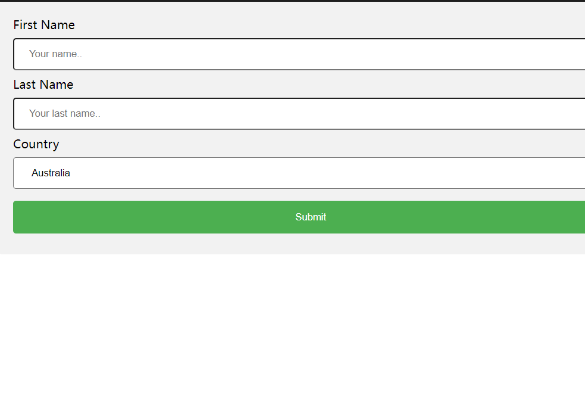

## 1、属性选择器
```html
/* 选择所有具有 `type` 属性的元素 */
[type] {
  border: 1px solid red;
}
```
### 2、[attribute="value"]

选择具有指定属性和值完全匹配的元素。

```
/* 选择所有 `type` 属性等于 `text` 的元素 */
[type="text"] {
  background-color: yellow;
}
```

### 3、[attribute~="value"]

选择属性值中包含指定词（用空格分隔的词列表之一）的元素。

```
/* 选择属性值中包含 `button` 的元素 */
[class~="button"] {
  font-weight: bold;
}
```

### 4、[attribute|="value"]

选择具有指定值或者以指定值开头并紧跟着连字符 - 的属性值的元素，常用于语言代码。

```
/* 选择所有 `lang` 属性是 `en` 或者以 `en-` 开头的元素 */
[lang|="en"] {
  color: green;
}
```

### 5、[attribute^="value"]

选择属性值以指定值开头的元素。

```
/* 选择所有 `href` 属性以 `https` 开头的链接 */
[href^="https"] {
  text-decoration: none;
}
```

### 6、[attribute$="value"]

选择属性值以指定值结尾的元素。

```
/* 选择所有 src 属性以 .jpg 结尾的图片 */
[src$=".jpg"] {
  border: 2px solid blue;
}
```

### 7、[attribute="value"]*

选择属性值中包含指定值的元素。

```
/* 选择所有 `title` 属性中包含 `tutorial` 的元素 */
[title*="tutorial"] {
  font-style: italic;
}
```


## 2、表单

### 2.1普通表单



```
<!DOCTYPE html>
<html lang="en">
<head>
    <meta charset="UTF-8">
    <meta name="viewport" content="width=device-width, initial-scale=1.0">
    <title>Document</title>
    <style>
        *{
            padding: 0;
            margin: 0;
        }
        input[type=text], select{
            width: 100%;
            padding: 12px 20px;
            margin: 8px 0;
            display: inline-block;
            border: 1px red #ccc;
            border-radius: 4px;
            box-sizing: border-box;
        }
        input[type=submit]{
            width: 100%;
            background-color: #4CAF50;
            color: white;
            padding: 14px 20px;
            margin:8px 0;
            border:none;
            border-radius: 4px;
            cursor: pointer;
        }
        input[type=submit]:hover{
            background-color: #45a049;
        }
        div{
            margin: auto;
            width: 800px;
            border-radius: 5px;
            background-color: #f2f2f2;
            padding: 20px;
        }

    </style>
</head>
<body>
    <div>
        <form action="/action_page.php">
          <label for="fname">First Name</label>
          <input type="text" id="fname" name="firstname" placeholder="Your name..">
      
          <label for="lname">Last Name</label>
          <input type="text" id="lname" name="lastname" placeholder="Your last name..">
      
          <label for="country">Country</label>
          <select id="country" name="country">
            <option value="australia">Australia</option>
            <option value="canada">Canada</option>
            <option value="usa">USA</option>
          </select>
        
          <input type="submit" value="Submit">
        </form>
      </div>
      
</body>
</html>
```

## 3、计数器


```html
<!DOCTYPE html>
<html lang="en">
<head>
  <meta charset="UTF-8">
  <meta name="viewport" content="width=device-width, initial-scale=1.0">
  <title>Document</title>
  <style>
    body{
      counter-reset: section;
    }
    h1{
      counter-reset:subsection;
    }
    h1::before{
      counter-increment: section;
      content:"Section" counter(section) ". "
    }
    h2::before{
      counter-increment: subsection;
      content: counter(section) "." counter(subsection) "、";
    }

  </style>
</head>
<body>
  <h1>HTML 教程:</h1>
  <h2>HTML 教程</h2>
  <h2>CSS 教程</h2>
  
  <h1>Scripting 教程:</h1>
  <h2>JavaScript</h2>
  <h2>VBScript</h2>
  
  <h1>XML 教程:</h1>
  <h2>XML</h2>
  <h2>XSL</h2>
  
  <p><b>注意:</b> IE8 需要指定 !DOCTYPE 才可以支持该属性。</p>
</body>
</html>
```


```html
<!DOCTYPE html>
<html lang="en">
<head>
  <meta charset="UTF-8">
  <meta name="viewport" content="width=device-width, initial-scale=1.0">
  <title>Document</title>
  <style>
    ol{
      counter-reset: section;
      list-style-type: none;
    }
    li::before{
      counter-increment: section;
      content: counters(section,".") " ";
    }
  </style>
</head>
<body>
  <ol>
  <li>item</li>
  <li>item   
  <ol>
    <li>item</li>
    <li>item</li>
    <li>item
    <ol>
      <li>item</li>
      <li>item</li>
      <li>item</li>
    </ol>
    </li>
    <li>item</li>
  </ol>
  </li>
  <li>item</li>
  <li>item</li>
</ol>

<ol>
  <li>item</li>
  <li>item</li>
</ol>
</body>
</html>
```


