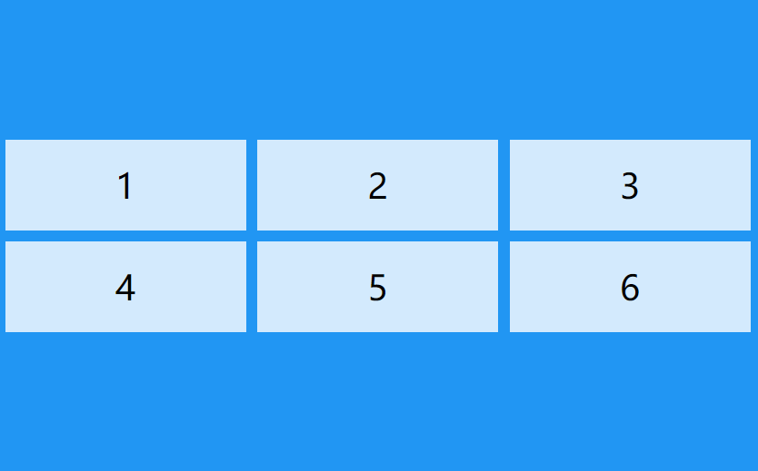
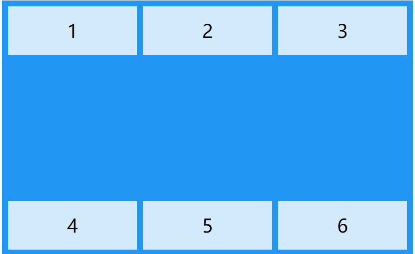
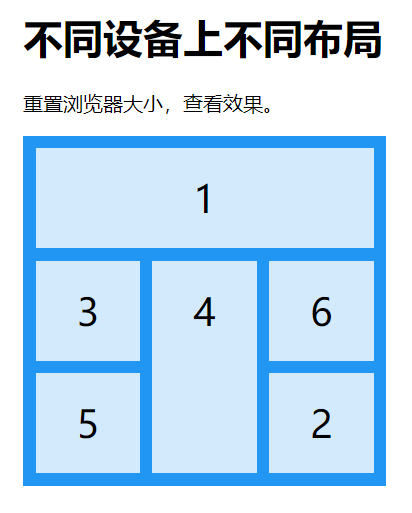

## 1、transform
```html
/*下面两个css样式，是为了如果在低端的浏览器上，也能够奏效 */
div
{
transform:matrix(0.866,0.5,-0.5,0.866,0,0);
-ms-transform:matrix(0.866,0.5,-0.5,0.866,0,0); /* IE 9 */
-webkit-transform:matrix(0.866,0.5,-0.5,0.866,0,0); /* Safari and Chrome */
}
```
- translate(100px,100px)
 - 当前位置为参考，在x轴方向上移动100px，在y轴方向上移动200px 
- scale(2,3)
 - x轴方向上放大2倍，3y轴方向上放大3倍
- rotate
 - 定义 2D 旋转，在参数中规定角度。
- skew(x-angle,y-angle)
 - 定义 2D 倾斜转换，沿着 X 和 Y 轴。

## 2、css3弹性盒子

display:flex就是弹性布局，我们知道display我们之前学过，可以控制元素的显示与消失，同时也可以让一个元素拥有弹性布局的能力

下面的例子右<div class="flex-container"></div>就已经有了弹性布局的能力，它下面有三个子元素，在默认中，弹性布局的div中的子元素会在一行中显示。

```html
<!DOCTYPE html>
<html>
<head>
<style>.flex-container {
    display: -webkit-flex;
    display: flex;
    width: 400px;
    height: 250px;
    background-color: lightgrey;
}
 
.flex-item {
    background-color: cornflowerblue;
    width: 100px;
    height: 100px;
    margin: 10px;
}</style>
</head>
<body>
 
<div class="flex-container">
  <div class="flex-item">flex item 1</div>
  <div class="flex-item">flex item 2</div>
  <div class="flex-item">flex item 3</div> 
</div>
 
</body>
</html>
```

### 1、direction

中文意思位方向。也就是能控制盒子子元素的方向

如果我们给一个给一个盒子增加上这个属性，那么我们就可以改变子元素的排列方向

dirction:rtl	这个的意思是方向由右向左

### 2、flex-direction

这个可以对父元素中的子元素进行固定的排列

- row：横向从左到右排列（左对齐），默认的排列方式。
- row-reverse：反转横向排列（右对齐，从后往前排，最后一项排在最前面。
- column：纵向排列。
- column-reverse：反转纵向排列，从后往前排，最后一项排在最上面。

### 3、justify-content

同样这个参数，也是对子元素进行固定的排列，不过它是相对与主轴的。文字少说，直接上图


### 4、align-items

- flex-start：弹性盒子元素的侧轴（纵轴）起始位置的边界紧靠住该行的侧轴起始边界。
- flex-end：弹性盒子元素的侧轴（纵轴）起始位置的边界紧靠住该行的侧轴结束边界。
- center：弹性盒子元素在该行的侧轴（纵轴）上居中放置。（如果该行的尺寸小于弹性盒子元素的尺寸，则会向两个方向溢出相同的长度）。
- baseline：如弹性盒子元素的行内轴与侧轴为同一条，则该值与'flex-start'等效。其它情况下，该值将参与基线对齐。
- stretch：如果指定侧轴大小的属性值为'auto'，则其值会使项目的边距盒的尺寸尽可能接近所在行的尺寸，但同时会遵照'min/max-width/height'属性的限制

这个费劲巴拉的，就三个指标常用，一个flex-start，一个flex-end，一个center

flex-start，让子元素在顶部

flex-end，让子元素在底部

flex-center-让元素纵向居中

### 5、flex-wrap

控制父盒子中的子盒子换行使用的

- **nowrap** - 默认， 弹性容器为单行。该情况下弹性子项可能会溢出容器。
- **wrap** - 弹性容器为多行。该情况下弹性子项溢出的部分会被放置到新行，子项内部会发生断行
- **wrap-reverse** -反转 wrap 排列。

### 6、align-content

作用呢，和align-items的效果差不多，不过网上说，align-content用于多行的情况，而align-items用于单行的情况，谁知道呢？

- `stretch` - 默认。各行将会伸展以占用剩余的空间。
- `flex-start` - 各行向弹性盒容器的起始位置堆叠。
- `flex-end` - 各行向弹性盒容器的结束位置堆叠。
- `center` -各行向弹性盒容器的中间位置堆叠。
- `space-between` -各行在弹性盒容器中平均分布。
- `space-around` - 各行在弹性盒容器中平均分布，两端保留子元素与子元素之间间距大小的一半。

### 7、总结

对于css3的弹性布局，总的来说，就是控制子元素的布局的，不是很智能，希望后面有更加智能的布局排版，为什么呢，因为我们用flex之后，默认情况下，子元素会成一行进行排列，然后我们可以通过direction来控制它们x轴的方向，在通过align-items来控制它们纵轴上的排列

同时我们也能让他分行，不用这么憋屈的展示，但说到底，也就是控制个横向和纵向的排列，操作空间很有限，但是很高效，我又能说什么呢

## 3、@media媒体查询

css3已经做了改进，现在叫多媒体查询了

有了媒体查询，我们现在可以针对不同的媒体设备做设置，例如我们的显示器、便携设备、电视机等等。

我举个例子，像是我们如果想让我们打印设备，打印出来的字体大小为10px，就可以通过媒体查询来设置打印设备输出的字体大小

这个我现在不关注，我现在更加关心的是，通过媒体查询来实现网页的自适应

也就是我下面要介绍的媒体查询的另外一个功能

以下实例中在屏幕可视窗口尺寸小于 480 像素的设备上修改背景颜色:

```html
@media screen and (max-width: 480px) {
    body {
        background-color: lightgreen;
    }
}
```

以下实例在屏幕可视窗口尺寸大于 480 像素时将菜单浮动到页面左侧：

```html
@media screen and (min-width: 480px) {
    #leftsidebar {width: 200px; float: left;}
    #main {margin-left:216px;}
}
```

尺寸到520px ~ 699px

```html
@media screen and (max-width: 699px) and (min-width: 520px) {
    ul li a {
        padding-left: 30px;
        background: url(email-icon.png) left center no-repeat;
    }
}
```

## 4、Css网格布局

可以看出这个在快速布局网页的时候，还是很有效果的。


```html
<!DOCTYPE html>
<html>
<head>
<meta charset="utf-8"> 
<title>菜鸟教程(runoob.com)</title>
<style>
.item1 { grid-area: header; }
.item2 { grid-area: menu; }
.item3 { grid-area: main; }
.item4 { grid-area: right; }
.item5 { grid-area: footer; }

.grid-container {
  display: grid;
  grid:
  'header header header header header header header'
  'menu menu main main right right right'
  'menu menu footer footer right right right';
  grid-gap: 10px;
  background-color: #2196F3;
  padding: 10px;
}

.grid-container > div {
  background-color: rgba(255, 255, 255, 0.8);
  text-align: center;
  padding: 20px 0;
  font-size: 30px;
}
</style>
</head>
<body>

<h1>网页模版</h1>

<p>您可以使用 grid-area 属性来命名网格项。</p>
<p>通过使用网格容器上的 grid 属性，您可以在设置网格布局时引用该名称。</p>
<p>以下网格布局包含六列和三行：</p>

<div class="grid-container">
  <div class="item1">头部</div>
  <div class="item2">菜单</div>
  <div class="item3">主要内容区域</div>  
  <div class="item4">右侧</div>
  <div class="item5">底部</div>
</div>

</body>
</html>
```

### 1、display:grid

这个就是将盒子变成网格的重要参数工具

当然仅有这一个配置，是无法看到效果的，接下来我将介绍其它的参数工具，配合它们，我们才能制造出一个完美的网格化布局

### 2、diplay:inline-grid

说实话，这个我不是很明白，后面用到的时候，在来补充

### 3、grid-template-columns

这个英文翻译过来，网格列模板，啥意思呢，就是可以控制显示多少列

包括以下几种显示方式:

grid-template-columns:auto auto auto auto	这个表示有四列，并且横屏铺满

grid-template-columns:100px 100px 100px	这个表示横向3列，并且列的宽度仅为100px

### 4、grid-template-rows:

这个是控制网格有多少行用的

grid-template-rows:auto auto auto	这个参数表示，我们的网格工具有3行，并且纵向铺满

```
  grid-template-columns: auto auto auto auto;
  grid-template-rows: 100px 300px;
  这两个参数表示，横向4列铺满
  纵向第一行100px，第二行300px
```

### 5、fr单位

网格引入了 **fr** 单位来帮助我们创建灵活的网格轨道。一个 fr 单位代表网格容器中可用空间的一等份。

下面就表示分为3等分

```
.grid-container {
  display: grid;
  grid-template-columns: 1fr 1fr 1fr;
}
```

### 6、grid的边距


#### 1、grid-column-gap

这个是网格边距，具体是哪里的边距呢？看下图

grid-column-gap表示的是列边距

#### 2、grid-row-gap

这个表示的是行边距

#### 3、grid-gap

这个可以控制行边距，也可以控制列边距

因为在英文中gap，意义为边距

### 7、利用网格线布局


观察下面的.item1，它采用的布局列从1到3


```
.item1 {
  grid-column-start: 1;
  grid-column-end: 3;
}
```

## 5、justify-content

### 5.1、space-evenly

evenly是平等的意思，所以也就是空间平等

使用 *justify-content* 属性对齐容器内的网格。

"space-evenly" 用于均匀排列每个元素，每个元素之间的间隔相等:


### 5.2、space-around

around是周围的意思，空间周围，你要问我它和space-evenly有什么区别，我也不知道


### 5.3、space-between

使用 *justify-content* 属性对齐容器内的网格。

"space-between" 均匀排列每个元素，首个元素放置于起点，末尾元素放置于终点


### 5.4、space-center

使用 *justify-content* 属性对齐容器内的网格。

"center" 在容器中居中:


### 5.5、start

使用 *justify-content* 属性对齐容器内的网格。

"start" 在容器中从行首开始排列:


### 5.6、end

使用 *justify-content* 属性对齐容器内的网格。

"end" 排列在容器的行尾:


## 6、align-content

**align-content** 属性用于设置垂直方向上的网格元素在容器中的对齐方式。

**注意：**网格元素的总高度必须小于容器的高度才能使 align-content 属性生效。

### 6.1、center

使用*align-content* 属性用于设置垂直方向上的网格元素在容器中的对齐方式。

"center" 属性值用于设置容器中所有行居中对齐:



### 6.2、space-evenly

使用*align-content* 属性用于设置垂直方向上的网格元素在容器中的对齐方式。

"space-evenly" 属性值用于设置容器中每一行间隔相等:


### 6.3、space-around

使用*align-content* 属性用于设置垂直方向上的网格元素在容器中的对齐方式。

"space-around" 属性值用于设置容器中每一行分配相同的空间:


### 6.4、space-between



### 6.5、start

使用*align-content* 属性用于设置垂直方向上的网格元素在容器中的对齐方式。

"start" 属性值用于设置在容器开始处开始排列:


### 6.6、end

使用*align-content* 属性用于设置垂直方向上的网格元素在容器中的对齐方式。

"end" 属性值用于设置在容器末尾处开始排列:


## 7、grid-column

grid-colum可以定义网格的开始和结束位置

### 7.1、grid-colum:1/5

一共有6列，grid-colum:1/5

这个是到第5列前就停下来了

```css
.item1 {
  grid-column: 1 / 5;
}
```


### 7.2、grid-column: 1 / span 3;

这个是满打满算的3列

.item1 {  grid-column: 1 / span 3; }


## 8、grid-row

### 8.1、grid-row: 1 / 4


```
.item1 {
  grid-row: 1 / 4;
}
```

### 8.2、grid-row: 1 / span 2


```
.item1 {
  grid-row: 1 / span 2;
}
```

## 9、grid-area

### 9.1、grid-area: 1 / 2 / 5 / 6;

使用*grid-area* 属性指定网格元素的位置。

语法格式:

grid-row-start / grid-column-start / grid-row-end / grid-column-end.

以下实例设置 "item8" 从第 1 行开始和第 2 列开始， 第 5 行和第 6 列结束。


### 9.2、  grid-area: 2 / 1 / span 2 / span 3;

使用*grid-area* 属性指定网格元素的位置。

语法格式:

grid-row-start / grid-column-start / span rowNum / span columnNum.

以下实例设置 "item8" 从第 2 行开始和第 1 列开始， 横跨 2 行 3 列。


### 9.3、grid-area 

```
.item1 {
  grid-area: myArea;
}
.grid-container {
  display: grid;
  grid-template-areas: 'myArea myArea myArea myArea myArea';
  grid-gap: 10px;
  background-color: #2196F3;
  padding: 10px;
}

<div class="grid-container">
  <div class="item1">1</div>
  <div class="item2">2</div>
  <div class="item3">3</div>  
  <div class="item4">4</div>
  <div class="item5">5</div>
  <div class="item6">6</div>
</div>
```

你可以使用 *grid-area* 属性来命名网格元素。

命名的网格元素可以通过容器的 grid-template-areas 属性来引用。

以下实例 item1 命名为 "myArea", 并跨越五列：


****

**要定义两行，请在另一组单引号内 ' ' 定义第二行的列。**

**以下实例设置 "item1" 跨越 2 行 2 列:**

```
.item1 {
  grid-area: myArea;
}
.grid-container {
  grid-template-areas: 'myArea myArea . . .';
}
```


### 9.4、通过媒体查询，重新排布页面



```
@media only screen and (max-width: 500px) {
  .item1 { grid-area: 1 / span 3 / 2 / 4; }
  .item2 { grid-area: 3 / 3 / 4 / 4; }
  .item3 { grid-area: 2 / 1 / 3 / 2; }
  .item4 { grid-area: 2 / 2 / span 2 / 3; }
  .item5 { grid-area: 3 / 1 / 4 / 2; }
  .item6 { grid-area: 2 / 3 / 3 / 4; }
}
```

