## 1、vue3创建

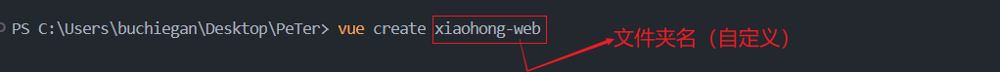

## 2、选择自定义项目配置

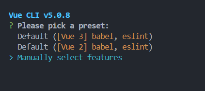

## 3、挑选配置

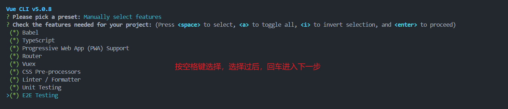

### 3.1配置解释

当你创建一个Vue 3项目时，可能会遇到一些配置选项，这些选项决定了你的项目将包含哪些功能和工具。下面是你提到的一些配置选项的解释：

1. **Babel**： Babel 是一个广泛使用的 JavaScript 编译器，它可以将 ES6+ 的代码转换为向后兼容的 JavaScript 版本，以便在当前和旧版浏览器或环境中运行。在Vue项目中，Babel 通常用于转译 Vue 单文件组件中的 JavaScript 和 JSX 代码。

   :::details Babel用法解释

   当然，让我们通过一个简单的例子来说明Babel在Vue项目中的作用。

   假设我们想要在Vue组件中使用一些ES6+的新特性，比如箭头函数和模板字符串。如果没有Babel，这些代码在旧版浏览器中将无法运行。下面是使用ES6+特性的Vue组件示例：

   ```javascript
   // MyComponent.vue (使用ES6+特性)
   <template>
     <div>
       <h1>Hello, {{ name }}!</h1>
       <ul>
         <li v-for="(item, index) in items" :key="index">{{ item }}</li>
       </ul>
     </div>
   </template>
   
   <script>
   export default {
     data() {
       return {
         name: 'Vue',
         items: ['Apple', 'Banana', 'Cherry']
       };
     },
     mounted() {
       console.log(`The component has been mounted.`);
     }
   };
   </script>
   
   <style>
   /* CSS styles here */
   </style>
   ```

   在这个组件中，我们使用了以下ES6+特性：

   1. **模板字符串**：在模板中使用反引号（`` ` ``）来创建模板字符串，这样可以更方便地插入变量和表达式。
   2. **箭头函数**：在`v-for`指令中使用了箭头函数来定义列表项。
   3. **计算属性**：虽然这个例子中没有显示，但ES6+的计算属性（使用`computed`属性）可以让我们在Vue组件中更简洁地定义依赖于响应式数据的值。

   然而，这些特性在IE11或更旧的浏览器中是不支持的。为了确保我们的Vue应用能够在所有主流浏览器中运行，我们需要使用Babel将这些ES6+代码转换为ES5代码。

   在Vue CLI创建的项目中，Babel配置通常在`babel.config.js`文件中定义。以下是一个简单的Babel配置示例：

   ```javascript
   // babel.config.js
   module.exports = {
     presets: [
       '@vue/cli-plugin-babel/preset'
     ]
   };
   ```

   这个配置使用了Vue CLI提供的Babel预设，它会自动处理Vue单文件组件中的JavaScript和Vue代码。

   当我们运行Vue应用时，Babel会自动转译我们的代码，将ES6+代码转换为向后兼容的ES5代码。这样，我们的Vue应用就可以在所有主流浏览器中运行，包括旧版浏览器。

   例如，上面的箭头函数在Babel转译后可能变成如下的ES5代码：

   ```javascript
   // MyComponent.vue (转译后的ES5代码)
   <template>
     <div>
       <h1>Hello, {{ name }}!</h1>
       <ul>
         <li v-for="item in items" :key="index">{{ item }}</li>
       </ul>
     </div>
   </template>
   
   <script>
   export default {
     data: function () {
       return {
         name: 'Vue',
         items: ['Apple', 'Banana', 'Cherry']
       };
     },
     mounted: function () {
       console.log('The component has been mounted.');
     }
   };
   </script>
   
   <style>
   /* CSS styles here */
   </style>
   ```

   通过使用Babel，我们可以在Vue项目中自由地使用最新的JavaScript特性，同时确保我们的应用在所有目标浏览器中都能正常运行。

   :::

2. **TypeScript**： TypeScript 是 JavaScript 的一个超集，它添加了类型系统和对 ES6+ 特性的支持。在Vue项目中，启用TypeScript可以让你使用类型注解来提高代码质量和开发体验。

   :::details TypyScript用法解释

   假设我们正在开发一个简单的待办事项（Todo）应用，我们需要一个组件来管理待办事项列表。在没有使用TypeScript的情况下，我们的JavaScript代码可能看起来像这样：

   ```js
   // Todo.js (JavaScript)
   export default {
     data() {
       return {
         todos: [
           { id: 1, text: 'Learn JavaScript', done: false },
           // ...其他待办事项
         ]
       };
     },
     methods: {
       addTodo(text) {
         const newTodo = {
           id: this.todos.length + 1,
           text: text,
           done: false
         };
         this.todos.push(newTodo);
       }
     }
   };
   ```

   在这个例子中，我们定义了一个`todos`数组来存储待办事项，每个待办事项是一个包含`id`、`text`和`done`属性的对象。然而，由于JavaScript是一种动态类型语言，我们没有明确指定这些属性的类型，这可能会导致一些潜在的错误，比如拼写错误或者属性类型不匹配。

   现在，让我们看看如何在同一个组件中使用TypeScript来提高代码质量和开发体验：

   ```js
   // Todo.ts (TypeScript)
   export default {
     data() {
       return {
         todos: [
           { id: 1, text: 'Learn TypeScript', done: false },
           // ...其他待办事项
         ] as Array<{ id: number; text: string; done: boolean }>,
       };
     },
     methods: {
       addTodo(text: string): void {
         const newTodo = {
           id: this.todos.length + 1,
           text: text,
           done: false
         } as { id: number; text: string; done: boolean };
         this.todos.push(newTodo);
       }
     }
   };
   ```

   在这个TypeScript版本的例子中，我们做了以下改进：

   1. **类型注解**：我们为`todos`数组中的每个待办事项对象添加了类型注解，明确指定了`id`是`number`类型，`text`是`string`类型，`done`是`boolean`类型。这有助于确保我们在整个应用中一致地使用这些类型。
   2. **方法参数和返回类型**：我们为`addTodo`方法的参数`text`添加了`string`类型的注解，并指定该方法没有返回值（`void`类型）。这有助于确保我们传递正确类型的参数，并明确方法的行为。
   3. 通过使用TypeScript，我们为代码添加了类型系统，这使得我们的代码更加健壮和易于维护。类型注解可以帮助我们提前发现潜在的错误，提高开发效率，并提供更好的开发体验。此外，TypeScript还提供了对ES6+特性的支持，让我们可以使用最新的JavaScript特性来编写更简洁、更强大的代码。

   :::

3. **Progressive Web App (PWA) Support**： PWA是一种网页应用，它利用现代Web API以及传统的渐进式增强策略来创建跨平台的应用体验。启用PWA支持意味着你的Vue应用将能够通过Service Workers缓存资源，实现离线工作，并通过Web App Manifest添加到主屏幕等。

   :::details **Progressive Web App (PWA) Support**描述

   想象一下，你正在开发一个新闻阅读应用，你希望这个应用能够在不同的设备上运行，并且即使用户没有网络连接也能阅读新闻。这就是Progressive Web App（PWA）可以发挥作用的地方。

   **没有PWA支持的情况：**
   假设你有一个新闻网站，用户访问这个网站时，他们只能在线阅读新闻。如果他们的设备没有网络连接，他们就无法访问任何内容。此外，如果用户想要快速访问这个网站，他们需要记住网站的URL或者在浏览器中搜索它。

   **启用PWA支持后的情况：**
   1. **离线工作**：通过Service Workers，你可以缓存网站的关键资源，比如文章内容、图片和样式表。这样，即使用户没有网络连接，他们也能访问这些缓存的资源。例如，用户可以在有网络的时候浏览新闻，然后即使在地铁或飞机上没有网络连接时，也能阅读之前缓存的文章。

   2. **添加到主屏幕**：PWA允许你通过Web App Manifest定义应用的名称、图标、启动画面等。这样，用户可以将你的网站添加到他们的手机或平板电脑的主屏幕上，就像安装了一个本地应用一样。他们可以像打开其他应用一样快速打开你的网站。

   3. **全屏体验**：当用户从主屏幕启动你的PWA时，它将以全屏模式运行，没有网址栏或浏览器界面的干扰，提供更沉浸的阅读体验。

   4. **推送通知**：PWA还支持推送通知，这意味着即使用户没有打开你的网站，你也可以发送通知来提醒他们新文章的发布或其他更新。

   **举个例子**：
   假设你是一个新闻阅读应用的开发者，你希望用户能够随时阅读最新的新闻，即使他们正在通勤或旅行。你启用了PWA支持，并做了以下事情：

   - 使用Service Workers缓存了最近的文章和图片，这样用户在没有网络的情况下也能阅读。
   - 在Web App Manifest中定义了应用的图标和名称，让用户可以将你的应用添加到主屏幕。
   - 实现了全屏模式，让用户在阅读时不会受到浏览器界面的干扰。
   - 设置了推送通知，当有重大新闻发生时，即使应用没有打开，也能通知用户。

   通过这些PWA的特性，你的新闻阅读应用不仅能够在不同的设备上提供一致的体验，还能在没有网络的情况下工作，并且能够通过主屏幕快捷方式和推送通知提供更好的用户互动。这些都是PWA作为现代Web API带来的优势。

   :::

4. **Router**： Router指的是Vue Router，它是Vue官方的路由管理器。启用Router支持意味着你的项目将包含一个客户端路由系统，允许你创建单页应用（SPA），并管理不同视图和组件之间的导航。

5. **Vuex**： Vuex是Vue的官方状态管理模式，用于在应用的所有组件之间共享状态。启用Vuex支持意味着你的项目将包含一个集中式存储管理应用的所有组件的状态，并以相应的规则保证状态以一种可预测的方式发生变化。

   :::details Vuex详解

   想象一下，你正在管理一个大型的超市，这个超市有很多不同的区域，比如水果区、蔬菜区、肉类区等，每个区域都有自己的库存管理系统。每个区域的员工都需要知道当前的库存情况，以便及时补货或者调整销售策略。

   **没有Vuex的情况：**
   如果没有一个集中的库存管理系统，每个区域的员工可能需要自己记录和管理库存。这会导致信息不一致，比如水果区可能不知道蔬菜区的库存情况，如果一个区域的库存信息更新了，其他区域可能不会立即知道。这就像在没有Vuex的Vue应用中，每个组件可能都有自己的状态管理，组件之间共享状态会很困难，而且难以保持状态的一致性。

   **启用Vuex的情况：**
   Vuex就像是一个中央库存管理系统，它为整个超市提供了一个统一的状态管理。每个区域的员工都可以通过这个系统来查看和更新库存。当一个区域的库存发生变化时，这个变化会立即反映在中央系统中，其他区域的员工也能立即看到最新的库存信息。

   **打个比方**：
   假设你正在开发一个在线商城的应用，这个应用有很多页面，比如商品列表页、购物车页、用户信息页等。每个页面都需要访问和更新商品的库存、用户的购物车内容等状态。

   - **商品列表页**：显示所有可购买的商品，用户可以点击商品添加到购物车。
   - **购物车页**：显示用户已经添加的商品，用户可以修改数量或者删除商品。
   - **用户信息页**：显示用户的个人信息，用户可以修改地址或者支付方式。

   如果没有Vuex，每个页面可能都有自己的状态管理，比如商品列表页有自己的商品数组，购物车页有自己的购物车数组。当用户在商品列表页添加商品到购物车时，购物车页的状态不会立即更新，因为它们是独立的。

   启用Vuex后，所有的状态（比如商品库存、购物车内容、用户信息）都存储在Vuex的中央存储（state）中。任何组件都可以从Vuex中读取状态，也可以通过提交mutation来更新状态。这样，当用户在商品列表页添加商品到购物车时，这个变化会立即反映在Vuex中，购物车页的状态也会立即更新，因为它们都是从同一个中央存储中读取状态的。

   通过Vuex，你的应用的状态管理变得更加集中和一致，就像超市的中央库存管理系统一样，确保了信息的准确性和及时性。

   :::details vuex在项目中的位置

   在Vue项目中启用Vuex后，你会在项目文件结构中看到一些特定的变化，这些变化体现了Vuex的状态管理模式。以下是一些典型的文件和目录结构变化：

   1. **store目录**：
      通常会在项目的`src`目录下创建一个名为`store`的目录。这个目录包含了Vuex状态管理的所有文件。

      ```plaintext
      src/
      ├── store/
      │   ├── index.js          // Vuex store的入口文件
      │   ├── actions.js        // 定义actions
      │   ├── mutations.js      // 定义mutations
      │   └── getters.js        // 定义getters
      ```

   2. **index.js**：
      这是Vuex store的入口文件，通常在这里你会创建和导出Vuex store实例。这里会导入state、mutations、actions和getters。

      ```javascript
      // src/store/index.js
      import Vue from 'vue';
      import Vuex from 'vuex';
      import actions from './actions';
      import mutations from './mutations';
      import getters from './getters';

      Vue.use(Vuex);

      const state = {
        // 初始状态
      };

      const store = new Vuex.Store({
        state,
        mutations,
        actions,
        getters
      });

      export default store;
      ```

   3. **mutations.js**：
      在这个文件中，你会定义修改state的方法，这些方法被称为mutations。它们是同步函数，用于执行实际的状态变更。

      ```javascript
      // src/store/mutations.js
      export default {
        INCREMENT_COUNTER(state) {
          state.counter++;
        }
      };
      ```

   4. **actions.js**：
      Actions类似于mutations，但是它们负责处理异步操作。你可以在actions中执行API请求，然后提交mutation来改变state。

      ```javascript
      // src/store/actions.js
      export default {
        incrementCounter({ commit }) {
          setTimeout(() => {
            commit('INCREMENT_COUNTER');
          }, 1000);
        }
      };
      ```

   5. **getters.js**：
      Getters允许你从store中获取状态。就像store的计算属性，它们可以接收state作为参数。

      ```javascript
      // src/store/getters.js
      export default {
        doubleCounter(state) {
          return state.counter * 2;
        }
      };
      ```

   6. **在main.js中引入store**：
      在项目的入口文件`main.js`中，你会引入并注入Vuex store到Vue实例中。

      ```javascript
      // src/main.js
      import Vue from 'vue';
      import App from './App.vue';
      import store from './store'; // 引入store

      new Vue({
        store, // 注入store
        render: h => h(App)
      }).$mount('#app');
      ```

   7. **在组件中使用store**：
      在Vue组件中，你可以通过`this.$store`访问store，或者使用`mapState`、`mapGetters`、`mapActions`和`mapMutations`辅助函数来简化状态的获取和actions的调用。

      ```javascript
      // 在Vue组件中
      export default {
        computed: {
          // 使用mapState辅助函数
          ...mapState([
            'counter'
          ])
        },
        methods: {
          // 使用mapActions辅助函数
          ...mapActions([
            'incrementCounter'
          ])
        }
      };
      ```

   这些文件和目录结构的变化体现了Vuex在项目中的集成，使得状态管理更加集中和模块化。通过这种方式，你可以在整个应用中共享和操作状态，同时保持状态的一致性和可预测性。

   :::

6. **CSS Pre-processors**： CSS预处理器（如Sass、Less或Stylus）允许你使用变量、嵌套规则、混合（mixins）、函数等高级功能来编写CSS。启用CSS预处理器支持意味着你可以在Vue项目中使用这些功能来编写更高效、更易于维护的样式代码。

   :::details

   CSS预处理器极大地扩展了CSS的功能，使其更易于编写和维护。以下是一些关键特性的详细说明，以及它们如何帮助你编写更高效的CSS代码：

   1. **变量（Variables）**：
      变量允许你存储可在整个样式表中重复使用的值。这可以是颜色、字体大小、间距等。使用变量可以确保你的网站或应用的样式保持一致，并且当你需要全局更改某个值时，可以很容易地进行。

      ```scss
      // Sass 示例
      $primary-color: #3498db;
      $padding: 15px;

      .container {
        color: $primary-color;
        padding: $padding;
      }
      ```

      在上述示例中，如果`$primary-color`或`$padding`需要更改，你只需更改变量的值，而不需要搜索和替换整个样式表。

   2. **嵌套规则（Nested Rules）**：
      嵌套规则允许你以更接近HTML结构的方式编写CSS规则，这样可以减少重复的CSS选择器，并且使代码结构更清晰。

      ```scss
      // Sass 示例
      .nav {
        &__item {
          display: inline-block;
          &--active {
            font-weight: bold;
          }
        }
      }
      ```

      这将被编译为：

      ```css
      .nav__item {
        display: inline-block;
      }
      .nav__item--active {
        font-weight: bold;
      }
      ```

      使用嵌套规则，你可以避免写出冗长的选择器链，并且更容易地看到哪些样式是相关的。

   3. **混合（Mixins）**：
      混合（mixins）是一种将一组CSS声明重用的机制。它们可以带有参数，这使得你可以创建灵活的代码块，可以用于不同的上下文中。

      ```scss
      // Sass 示例
      @mixin border-radius($radius) {
        -webkit-border-radius: $radius;
        -moz-border-radius: $radius;
        border-radius: $radius;
      }

      .box {
        @include border-radius(5px);
      }
      ```

      在这个例子中，`border-radius`是一个mixin，它接受一个参数`$radius`。你可以在任何需要的地方调用这个mixin，并传递不同的值。

   4. **函数（Functions）**：
      函数允许你编写可以返回值的代码块。这可以用来计算值、生成颜色等。函数可以接收参数，并且可以返回一个值。

      ```scss
      // Sass 示例
      @function calculate-rem($size-in-px) {
        $rem-size: $size-in-px / 16;
        @return $rem-size * 1rem;
      }

      .font-size {
        font-size: calculate-rem(18px);
      }
      ```

      在这个例子中，`calculate-rem`函数接受一个像素值，并将其转换为相对长度单位rem。这使得在不同设备上保持一致的字体大小变得容易。

   通过使用这些高级功能，CSS预处理器使得CSS代码更加模块化、可重用和易于维护。它们提供了一种更编程化的方式来编写样式，这使得CSS更加强大和灵活。在Vue项目中，你可以在`.vue`文件的`<style>`块中直接使用这些特性，或者在单独的`.scss`、`.sass`、`.less`或`.styl`文件中使用它们，然后通过Webpack等构建工具将它们编译为普通的CSS。

   :::

7. **Linter**： Linter是一种工具，用于分析代码并检测潜在的错误、不一致的代码风格或可疑的模式。在Vue项目中，常见的Linter工具有ESLint，它可以帮助你在开发过程中保持代码质量。

   :::details Linter详细解析

   想象一下，你是一位作家，正在撰写一本小说。你的编辑（Linter）会仔细阅读你的草稿，检查拼写错误、语法错误、不一致的用词，甚至是那些可能让读者感到困惑的表达方式。编辑的目标是帮助你提高写作质量，确保你的小说对读者来说既易于理解又吸引人。

   **在编程中，Linter的作用类似：**

   1. **检测错误**：Linter会查找那些可能导致程序崩溃或异常的代码错误。这就像是编辑指出你小说中的情节漏洞或不合逻辑的情节转折。

   2. **代码风格**：Linter会检查代码是否遵循了既定的编码风格指南。这可以是命名约定、缩进、大括号的使用等。这就像是编辑确保你的小说遵循了出版商的格式要求。

   3. **可疑的模式**：Linter会警告那些可能不会直接导致错误，但可能表明潜在问题的代码模式。这可以是低效的代码实现，或者是可能导致未来维护问题的模式。这就像是编辑指出那些可能让读者感到困惑的复杂句子结构。

   **举个例子**：

   假设你在Vue项目中编写了以下JavaScript代码：

   ```javascript
   let username = "John Doe";
   let age = 30;
   
   if (age > 18) {
       console.log("User " + username + " is an adult.");
   }
   ```

   如果这段代码通过了Linter（如ESLint），它可能会指出几个问题：

   1. **未声明的变量**：如果代码不在严格模式下运行，`username`和`age`变量可能未被声明，这可能导致意外的行为。

   2. **字符串连接**：使用`+`来连接字符串是一种老旧的做法，可能会导致性能问题，特别是在循环中。Linter可能会建议使用模板字符串。

   3. **魔法数字**：数字`18`是一个“魔法数字”，它直接硬编码在代码中，这可能会导致代码难以理解和维护。Linter可能会建议定义一个常量来代替这个数字。

   经过Linter检查和修正后的代码可能如下：

   ```javascript
   const MIN_AGE_FOR_ADULT = 18;
   
   let username = "John Doe";
   let age = 30;
   
   if (age > MIN_AGE_FOR_ADULT) {
       console.log(`User ${username} is an adult.`);
   }
   ```

   通过使用Linter，你可以在代码进入更复杂的构建过程或生产环境之前，提前发现并修正这些问题。这有助于提高代码质量，减少潜在的bug，并且使得代码更加一致和易于维护。就像一个好编辑可以帮助作家提高写作水平一样，一个好Linter可以帮助开发者提高代码水平。

   :::

8. **Formatter**： 代码格式化工具（如Prettier）用于自动格式化代码，以符合一定的代码风格和约定。启用Formatter支持意味着你的项目将自动格式化代码，以保持一致的代码风格。

9. **Unit Testing**： 单元测试是一种测试方法，用于验证代码的最小可测试部分（通常是函数或方法）的正确性。启用单元测试支持意味着你的项目将包含单元测试框架（如Jest或Mocha），并配置好测试环境，以便你可以编写和运行单元测试。

   :::details Unit Testing详解

   单元测试是软件开发过程中的一种自动化测试方法，它专注于测试应用程序中的最小可测试单元，通常是单个函数或方法。单元测试的目的是验证每个单元是否按照预期工作，并且能够独立于其他单元运行。

   **如何进行单元测试：**

   1. **编写测试用例**：为每个函数或方法编写测试用例，这些测试用例应该覆盖不同的输入和预期输出。测试用例应该设计得足够小，以便快速执行。

   2. **断言**：在测试用例中使用断言来验证代码的实际输出是否与预期输出相匹配。

   3. **测试框架**：使用测试框架（如Jest、Mocha、Jasmine等）来组织测试用例、执行测试，并报告测试结果。

   4. **测试运行器**：配置测试运行器来自动执行测试用例，通常在代码变更时运行。

   5. **持续集成**：将单元测试集成到持续集成（CI）流程中，以确保在代码合并到主分支之前自动运行测试。

   **在项目文件中如何体现：**

   1. **测试文件**：通常，每个源代码文件都会有一个对应的测试文件。如果源代码文件是`src/utils/mathUtils.js`，那么测试文件可能是`src/utils/__tests__/mathUtils.test.js`。

   2. **测试目录**：在项目的`src`目录下，可能会有一个专门的`__tests__`目录，用于存放所有的测试文件。

   3. **测试配置文件**：项目中可能会有一个测试配置文件，如`jest.config.js`或`mocha.opts`，用于配置测试框架。

      ```javascript
      // jest.config.js
      module.exports = {
        preset: '@vue/cli-plugin-unit-jest',
        transform: {
          '^.+\\.vue$': 'vue-jest'
        }
      };
      ```

   4. **测试脚本**：在`package.json`中，会有一个或多个脚本用于运行测试。

      ```json
      {
        "scripts": {
          "test:unit": "jest --clearCache && jest"
        }
      }
      ```

   5. **测试覆盖率报告**：有时，项目中会生成测试覆盖率报告，以显示代码中被测试覆盖的部分。

   6. **测试钩子**：在版本控制系统（如Git）中，可能会使用钩子（如pre-commit hook），在代码提交之前自动运行测试。

   **举个例子**：

   假设你有一个Vue组件中的一个方法，用于计算两个数字的和：

   ```javascript
   // src/components/Calculator.vue
   <template>
     <div>
       <input v-model="number1" type="number" />
       <input v-model="number2" type="number" />
       <button @click="add">Add</button>
       <p>{{ sum }}</p>
     </div>
   </template>
   
   <script>
   export default {
     data() {
       return {
         number1: 0,
         number2: 0,
         sum: 0
       };
     },
     methods: {
       add() {
         this.sum = this.number1 + this.number2;
       }
     }
   };
   </script>
   ```

   对应的单元测试可能如下所示：

   ```javascript
   // src/components/__tests__/Calculator.test.js
   import { shallowMount } from '@vue/test-utils';
   import Calculator from '@/components/Calculator.vue';
   
   describe('Calculator.vue', () => {
     it('calculates the sum of two numbers', () => {
       const wrapper = shallowMount(Calculator);
       wrapper.setData({ number1: 5, number2: 3 });
       wrapper.find('button').trigger('click');
       expect(wrapper.vm.sum).toBe(8);
     });
   });
   ```

   在这个测试中，我们使用`@vue/test-utils`来创建一个`Calculator`组件的实例，并模拟用户输入和点击按钮。然后我们断言组件的`sum`数据属性是否等于两个输入数字的和。

   通过这种方式，单元测试确保了`Calculator`组件的`add`方法在给定输入的情况下能够产生预期的输出。如果测试通过，则表明该单元按预期工作；如果测试失败，则表明可能存在bug，需要进一步调查和修复。

   :::

10. **E2E Testing**： 端到端（E2E）测试是一种测试方法，用于验证整个应用从开始到结束的流程是否按预期工作。启用E2E测试支持意味着你的项目将包含E2E测试框架（如Cypress或Nightwatch），并配置好测试环境，以便你可以编写和运行E2E测试。

    :::details E2E Testing详解

    端到端（E2E）测试就像是在测试一个完整的旅行体验。想象一下，你计划了一次从北京到上海的旅行，这个旅行包括了预订机票、到达机场、通过安检、登机、飞行、降落、以及最终到达目的地。端到端测试不仅仅检查飞机是否起飞和降落，而是确保整个旅程的每个环节都按照预期顺利进行。

    **在软件开发中，E2E测试的目的是：**

    1. **验证整个流程**：确保从用户打开应用开始，到完成一个特定任务（比如购买商品、提交表单等）的整个流程都能按预期工作。

    2. **跨组件交互**：检查应用中不同组件或页面之间的交互是否正常。

    3. **用户体验**：从用户的角度出发，确保应用的用户体验符合预期。

    **在项目中如何体现E2E测试：**

    1. **测试框架**：项目中会集成一个E2E测试框架，如Cypress、Nightwatch、Selenium等。

    2. **测试脚本**：在项目的特定目录下，会有一系列的测试脚本，这些脚本模拟用户的操作，如点击按钮、填写表单、导航等。

    3. **测试配置文件**：项目中可能会有一个或多个配置文件，用于设置测试环境和测试参数。

    4. **测试环境**：E2E测试通常需要一个特定的测试环境，这可能是一个独立的服务器、一个模拟的生产环境，或者是使用CI/CD工具配置的云服务。

    5. **测试报告**：执行测试后，会生成测试报告，显示哪些测试通过了，哪些失败了，以及失败的原因。

    6. **CI/CD集成**：E2E测试通常会集成到CI/CD流程中，这样每次代码提交或部署新版本时，都会自动运行E2E测试。

    **举个例子**：

    假设你有一个电商网站，用户可以浏览商品、添加商品到购物车、结算并完成购买。端到端测试将模拟以下步骤：

    1. 打开网站首页。
    2. 搜索一个特定商品。
    3. 点击商品进入详情页。
    4. 添加商品到购物车。
    5. 导航到购物车页面。
    6. 填写收货地址和支付信息。
    7. 提交订单。
    8. 验证订单成功页面。

    对应的E2E测试脚本可能如下所示（以Cypress为例）：

    ```javascript
    // cypress/integration/checkout_flow.spec.js
    describe('Checkout flow', () => {
      it('successfully purchases a product', () => {
        cy.visit('http://localhost:3000'); // 访问首页
        cy.get('.search-input').type('T-shirt'); // 搜索商品
        cy.get('.product-card').first().click(); // 点击第一个商品
        cy.get('.add-to-cart').click(); // 添加到购物车
        cy.get('.cart-icon').click(); // 导航到购物车
        cy.get('[name=address]').type('123 Example St'); // 填写地址
        cy.get('[name=cardNumber]').type('1234567890123456'); // 填写支付信息
        cy.get('.checkout-button').click(); // 提交订单
        cy.get('.success-message').should('be.visible'); // 验证成功信息
      });
    });
    ```

    在这个测试脚本中，我们使用Cypress测试框架来模拟用户操作，从访问首页到完成购买的整个流程。测试脚本会验证每个步骤是否按预期工作，最终检查是否显示了订单成功的信息。

    通过E2E测试，你可以确保整个应用的流程是连贯的，用户体验是符合预期的，这对于捕获那些可能在单元测试中遗漏的集成问题至关重要。

    :::

## 4、选择vue版本

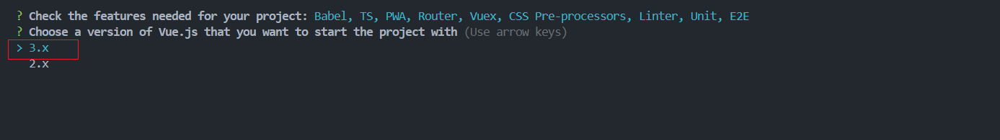

## 5、是否在项目中使用Vue的类组件语法

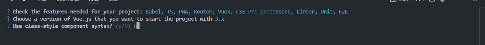

:::在使用Vue CLI v5.0.8创建Vue项目时，最后的这个问题：“Use class-style component syntax? (y/N)”实际上是在询问你是否希望在项目中使用Vue的类组件语法。

在Vue中，类组件语法是指使用JavaScript的`class`关键字来定义Vue组件。这在Vue 2中引入，作为可选的语法糖，允许开发者使用基于类的组件来利用JavaScript的面向对象特性，如继承和构造函数。

以下是使用类组件语法的Vue组件示例：

```vue
<script lang="ts">
import { Component, Vue } from 'vue-property-decorator';

@Component
export default class MyComponent extends Vue {
  message: string = 'Hello World!';

  created() {
    console.log(this.message);
  }

  reverseMessage() {
    this.message = this.message.split('').reverse().join('');
  }
}
</script>
```

在这个示例中，`MyComponent`是一个类组件，它继承自`Vue`。你可以使用装饰器（如`@Component`）来定义组件的选项，并且可以使用类的构造函数来初始化数据和方法。

如果你选择“y”（是），Vue CLI将在生成的项目中为你的组件使用类组件语法。如果你选择“N”（否），Vue CLI将使用Vue的选项API语法，这是Vue组件的传统定义方式，如下所示：

```vue
<script>
export default {
  data() {
    return {
      message: 'Hello World!'
    };
  },
  created() {
    console.log(this.message);
  },
  methods: {
    reverseMessage() {
      this.message = this.message.split('').reverse().join('');
    }
  }
};
</script>
```

在这个示例中，组件是通过一个对象来定义的，其中包含了`data`、`methods`、`created`生命周期钩子等选项。

选择哪种方式取决于你的个人偏好和项目需求。如果你喜欢面向对象编程并且想利用JavaScript的类特性，你可能会倾向于使用类组件语法。如果你更习惯于使用Vue的传统选项API，或者你不需要类组件提供的面向对象特性，那么你可能会选择“N”。在Vue 3中，Composition API提供了一种新的方式来组织组件逻辑，它与类组件语法无关，因此这个选择不会影响你使用Composition API的能力。details 解释


:::


## 6、是否希望在项目中同时使用Babel和TypeScript

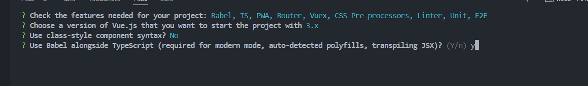

:::details 解释

在你选择“Use class-style component syntax? No”之后，Vue CLI 提出了另一个问题：“Use Babel alongside TypeScript (required for modern mode, auto-detected polyfills, transpiling JSX)? (Y/n)”。这个问题是在询问你是否希望在项目中同时使用Babel和TypeScript。

以下是这个问题相关选项的解释：

1. **Y (Yes)**：
   - 如果你选择“Y”，你将在你的Vue项目中同时使用Babel和TypeScript。
   - Babel是一个编译器，它可以将ES6+代码转换为向后兼容的JavaScript版本，这样你的代码就能在当前和旧版浏览器或环境中运行。
   - TypeScript是一种由Microsoft开发的编程语言，它是JavaScript的超集，添加了类型系统和对ES6+特性的支持。
   - 使用Babel和TypeScript的组合，可以让你在Vue项目中使用TypeScript编写代码，并通过Babel将TypeScript代码转换为普通的JavaScript代码，以便在浏览器中运行。

2. **n (No)**：
   - 如果你选择“n”，你将只在你的Vue项目中使用TypeScript，而不使用Babel。
   - 这通常意味着你不需要Babel来转换TypeScript代码，可能是因为你的目标环境已经支持TypeScript，或者你使用其他工具来处理TypeScript代码的编译。

在大多数情况下，选择“Y”是推荐的，因为Babel提供了许多有用的功能，如代码转换、polyfills自动检测和JSX转换等。这些功能可以帮助你确保你的代码在各种环境中都能正常运行，并且可以处理一些TypeScript无法处理的JavaScript新特性。

总结来说，如果你的项目需要使用TypeScript，并且你希望利用Babel提供的功能来增强你的开发体验，那么你应该选择“Y”。如果你有特定的理由不需要Babel，或者你计划使用其他工具来处理TypeScript代码，那么你可以选择“n”。

:::


## 7、选择router

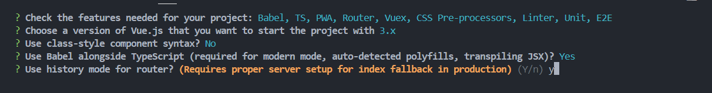


## 8、

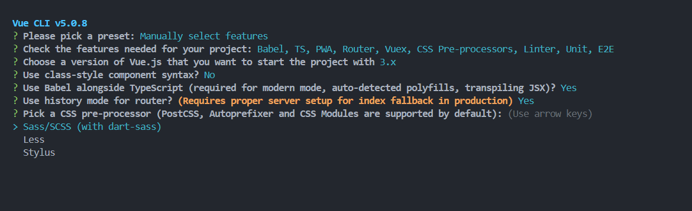

:::details

在Vue CLI的设置过程中，你现在面临的选择是决定使用哪种CSS预处理器。CSS预处理器是一种工具，它允许你使用更高级的CSS特性，如变量、嵌套规则、混合（mixins）和函数。这些特性使得编写复杂的CSS变得更加容易和可维护。

选项如下：

1. **Sass/SCSS (with dart-sass)**：
   - Sass是一种流行的CSS预处理器，它增加了变量、嵌套、混合、函数等特性，让CSS更加动态和可复用。SCSS是Sass的语法的一个版本，它与CSS几乎兼容，易于学习且易于集成到现有的项目中。

2. **Less**：
   - Less是另一种CSS预处理器，它也提供了变量、混合、函数等特性。Less的语法与Sass略有不同，但它同样能够提高CSS的可维护性。

3. **Stylus**：
   - Stylus是一种功能强大的CSS预处理器，它提供了丰富的功能，包括变量、表达式、函数、混合等。Stylus的语法与其他两者不同，它使用一种更简洁和灵活的格式。

选择哪种预处理器主要取决于你的个人偏好和项目需求。以下是一些考虑因素：

- **流行度和社区支持**：Sass/SCSS在前端社区中非常流行，有大量的文档、教程和社区支持。
- **集成和兼容性**：SCSS由于其与CSS的兼容性，通常更容易集成到现有的项目中，不需要对现有的CSS代码做太多修改。
- **特性和灵活性**：Stylus提供了一些独特的特性，如函数式编程能力，如果你需要这些高级功能，可能会选择Stylus。
- **团队熟悉度**：如果你的团队已经熟悉了某种预处理器，那么继续使用相同的预处理器可能会更高效。

在这个例子中，你可以选择“Sass/SCSS (with dart-sass)”作为项目的CSS预处理器。选择之后，你可以在Vue组件的`<style>`标签中使用SCSS语法来编写样式，或者创建单独的`.scss`文件。

一旦你做出了选择，Vue CLI将为你的项目配置相应的CSS预处理器，并且设置好相应的 loader 和 plugin，以便你可以在项目中使用这些高级CSS特性。

:::

## 9、选择代码检查风格

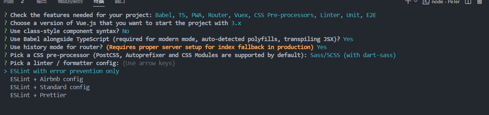

:::details 解析

现在，Vue CLI 正在询问你希望使用哪种 linter 和 formatter 配置。Linter 用于识别代码中的错误和可疑的模式，而 formatter 自动调整代码格式以符合一定的风格指南。

以下是你可以选择的配置：

1. **ESLint with error prevention only**：
   - 这个选项提供了一个基本的 ESLint 配置，专注于防止错误。它不会强制执行任何特定的代码风格。

2. **ESLint + Airbnb config**：
   - 这个选项结合了 ESLint 和 Airbnb 的代码风格指南，提供了一个非常严格和全面的代码风格配置。Airbnb 风格指南是业界广泛认可的 JavaScript 代码风格指南。

3. **ESLint + Standard config**：
   - 这个选项结合了 ESLint 和 StandardJS 的代码风格指南，这是另一个流行的、较为宽松的代码风格指南。

4. **ESLint + Prettier**：
   - 这个选项结合了 ESLint 和 Prettier。Prettier 是一个流行的代码格式化工具，它可以自动格式化代码以符合配置的风格。这个选项允许你在 ESLint 中开启 Prettier 插件，以确保代码的一致性和可读性。

选择哪种配置取决于你的个人偏好和项目需求。以下是一些考虑因素：

- **团队习惯**：如果你的团队已经习惯了某种特定的代码风格，选择相应的配置可能更合适。
- **项目规模**：对于大型项目，更严格的代码风格指南可能有助于保持代码的一致性。
- **个人偏好**：如果你对代码风格有特定的偏好，你可以选择最符合你偏好的配置。
- **自动化格式化**：如果你希望自动化代码格式化，选择 ESLint + Prettier 可能更合适，因为 Prettier 可以帮助你自动调整代码格式。

在这个例子中，如果你希望在项目中使用 Prettier 进行代码格式化，并且希望 ESLint 帮助预防错误，你可以选择 “ESLint + Prettier” 配置。这样，你就可以在项目中利用 Prettier 来自动格式化代码，同时 ESLint 会帮助你捕获潜在的错误。

一旦你做出了选择，Vue CLI 将为你的项目配置相应的 linter 和 formatter，设置好相应的配置文件和插件，以便你可以在开发过程中使用这些工具。

:::


## 10、Lint on save与**Lint and fix on commit**

:::details

在Vue CLI的设置过程中，你已经选择了基本的linter/formatter配置（"Basic"），现在CLI询问你希望添加哪些额外的lint功能。

这里是你的两个选项：

1. **Lint on save**：
   - 如果你选择这个选项（通过按空格键选中），每当你保存文件时，linter将会运行并报告代码中的问题。这可以帮助你及时发现并修正错误和风格问题，但可能会稍微增加保存文件时的等待时间。

2. **Lint and fix on commit**：
   - 如果你选择这个选项，linter将会在代码提交到版本控制系统之前运行。它不仅会检查代码，还会尝试自动修复一些问题。这有助于确保只有符合代码质量标准的代码才能被提交，但可能会增加提交过程的复杂性。

选择这些选项取决于你的个人偏好和团队的工作流程：

- 如果你希望在开发过程中即时捕捉问题，那么“Lint on save”是一个好选择。
- 如果你希望在代码提交阶段确保代码质量，并且愿意在提交前处理linter发现的问题，那么“Lint and fix on commit”可能更适合你。
- 在团队协作环境中，"Lint and fix on commit"可以帮助维护整个项目的代码质量，因为它确保了所有提交都符合预定义的lint规则。

由于你已经选择了“Basic”的linter/formatter配置，这通常意味着你希望有一个较为基础的lint体验。即便如此，添加“Lint on save”功能仍然是有益的，因为它可以在你编写代码时提供即时反馈。

如果你的团队有严格的代码质量要求，或者你希望在代码合并到主分支之前确保代码质量，那么“Lint and fix on commit”也是一个不错的选择。不过，这可能需要额外配置一个commit hook，并且可能需要团队成员安装和配置额外的工具，比如Husky或lint-staged。

在这个例子中，如果你希望在保存文件时自动检查代码，可以选中“Lint on save”选项。如果你还希望在代码提交阶段自动检查和修复问题，可以进一步选中“Lint and fix on commit”选项。这样，你就可以在开发和提交阶段都有一定的代码质量保证。

:::


## 11、

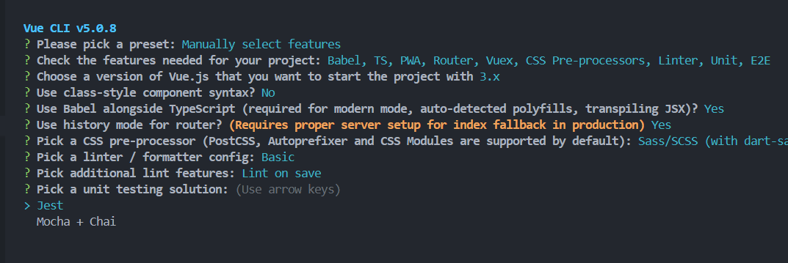

:::details

在Vue CLI的设置过程中，你现在面临的选择是决定使用哪种单元测试解决方案。单元测试是软件开发中用于验证代码最小可测试部分（通常是函数或方法）正确性的一种测试方法。

以下是你可以选择的单元测试框架：

1. **Jest**：
   - Jest是一个广泛使用的JavaScript测试框架，由Facebook开发。它提供了一个零配置的测试环境，支持快速测试运行，并且具有内置的mocking功能。Jest还提供了代码覆盖率报告，可以帮助你了解测试覆盖情况。

2. **Mocha + Chai**：
   - Mocha是一个功能丰富的JavaScript测试框架，它允许你使用任何断言库。Chai是一个断言库，它提供了丰富的断言风格，包括should、expect和assert。Mocha和Chai的组合提供了灵活的测试配置和广泛的社区支持。

选择哪种测试框架取决于你的个人偏好和项目需求：

- **Jest**以其简单的配置和全面的内置功能而闻名，适合需要快速设置和强大mocking功能的项目。
- **Mocha + Chai**提供了更多的灵活性和控制，适合需要高度定制测试环境的项目，或者你的团队已经熟悉了这个组合。

在这个例子中，如果你选择“Jest”，Vue CLI将为你的项目配置Jest作为单元测试框架，并设置好相应的测试脚本和配置文件。这样，你就可以开始编写和运行单元测试了。

如果你选择“Mocha + Chai”，Vue CLI将为你的项目配置Mocha作为测试框架，并集成Chai作为断言库。同样，它也会设置好相应的测试脚本和配置文件。

一旦你做出了选择，你可以使用相应的命令来运行单元测试，例如通过运行`npm run test:unit`或`yarn test:unit`来执行测试。Vue CLI会根据你的选择预配置好测试环境，让你可以专注于编写测试用例。

:::

## 12、E2E测试解决方案

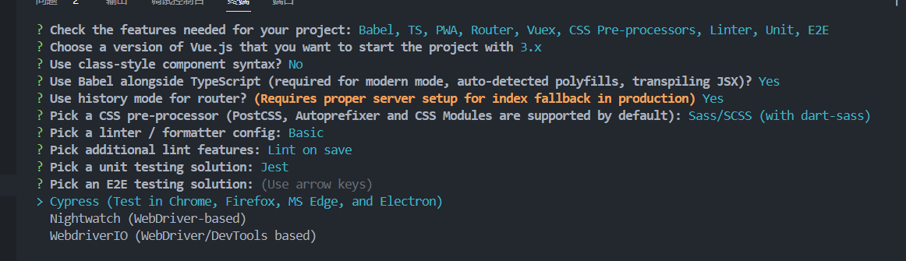

:::details 解析

在Vue CLI的设置过程中，你现在面临的选择是决定使用哪种单元测试解决方案。单元测试是软件开发中用于验证代码最小可测试部分（通常是函数或方法）正确性的一种测试方法。

以下是你可以选择的单元测试框架：

1. **Jest**：
   - Jest是一个广泛使用的JavaScript测试框架，由Facebook开发。它提供了一个零配置的测试环境，支持快速测试运行，并且具有内置的mocking功能。Jest还提供了代码覆盖率报告，可以帮助你了解测试覆盖情况。

2. **Mocha + Chai**：
   - Mocha是一个功能丰富的JavaScript测试框架，它允许你使用任何断言库。Chai是一个断言库，它提供了丰富的断言风格，包括should、expect和assert。Mocha和Chai的组合提供了灵活的测试配置和广泛的社区支持。

选择哪种测试框架取决于你的个人偏好和项目需求：

- **Jest**以其简单的配置和全面的内置功能而闻名，适合需要快速设置和强大mocking功能的项目。
- **Mocha + Chai**提供了更多的灵活性和控制，适合需要高度定制测试环境的项目，或者你的团队已经熟悉了这个组合。

在这个例子中，如果你选择“Jest”，Vue CLI将为你的项目配置Jest作为单元测试框架，并设置好相应的测试脚本和配置文件。这样，你就可以开始编写和运行单元测试了。

如果你选择“Mocha + Chai”，Vue CLI将为你的项目配置Mocha作为测试框架，并集成Chai作为断言库。同样，它也会设置好相应的测试脚本和配置文件。

一旦你做出了选择，你可以使用相应的命令来运行单元测试，例如通过运行`npm run test:unit`或`yarn test:unit`来执行测试。Vue CLI会根据你的选择预配置好测试环境，让你可以专注于编写测试用例。

:::


在Vue CLI的设置过程中，你已经选择了Jest作为单元测试框架，现在CLI询问你希望使用哪种端到端（E2E）测试解决方案。E2E测试用于验证整个应用的流程是否按预期工作，从开始到结束。

以下是你可以选择的E2E测试框架：

1. **Cypress**：
   - Cypress是一个现代的、开源的E2E测试框架，它提供了一个非常易用的测试体验。Cypress可以在多种浏览器中运行测试，包括Chrome、Firefox、Microsoft Edge和Electron。它还提供了一个交互式的测试运行器，使得编写和调试测试变得更加简单。
2. **Nightwatch**：
   - Nightwatch是一个开源的E2E测试框架，它基于WebDriver协议。这意味着它可以在多种浏览器和操作系统上运行测试。Nightwatch提供了一个配置驱动的测试环境，允许你定义测试用例和配置文件。
3. **WebdriverIO**：
   - WebdriverIO是一个开源的E2E测试框架，它基于WebDriver协议和DevTools协议。这使得它可以在多种浏览器和环境中运行测试。WebdriverIO提供了一个强大的API，允许你编写复杂的测试脚本。

选择哪种测试框架取决于你的个人偏好和项目需求：

- **Cypress**以其简洁的API和交互式测试运行器而闻名，适合需要快速反馈和易于调试的项目。
- **Nightwatch**提供了更多的配置选项和对WebDriver协议的支持，适合需要高度定制测试环境的项目。
- **WebdriverIO**提供了强大的API和对WebDriver/DevTools协议的支持，适合需要高度灵活和可扩展测试框架的项目。

在这个例子中，如果你选择“Cypress”，Vue CLI将为你的项目配置Cypress作为E2E测试框架，并设置好相应的测试脚本和配置文件。这样，你就可以开始编写和运行E2E测试了。

如果你选择“Nightwatch”或“WebdriverIO”，Vue CLI将为你的项目配置相应的测试框架，并集成WebDriver协议。同样，它也会设置好相应的测试脚本和配置文件。

一旦你做出了选择，你可以使用相应的命令来运行E2E测试，例如通过运行`npm run test:e2e`或`yarn test:e2e`来执行测试。Vue CLI会根据你的选择预配置好测试环境，让你可以专注于编写测试用例。


## 13、选中独立配置文件

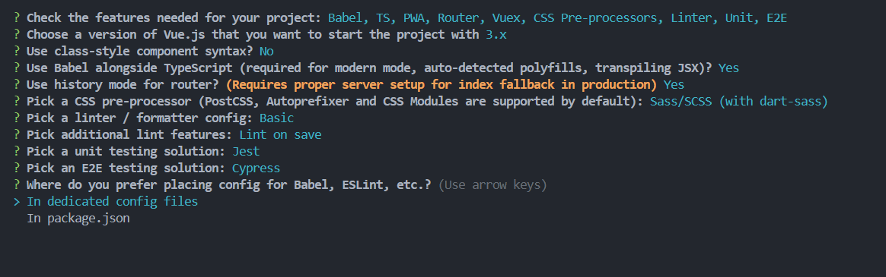