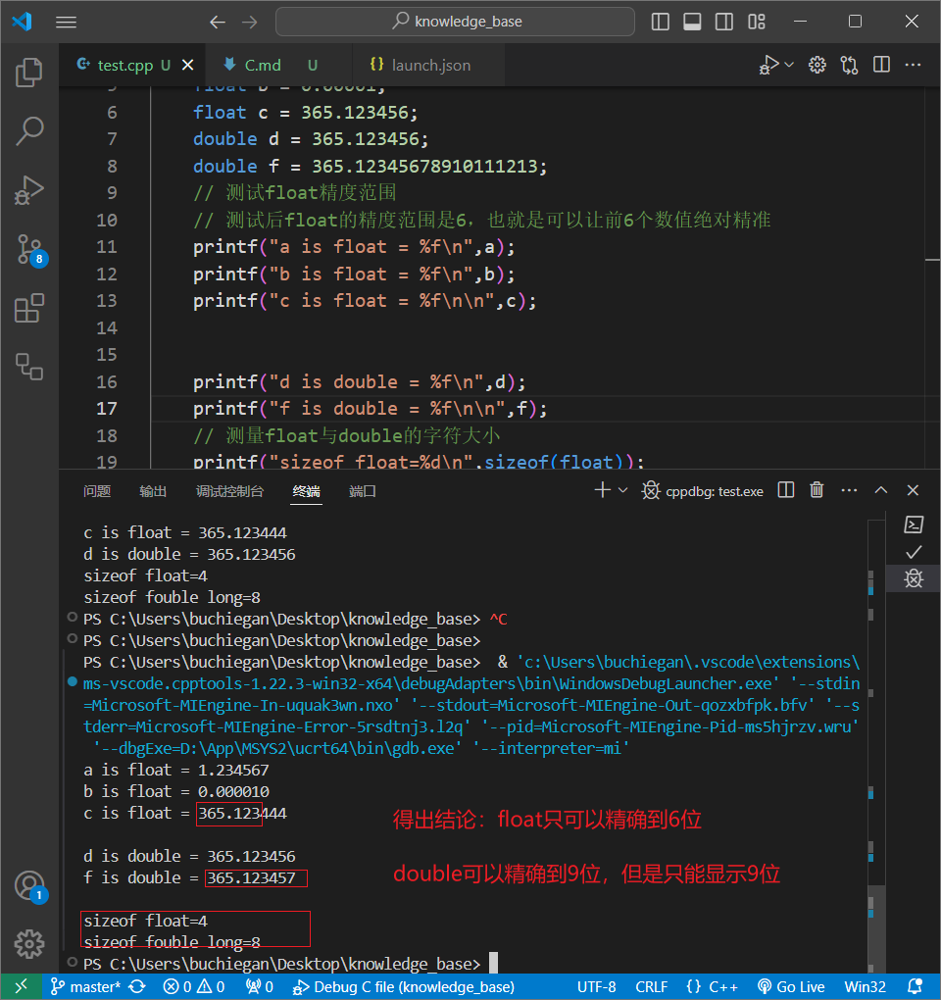

# C语言学习笔记

## 一、基本数据类型

### 1、c语言与c++文件的区别

因为C++的语法已经包含了绝大部分的C的功能,所以用cpp文件后缀，也就是c++的文件格式写C语言是完全ok的

### 2、C命名规范

C语言的标识符，可以用小写字母、大写字母、数字和下划线

标识符的第一个字母必须是字母或下划线，不能是数字

标识符区分大小写

### printf函数

printf也是函数，用户输入参数，调用printf函数，函数产出结果输入到终端

### include<staido.h>标头解释

#include<stdio.h>

## 二、整形数据类型

**测试C语言中每一种字符类型的大小**

```c++
#include<stdio.h>

int main(){
    int result;
    printf("sizeof char=%d\n",sizeof(char));
    printf("sizeof short=%d\n",sizeof(short));
    printf("sizeof int=%d\n",sizeof(int));
    printf("sizeof long=%d\n",sizeof(long));
    printf("sizeof long long=%d\n",sizeof(long long));
    return 0;
}

sizeof char=1
sizeof short=2
sizeof int=4
sizeof long=4
sizeof long long=8
```

注释：一个字节就等于8个bit位，也就是8个晶体管，8个晶体管每一个有两种状态，所以相当于2进制，那么可以表示2^8个数


| 类型      | sizeof大小 | 二进制位数 | 取值范围算式   | 取值范围    |
| --------- | ---------- | ---------- | -------------- | ----------- |
| char      | 1          | 8个晶体管  | -2^7 ~ 2^7     | -128 ~ +127 |
| short     | 2          | 16个晶体管 | -2^15 ~ 2^15-1 |             |
| int       | 4          | 32个晶体管 |                |             |
| long      | 4          | 32个晶体管 |                |             |
| long long | 8          | 64个晶体管 |                |             |


如果你能确定你的数据类型绝对的是正数类型，就不需要考虑符号位置了

可以直接用unsigined

## 三、浮点数据类型

```C++
#include<stdio.h>

int main(){
    float a = 1.234567;
    float b = 0.00001;
    float c = 365.123456;
    double d = 365.123456;
    // 测试float精度范围
    // 测试后float的精度范围是6，也就是可以让前6个数值绝对精准
    printf("a is float = %f\n",a);
    printf("b is float = %f\n",b);
    printf("c is float = %f\n",c);


    printf("d is double = %f\n",d);
    // 测量float与double的字符大小
    printf("sizeof float=%d\n",sizeof(float));
    printf("sizeof fouble long=%d\n",sizeof(double));
    return 0;
}
```



## 四、变量与常量

数字类型和浮点类型的变量和常量

备注：这一节没什么好学的

```
#include<stdio.h>
#define PRICE 3;
int main(){
    int num = 10;
    int total;
    total = num*PRICE;
    printf("总价：%d",total);
    return 0;
}
```

## 五、