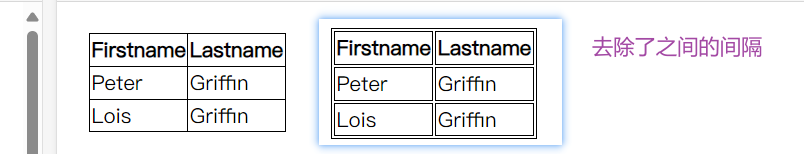

## 1、backgrounds

| Property                                                     | 描述                                         |
| :----------------------------------------------------------- | :------------------------------------------- |
| [background](https://www.runoob.com/cssref/css3-pr-background.html) | 简写属性，作用是将背景属性设置在一个声明中。 |
| [background-attachment](https://www.runoob.com/cssref/pr-background-attachment.html) | 背景图像是否固定或者随着页面的其余部分滚动。 |
| [background-color](https://www.runoob.com/cssref/pr-background-color.html) | 设置元素的背景颜色。                         |
| [background-image](https://www.runoob.com/cssref/pr-background-image.html) | 把图像设置为背景。                           |
| [background-position](https://www.runoob.com/cssref/pr-background-position.html) | 设置背景图像的起始位置。                     |
| [background-repeat](https://www.runoob.com/cssref/pr-background-repeat.html) | 设置背景图像是否及如何重复。                 |

### 1.1、CSS 属性定义背景效果:

- background-color

  - ``````
    body {background-color:#b0c4de;}
    ``````

- background-image

  - ```css
    body {
        backgroundimage:url('paper.gif');
        background-repeat:repeat-x; /**沿x轴平铺**/
        background-repeat:no-repeat;/**不平铺**/
        background-position:right top;/**调整背景图的位置**/  
        
        /**
        	flex：背景图像固定
        	scroll：背景图像随着内容滚动
        	local：背景图像在元素内部滚动
        **/
        background-attachment:flex;
    }
    
    ```

  - 默认：平铺重复显示

- background-repeat

- background-attachment

- background-position

**background合着**

```
body {background:#ffffff url('img_tree.png') no-repeat right top;}
```

## 2、文本（Text）

如果你要调整文本，可以查看下面表格内容

| [color](https://www.runoob.com/cssref/pr-text-color.html)    | 设置文本颜色             |
| ------------------------------------------------------------ | ------------------------ |
| [direction](https://www.runoob.com/cssref/pr-text-direction.html) | 设置文本方向。           |
| [letter-spacing](https://www.runoob.com/cssref/pr-text-letter-spacing.html) | 设置字符间距             |
| [line-height](https://www.runoob.com/cssref/pr-dim-line-height.html) | 设置行高                 |
| [text-align](https://www.runoob.com/cssref/pr-text-text-align.html) | 对齐元素中的文本         |
| [text-decoration](https://www.runoob.com/cssref/pr-text-text-decoration.html) | 向文本添加修饰           |
| [text-indent](https://www.runoob.com/cssref/pr-text-text-indent.html) | 缩进元素中文本的首行     |
| [text-shadow](https://www.runoob.com/cssref/css3-pr-text-shadow.html) | 设置文本阴影             |
| [text-transform](https://www.runoob.com/cssref/pr-text-text-transform.html) | 控制元素中的字母         |
| [unicode-bidi](https://www.runoob.com/cssref/pr-text-unicode-bidi.html) | 设置或返回文本是否被重写 |
| [vertical-align](https://www.runoob.com/cssref/pr-pos-vertical-align.html) | 设置元素的垂直对齐       |
| [white-space](https://www.runoob.com/cssref/pr-text-white-space.html) | 设置元素中空白的处理方式 |
| [word-spacing](https://www.runoob.com/cssref/pr-text-word-spacing.html) | 设置字间距               |

### 2.1、letter-spacing:

```
h1 {letter-spacing:2px}
h2 {letter-spacing:-3px}
```

| normal   | 默认。规定字符间没有额外的空间。               |
| -------- | ---------------------------------------------- |
| *length* | 定义字符间的固定空间（允许使用负值）。         |
| inherit  | 规定应该从父元素继承 letter-spacing 属性的值。 |

### 2.2、line-height:

```
p.small {line-height:90%}
p.big {line-height:200%}
```

| 值       | 描述                                                 |
| :------- | :--------------------------------------------------- |
| normal   | 默认。设置合理的行间距。                             |
| *number* | 设置数字，此数字会与当前的字体尺寸相乘来设置行间距。 |
| *length* | 设置固定的行间距。                                   |
| *%*      | 基于当前字体尺寸的百分比行间距。                     |
| inherit  | 规定应该从父元素继承 line-height 属性的值。          |

### 2.3、text-align:

```
h1 {text-align:center}
h2 {text-align:left}
h3 {text-align:right}
```

| 值      | 描述                                       |
| :------ | :----------------------------------------- |
| left    | 把文本排列到左边。默认值：由浏览器决定。   |
| right   | 把文本排列到右边。                         |
| center  | 把文本排列到中间。                         |
| justify | 实现两端对齐文本效果。                     |
| inherit | 规定应该从父元素继承 text-align 属性的值。 |

### 2.4、text-decoration:

```
h1 {text-decoration:overline}
h2 {text-decoration:line-through}
h3 {text-decoration:underline}
```


| 值           | 描述                                            |
| :----------- | :---------------------------------------------- |
| none         | 默认。定义标准的文本。                          |
| underline    | 定义文本下的一条线。                            |
| overline     | 定义文本上的一条线。                            |
| line-through | 定义穿过文本下的一条线。                        |
| blink        | 定义闪烁的文本。                                |
| inherit      | 规定应该从父元素继承 text-decoration 属性的值。 |

### 2.5text-transform

| none       | 默认。定义带有小写字母和大写字母的标准的文本。 |
| ---------- | ---------------------------------------------- |
| capitalize | 文本中的每个单词以大写字母开头。               |
| uppercase  | 定义仅有大写字母。                             |
| lowercase  | 定义无大写字母，仅有小写字母。                 |
| inherit    | 规定应该从父元素继承 text-transform 属性的值。 |

## 3、字体

font-family 属性应该设置几个字体名称作为一种"后备"机制，如果浏览器不支持第一种字体，他将尝试下一种字体。

**注意**: 如果字体系列的名称超过一个字，它必须用引号，如Font Family："宋体"。

```css
p{font-family:"Times New Roman", Times, serif;}
```

| [font](https://www.runoob.com/cssref/pr-font-font.html)      | 在一个声明中设置所有的字体属性       |
| ------------------------------------------------------------ | ------------------------------------ |
| [font-family](https://www.runoob.com/cssref/pr-font-font-family.html) | 指定文本的字体系列                   |
| [font-size](https://www.runoob.com/cssref/pr-font-font-size.html) | 指定文本的字体大小                   |
| [font-style](https://www.runoob.com/cssref/pr-font-font-style.html) | 指定文本的字体样式                   |
| [font-variant](https://www.runoob.com/cssref/pr-font-font-variant.html) | 以小型大写字体或者正常字体显示文本。 |
| [font-weight](https://www.runoob.com/cssref/pr-font-weight.html) | 指定字体的粗细。                     |

### 3.1、em单位的好处

- 子元素设置为em单位，可以跟随父元素的字体大小变动而变动
- 如果你不指定一个字体的大小，默认大小和普通文本段落一样，是16像素（16px=1em）

## 4、链接：

```
a:link {color:#000000;}      /* 未访问链接*/
a:visited {color:#00FF00;}  /* 已访问链接 */
a:hover {color:#FF00FF;}  /* 鼠标移动到链接上 */
a:active {color:#0000FF;}  /* 鼠标点击时 */
```

## 5、列表


| [list-style](https://www.runoob.com/cssref/pr-list-style.html) | 简写属性。用于把所有用于列表的属性设置于一个声明中 |
| ------------------------------------------------------------ | -------------------------------------------------- |
| [list-style-image](https://www.runoob.com/cssref/pr-list-style-image.html) | 将图像设置为列表项标志。                           |
| [list-style-position](https://www.runoob.com/cssref/pr-list-style-position.html) | 设置列表中列表项标志的位置。                       |
| [list-style-type](https://www.runoob.com/cssref/pr-list-style-type.html) | 设置列表项标志的类型。                             |

### 5.1、list-style-type


```css
ul.a {list-style-type: circle;}
ul.b {list-style-type: square;}
 
ol.c {list-style-type: upper-roman;}
ol.d {list-style-type: lower-alpha;}
```

### 5.2、list-style-image

```css
ul
{
    list-style-image: url('sqpurple.gif');
}
```

## 6、表格样式

**border-collapse:collapse;**这个是去除间隔的



```css
table
{
    border-collapse:collapse;
}
table,th, td
{
    border: 1px solid black;
}
```

## 7、盒子模型


## 8、border（边框）

| 边框样式 | 定义                                                   |
| -------- | ------------------------------------------------------ |
| `dotted` | 定义一个点线边框                                       |
| `dashed` | 定义一个虚线边框                                       |
| `solid`  | 定义实线边框                                           |
| `double` | 定义两个边框。两个边框的宽度与 `border-width` 的值相同 |
| `groove` | 定义 3D 沟槽边框。效果取决于边框的颜色值               |
| `ridge`  | 定义 3D 脊边框。效果取决于边框的颜色值                 |
| `inset`  | 定义一个 3D 的嵌入边框。效果取决于边框的颜色值         |
| `outset` | 定义一个 3D 突出边框。效果取决于边框的颜色值           |

```css
div{
	border:1px red solid;
    border-style:solid;
    border-color:red;
    border-width:10px;
    
    border-left-style:double;
    border-right=color:red;
    
    border-top-left-radius:20px;
}
```

## 9、轮廓

轮廓就是border外面的一层

```
outline:green dotted thick;
```

## 10、尺寸

| [height](https://www.runoob.com/cssref/pr-dim-height.html)   | 设置元素的高度。     |
| ------------------------------------------------------------ | -------------------- |
| [line-height](https://www.runoob.com/cssref/pr-dim-line-height.html) | 设置行高。           |
| [max-height](https://www.runoob.com/cssref/pr-dim-max-height.html) | 设置元素的最大高度。 |
| [max-width](https://www.runoob.com/cssref/pr-dim-max-width.html) | 设置元素的最大宽度。 |
| [min-height](https://www.runoob.com/cssref/pr-dim-min-height.html) | 设置元素的最小高度。 |
| [min-width](https://www.runoob.com/cssref/pr-dim-min-width.html) | 设置元素的最小宽度。 |
| [width](https://www.runoob.com/cssref/pr-dim-width.html)     | 设置元素的宽度。     |

## 11、display

隐藏一个元素可以通过把display属性设置为"none"，或把visibility属性设置为"hidden"。但是请注意，这两种方法会产生不同的结果。

visibility:hidden可以隐藏某个元素，但隐藏的元素仍需占用与未隐藏之前一样的空间。也就是说，该元素虽然被隐藏了，但仍然会影响布局。

display:none是直接将这个元素从空间布局中抹除掉