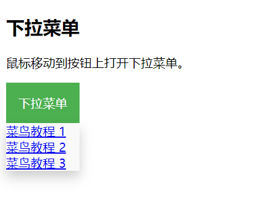

## 1、position:absolute脱离文本流状态

## 行内元素无法设置宽高，为什么行类元素采用position:absolute，就可以设置宽高了

行内元素默认不接受宽高设置，因为它们的大小由内容决定。当你将行内元素设置为 `position: absolute` 时，它的定位脱离了文档流，这使得它的宽高可以独立于其内容进行设置。这样，你就可以给它赋予具体的宽高。你想深入了解这方面的概念吗？