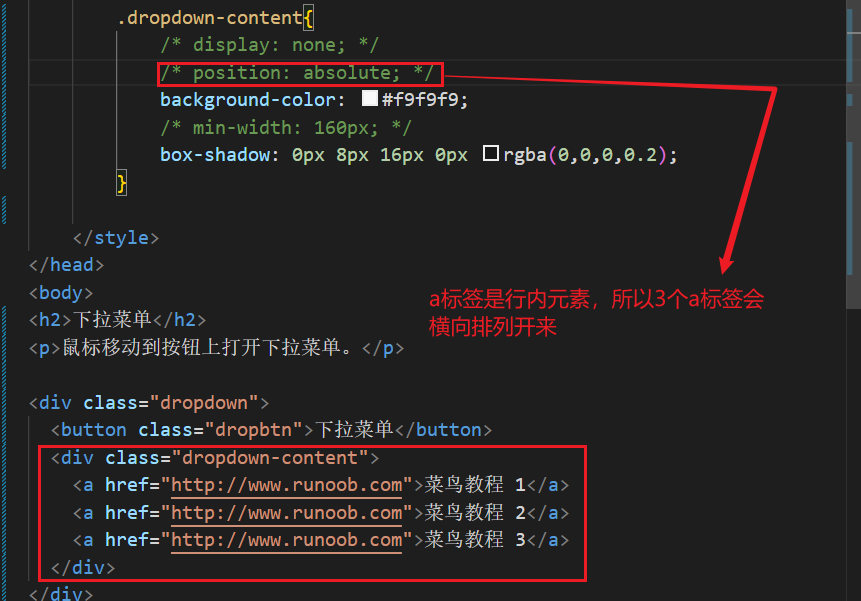
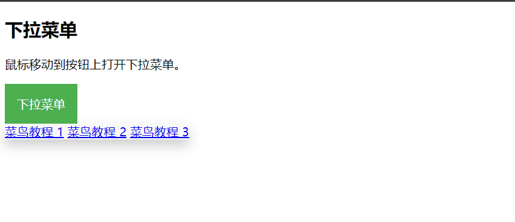
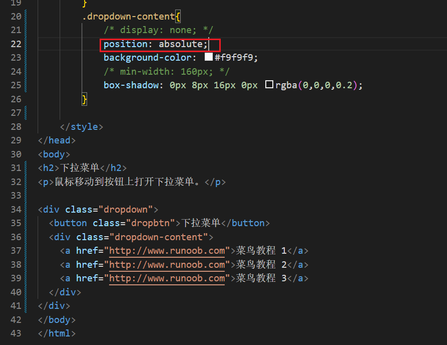
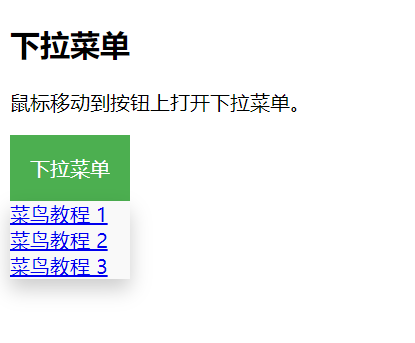

## 1、position:absolute脱离文本流状态

## 2、box-sizing: border-box;
box-sizing: border-box; 是一种 CSS 属性设置，它改变了元素的盒模型计算方式。使用这个属性后，元素的总宽度和高度将包括内边距（padding）和边框（border），而不是仅仅包含内容区域。这使得元素的尺寸更容易控制，特别是在设计响应式布局时。

简单来说，当你设置一个元素的宽度为 200px，并且给它添加了 20px 的内边距和 5px 的边框，使用 border-box 后，元素的总宽度依然是 200px，而内容区域会相应缩小，而不是超出设定的宽度。

## 3、transition: width 0.4s ease;
`transition: width 0.4s ease-in-out;` 是 CSS 中用于定义过渡效果的属性，具体解释如下：

1. **`transition`**: 这是用于创建平滑过渡效果的属性，允许你定义元素属性变化的动画。
2. **`width`**: 指定要应用过渡效果的 CSS 属性。在这里，是元素的宽度。
3. **`0.4s`**: 过渡持续时间，单位为秒。在这个例子中，元素的宽度变化将在 0.4 秒内完成。
4. **`ease-in-out`**: 这是过渡的时间函数，定义了动画速度的变化方式。`ease-in-out` 意味着动画开始和结束时的速度较慢，中间加速，这样的效果更加自然。

### 其他相关知识点：

- **其他时间函数**:
  - `linear`: 速度保持一致。
  - `ease`: 初始慢，随后加速，最后减速。
  - 自定义贝塞尔曲线，如 `cubic-bezier(0.25, 0.1, 0.25, 1)`，可以更细致地控制动画的速度变化。
- **多个属性过渡**: 可以同时过渡多个属性，如 `transition: width 0.4s ease-in-out, height 0.4s ease-in-out;`。
- **过渡状态**: 可以通过伪类（如 `:hover`、`:focus`）来触发过渡效果。
- **初始状态**: 通常，设置一个初始状态（如通过 `width: 100px;`），再通过 JavaScript 或 CSS 改变状态，以便触发过渡。

使用过渡效果可以使用户体验更加流畅和直观，是现代网页设计的重要组成部分。

