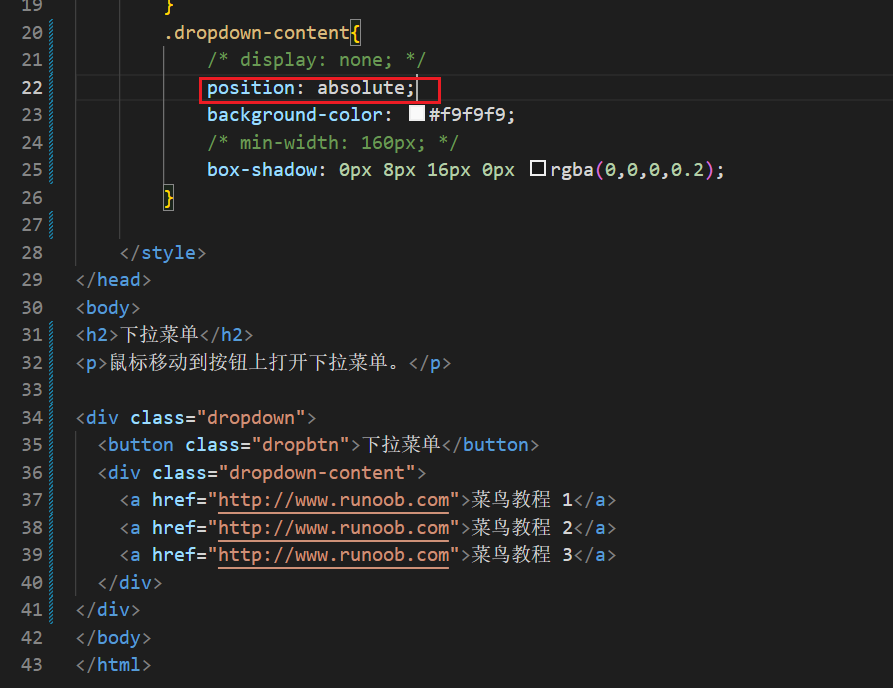

## 1、position:absolute脱离文本流状态





## 行内元素无法设置宽高，为什么行类元素采用position:absolute，就可以设置宽高了

行内元素默认不接受宽高设置，因为它们的大小由内容决定。当你将行内元素设置为 `position: absolute` 时，它的定位脱离了文档流，这使得它的宽高可以独立于其内容进行设置。这样，你就可以给它赋予具体的宽高。你想深入了解这方面的概念吗？


```html
<!DOCTYPE html>
<html lang="en">
<head>
  <meta charset="UTF-8">
  <meta name="viewport" content="width=device-width, initial-scale=1.0">
  <title>Document</title>
  <style>
    div {
      border-radius: 4px;
      text-align: center;
      margin: auto auto;
      line-height: 100px;
      width: 200px;
      height: 100px;
      background-color: orange;
      transition:width 2s, height 2s ,background-color 2s,line-height 2s,color 2s,margin-top 10s, transform 1s;
    }
    div:hover {
      margin-top: 50px;
      color: white;
      line-height: 200px;
      width: 300px;
      height: 200px;
      transform: rotate(360deg);
      background-color: red;
    }

  </style>
</head>
<body>
  <p><b>HELLO</b></p>

<div>HELLOILOVE</div>
</body>
</html>
```

