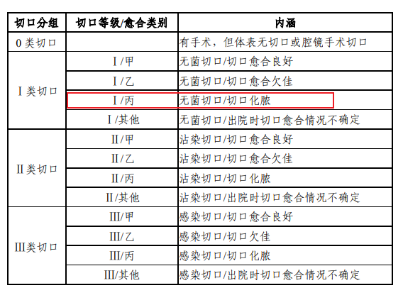
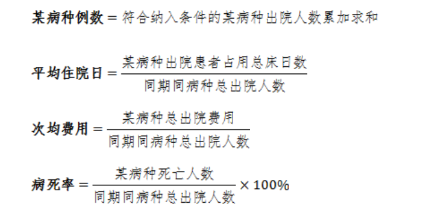
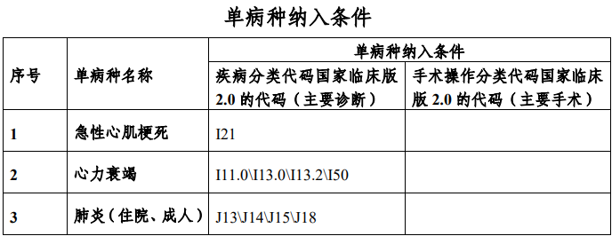
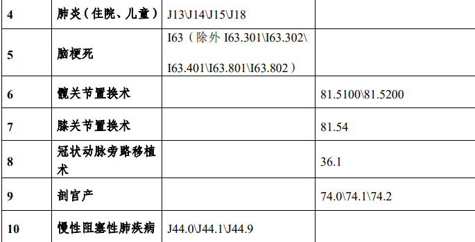
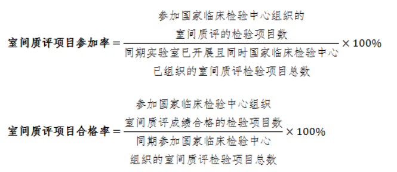

## 1、手术患者并发症发生率

| 指标属性               | 计量单位 | 指标导向 | 数据来源 | 指标解释                           |
| ---------------------- | -------- | -------- | -------- | ---------------------------------- |
| 定量指标，国家监测指标 | %        | 逐步降低 | 病案首页 | 国家卫生健康委病案管理质量控制中心 |

### 1.1、指标定义

考核年度择期手术患者发生并发症例数占同期出院的 手术患者人数的比例。

### 1.2、计算方法

（1）分子：此处手术患者并发症发生例数是指手术患 者并发症发生人数。

（2）分母：此处同期出院的手术患者人数是指同期出 院患者中接受手术和介入治疗的总人数。不包括妊娠、分 娩、围产期、新生儿患者。

（3）本次考核手术以人数计算，即同一次住院就诊期 间患有同一疾病或不同疾病施行多次手术者，按 1 人统计。

（4）择期手术患者并发症评价指非急诊入院患者（择 期手术）手术后发生的并发症。择期手术是指可以选择适 当的时机实施的手术，手术时机的把握不致影响治疗效果， 允许术前充分准备或观察，再选择时机实施手术。排除住 院病案首页“入院途径”字段为 “1.急诊”的手术病例。

（5）手术并发症是指并发于手术或手术后的疾病或情 况，如手术后出血或血肿、手术后伤口裂开、手术中发生 或由于手术造成的休克、手术后的血管并发症等。确定了择期手术后并发症范围，即指考 核年度择期手术后发生感染、瘘、肺栓塞、深静脉血栓、 败血症、出血或血肿、伤口裂开、猝死、呼吸衰竭、生理/ 代谢紊乱等情况的人数。

### 1.3、指标意义

预防手术后并发症发生是医疗质量管理和监控的重 点，也是患者安全管理的核心内容，是衡量医疗技术能力 和管理水平的重要结果指标之一。

:::details 指标上升与下降意义解析

手术患者并发症发生率是一个重要的医疗质量安全指标，它反映了医疗机构在手术过程中对患者并发症的控制能力。这个指标的计算公式是“手术患者并发症发生例数/同期出院的手术患者人数”，以百分比形式表示。

**指标上升代表：**

1. **手术并发症风险增加**：可能意味着在手术过程中，由于技术、管理或患者个体差异等原因，导致并发症的发生频率增加。
2. **手术难度或复杂性增加**：如果医院近期进行的手术中，高难度或高风险手术的比例增加，可能会导致并发症发生率上升。
3. **数据报告或监测改进**：有时候，指标的上升并不一定反映实际情况的恶化，而可能是因为数据报告更加准确或监测手段的改进，使得原本未被记录的并发症现在被纳入统计。

**指标下降代表：**

1. **医疗质量提升**：表明医疗机构在手术管理和患者护理方面做出了有效的改进，减少了并发症的发生。
2. **术前评估和风险管理加强**：医院可能加强了术前评估和风险管理，更好地识别和预防可能导致并发症的风险因素。
3. **术后护理和监控改善**：改善术后护理和监控措施，可以及时发现并处理并发症，减少其发生。
4. **医疗技术进步**：随着医疗技术的发展，手术方法的改进和新技术的应用可能降低了并发症的风险。

根据搜索结果，国家卫生健康委在《手术质量安全提升行动方案（2023-2025年）》中提出了到2025年末，住院患者围手术期死亡、手术并发症、麻醉并发症等负性事件发生率进一步下降的目标。这表明国家层面也在推动降低手术并发症发生率，以提升医疗质量和患者安全。

医疗机构应通过持续改进手术前、中、后的管理和监控，优化手术流程，提高医护人员的专业技能，以及加强患者教育和术后护理等措施，来降低手术患者并发症发生率。同时，医疗机构还应建立手术质量安全数据库，定期分析评估手术质量安全情况，并根据分析结果进行针对性改进。

:::

### 1.4、所需字段

| 字段名                 | 字段单位 | 字段解释                |
| ---------------------- | -------- | ----------------------- |
| 手术患者并发症发生例数 | 人/年    | 手术患 者并发症发生人数 |
| 同期出院的手术患者人数 | 人/年    |                         |

## 2、 I 类切口手术部位感染率

| 指标属性               | 计量单位 | 指标导向 | 数据来源 | 指标解释                           |
| ---------------------- | -------- | -------- | -------- | ---------------------------------- |
| 定量指标，国家监测指标 | %        | 逐步降低 | 病案首页 | 国家卫生健康委病案管理质量控制中心 |

### 2.1、指标定义

考核年度发生 I 类切口手术部位感染人次数占同期 I 类切口手术台次数的比例。

### 2.2、计算方法

（1）分子：此处 I 类切口手术部位感染人次数是住院 病案首页切口愈合等级字段填报 I 类切口丙级愈合（代码 3）选项的人次数>，同一患者同一次住院有多个 I 类切口丙 级愈合，按 1 人统计。

（2）分母：此处同期 I 类切口手术台次数是指同期住 院病案首页切口愈合等级字段填报为 I 类切口（代码 1/2/3/10）的患者总人数，同一患者同一次住院多个 I 类切 口手术，按 1 人统计。

### 2.3、指标意义

描述Ⅰ类切口手术患者发生手术部位感染的频率, 反 映医院对接受 I 类切口手术患者医院感染管理和防控情 况。

:::details 指标上升与下降意义解析

1类切口手术部位感染率是一个关键的医疗质量安全指标，用于衡量医疗机构在进行1类切口手术时对医院感染的防控能力。1类切口手术通常指的是无菌切口手术，即手术未进入炎症区，未进入呼吸、消化及泌尿生殖道的手术。这个指标的计算公式是“1类切口手术部位感染人次数/同期1类切口手术台次数”，以百分比形式表示。

**指标上升代表：**

1. **感染控制措施可能不足**：如果1类切口手术部位感染率上升，可能意味着医疗机构在术前、术中、术后的感染控制措施不够严格或执行不到位。
2. **手术量增加而感染控制未同步加强**：随着手术量的增加，如果感染控制措施没有相应加强，可能会导致感染率上升。
3. **监测和报告改进**：有时候，感染率的上升可能是因为监测和报告系统得到了改进，使得原本未被识别或报告的感染病例现在被纳入统计。

**指标下降代表：**

1. **感染控制措施有效**：如果1类切口手术部位感染率下降，表明医疗机构在感染控制方面采取的措施是有效的，如术前准备、无菌操作、术后护理等。
2. **医疗质量提升**：感染率的下降通常与整体医疗质量的提升有关，包括医护人员的专业技能、手术环境的清洁度、医疗设备和耗材的消毒等。
3. **患者教育和参与**：对患者进行有效的术前教育，提高他们对感染控制重要性的认识，也可能有助于降低感染率。

根据搜索结果，国家卫生健康委在《手术质量安全提升行动方案（2023-2025年）》中提出了到2025年末，住院患者围手术期死亡、手术并发症、麻醉并发症等负性事件发生率进一步下降的目标。这表明国家层面也在推动降低手术患者并发症发生率，以提升医疗质量和患者安全。医疗机构应通过持续改进手术前、中、后的管理和监控，优化手术流程，提高医护人员的专业技能，以及加强患者教育和术后护理等措施，来降低1类切口手术部位感染率。同时，医疗机构还应建立手术质量安全数据库，定期分析评估手术质量安全情况，并根据分析结果进行针对性改进。

:::

### 2.4、所需字段

| 字段名                    | 字段单位 | 字段解释 |
| ------------------------- | -------- | -------- |
| 1类切口手术部位感染人次数 | 人/年    |          |
| 同期1类切口手术台次数     | 人/年    |          |

## 3、 单病种质量控制

| 指标属性               | 计量单位      | 指标导向                                                     | 数据来源 | 指标解释                           |
| ---------------------- | ------------- | ------------------------------------------------------------ | -------- | ---------------------------------- |
| 定量指标，国家监测指标 | 人、天、元、% | （1）每一单病种例数：监测比较。 （2）每一单病种平均住院日：逐步降低。 （3）每一单病种次均费用：监测比较。 （4）每一单病种死亡率：逐步降低。 | 病案首页 | 国家卫生健康委病案管理质量控制中心 |

### 3.1、指标定义

考核年度单病种纳入条件见下表，具体考核指标为： 

（1）单病种例数：考核年度符合疾病分类代码国家临 床版2.0及手术操作分类代码国家临床版2.0中单病种纳入 条件的某病种出院人数之和，计量单位：人。 

（2）平均住院日：考核年度符合单病种纳入条件的某 单病种平均住院时间，计量单位：天。

 （3）次均费用：考核年度符合单病种纳入条件的某病 种出院患者平均住院费用，计量单位：元。 

（4）病死率：考核年度符合单病种纳入条件的某病种 患者死亡人数所占的比例，计量单位：%。

### 3.2、计算方法

（1）分子：

①**某病种出院患者占用总床日数**是指考核 年度某病种所有出院人数的住院床日之总和。

②**某病种总出院费用**是指考核年度某病种患者住院期间发生的与诊疗 有关的所有费用之和。

③**某病种死亡人数**是指考核年度某 病种出院病案首页中离院方式为“死亡”（代码为 5）的 人数之和。

（2）分母：所有指标均为某病种同期总出院人数。按 照《关于加强三级公立医院绩效考核工作的意见》（国办 发〔2019〕4 号）的考核要求，纳入监测的单病种范围详 见下表。

注：按照国务院办公厅《关于加强三级公立医院绩效考核工作的意见》 （国办发〔2019〕4 号）的要求，需监测的单病种包括急性心肌梗死、心力衰 竭、肺炎（住院、成人）、肺炎（住院、儿童）、脑梗死、髋关节置换术、 膝关节置换术、冠状动脉旁路移植术、围手术期预防感染、剖宫产、慢性阻 塞性肺疾病、围手术期预防深静脉血栓。但由于“围手术期预防感染、围手 术期预防深静脉血栓”数据信息无法从病案首页中获得，故本年度暂不进行 评价。

### 3.3、指标意义

单病种质量管理是一种标准化的、以病种（或手术） 为单位而进行的全程医疗质量管理的新方法，它以明确诊 断标准的单一疾病（或手术）种类为一个质量评价单位， 通过对疾病诊疗全过程，包括诊断、检查、治疗、治疗效 果以及医疗费用等，实施标准化控制，达到提高医疗质量 和促进医疗资源合理利用的目的；具有相同疾病（或手术） 诊断名称的一类患者运用相同指标进行医院间比较，可反 映各医院的诊疗能力、技术水平和费用等差异性。

:::details 指标上升与下降意义解析

:::

### 3.4、所需字段

| 字段名                    | 字段单位 | 字段解释 |
| ------------------------- | -------- | -------- |
| 1类切口手术部位感染人次数 | 人/年    |          |
| 同期1类切口手术台次数     | 人/年    |          |

## 4、 大型医用设备检查阳性率

| 指标属性 | 计量单位 | 指标导向 | 数据来源 | 指标解释       |
| -------- | -------- | -------- | -------- | -------------- |
| 定量指标 | %        | 监测比较 | 医院填报 | 省级卫生健康委 |

### 4.1、指标定义

考核年度大型医用设备检查阳性数与同期大型医用设 备检查的人次数之比。

### 4.2、计算方法

（1）大型医用设备，是指使用技术复杂、资金投入量 大、运行成本高、对医疗费用影响大且纳入目录管理的大 型医疗器械。 

（2）本次考核所指的大型医用设备

### 4.3、指标意义

对已经购置的大型医用设备使用情况、使用效果应定 期评价，以充分发挥其在诊疗中的优势作用，促进大型医，用设备科学配置和合理使用。

:::details 指标上升与下降意义解析

大型医用设备检查阳性率是一个衡量医疗设备使用效率和医疗质量的重要指标。它反映了在一定时期内，使用大型医用设备进行检查时，发现阳性结果的比例。这个指标的计算公式是“大型医用设备检查阳性数/同期大型医用设备检查人次数”。

**指标上升代表：**

1. **医疗设备使用效率提高**：阳性率的上升可能意味着大型医用设备的使用更加精准，检查结果更具有临床价值，减少了不必要的检查。
2. **临床决策和检查指征把握得当**：医生可能更加严格地把握检查指征，只在必要时使用大型医用设备，从而提高了检查的阳性率。
3. **医疗技术水平提升**：随着医疗技术的进步，设备的诊断能力可能得到增强，使得检查结果的准确性提高。
4. **患者疾病谱变化**：如果患者群体中某种疾病的发病率上升，而这种疾病通过大型设备检查容易被发现，也可能导致阳性率上升。
5. **政策和监管影响**：根据国家相关规定，大型医疗设备检查结果阳性率应达到70%以上。因此，医疗机构可能在政策引导下，更加注重检查的适宜性和必要性，从而提高了阳性率。

**指标下降代表：**

1. **过度检查现象**：阳性率的下降可能意味着存在不必要的检查，增加了患者的经济负担和医疗资源的浪费。
2. **医疗决策的准确性下降**：可能是因为医生在决定是否进行大型设备检查时，把握指征不够准确，导致阳性结果的比例降低。
3. **设备使用不规范**：可能反映了医疗机构在大型医用设备的使用和管理上存在不规范的情况，需要加强监管和培训。
4. **患者疾病谱变化**：如果患者群体中某种疾病的发病率下降，而这种疾病不易通过大型设备检查发现，也可能导致阳性率下降。

根据搜索结果，2022年，全国三级公立医院大型医用设备检查阳性率为89.1%，较2021年提升1.2个百分点。这表明在一定时期内，三级公立医院在大型医用设备的使用上更加规范和高效，医疗质量和安全管理情况持续向好。

:::

### 4.4、所需字段

| 字段名                     | 字段单位 | 字段解释 |
| -------------------------- | -------- | -------- |
| 大型医用设备检查阳性数     | 次/年    |          |
| 同期大型医用设备检查人次数 | 人/年    |          |

## 5、 大型医用设备维修保养及质量控制管理

| 指标属性 | 计量单位 | 指标导向 | 数据来源 | 指标解释       |
| -------- | -------- | -------- | -------- | -------------- |
| 定性指标 | 无       | 监测比较 | 医院填报 | 省级卫生健康委 |

### 5.1、指标定义

考核年度大型医用设备在医院购置、使用、管理及评 价等全程管理现况。

### 5.2、计算方法

医院提供相应佐证材料

引导医院关注医用设备的维修保养和质量控制，配置 合适维修人员和维修检测设备。评价内容包括但不限于： 

（1）配置合理维修人员和维修场地，涉及有毒有害作 业应有合适的维修场所和有效防护。

 （2）制定急救、生命支持类等设备的预防性维护维修 计划。

 （3）开展日常保养和维护，有巡检、保养、维修等相 关记录及设备管理部门对临床使用部门的监管、培训记录。 

（4）配置必备的检测和质量控制设备，医学设备管理 部门定期对设备特别是急救、生命支持类设备进行预防性 维护，确保在用设备完好，有记录和标识，并对发现的问 题及时处理。

### 5.3、指标意义

医院应当关注医用设备的维修保养和质量控制，科学 配置工程技术人员并做好设备维修保养等管理工作。

 医学影像相关设备可参见《医学影像诊断中心基本标 准和管理规范（试行）》（国卫医发〔2016〕36 号）的通知 要求执行，医院要有专职人员负责对设备进行定期校正与维 护保养，设备的运行完好率＞95%。

:::details 指标上升与下降意义解析

:::

### 4.4、所需字段

| 字段名 | 字段单位 | 字段解释 |
| ------ | -------- | -------- |
|        |          |          |
|        |          |          |

## 6、 通过国家室间质量评价的临床检验项目数

| 指标属性               | 计量单位 | 指标导向                                        | 数据来源                   | 指标解释                   |
| ---------------------- | -------- | ----------------------------------------------- | -------------------------- | -------------------------- |
| 定量指标、国家监测指标 | %        | 室间质评项目参加率和室间质评项目合格率 逐步提高 | 国家卫生健康委临床检验中心 | 国家卫生健康委临床检验中心 |

### 6.1、指标定义

考核年度医院临床检验项目中通过国家卫生健康委临 床检验中心组织的室间质量评价项目数量。

### 6.2、计算方法

医院临床检验项目中通过国家卫生健康委临床检验中 心组织的室间质量评价项目数量。

（1）本次考核的项目数量的指标是由两部分组成，即 室间质量评价项目数量和室间质量评价中合格的项目数 量。这两个数值分别通过室间质评项目参加率和室间质评 项目合格率予以体现。具体计算方法如下：

注：分母为实验室开展的项目与国家卫生健康委临床检验中心组织的室 间质评项目中重叠的项目数。

（2）考核中的室间质量评价项目数量只能是国家卫生，健康委临床检验中心开展的室间质量评价项目。

### 6.3、指标意义

（1）《关于加强医疗质量控制中心建设推进同级医疗 机构检查结果互认工作的通知》（卫办医政发〔2010〕108 号）提出，国家卫生健康委医疗质量控制中心负责推进同 级医疗机构检查结果互认。提供临床服务的检验项目如果 国家有室间质量评价计划的应当参加，以反映检验结果的 可比性和同质性，同时为临床检验结果互认提供科学的依据。 

（2）室间质评反映实验室参加国家卫生健康委临床检 验中心组织的室间质评计划进行外部质量监测的情况①。 

（3）《关于印发进一步改善医疗服务行动计划（2018 —2020 年）的通知》（国卫医发〔2017〕73 号）要求各地 区应实现检查检验结果互认。

:::details 指标上升与下降意义解析

医院临床检验项目中通过国家卫生健康委临床检验中心组织的室间质量评价项目数量，这个指标反映了医院临床检验科的质量管理水平和检验结果的准确性、可靠性。室间质量评价（EQA）是一种能力验证活动，通过比较不同实验室之间的检测结果，评估实验室检测能力的一致性和准确性。

**指标上升代表：**

1. **质量管理水平提高**：医院临床检验科对质量管理的重视程度提高，积极参与国家卫生健康委临床检验中心组织的室间质量评价，以确保检验结果的准确性和可靠性。
2. **检验能力增强**：医院可能通过引进新技术、新设备或提升人员专业技能，增强了检验能力，从而在更多的检验项目上达到了国家卫生健康委临床检验中心的质量评价标准。
3. **检验结果的可比性提高**：通过室间质量评价，医院的检验结果与其他实验室的结果具有更好的可比性，这对于患者的诊疗和医院间的合作都是非常有益的。
4. **患者信任度提升**：随着质量管理水平的提高，患者对医院检验结果的信任度也会随之提升，有助于提升医院的整体服务水平和市场竞争力。

**指标下降代表：**

1. **质量管理重视程度下降**：可能是因为医院对质量管理的重视程度不够，没有积极参与室间质量评价，或者在质量管理上存在疏忽。
2. **检验能力下降**：可能是因为医院在人员培训、设备更新、技术升级等方面投入不足，导致检验能力下降，无法满足国家卫生健康委临床检验中心的质量评价标准。
3. **检验结果的可比性降低**：检验项目通过室间质量评价的数量减少，可能导致医院的检验结果与其他实验室的结果可比性降低，影响诊疗效果和医院间的合作。
4. **患者信任度下降**：质量管理水平的下降可能会影响患者对医院检验结果的信任度，进而影响医院的声誉和患者满意度。

根据搜索结果，国家卫生健康委临床检验中心组织的室间质量评价项目数量的监测，对三级公立医院临床实验室室间质评项目参加率和合格率进行统计分析，推动三级公立医院重视室间质量评价，持续改进质量，以提高检测的有效性和可比性。这表明国家层面也在推动医院提升质量管理水平，确保检验结果的准确性和可靠性。

:::

### 6.4、所需字段

| 字段名 | 字段单位 | 字段解释 |
| ------ | -------- | -------- |
|        |          |          |
|        |          |          |

## 7、 低风险组病例死亡率

| 指标属性               | 计量单位 | 指标导向 | 数据来源 | 指标解释                                                     |
| ---------------------- | -------- | -------- | -------- | ------------------------------------------------------------ |
| 定量指标、国家监测指标 | %        | 逐步降低 | 病案首页 | 国家卫生健康委 DRGs 质量控制中心、国家 卫生健康委病案管理质量控制中心 |

### 7.1、指标定义

考核年度低风险组病例是基于 DRGs 分组后的一组病 例，经数据计算，全国死亡率较低的 DRG 组。低风险组 病例死亡率是指该组死亡的病例数与低风险组全部病例数 量之比。

### 7.2、计算方法

（1）低风险组病例是由病案首页数据通过 DRGs 分组 器测算而产生。

（2） DRGs（Diagnosis Related Groups）译作“按疾病 诊断分组”，其主要特点是以病例的诊断和（或）操作作为 病例组合的基本依据，综合考虑了病例的个体特征如年龄、 主要疾病、并发症和伴随疾病，将临床过程相近、费用消 耗相似的病例分到同一个组（DRG）中。

（3）死亡风险分级：利用各 DRGs 病例的住院患者病 死率对不同 DRG 进行死亡风险分级。

**住院患者基于 DRGs 死亡风险评分**

（4）低风险组：用于度量医院对住院患者所提供服务 的安全和质量。其基本原理是，全国相应 DRG 组病死率 较低，一旦发生死亡，意味着死亡原因很可能与疾病本身 的关系低，而与临床诊治管理过程相关度更高。

### 7.3、指标意义

体现医院医疗质量和安全管理情况，也间接反映了医 院的救治能力和临床过程管理水平。

:::details 指标上升与下降意义解析

低风险组病例死亡率是一个重要的医疗质量管理指标，它反映了在病情并不严重的情况下，患者发生死亡的概率。这个指标的计算公式是“低风险组死亡例数/低风险组病例数”。

**指标上升代表：**

1. **医疗质量管理可能存在问题**：如果低风险组病例死亡率上升，可能意味着在医疗安全和服务质量方面存在问题，需要进一步分析原因并采取改进措施。
2. **临床诊疗过程管理水平可能下降**：低风险组病例的死亡与临床过程的失误密切相关，因此，该指标的上升可能反映了医院的救治能力和临床诊疗过程管理水平有所下降。
3. **数据质量问题**：病案首页数据填写的不规范可能导致低风险组病例的划分不准确，从而影响低风险组死亡率的统计。

**指标下降代表：**

1. **医疗质量提升**：低风险组病例死亡率的下降通常意味着医院在医疗安全和服务质量方面取得了进步，可能是由于医疗技术的提升、诊疗流程的优化、患者护理的改善等因素。
2. **医疗风险管理加强**：医院可能加强了对患者的风险评估和管理，提前识别并干预可能导致死亡的风险因素，从而降低了低风险组的死亡率。
3. **病案首页数据质量提高**：准确的病案首页数据填写可以确保DRG分组的准确性，从而更准确地反映低风险组病例的实际情况，降低因数据问题导致的低风险组死亡率。

需要注意的是，低风险组病例死亡率是一个非常敏感的指标，其数值通常非常低，因此即使是小的变化也可能具有统计学意义。此外，该指标的计算和评估需要考虑到病案首页数据的准确性和DRG分组的科学性。医疗机构应该通过持续的质量改进活动，如优化诊疗流程、加强患者监护、提高病案首页数据质量等措施，来降低低风险组病例的死亡率

:::

### 7.4、所需字段

| 字段名           | 字段单位 | 字段解释 |
| ---------------- | -------- | -------- |
| 低风险组死亡例数 | 未知     |          |
| 低风险组病例数   | 未知     |          |

## 8、 优质护理服务病房覆盖率

| 指标属性 | 计量单位 | 指标导向 | 数据来源 | 指标解释       |
| -------- | -------- | -------- | -------- | -------------- |
| 定量指标 | %        | 逐步降低 | 医院填报 | 省级卫生健康委 |

### 8.1、指标定义

考核年度医院已经开展优质护理服务的病房总数占医 院全部病房总数的比例。

### 8.2、计算方法

（1）2011 年《关于开展全国三级医院优质护理服务 检查评价的通知》（卫办医政函〔2011〕973 号）提出在病 房开展优质护理服务概念，为统一计算口径，所有病房的 统计概念均以病区为计算单位。

病区：根据《病区医院感染管理规范》（WS/T 510 —2016）中的定义，病区是指由一个护士站统一管理的多 个病室（房）组成的住院临床医疗区域，与住院部公用区 域或公用通道由门分隔。一般包括病室（房）、护士站、医 生办公室、医务人员值班室、治疗室、污物间等。

### 8.3、指标意义

根据《关于进一步深化优质护理、改善护理服务的通 知》（国卫办医发〔2015〕15 号）的要求，到 2015 年底， 46 全国三级医院的各个病房都要开展优质护理服务；逐步实 现二级以上医院优质护理服务全覆盖。参照《关于印发进 一步改善医疗服务行动计划（2018—2020 年）的通知》（国 卫医发〔2017〕73 号）。

:::details 指标上升与下降意义解析

优质护理服务病房覆盖率是一个衡量医疗机构护理服务质量的重要指标，它反映了医院中提供高质量护理服务的病房数量占总病房数量的比例。这个指标的上升和下降可以反映以下几个方面的变化：

**指标上升代表：**

1. **护理服务质量提高**：更多的病房能够提供符合优质护理标准的服务，这通常意味着医院在护理人员培训、病房设施改善、护理技术提升等方面做出了努力。
2. **患者护理体验改善**：随着优质护理服务病房数量的增加，患者能够享受到更加专业、细致的护理服务，从而提高就医体验和满意度。
3. **医疗资源优化配置**：医院可能加大了对护理服务的投入，如改善病房设施、引进先进的护理技术和设备，以提高护理效率和质量。
4. **政策导向效果显现**：根据国家相关政策，如《医院实施优质护理服务工作标准（试行）》等文件要求，医院逐步实现优质护理服务全覆盖，这推动了优质护理服务病房覆盖率的提升。

**指标下降代表：**

1. **护理服务投入可能减少**：如果优质护理服务病房覆盖率下降，可能意味着医院在护理服务方面的投入减少，导致部分病房无法维持优质护理标准。
2. **护理服务质量下降**：覆盖率的下降可能反映了护理人员素质、服务态度、病房环境等方面的退步，这会影响患者的护理体验和康复效果。
3. **资源分配不均**：可能是由于医院在资源分配上存在问题，导致部分病房无法得到足够的支持来维持优质护理服务。
4. **政策执行不到位**：如果医院没有严格执行国家关于优质护理服务的相关政策，也可能导致优质护理服务病房覆盖率的下降。

根据搜索结果，优质护理服务病房覆盖率的提高可以有效改善患者的护理体验和康复效果，需要医疗机构加大对护理服务病房的投入和建设。此外，国家卫生健康委在《进一步改善护理服务行动计划（2023-2025年）》中提出了到2025年，各级各类医疗机构责任制整体护理覆盖全院100%病区的目标，这表明国家层面也在推动提高优质护理服务病房的覆盖率，以提升患者就医体验和护理工作质量

:::

### 8.4、所需字段

| 字段名                             | 字段单位 | 字段解释 |
| ---------------------------------- | -------- | -------- |
| 全院已经开展优质护理服务的病房总数 | 个       |          |
| 全院病房总数                       | 个       |          |

## 