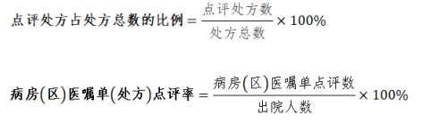
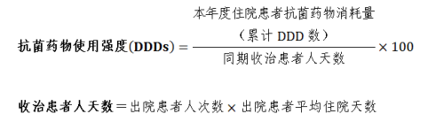
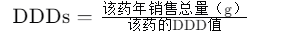
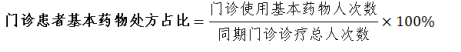
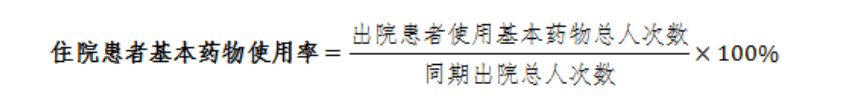
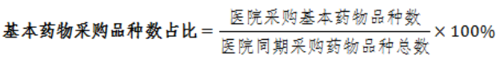
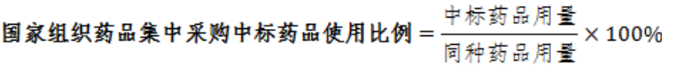

## 1、点评处方占处方总数的比例

| 指标属性 | 计量单位 | 指标导向 | 数据来源 | 指标解释       |
| -------- | -------- | -------- | -------- | -------------- |
| 定量指标 | %        | 逐步提高 | 医院填报 | 省级卫生健康委 |

### 1.1、指标定义

考核年度点评处方占处方总数的比例。

### 1.2、计算方法

（1）根据《处方管理办法》，处方是指由注册的执业 医师和执业助理医师（以下简称医师）在诊疗活动中为患 者开具的、由取得药学专业技术职务任职资格的药学专业 技术人员（以下简称药师）审核、调配、核对，并作为患 者用药凭证的医疗文书。处方包括门急诊处方和医疗机构 病区用药医嘱单。

（2）处方总数按药房处方数统计，医嘱单点评数按出 院病历数计

（3）点评处方包括门诊处方、急诊处方和病房（区） 医嘱单。

（4）点评过程：

- **抽样**：医院药学部门根据医院的实际情况确定抽样方法和抽样率。例如，门急诊处方的抽样率不应少于总处方量的1‰，且每月点评处方绝对数不应少于100张；病房（区）医嘱单的抽样率不应少于1%，且每月点评出院病历绝对数不应少于30份。
- **点评**：由具备相应专业技术资格的药师组成的处方点评小组，按照既定的标准和流程，对随机抽取的处方进行点评。
- **记录**：对点评结果进行记录，包括点评的处方数、发现的问题、干预措施等。
- **报告**：形成书面点评报告，经药学部门负责人审核签字后通报医疗管理部门，并根据点评结果进行持续改进。

### 1.3、指标意义

处方点评是根据相关法规、技术规范，对处方书写的 规范性及药物临床使用的适宜性（用药适应证、药物选择、 给药途径、用法用量、药物相互作用、配伍禁忌等）进行 评价。医院按照《医院处方点评管理规范（试行）》（卫 医管发〔2010〕28 号）和《关于加强药事管理转变药学服 务模式的通知》（国卫办医发〔2017〕26 号）等文件规定， 对点评中发现的问题，重点是超常用药和不合理用药，进 行干预和跟踪管理。将处方点评结果纳入地方卫生健康行 政部门对医疗机构的绩效考核指标中。门急诊处方的抽样 率不应少于总处方量的 1‰，且每月点评处方绝对数不应 少于 100 张；病房（区）医嘱单的抽样率（按出院病历数 计）不应少于 1%，且每月点评出院病历绝对数不应少于 30 份为合格基础。

:::details 指标上升与下降意义解析

点评处方占处方总数的比例是一个反映医院合理用药水平和处方质量管理的重要指标。这个指标的上升和下降可以反映以下几个方面的变化：

**指标上升代表：**

1. **处方质量管理加强**：点评处方数的增加意味着医院对处方的审核和点评工作更加严格和全面，有助于提高处方的规范性和合理性。
2. **临床用药合理性提高**：随着处方点评工作的深入，医生可能更加注重药物的选择、剂量、给药途径等，从而提高临床用药的合理性。
3. **药事管理水平提升**：医院可能加强了药事管理工作，通过培训、指导等方式提升药师和医师的专业能力，进而提高处方质量。
4. **政策导向效果显现**：根据国家相关政策，如《医院处方点评管理规范（试行）》等文件要求，医院逐步建立健全处方点评制度，推动点评处方占处方总数的比例提升。

**指标下降代表：**

1. **处方质量管理可能放松**：如果点评处方数减少，可能意味着医院对处方的审核和点评工作有所放松，这可能会影响处方的规范性和合理性。
2. **临床用药合理性下降**：点评处方比例的下降可能反映了临床用药合理性的问题，如药物选择不当、剂量不适宜等。
3. **药事管理水平下降**：医院可能在药事管理方面的投入和重视程度不足，导致处方点评工作不够充分，影响处方质量。
4. **资源分配问题**：可能是因为医院资源分配的问题，导致无法对所有处方进行有效的点评和管理。

根据搜索结果，国家卫生健康委在《医院处方点评管理规范（试行）》中明确要求医疗机构应当建立处方点评制度，并对处方实施动态监测及超常预警，以提高处方质量，促进合理用药，保障医疗安全。此外，点评处方占处方总数的比例也被纳入公立医院绩效考核指标中，以推动医院提高处方质量管理水平。

:::

### 1.4、所需字段

| 字段名                 | 字段单位 | 字段解释 |
| ---------------------- | -------- | -------- |
| 点评处方数             | 未知     |          |
| 处方总数               | 未知     |          |
| 病房（区）医嘱单点评数 | 未知     |          |
| 出院人数               | 人/年    |          |

## 2、 抗菌药物使用强度（DDDs）

| 指标属性               | 计量单位 | 指标导向 | 数据来源 | 指标解释       |
| ---------------------- | -------- | -------- | -------- | -------------- |
| 定量指标，国家监测指标 | DDD      | 逐步降低 | 医院填报 | 省级卫生健康委 |

### 2.1、指标定义

DDD（defined daily dose，DDD）①用于主要治疗目的 的成人的药物平均日剂量。DDD 作为用药频度分析单位， 不受治疗分类、剂型和不同人群的限制。 

DDDs：用药频度（累计 DDD 数）。

### 2.2、计算方法

DDDs 可反映不同年度的用药动态和用药结构，DDDs 越大，说明该药的使用频率越高。

（1）**本年度住院患者抗菌药物消耗量**（累计DDD数）是指在一年内，医院住院患者使用的抗菌药物总量按照DDD值计算出的总和，

DDD数的计算公式为：

（2）**同期收治患者人天数**是指在特定的时间段内（通常为一年），医院收治的所有患者的住院天数总和。这个指标用于衡量在一定时期内医院收治患者的住院总量，是反映医院服务能力和患者住院需求的重要数据。

### 2.3、指标意义

住院患者抗菌药物使用强度（DDDs）用于衡量医院 合理用药的管理水平。根据《关于进一步加强抗菌药物临 床应用管理工作的通知》（国卫办医发〔2015〕42 号）规定：三级综合医院住院患者抗菌药物使用强度不超过 40DDDs，口腔医院不超过 40DDDs，肿瘤医院不超过 30DDDs，儿童医院不超过 20DDDs（按照成人规定日剂量 标准计算），精神病医院不超过 5DDDs，妇产医院（妇幼 保健院）不超过 40DDDs。

:::details 指标上升与下降意义解析

抗菌药物使用强度（DDDs）是衡量医院抗菌药物使用合理性的一个重要指标，它反映了住院患者每100人每天消耗的抗菌药物的DDD数。这个指标的计算公式是“本年度住院患者抗菌药物消耗量（累计DDD数）/同期收治患者人天数”。抗菌药物使用强度的上升和下降反映了以下几个方面的变化：

**指标上升代表：**

1. **抗菌药物使用增加**：如果抗菌药物使用强度上升，可能意味着医院中抗菌药物的使用量增加，这可能是由于处方习惯、患者病情复杂性增加或感染控制措施不够有效。
2. **耐药性管理可能需要加强**：抗菌药物使用强度的增加可能会加速耐药性的发展，因此可能需要加强对耐药性管理的措施。
3. **可能反映了临床治疗的挑战**：在某些情况下，抗菌药物使用强度的上升可能反映了临床治疗面临的挑战，如患者群体的疾病严重程度增加或感染性疾病的流行。

**指标下降代表：**

1. **抗菌药物管理改善**：抗菌药物使用强度的下降通常是一个积极信号，表明医院在抗菌药物管理方面取得了进步，如实施了更严格的处方审核、提高了临床医生对抗菌药物合理使用的认识等。
2. **感染控制措施有效**：下降的抗菌药物使用强度可能反映了医院感染控制措施的有效性，如改善手卫生、环境清洁和消毒等。
3. **患者治疗优化**：可能意味着医院在患者治疗方面进行了优化，减少了不必要的抗菌药物使用，提高了治疗的针对性和有效性。
4. **政策和教育的影响**：医院可能加强了对抗菌药物使用的监管和教育，提高了医务人员对合理使用抗菌药物的认识，从而降低了抗菌药物的使用强度。

根据搜索结果，国家卫生健康委在相关政策中强调了抗菌药物使用强度的重要性，并将其作为公立医院绩效考核的合理用药核心指标之一。政策要求力争将抗菌药物使用强度控制在40 DDDs以下，并在医院评审和公立医院绩效考核中加大考核权重，以发挥指挥棒作用，推动医院提高抗菌药物使用的合理性

:::

### 2.4、所需字段

| 字段名                                     | 字段单位 | 字段解释 |
| ------------------------------------------ | -------- | -------- |
| 本年度住院患者抗菌药物消耗量 （累计DDD数） | DDD/年   |          |
| 同期收治患者人天数                         | 天/年    |          |

## 3、 门诊患者基本药物处方占比

| 指标属性 | 计量单位 | 指标导向 | 数据来源 | 指标解释       |
| -------- | -------- | -------- | -------- | -------------- |
| 定量指标 | %        | 逐步提高 | 医院填报 | 省级卫生健康委 |

### 3.1、指标定义

考核年度门诊患者就诊的处方中含有国家基本药物目 录中药品的患者人次数与同期门诊诊疗总人次数之比。

### 3.2、计算方法

（1）分子：按照国家卫生健康委颁布的《国家基本药 物目录》内品种数，门诊患者中就诊一个科室的总处方中 只要含有其中一种及以上基本药物则为 1 人次。

 （2）分母：门诊诊疗总人次数，不包括健康体检者及 未开具药物处方患者。

### 3.3、指标意义

（1）根据《国家基本药物目录》（卫药政发〔2009〕 78 号）按照防治必须、安全有效、使用方便、中西药并重、 基本保障、临床首选的原则确定基本药物。国家基本药物 目录实行动态调整管理。

 （2）根据国务院办公厅《关于完善国家基本药物制度 的意见》（国办发〔2018〕88 号）的总体要求，基本药物 52 “突出基本、防治必需、保障供应、优先使用、保证质量、 降低负担”的功能定位，从基本药物的遴选、生产、流通、 使用、支付、监测等环节完善政策，全面带动药品供应保 障体系建设，着力保障药品安全有效、价格合理、供应充 分，缓解“看病贵”问题。各级公立医疗机构加强基本药 物配备使用管理，保障人民群众基本需求，促进药品供应 保障体系建设，强化基本药物功能定位，推动分级诊疗。

 （3）《关于进一步加强公立医疗机构基本药物配备使 用管理的通知》（国卫药政发〔2019〕1 号）要求，提升 基本药物使用占比，公立医疗机构应当科学设置临床科室 基本药物使用指标，基本药物使用金额比例及处方比例应 当逐年提高。

:::details 指标上升与下降意义解析

门诊患者基本药物处方占比是一个反映医院门诊处方中使用基本药物的普遍程度的指标。这个指标的计算公式是“门诊使用基本药物人次数/同期门诊诊疗总人次数”，以百分比形式表示。这个指标的上升和下降反映了以下几个方面的变化：

**指标上升代表：**

1. **基本药物使用增加**：门诊患者基本药物处方占比的上升意味着在门诊处方中使用基本药物的频率增加，这可能反映了医院在推动基本药物使用方面取得了进展。
2. **合理用药水平提高**：基本药物通常具有成本低、疗效好、使用广泛的特点，占比的上升可能意味着医院在合理用药方面做得更好，减少了不必要的高价药物使用。
3. **政策导向效果显现**：根据国家相关政策，如《关于进一步加强公立医疗机构基本药物配备使用管理的通知》（国卫药政发〔2019〕1号），要求提升基本药物使用占比，公立医疗机构应当科学设置临床科室基本药物使用指标，基本药物使用金额比例及处方比例应当逐年提高。因此，指标的上升可能反映了这些政策导向的效果。
4. **患者经济负担减轻**：基本药物的广泛使用有助于降低患者的医疗费用，提高医疗服务的可及性和可负担性。

**指标下降代表：**

1. **基本药物使用减少**：如果门诊患者基本药物处方占比下降，可能意味着在门诊处方中使用基本药物的频率减少，这可能是由于医生选择了更多的非基本药物。
2. **合理用药水平可能下降**：占比的下降可能反映了医院在合理用药方面存在问题，如过度使用非基本药物，可能导致患者经济负担增加。
3. **政策执行力度不足**：指标的下降可能反映了医院在执行国家关于基本药物使用政策方面的力度不足，需要进一步加强管理和改进。
4. **患者需求变化**：也可能是由于患者对药物的需求发生变化，导致非基本药物的使用增加。

根据搜索结果，门诊患者基本药物处方占比是公立医院绩效考核的重要指标之一，其导向是逐步提高。这表明国家层面也在推动医院提高基本药物的使用比例，以实现合理用药和减轻患者负担的目标。

:::

### 3.4、所需字段

| 字段名                 | 字段单位 | 字段解释 |
| ---------------------- | -------- | -------- |
| 门诊使用基本药物人次数 | 人/年    |          |
| 同期门诊诊疗总人次数   | 人/年    |          |

## 4、 住院患者基本药物使用率

| 指标属性 | 计量单位 | 指标导向 | 数据来源 | 指标解释       |
| -------- | -------- | -------- | -------- | -------------- |
| 定量指标 | %        | 逐步提高 | 医院填报 | 省级卫生健康委 |

### 4.1、指标定义

考核年度出院患者在住院期间医嘱中有使用基本药物 的总人次数占同期出院总人次数比。

### 4.2、计算方法

（1）分子：根据国家卫生健康委颁布的《国家基本 药物目录》内品种数，出院患者在住院期间诊疗用药中 含有基本药物者则为 1 人次，含出院带药。

 （2）分母：此处指同期出院人数，不包括未使用药 物的出院患者。

### 4.3、指标意义

门诊患者基本药物处方占比。

:::details 指标上升与下降意义解析

住院患者基本药物使用率是衡量医院住院患者使用基本药物情况的一个重要指标。这个指标的上升和下降反映了以下几个方面的变化：

**指标上升代表：**

1. **基本药物使用增加**：住院患者基本药物使用率的上升意味着在住院治疗期间，使用基本药物的患者比例增加，这可能反映了医院在推动基本药物使用方面取得了进展。
2. **合理用药水平提高**：基本药物通常具有成本低、疗效好、使用广泛的特点，占比的上升可能意味着医院在合理用药方面做得更好，减少了不必要的高价药物使用。
3. **政策导向效果显现**：根据国家相关政策，如《关于进一步加强公立医疗机构基本药物配备使用管理的通知》（国卫药政发〔2019〕1号），要求提升基本药物使用占比，公立医疗机构应当科学设置临床科室基本药物使用指标，基本药物使用金额比例及处方比例应当逐年提高。因此，指标的上升可能反映了这些政策导向的效果。
4. **患者经济负担减轻**：基本药物的广泛使用有助于降低患者的医疗费用，提高医疗服务的可及性和可负担性。

**指标下降代表：**

1. **基本药物使用减少**：如果住院患者基本药物使用率下降，可能意味着在住院治疗期间，使用基本药物的患者比例减少，这可能是由于医生选择了更多的非基本药物。
2. **合理用药水平可能下降**：占比的下降可能反映了医院在合理用药方面存在问题，如过度使用非基本药物，可能导致患者经济负担增加。
3. **政策执行力度不足**：指标的下降可能反映了医院在执行国家关于基本药物使用政策方面的力度不足，需要进一步加强管理和改进。
4. **患者需求变化**：也可能是由于患者对药物的需求发生变化，导致非基本药物的使用增加。

根据搜索结果，住院患者基本药物使用率是公立医院绩效考核的重要指标之一，其导向是逐步提高。这表明国家层面也在推动医院提高基本药物的使用比例，以实现合理用药和减轻患者负担的目标。

:::

### 4.4、所需字段

| 字段名                       | 字段单位 | 字段解释 |
| ---------------------------- | -------- | -------- |
| 出院患者使用基本药物总人次数 | 人/年    |          |
| 同期出院总人次数             | 人/年    |          |

## 5、  基本药物采购品种数占比

| 指标属性 | 计量单位 | 指标导向 | 数据来源     | 指标解释                     |
| -------- | -------- | -------- | ------------ | ---------------------------- |
| 定性指标 | %        | 逐步提高 | 省级招采平台 | 省级招采部门、省级卫生健康委 |

### 5.1、指标定义

考核年度医院采购基本药物品种数占医院同期采购 药物品种总数之比。

### 5.2、计算方法

（1）分子：医院采购的药品按照国家卫生健康委颁 布的《国家基本药物目录》内品种数。

（2）分母：医院同时期所采购的所有为患者诊治服 务的药品品种总数。

### 5.3、指标意义

国务院办公厅《关于完善国家基本药物制度的意见》 （国办发〔2018〕88 号）明确要求，公立医院对国家基本 药物要全面配备优先使用，坚持基本药物主导地位，强化 医疗机构基本药物使用管理，以省为单位明确公立医疗机 构基本药物使用比例，不断提高医疗机构基本药物使用量。 公立医疗机构根据功能定位和诊疗范围，合理配备基本药 物，保障临床基本用药需求。药品集中采购平台和医疗机构信息系统应对基本药物进行标注，提示医疗机构优先采 购、医生优先使用。

:::details 指标上升与下降意义解析

基本药物采购品种数占比这个指标的上升和下降反映了医院在药品采购方面对基本药物的重视程度和执行国家基本药物政策的情况。

**指标上升代表：**

1. **基本药物的采购和使用增加**：医院在药品采购中优先考虑基本药物，增加了基本药物的品种数量，这表明医院在执行国家基本药物政策方面取得了进展。
2. **药品采购结构优化**：上升的占比可能意味着医院在优化药品采购结构，减少非基本药物的采购，从而提高基本药物在药品采购中的主导地位。
3. **政策导向效果显现**：根据国家相关政策，如《关于进一步加强公立医疗机构基本药物配备使用管理的通知》（国卫药政发〔2019〕1号），要求提升基本药物使用占比，公立医疗机构应当科学设置临床科室基本药物使用指标，基本药物使用金额比例及处方比例应当逐年提高。因此，指标的上升可能反映了这些政策导向的效果。
4. **患者经济负担减轻**：基本药物通常具有成本低、疗效好的特点，提高基本药物的采购品种数占比有助于降低患者的医疗费用，提高医疗服务的可及性和可负担性。

**指标下降代表：**

1. **基本药物的采购和使用减少**：如果基本药物采购品种数占比下降，可能意味着医院在药品采购中减少了基本药物的品种数量，这可能是由于医院对非基本药物的依赖增加。
2. **药品采购结构可能不合理**：下降的占比可能反映了医院在药品采购结构上的问题，如过度采购非基本药物，可能导致患者经济负担增加。
3. **政策执行力度不足**：指标的下降可能反映了医院在执行国家关于基本药物使用政策方面的力度不足，需要进一步加强管理和改进。
4. **患者需求变化**：也可能是由于患者对药物的需求发生变化，导致非基本药物的使用增加。

根据搜索结果，基本药物采购品种数占比是公立医院绩效考核的重要指标之一，其导向是逐步提高。这表明国家层面也在推动医院提高基本药物的采购和使用比例，以实现合理用药和减轻患者负担的目标。

:::

### 4.4、所需字段

| 字段名                   | 字段单位 | 字段解释 |
| ------------------------ | -------- | -------- |
| 医院采购基本药物品种数   | 种/年    |          |
| 医院同期采购药物品种总数 | 种/年    |          |

## 6、  国家组织药品集中采购中标药品使用比例

| 指标属性 | 计量单位 | 指标导向                                        | 数据来源                   | 指标解释                   |
| -------- | -------- | ----------------------------------------------- | -------------------------- | -------------------------- |
| 定量指标 | %        | 室间质评项目参加率和室间质评项目合格率 逐步提高 | 国家卫生健康委临床检验中心 | 国家卫生健康委临床检验中心 |

### 6.1、指标定义

考核年度国家组织药品集中采购中标药品用量与同期 医疗机构同种药品用量之比。

### 6.2、计算方法

（1）分子：中标药品用量是指国家对处方药品由政府 统一招标，招标的内容包括，药品的品牌、价格、规格、 剂型等。中标后的产品方可进入医院销售。 

（2）分母：同期相同品种药品用量是指包含国家组织 药品集中采购的中标药品用量在内的所有同种药品量。

### 6.3、指标意义

为进一步落实《关于完善国家基本药物制度的意见》 （国办发〔2018〕88 号），国家卫生健康委发布了《关于 做好国家组织药品集中采购中选药品临床配备使用工作的 通知》（国卫办医函〔2019〕77 号），通过国家组织药品集 中采购和使用实现药价明显降低，减轻患者药费负担；降 低企业交易成本，净化流通环境，改善行业生态；引导医 疗机构规范用药，支持公立医院改革；探索完善药品集中采购机制和以市场为主导的药品价格形成机制。卫生健康 行政部门要将公立医疗机构执行带量采购情况纳入医疗机 构绩效考核

:::details 指标上升与下降意义解析

国家组织药品集中采购中标药品使用比例这个指标的上升和下降反映了医院在药品采购和使用方面对国家集中采购政策的执行情况。

**指标上升代表：**

1. **执行集中采购政策的效果显著**：如果国家组织药品集中采购中标药品使用比例上升，说明医院在药品采购和使用中更加倾向于选择中标的集中采购药品，这通常意味着医院在执行国家集中采购政策方面取得了积极进展。
2. **药品费用下降**：集中采购的药品往往价格更低，指标上升可能意味着医院药品费用得到有效控制，减轻了患者的经济负担。
3. **临床用药质量提升**：集中采购的药品需要通过质量和疗效一致性评价，指标上升可能反映了医院在提高临床用药质量方面的努力。
4. **行业生态改善**：集中采购有助于改善医药行业生态，减少不规范的流通行为，提高药品供应的稳定性和可靠性。

**指标下降代表：**

1. **执行集中采购政策的效果不佳**：如果国家组织药品集中采购中标药品使用比例下降，可能意味着医院在药品采购和使用中选择了更多的非集中采购药品，这可能是由于医院对集中采购政策的执行力度不够或者存在其他障碍。
2. **药品费用控制可能存在问题**：指标下降可能意味着医院在控制药品费用方面存在问题，可能导致患者药品费用增加。
3. **临床用药质量可能受影响**：如果集中采购药品的使用比例下降，可能会影响临床用药的质量，尤其是对于那些通过一致性评价的优质仿制药。
4. **行业整合和竞争可能存在挑战**：指标下降可能反映了医药行业在整合和竞争方面面临的挑战，尤其是对于那些需要通过集中采购来提升市场竞争力的企业。

综上所述，国家组织药品集中采购中标药品使用比例的上升通常被视为正面的发展，反映了医院在降低药品费用、提高用药质量、执行国家政策等方面的积极努力。而指标的下降则可能需要进一步分析原因，并采取相应的改进措施。

:::

### 6.4、所需字段

| 字段名       | 字段单位 | 字段解释 |
| ------------ | -------- | -------- |
| 中标药品用量 | 不详     |          |
| 同种药品用量 | 不详     |          |

