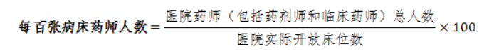

## 1、每名执业医师日均住院工作负担

| 指标属性 | 计量单位 | 指标导向 | 数据来源 | 指标解释       |
| -------- | -------- | -------- | -------- | -------------- |
| 定量指标 | 日       | 监测比较 | 医院填报 | 省级卫生健康委 |

### 1.1、指标定义

考核年度平均每位医师每日担负的住院床日数。

### 1.2、计算方法

（1）分子：全年实际占用总床日数是指全年医院各科 室每日零点实际占用的病床之和，包括实际占用的临时加 床在内，除外家庭病床占用床日数。

 （2）分母：执业（助理）医师人数是指医院中取得医 师执业证书且实际从事医疗、妇幼保健、疾病防治等工作 的执业医师和执业助理医师数之和。

### 1.3、指标意义

了解医生劳动负荷及医院人力资源配备情况，推进分 级诊疗，改善医务人员的工作环境和后勤保障，为医疗机 构改善医疗服务创造条件。

:::details 指标上升与下降意义解析

每名执业医师日均住院工作负担是一个反映医院人力资源配置和医生工作强度的重要指标。这个指标的计算公式是全年实际占用总床日数除以医院平均执业（助理）医师人数，再除以365（一年的天数）。

1. **指标上升**：如果这个指标上升，意味着每位医师每天平均需要负责更多的住院床日数。这可能反映出几个情况：
   - **医师人数减少**：医院的医师人数可能减少，导致剩余的医师需要承担更多的工作量。
   - **住院患者增加**：可能是医院收治的住院患者数量增加，导致医师需要管理更多的床位。
   - **医疗资源紧张**：在某些地区，尤其是医疗资源分布不均的地区，医师可能需要承担更大的工作负荷。
   - **工作强度提高**：医生的工作强度提高，可能导致工作满意度降低，长期过重的工作负荷还可能影响医护人员的身心健康，进而影响医疗服务的质量和安全。
2. **指标下降**：如果这个指标下降，意味着每位医师每天平均负责的住院床日数减少，这可能意味着：
   - **医师人数增加**：医院可能增加了医师的人数，从而减轻了每位医师的工作负担。
   - **住院患者减少**：可能是因为住院患者数量减少，导致医师需要管理的床位数减少。
   - **资源优化配置**：医院可能通过优化人力资源配置，提高了医疗服务的效率，减轻了医师的工作负荷。
   - **政策影响**：政府可能出台了相关措施，如推进分级诊疗，合理配置人力资源，从而减轻了医师的工作负荷。

综上所述，每名执业医师日均住院工作负担的上升或下降，反映了医院人力资源配置和医生工作强度的变化，对医院管理和政策制定具有重要的参考价值。

:::

### 1.4、所需字段

| 字段名                     | 字段单位 | 字段解释 |
| -------------------------- | -------- | -------- |
| 全年实际占用总床日数       | 天/年    |          |
| 医院平均执业(助理)医师人数 | 人/年    |          |

## 2、 每百张病床药师人数

| 指标属性 | 计量单位 | 指标导向 | 数据来源 | 指标解释       |
| -------- | -------- | -------- | -------- | -------------- |
| 定量指标 | 人       | 监测比较 | 医院填报 | 省级卫生健康委 |

### 2.1、指标定义

考核年度每百张实际开放床拥有药师人数。

### 2.2、计算方法

（1）分子：医院药师（包括药剂师和临床药师）含 主任药师、副主任药师、主管药师、药师。除外：药士、 药剂员。 

（2）分母：实际开放床位数指年内医院各科每日零点 开放病床数总和，不论该床是否被病人占用，都应计算在 内。包括：消毒和小修理等暂停使用的病床，超过半年的 加床。除外：因病房扩建或大修而停用的病床及临时增设 病床、产科新生儿床、接产室待产床、库存床、观察床、 临时加床和病人家属陪侍床。

### 2.3、指标意义

关于印发《医疗机构药事管理规定》的通知（卫医政 发〔2011〕11 号）和《关于加快药学服务高质量发展的意 见》（国卫医发〔2018〕45 号）等文件要求，医疗机构应 当根据本机构性质、任务、规模配备适当数量临床药师，三级医院临床药师不少于 5 名。各医疗机构要按照规定配 备临床药师。要逐步实现药学服务全覆盖，临床药师为门 诊和住院患者提供个性化的合理用药指导。

:::details 指标上升与下降意义解析

每百张病床药师人数是一个衡量医院药学服务能力和人力资源配置的重要指标。它反映了每百张病床中药师（包括药剂师和临床药师）的数量，这个比例可以告诉我们医院在药学服务方面的人力资源是否充足。

1. **指标上升**：如果每百张病床药师人数上升，可能意味着：
   - **药学服务增强**：医院可能增加了药师的人数，以提高药学服务的质量和效率，更好地满足患者的药学服务需求。
   - **合理用药监督**：药师在合理用药、处方审核、药物咨询等方面的作用得到了加强，有助于提高患者用药的安全性和有效性。
   - **人力资源优化**：可能是医院对人力资源进行了优化配置，提高了药师的比例，以适应医疗服务的发展和患者需求的变化。
   - **政策导向**：可能是响应政府或卫生部门的号召，提高药师在医疗服务中的地位和作用，如《国家三级公立医院绩效考核操作手册(2022版)》将每百张病床药师的人数纳入考核。
2. **指标下降**：如果每百张病床药师人数下降，可能意味着：
   - **人力资源紧张**：医院可能面临药师人力资源紧张的问题，这可能是由于药师的流失或医院床位数的增加而药师人数没有相应增加。
   - **服务压力增大**：药师需要服务更多的床位，可能会导致工作压力增大，服务质量受到影响。
   - **成本控制**：医院可能出于成本控制的考虑，减少了药师的人数，这可能会影响药学服务的质量和深度。
   - **政策或经济因素**：可能受到政策调整或经济因素的影响，导致药师人数的减少。

综上所述，每百张病床药师人数的变化反映了医院在药学服务方面的人力资源配置和政策导向，对提高医疗服务质量和患者用药安全具有重要意义。

:::

### 2.4、所需字段

| 字段名                                 | 字段单位 | 字段解释 |
| -------------------------------------- | -------- | -------- |
| 医院药师（包括药剂师和临床药师）总人数 | 人/年    |          |
| 医院实际开放床位数                     | 床/年    |          |

