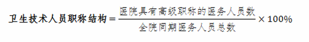
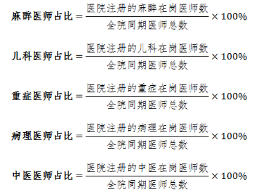
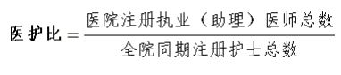

## 1、 卫生技术人员职称结构

| 指标属性 | 计量单位 | 指标导向 | 数据来源 | 指标解释       |
| -------- | -------- | -------- | -------- | -------------- |
| 定量指标 | %        | 监测比较 | 医院填报 | 省级卫生健康委 |

### 1.1、指标定义

考核年度医院具有副高级职称及以上的医务人员（医、 药、护、技）占全院同期医务人员总数的比例。

### 1.2、计算方法

（1）分子：具有副高级职称及以上的医务人员数。  

（2）分母：全院同期医务人员总数。

### 1.3、指标意义

与医院功能和任务项匹配。

:::details 指标上升与下降意义解析

卫生技术人员职称结构，即医院具有高级职称的医务人员数与全院同期医务人员总数的比例，是衡量医院人才结构和服务质量的重要指标。这个比例的上升和下降反映了医院在人才队伍建设和医疗服务能力方面的变化。

1. **比例上升**：通常意味着医院在人才培养和引进方面取得了积极进展，高级职称的医务人员数量增加，这可能表明医院在提升医疗服务质量、增强科研能力和教学水平等方面做出了努力。高级职称医务人员往往具有更丰富的临床经验和更高的专业技术水平，能够带动医院整体医疗服务能力的提升。此外，高级职称医务人员的增加也可能有助于吸引更多的患者，提高医院的竞争力和社会影响力。根据搜索结果，国家卫生健康委在《“十四五”卫生健康人才发展规划》中提到，到2025年，卫生健康人员总量达到1600万人，每千人口执业（助理）医师数达到3.20人，每千人口注册护士数达到3.80人，这表明国家在推动卫生技术人员职称结构优化方面有明确的目标和规划。
2. **比例下降**：可能意味着医院在人才保留和吸引方面面临挑战，或者医院的人才政策和发展战略需要调整。高级职称医务人员比例的下降可能会影响医院的服务质量和患者满意度，同时也可能影响医院的科研和教学活动。这可能是由于多种因素造成的，如人才流失、招聘困难、职称晋升机制不够灵活等。在这种情况下，医院可能需要采取措施，如改善工作环境、提高薪酬待遇、加强职业发展支持等，以吸引和留住高级职称的医务人员。

综上所述，卫生技术人员职称结构的变化反映了医院在人才队伍建设方面的状况，对于医院的服务质量、科研能力和教学水平都有重要影响。医院需要根据这一指标的变化，及时调整人才政策和发展战略，以确保医院的持续发展和竞争力。

复制再试一次分享

:::

### 1.4、所需字段

| 字段名                       | 字段单位 | 字段解释 |
| ---------------------------- | -------- | -------- |
| 医院具有高级职称的医务人员数 | 人/年    |          |
| 全院同期医务人员总数         | 人/年    |          |

## 2、 麻醉、儿科、重症、病理、中医医师占比

| 指标属性               | 计量单位 | 指标导向 | 数据来源   | 指标解释                       |
| ---------------------- | -------- | -------- | ---------- | ------------------------------ |
| 定量指标、国家监测指标 | %        | 逐步降低 | 财务年报表 | 国家卫生健康委，省级卫生健康委 |

### 2.1、指标定义

考核年度医院麻醉、儿科、重症、病理、中医医师各 类医师数量分别占全院同期医师总数的百分比。

### 2.2、计算方法

医院注册的麻醉、儿科、重症、病理、中医在岗医师 数除以全院同期医师总数，其中在岗是指在临床一线岗位 工作。

（1）麻醉、儿科、重症、病理及中医医师等是目前紧 缺人才，本次考核要求对五类人才占比分别计算。

（2）麻醉和病理医师从目前的国家卫生健康委医疗机 构、医师和护士电子化注册系统中无明确分类，本年度考核要求各医院在填报相关信息时，要把麻醉和病理医师分 别填写到相应的工作科室，以便从数据库中提取数据。

### 2.3、指标意义

了解全国三级医院五个专业医师人才现况。落实“十 三五”全国卫生计生人才发展规划中七项主要任务之一就 是加强急需紧缺专业人才队伍建设”，包括儿科、病理、麻 醉、重症医学等各类急需紧缺专业人才队伍建设，以及加 强中医药人才队伍建设。

:::details 指标上升与下降意义解析

麻醉、儿科、重症、病理、中医医师占比是衡量医疗服务供给结构和专业人才配置的重要指标。这些指标的上升和下降反映了医疗服务能力、医疗资源分布、医疗需求变化以及医疗政策导向等多个方面的情况。

1. **麻醉医师占比**：
   - 上升：可能意味着医院对手术和麻醉服务的需求增加，医院手术量增加，或者医院在提升手术相关医疗服务能力方面做出了努力。根据《中国麻醉学科发展研究报告》，我国麻醉医师数量在增加，但每10万人口中的麻醉医师比例仍然较低，表明麻醉学的发展还有很大的提升空间。
   - 下降：可能反映了医院手术量的减少，或者麻醉医师的流失，需要关注麻醉医师的工作负荷和职业吸引力。

2. **儿科医师占比**：
   - 上升：根据国家卫生健康委的数据，我国儿科医师数量从2015年的11.8万人增加到2021年的20.6万人，这可能意味着国家在儿科医师培养和引进方面取得了积极进展，有助于改善儿童医疗服务供给。
   - 下降：可能意味着儿科医师的流失，或者儿童医疗服务需求的减少，需要关注儿科医疗服务的供需平衡。

3. **重症医师占比**：
   - 上升：根据《关于推动公立医院高质量发展的意见》，到2025年末，全国重症医学床位达到15张/10万人，这可能意味着医院在提升重症医疗服务能力方面做出了努力，以应对重症患者救治的需求。
   - 下降：可能反映了重症医疗服务需求的减少，或者重症医师的流失，需要关注重症医疗服务的质量和可持续性。

4. **病理医师占比**：
   - 上升：可能意味着医院在病理诊断服务方面增强了能力，病理诊断是许多疾病确诊的关键，占比上升可能有助于提高疾病诊断的准确性。
   - 下降：根据国家卫健委医政医管局2019年的数据，我国病理医师资源稀缺，难以满足临床需求，占比下降可能加剧这一问题，影响疾病的准确诊断和治疗。

5. **中医医师占比**：
   - 上升：根据2020年的数据，全国中医药人员数占全国卫生技术人员数比例为7.8%，这可能反映了国家对中医药服务的重视和推动，以及中医药服务需求的增加。
   - 下降：可能意味着中医药服务需求的减少，或者中医医师的流失，需要关注中医药服务的传承和发展。

总的来说，这些指标的变化需要结合医疗服务的供需状况、医疗政策导向以及医疗市场的变化来综合分析。医院和卫生管理部门应密切关注这些指标的变化，及时调整医疗资源配置和人才培养策略，以确保医疗服务的质量和可及性。

:::

### 2.4、所需字段

| 字段名                   | 字段单位 | 字段解释 |
| ------------------------ | -------- | -------- |
| 医院注册的麻醉在岗医师数 | 人/年    |          |
| 医院注册的儿科在岗医师数 | 人/年    |          |
| 医院注册的重症在岗医师数 | 人/年    |          |
| 医院注册的病理在岗医师数 | 人/年    |          |
| 医院注册的中医在岗医师数 | 人/年    |          |
| 全院同期医师总数         | 人/年    |          |

## 3、医护比

| 指标属性               | 计量单位 | 指标导向 | 数据来源                               | 指标解释                       |
| ---------------------- | -------- | -------- | -------------------------------------- | ------------------------------ |
| 定量指标、国家监测指标 | 比值     | 监测比较 | 国家医疗机构、医师、护士电子化注册系统 | 国家卫生健康委，省级卫生健康委 |

### 3.1、指标定义

考核年度医院注册执业（助理）医师总数与全院同期 注册护士总数之比。

### 3.2、计算方法

（1）分子：考核年度医院注册医师总数 

（2）分母：医院同期注册护士总数

### 3.3、指标意义

《关于印发全国医疗卫生服务体系规划纲要 （2015-2020 年）的通知》（国办发〔2015〕14 号）要求， 2020 年目标每千常住人口执业（助理）医师数（人）2.5， 每千常住人口注册护士数（人）3.14，医护比 1:1.25。

:::details 指标上升与下降意义解析

医护比，即医院注册执业（助理）医师总数与全院同期注册护士总数之比，是衡量医疗服务人员配置合理性的重要指标。这个比例反映了医护人员之间的工作分配和协作关系，对医疗服务的质量和效率有直接影响。

1. **医护比上升**：
   - 医护比上升通常意味着护士相对于医生的数量减少，这可能是由于护士的流失、招聘困难或医院对医生的重视程度增加。根据国家卫生健康委员会的数据，我国医护比从2012年的1:0.95发展到2021年的1:1.17，显示了医护比例倒置的问题得到了根本的扭转。医护比的上升有助于提高医疗服务的效率，因为医生可以更专注于诊疗决策，而护士则可以集中精力提供护理服务。然而，如果医护比过高，可能会导致护士工作负担过重，影响护理质量和患者满意度。
2. **医护比下降**：
   - 医护比下降则意味着护士数量相对于医生数量的增加，这可能是由于医院增加了护士的招聘、提高了护士的待遇或对护理服务的重视程度增加。例如，根据《关于推动公立医院高质量发展的意见》，国家期望逐步使公立医院医护比总体达到1∶2左右。医护比的下降有助于提高患者护理的质量和响应速度，因为有更多的护士可以提供日常护理和患者支持。然而，如果医护比过低，可能会导致医疗资源的浪费，增加医疗机构的运营成本。

总的来说，医护比的合理性需要综合考虑医疗机构的财政状况、人员配备的能力和负担、患者的需求等多个因素。一个合理的医护比有助于提高医疗服务的质量和效率，确保患者获得适当的医疗和护理服务。

:::

### 3.4、所需字段

| 字段名                       | 字段单位 | 字段解释 |
| ---------------------------- | -------- | -------- |
| 医院注册执业（助理）医师总数 | 人/年    |          |
| 全院同期注册护士总数         | 人/年    |          |

