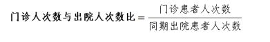

## 1、医疗质量相关指标

医疗质量指标部分，

共有 4 个二级指标，

24 个三级指 标，

其中定量指标 22 个，定性指标 2 个，10 个国家监测 指标。

## 2、功能定位（指标 1—7）

### 2.1、门诊人次数与出院人次数比

【指标属性】定量指标 

【计量单位】比值 

【指标定义】 考核年度门诊患者人次数与同期出院患者人次数之 比。

#### 2.2.1、计算方法

