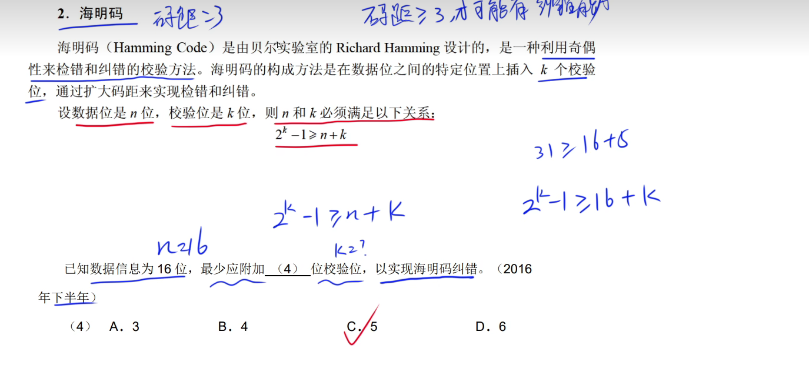
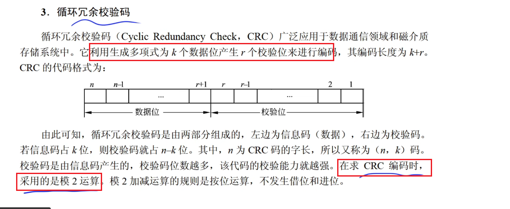

## 一、码距

要计算1100和0011的码距，我们逐位比较这两个二进制数：

- 1100
- 0011

比较结果：

- 第一位：1 vs 0（不同）
- 第二位：1 vs 0（不同）
- 第三位：0 vs 1（不同）
- 第四位：0 vs 1（不同）

因此，1100与0011的码距为4，因为所有位都不同。

## 二、奇偶校验

奇偶校验只能检测出奇数位改变出错，不能检测出偶数位

## 三、海明码

海明码是利用多组数位的奇偶性来纠错的

海明码码距为2的时候可以检错。>=3的时候可以纠错

## 四、循环冗余校验码

不能纠错，只能检错

码距为2

