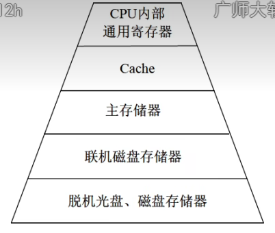

## 一、存储器

**主存（DRAM）：**动态随机存储器【周期性的刷新】

**Cache（SRAM）：**静态随机存储

### 1、按存储的工作方式分类

- 读/写存储器（RAM）。它指既能读取数据也能存入数据的存储器
- 只读存储器：工作过程中仅能读取的存储器，根据数据的写入方式，这种存储器又可以细分为：
  - ROM
  - PROM
  - EPROM
  - EEPROM

### 2、按访问方式分类

- 按地址访问的存储器
- 按内容访问的存储器

### 3、按寻址方式分类

- 随机存储器
  - 随机存储器是一种可读写的内存，允许数据在任何时刻被随机访问。它的存取时间与访问数据的顺序无关，通常用于存储正在运行的程序和数据。常见类型包括动态随机存取存储器（DRAM）和静态随机存取存储器（SRAM）。
- 顺序存储器
  - 顺序存储器是一种数据存取方式，其中数据按顺序存储和访问。访问某个特定位置的数据时，需要从起始位置逐个读取，直到到达所需位置。常见例子包括磁带存储和某些类型的文件系统，适合存储大量数据但访问速度较慢。
- 直接存储器
  - 直接存储器（如DMA）通常指的是一种数据传输方式，允许外设直接与内存进行数据传输，而不经过CPU。它提高了数据传输效率，减轻了CPU负担，适用于大量数据传输场景。

### 4、虚拟存储器

虚拟存储器由主存和辅存构成

虚拟存储器（Virtual Memory）是一种内存管理技术，它允许程序使用比物理内存更大的地址空间。虚拟存储器通过将物理内存和硬盘空间结合起来，创建出一个更大的逻辑内存空间，从而提高了系统的灵活性和效率。

#### 主要特点：

1. **地址空间隔离**：每个进程都有自己的虚拟地址空间，进程之间互不干扰，提高了安全性和稳定性。
2. **分页和分段**：虚拟内存通常采用分页或分段的方式管理，将逻辑地址分为固定大小的页或段，按需加载到物理内存中。
3. **按需加载**：只有在需要时才将页面加载到内存，节省了物理内存的使用。
4. **换页**：当物理内存不足时，操作系统可以将不常用的页面换出到硬盘，腾出空间给新的页面。

#### 优点：

- **内存扩展**：程序可以使用超过物理内存限制的地址空间。
- **提高效率**：可以更有效地利用内存，减少内存碎片。
- **程序隔离**：提高了系统的安全性和稳定性。

虚拟存储器是现代操作系统中一个非常重要的概念，广泛应用于各种计算机系统中。

### 5、时间局部性

时间局部性（Temporal Locality）是指程序在某个时间段内访问的数据或指令，可能会在不久后再次被访问。换句话说，如果某个数据被访问过，那么它很可能会在短时间内再次被访问。这一特性常用于缓存设计，以提高访问速度和效率。

### 6、空间局部性

空间局部性（Spatial Locality）指的是程序在访问某个内存地址时，往往会很快访问相邻的内存地址。这意味着如果一个数据块被访问，附近的数据也很可能在不久后被访问。这一特性常用于缓存和预取策略，以提高数据访问效率。

### 7、相联存储器

相联存储器是一种按内容访问的存储器