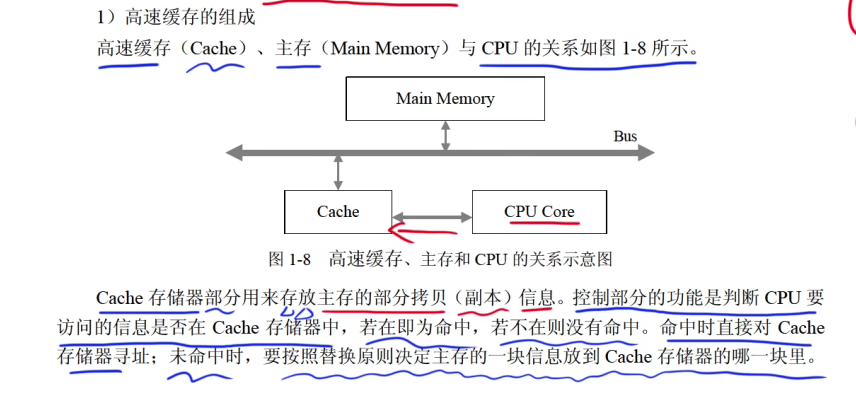
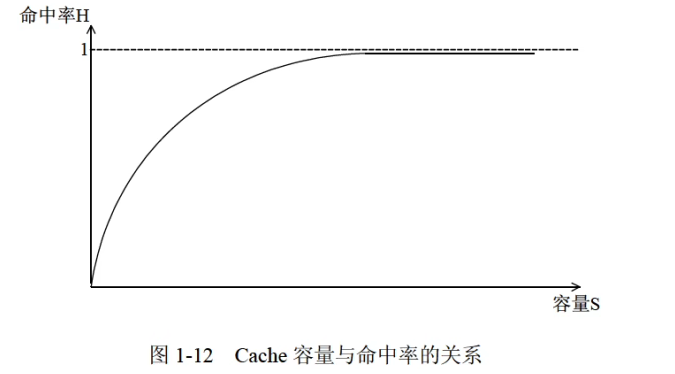
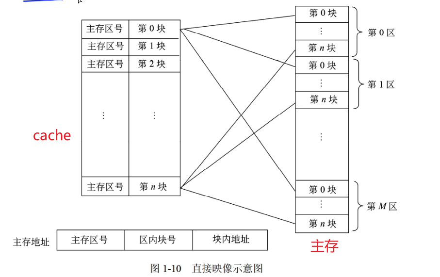
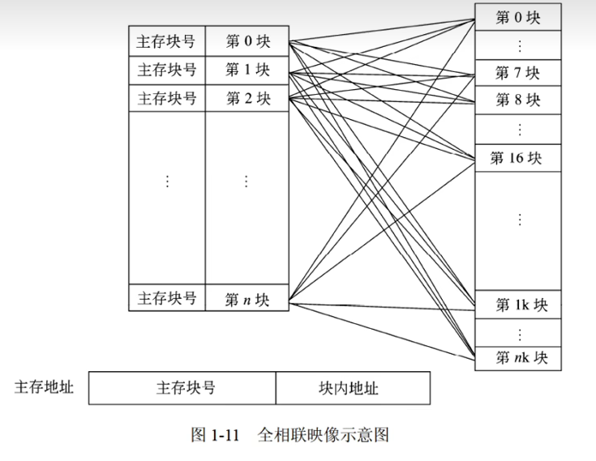

## 1、cache介绍

缓存（Cache）是一种高yi速存储器，用于临时存储经常访问的数据和指令，以减少访问主内存的时间。它位于CPU与主内存之间，能显著提高系统性能。缓存通常分为几级：

1. **L1缓存**：内置于CPU内部，速度最快，但容量较小。
2. **L2缓存**：仍在CPU内部或靠近CPU，速度较快，容量稍大。
3. **L3缓存**：通常共享在多个核心之间，速度较慢但容量更大。

缓存利用时间局部性和空间局部性原理，存储最近或即将使用的数据，极大提高数据访问效率。

## 2、cache替换算法

- 随机替换算法
  - 随机数发生器产生一个要替换的块号，将该块替换出去
- 先进先出算法
  - 最先进入cache的信息块替换出去
- 近期最少使用算法
  - 近期最少使用的cache中的信息块替换出去
- 优化替换算法
  - 先执行一个程序，统计Cahe的替换情况。有了这样的先验信息，在第二次执行该程序时便可以用最有效的方式来替换

## 3、cache的命中率

cache的容量越大，cache的命中率越高

## 4、cache的

cache与主存地址的映射是由硬件自动完成的

## 5、直接映像

###  直接映射（Direct Mapping）

- **映射方式**：每个主存块仅能映射到缓存中的一个特定位置。
- **工作原理**：主存地址通过索引部分直接确定缓存行，再通过标签验证数据是否命中。
- **优缺点**：实现简单，但容易导致冲突，缓存命中率可能较低。

## 6、全相联映射

### 全相联映射（Fully Associative Mapping）

- **映射方式**：主存块可以映射到缓存中的任何位置。
- **工作原理**：访问时，缓存中的所有标签都会被检查，以确认数据是否存在。
- **优缺点**：灵活性高，命中率通常较好，但硬件复杂度高，成本增加。

## 7、组相联映射

### 组相联映射（Set-Associative Mapping）

- **映射方式**：结合了直接映射和全相联映射的特点，缓存被划分为多个组，每个组包含多个缓存行。
- **工作原理**：主存块根据索引映射到特定组内，数据可以在组内的任何位置存放，通过标签确认命中。
- **优缺点**：性能和灵活性较好，冲突较少，但实现复杂度介于直接映射和全相联映射之间。