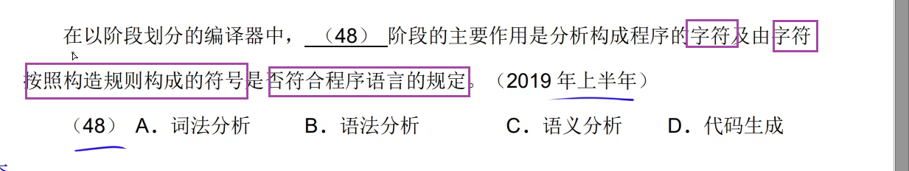
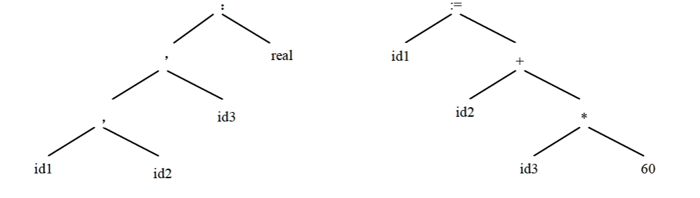
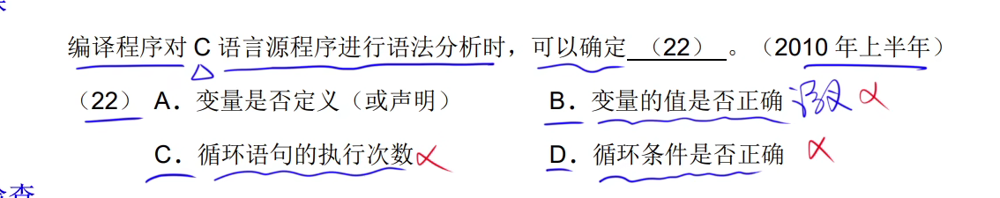

z

词法分析阶段主要的作用是：分析构成程序的符号及由字符按照构造规则构成的符号是否符合程序语言的规定

输入：源程序

输出：记号流

源程序可以简单的被看成是一个多行的字符串。词法分析阶段是编译过程中的第一个阶段

这个阶段的任务是对源程序从前到后，从左到右逐个字符的扫描，从中识别出一个个“单词”符号。如关键字、标识符、常数、运算符、分隔符等



## 2、语法分析

输入：记号流

输出：语法树

- 对各条语句的结构进行合法性分析
- 分析程序中的句子结构是否正确

在词法分析的基础上，根据语言的语法规则将单词符号序列分解成各类语法单位，如：表达式、语句、程序等。

语法规则就是各类语法单位的构成规则。

通过语法分析确定整个输入串是否构成一个语法上的正确程序。如果源程序中没有语法错误，语法分析后就能正确的构造出语法树；

	

int a = "sadhjk"，这在语法上是错误的，语法分析阶段只能分析其结构是否正确，如int是否位置正确等，是否由分号，这些，不能判断其赋值这些的，这些需要到语义分析中进行



## 3、语义分析

### 3.1、静态语义错误

输入：语法树

- 检查源程序是否包含**静态语句**错误，动态语义错误要到运行的时候才能发现
- 进行类型分析和检查

### 3.2、动态语义错误

像是：int a = 1/0;

这个在语法上是没问题的，有分号有等号，有接受数

这个在语义上也是没有问题的，int/int类型赋值给int类型

但是在执行的时候，由于逻辑的错误，这段程序会报错

## 4、中间代码生成

1、常见的中间代码有：后缀式、三地址码、三元式、四元式和树

2、中间代码与具体的机器无关（不依赖具体的机器）

可以将不同的高级程序语言翻译成同一种中间代码。中间代码可以跨平台

因为与具体的机械无关，使用中间代码有利于进行与机器无关的优化处理和提高编译程序的可移植性

## 5、代码优化

## 6、目标代码生成

- 目标代码生成阶段的工作与具体的机器密切相关
- 寄存器的分配处于目标代码生成阶段
  - 由于访问寄存器的速度远远快于访问内存单元的速度，希望尽可能多的使用寄存器存储数据，而寄存器的个数是有限的，因此，如何分配和使用寄存器是目标代码生成时需要着重考虑的


```
  - name: notify
    image: drillster/drone-email
    settings:
      host: mposp.126.com
      port: 465
      username: xiaobei_service@126.com
      password: EDLAEOGBJDLAGUYFA
      from: xiaobei_service@126.com
      recipients: gz812js@163.com,1djsj1485@qq.com,286xxsnaldk933@qq.com,13dhas8156231@qq.com,1281238101@qq.com,5697912385@qq.com,205189120@qq.com,242381034@qq.com
    when:
      status:
      - success
      - changed
      - failure
```

