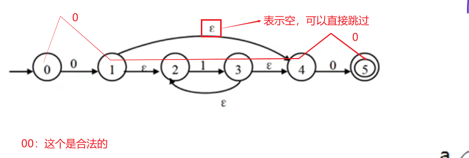

## 1、有限自动机

有限自动机是词法分析的一个工具，它能正确的识别正规集

## 2、有限自动机的特殊符号

这个特殊符号我打不出来，这个特殊符号的意思是，可以直接跳过的意思

## 3、确定有限自动机和不确定有限自动机

确定的有限自动机（DFA）：对每一个状态来说是被字符后转移的状态是唯一的

不确定的有限自动机（NFA）：对每一个状态来说识别字符后转移的状态是不唯一的

## 4、具体案例

