## 1、概念

中缀表达式是我们平时使用的表达式，例如：`a+b*c`。

后缀表达式是一种没有括号的表达式，例如：`abc*+`。

后缀式和中缀式就是符号位一个在后面，一个在中间的区别

**优先级：**
优先级相同，从右向左

## 2、为什么要用后缀式呢？

后缀式，方便计算机进行计算，因为后缀式可以通过栈的结构的数据进行计算。

## 3、语法树中、后序遍历

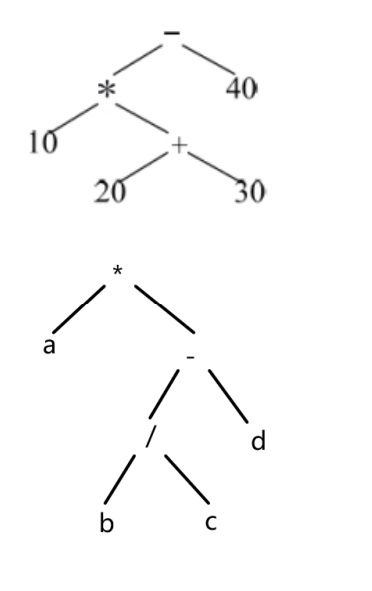

通过语法树，可以方便的进行中序遍历和后续遍历，对饮的也就是中缀式和后缀式

中序遍历是：左根右

后续遍历是：左右根
## 4、例题

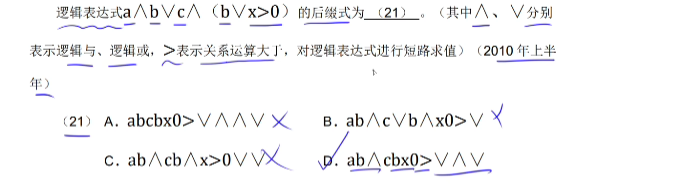
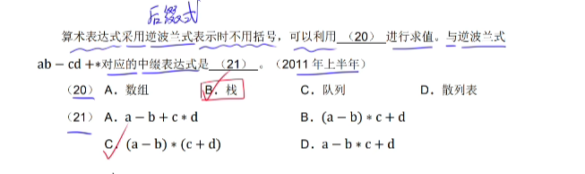
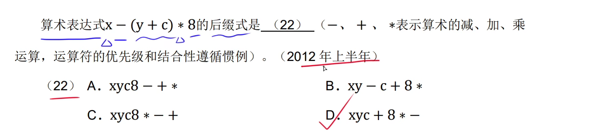
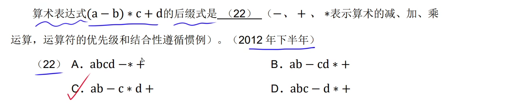
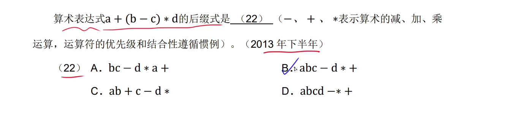
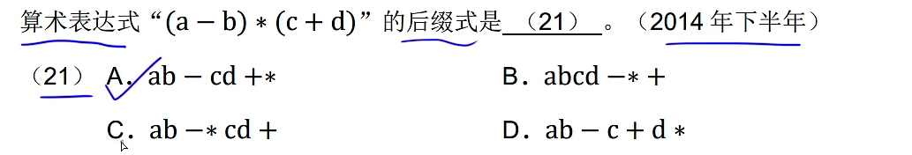
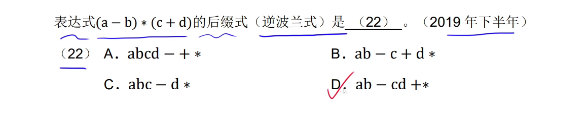
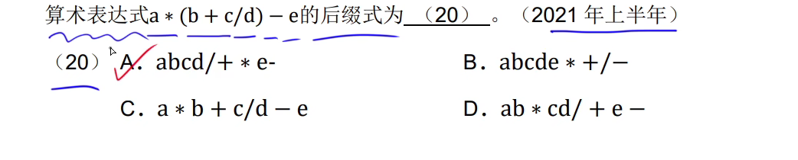
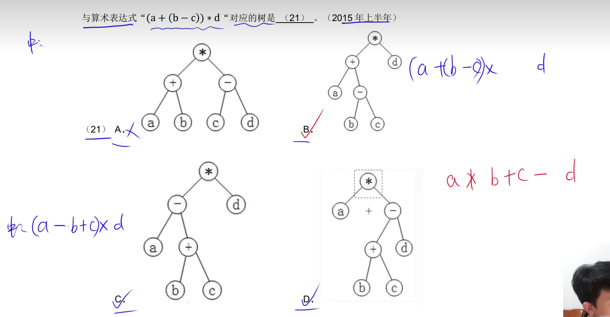
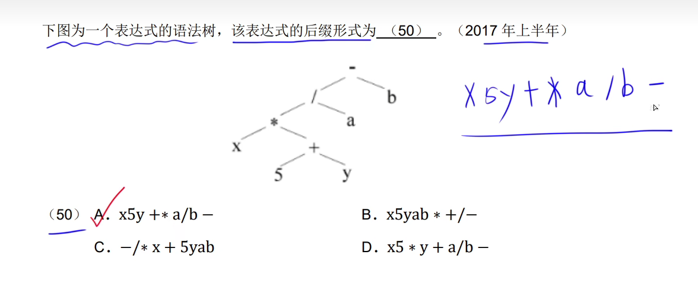
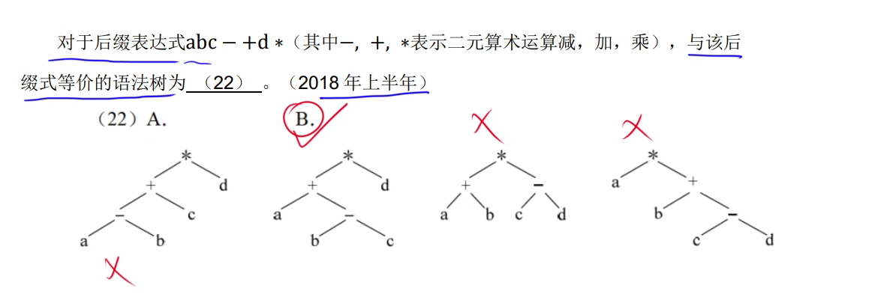
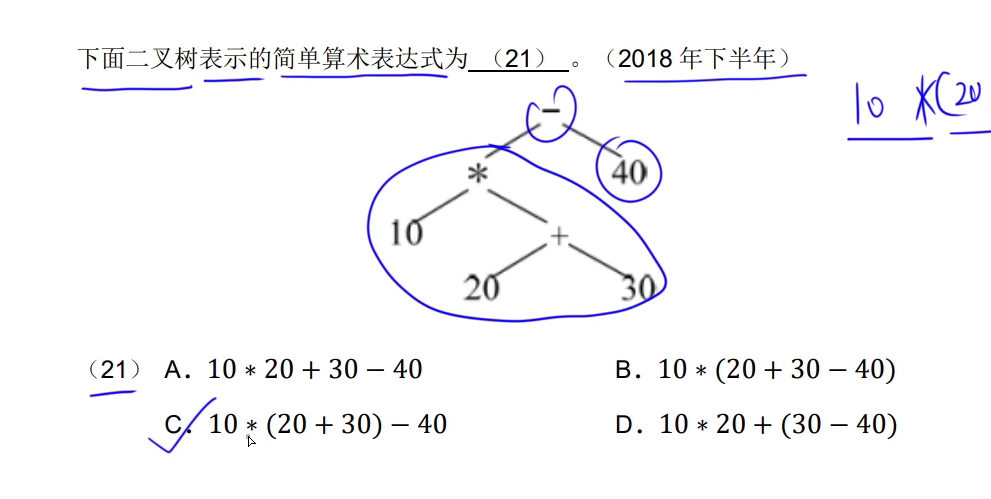
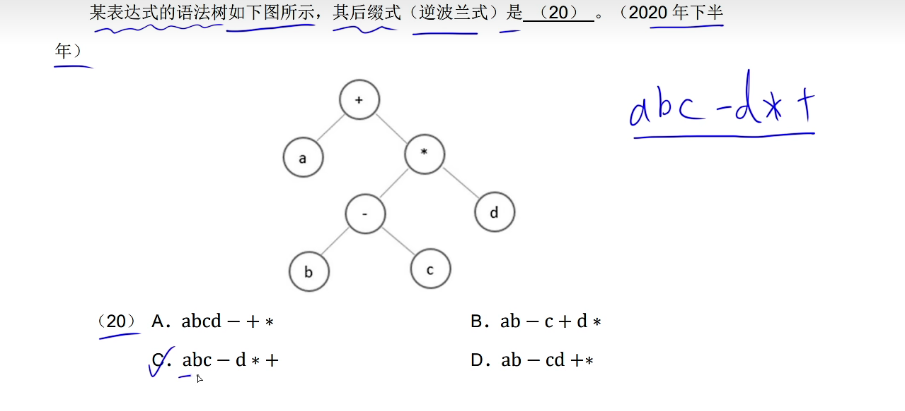