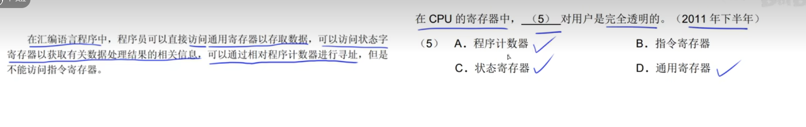

# 计算机系统基础知识

## 1、计算机系统硬件基本组成

- 计算机系统
  - 硬件
    - 输入设备
    - 控制器
    - 存储器
    - 运算器
    - 输出设备
  - 软件

运算器+控制器 = 中央处理器 = CPU

内部存储器：速度高、容量小、用于零时存放程序、数据及其中间结果

外部存储器：容量大、速度慢、可长期保存程序和数据

## 2、中央处理器

CPU：获取程序指令、对指令译码并执行

- 控制器
  - 程序控制
  - 操作控制
  - 时间控制
- 运算器
  - 数据处理

### 2.1、运算器:

- 算数逻辑单元（AUL）
  - 算数逻辑运算
  - 逻辑运算
- 累加寄存器（AC） 
  - AUL的一个工作区，就是AUL在进行运算的时候，提供一个场地
- 数据缓冲寄存器（DR）
- 状态条件寄存器（PSW）

### 2.2控制器

**控制整个CPU执行**

- 保证程序的正确执行
- 能够处理异常事件

**控制器包括**：

- 指令寄存器（IR）
  - 首先从内存中取出一条指令到缓冲寄存器中
  - 缓冲寄存器送到IR暂存
- 程序技术器（PC）
  - 程序执行有两种模式，一种是顺序执行，一种是转移执行
- 地址寄存器（AR）
- 指令译码器（ID）

