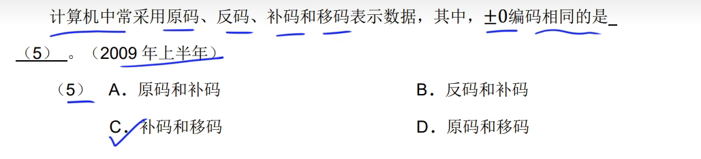
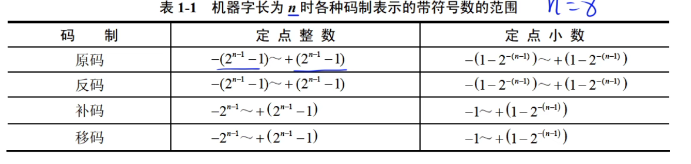

## 一、原码反码补码移码之间的关系

**注释：**正数的反码、补码、移码都相同

**注释：**负数的原码的移码 等于 补码符号位取反

### 1. 原码与反码

- **正数**：原码 = 反码
- **负数**：反码 = 原码符号位不变，其余位取反。

### 2. 原码与补码

- **正数**：原码 = 补码
- **负数**：补码 = 反码 + 1。

### 3. 反码与补码

- **正数**：反码 = 补码
- **负数**：补码 = 反码 + 1。

### 4. 原码与移码

- **正数**：移码 = 原码
- **负数**：移码 = 原码 + 2n−12^{n-1}2n−1（偏移量）。

### 5. 反码与移码

- 对于负数：
  - 移码 = 反码 + 2n−12^{n-1}2n−1

### 6. 补码与移码

- 移码与补码之间的关系较复杂，主要依赖于具体的上下文，但通常不直接转换。

## 二、正负零的补码和移码相同

### 1. 正零和负零的表示：

- **正零**的原码为 `0000 0000`（符号位为 `0`）。
- **负零**的原码为 `1000 0000`（符号位为 `1`），但在补码表示中，负零的补码也是 `0000 0000`，因为负零的补码是反码加 1，而反码的其他位全为 `0`。

### 2. 补码和移码：

- **补码**：
  - 正零的补码是 `0000 0000`。
  - 负零的补码也是 `0000 0000`。
- **移码**：
  - 正零的移码是 `0000 0000`。
  - 负零的移码是 `0000 0000`（因为偏移量 2n−12^{n-1}2n−1 在这里也不影响结果）。

### 总结

因此，正零和负零的补码和移码都表现为相同的二进制值 `0000 0000`。这就是为什么它们的表示在这两种编码中是相同的。若有其他问题，欢迎继续提问！

## 三、补码的补码等于原码

## 四、原码、反码、补码、移码的定点整数范围

