# 知识库搭建笔记

时间：2024年8月22日

作者：罗佳鸿

搭建须知：由于docker目前很多的镜像源库在中国已经停止服务了，所以在使用docker拉取droneCI的时候会出现拉取超时的问题。如果项目中不希望使用docker进行应用管理，无需继续往下看。如果执意选择docker安装，在docker拉取镜像超时时，可以去网上多尝试不同的镜像源。目前国内还有部分docker镜像能用。

## 一、环境配置：

| 名称               | 版本号                |
| ------------------ | --------------------- |
| 操作系统           | openEuler             |
| docker版本         | v26.1.3               |
| nginx版本          | v1.21.5               |
| docker-compose版本 | v2.29.2               |
| node               | v20.16.0              |
| git                | v2.40.0.rc0.windows.1 |

## 二、知识库运行原理

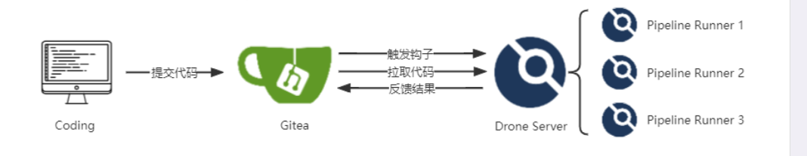

知识库采用droneCI为主线技术。

DroneCI 的工作原理是本地代码提交到 Gitea 后，Gitea 通过 webhook 通知 Drone Server。Drone Server 接收到通知后，会触发相应的 pipeline，运行定义好的构建任务。这些任务由 Runner 执行，Runner 会去gitea拉取代码并在指定环境中进行构建和测试。


## 三、将本地vuepress代码传到gitea仓库

#### 1、创建vuepress-starter项目

​	通过gitbash在本地创建vuepress-starter项目【vuepress的默认项目】，这是自动拉取方式，如果拉取不下来，可以尝试手动拉取，参考地址：[快速上手 | VuePress (vuejs.org)](https://vuepress.vuejs.org/zh/guide/getting-started.html#依赖环境)

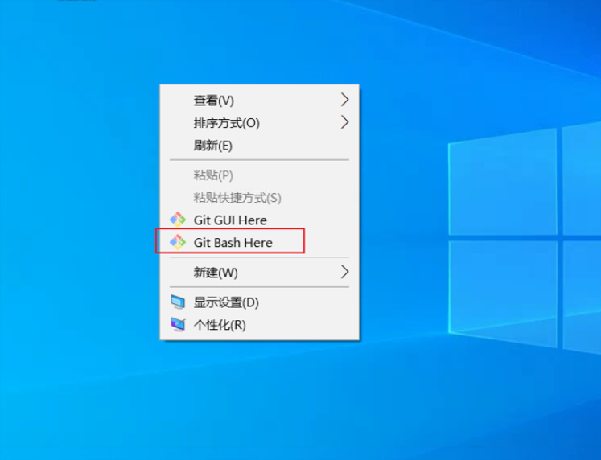

```
npm init vuepress vuepress-starter
```

---

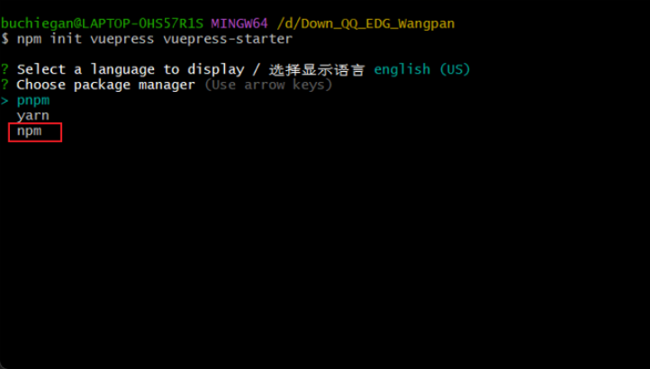

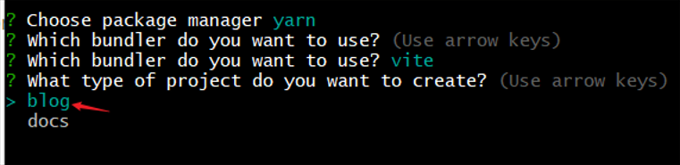

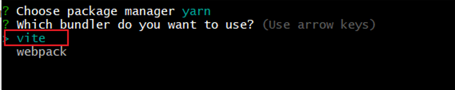

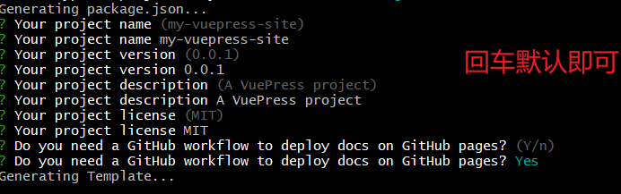


#### 2、vuepress-starter项目中添加.drone.yml文件

`.drone.yml` 是 DroneCI 中的配置文件，定义了持续集成（CI）和持续部署（CD）的管道。它的主要作用包括：

1. 定义构建步骤：指定需要执行的步骤，如编译代码、运行测试、构建镜像等。每个步骤可以使用不同的 Docker 镜像。
2. 配置工作流：定义构建流程，包括顺序、并行执行、依赖关系等。
3. 设置环境变量：为构建过程提供必要的环境变量，可以包括敏感信息如 API 密钥或数据库凭证。
4. 管理部署：配置自动化部署步骤，将构建好的应用程序部署到目标环境中。
5. 控制触发条件：指定何时触发构建，比如在代码推送、合并请求等事件时。

通过 `.drone.yml` 文件，你可以将构建和部署过程自动化，从而提高开发效率和代码质量。这个文件仅仅需要放在项目的根目录下即可

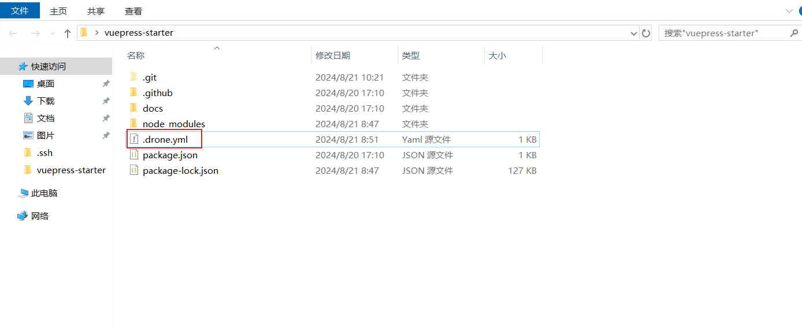

配置文件中填入：

```yml
kind: pipeline
type: docker
name: build-and-deploy
```

---


#### 3、在gitea创建drone仓库

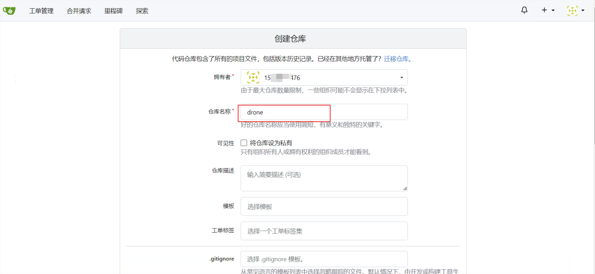

---


#### 4、在gitea上创建应用。

之所以要在 gitea 上创建应用，是因为这些参数需要事先记录下来，后续gitea在与服务器端的 droneCI 进行通信之时，是需要运用到这些参数的。

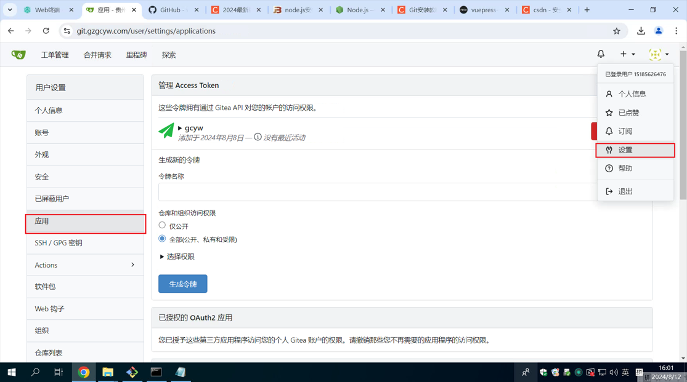

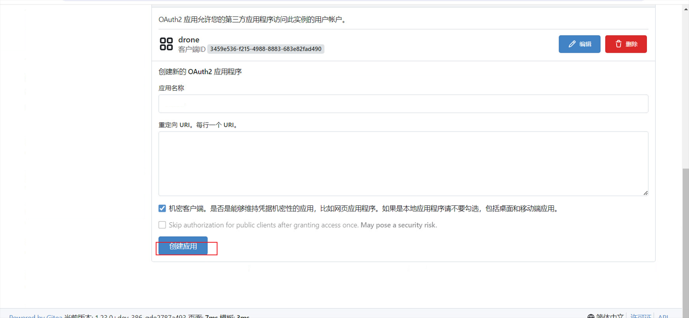

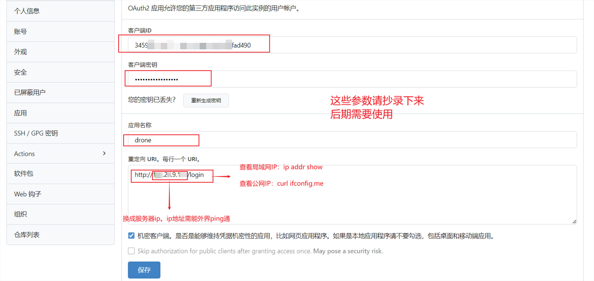

---


#### 5、将本地的vuepress代码推送到gitea中

```
touch README.md
git init
git checkout -b main
git add README.md
git commit -m "first commit"
git remote add origin https://xxxxxxxxxxxxxxxxxxxx/2.git
git push -u origin main
```


## 四、服务器环境安装

#### 1、安装nginx

##### 1.1. 添加Nginx 官方仓库

Nginx 提供了自己的官方仓库，你可以直接从中安装 Nginx。首先，下载并安装 Nginx 官方的仓库配置文件：

```
sudo dnf install https://nginx.org/packages/centos/7/x86_64/RPMS/nginx-release-centos-1.14-1.el7.ngx.noarch.rpm
```

##### 1.2. **安装 Nginx**

下载并安装 Nginx：

```
sudo dnf install nginx
```

##### 1.3. **启动并启用 Nginx 服务**

启动 Nginx 服务，并设置为开机自启：

```
sudo systemctl start nginx
sudo systemctl enable nginx
```

##### 1.4. **检查 Nginx 状态**

确认 Nginx 是否在运行：

```
sudo systemctl status nginx
```

##### 1.5. **配置防火墙**

如果使用 `firewalld`，允许 HTTP 和 HTTPS 流量：

```
sudo firewall-cmd --permanent --add-service=http
sudo firewall-cmd --permanent --add-service=https
sudo firewall-cmd --reload
```

##### 1.6、更改nginx的配置文件

```
curl ifconfig.me
nano /etc/nginx/nginx.conf
```

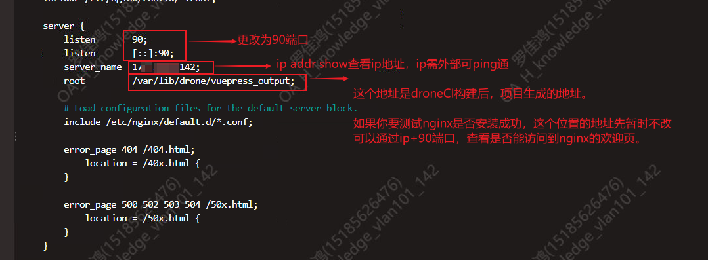

##### 1.7、服务器配置防火墙，添加90端口，可访问

```
sudo firewall-cmd --permanent --add-port=90/tcp
```

##### 1.9. **重新加载或重启 Nginx**

应用更改需要重新加载或重启 Nginx：

```
sudo systemctl reload nginx
```

如果 `reload` 不生效，可以使用 `restart` 命令：

```
sudo systemctl restart nginx
```

##### 2.0检查nginx是否安装成功

采用ip+90端口，查看是否可以访问到nginx的欢迎页


---


#### 2、安装docker

##### 2.1. 卸载旧版本（如果存在）

首先，卸载任何旧版本的 Docker（如有）：

```
sudo dnf remove docker docker-common docker-selinux docker-engine
```

##### 2.2. 设置 Docker 仓库

添加 Docker 的官方仓库：

```
sudo dnf config-manager --add-repo=https://download.docker.com/linux/centos/docker-ce.repo
```

##### 2.3. 安装 Docker CE 稳定版本

更新仓库索引，并安装 Docker CE 稳定版本及其相关工具：

```
sudo dnf clean all
sudo dnf makecache
sudo dnf install -y docker-ce docker-ce-cli containerd.io --nobest
```

##### 2.4. 启动和启用 Docker 服务

启动 Docker 服务并设置开机自启：

```
sudo systemctl start docker
sudo systemctl enable docker
```

##### 2.5. 验证 Docker 安装

检查 Docker 版本以确认安装：

```
sudo docker --version
```

##### 2.6、运行 `hello-world` 容器来验证 Docker 是否正确工作：

```
sudo docker run hello-world
```

##### 2.7、将用户添加到 Docker 组：

备注：如果你希望以非 `root` 用户身份运行 Docker 命令

```
sudo usermod -aG docker $USER
newgrp docker
```

---


#### 3、安装docker-compose

##### 3.1、使用 `curl` 命令下载 Docker Compose 的最新版本：

```
sudo curl -L "https://github.com/docker/compose/releases/latest/download/docker-compose-$(uname -s)-$(uname -m)" -o /usr/local/bin/docker-compose
```

##### 3.2. 设置可执行权限

将 Docker Compose 文件设置为可执行：

```
sudo chmod +x /usr/local/bin/docker-compose
```

##### 3.3、临时将其添加到 `$PATH`：

```
export PATH=$PATH:/usr/local/bin
```

##### 3.4、永久添加，你可以将其加入到 `~/.bashrc` 文件中：

```
nano ~/.bashrc
```

##### 3.5、在文件末尾添加：

```
export PATH=$PATH:/usr/local/bin
```

##### 3.6、保存文件并重新加载配置

```
source ~/.bashrc
```

##### 3.7、运行 `docker-compose` 命令了。验证是否安装成功

```
docker-compose --version
```


#### 4、安装DroneCI

##### 4.1、droneCI的配置文件

注释：这是配置文件的大体格式，具体的需要根据自己的需求，添加和修改部分数据

```bash
version: '3'
services:
  drone-server:
    restart: always
    image: drone/drone:2
    ports:
      - "80:80"
    volumes:
      - /path/to/drone-data:/var/lib/drone/
    environment:
      - DRONE_GITEA_SERVER=https://xxxxxx.xxxxxxx.com
      - DRONE_GITEA_CLIENT_ID=777xxxxxxxxxxxxxx6aa7c
      - DRONE_GITEA_CLIENT_SECRET=gto_zixxxxxxxxxxxxxxxxxxxxxxxxxxxxxxxxxxxxxz6w5vqp5kxwh6q
      - DRONE_SERVER_HOST=8.xxx.xx.84
      - DRONE_SERVER_PROTO=http
      - DRONE_RPC_SECRET=5831a2eea5c0b5a9f377259c30a63185
      - DRONE_GIT_ALWAYS_AUTH=true
      - DRONE_GIT_USERNAME=15xxxxxxx76
      - DRONE_GIT_PASSWORD=Lxxxxxx6
      - DRONE_USER_CREATE=username:15xxxxxxx76,admin:true

  drone-runner-docker:
    image: drone/drone-runner-docker:latest
    restart: always
    volumes:
      - /var/run/docker.sock:/var/run/docker.sock
    environment:
      - DRONE_RPC_PROTO=http
      - DRONE_RPC_HOST=8.xxx.xx.84
      - DRONE_RPC_SECRET=5831a2eea5c0b5a9f377259c30a63185
      - DRONE_RUNNER_NAME=drone-runner-docker
      - DRONE_RUNNER_CAPACITY=2
```


##### 4.2、droneci配置文件位置说明

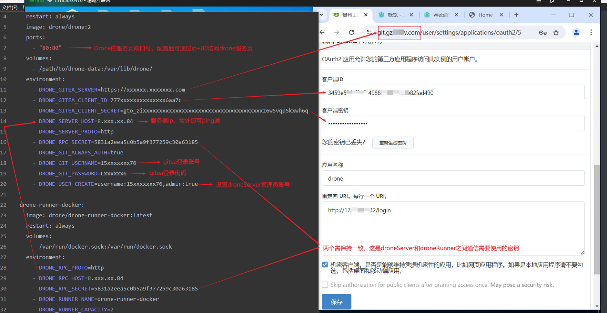

DRONE_RPC_SECRET用这个命令生成

```
openssl rand -hex 16
```


##### 4.3、dronce配置文件使用说明

进入根目录，创建gcyw文件夹，在文件夹中创建docker-compose.yml文件

```
#切换到root用户
sudo su
#在根目录下创建gcyw目录
mkdir /gcyw
#创建docker-compose.yml文件
touch docker-compose.yml
```

运行docker-compose.yml文件

```
docker-compose up -d
```

查看droneRunner和droneServer是否启动成功

```
sudo docker ps
```

##### 4.4、droneCi的配置文件解释

这个 `docker-compose.yml` 文件配置了一个 Drone CI/CD 系统，包括两个主要的服务：`drone-server` 和 `drone-runner-docker`。下面是每个部分的详细解释：

###### `4.4.1、drone-server` 服务

- **`restart: always`**：表示容器崩溃或宿主机重启后会自动重新启动。

- **`image: drone/drone:2`**：使用 `drone/drone` 镜像的 2 版。这个镜像包含 Drone 服务器的最新稳定版本。

- `ports`

  ：

  - `80:80`：将宿主机的 80 端口映射到容器的 80 端口。这使得你可以通过宿主机的 80 端口访问 Drone 服务器。

- `volumes`

  ：

  - `/path/to/drone-data:/var/lib/drone/`：将宿主机上的 `/path/to/drone-data` 目录挂载到容器的 `/var/lib/drone/`。这个目录用于存储 Drone 服务器的数据和配置文件。

- `environment`

  ：配置了多个环境变量，用于设置 Drone 服务器的行为和连接到 Git 服务器（Gitea）的方式。

  - `DRONE_GITEA_SERVER`：Gitea 服务器的地址。
  - `DRONE_GITEA_CLIENT_ID` 和 `DRONE_GITEA_CLIENT_SECRET`：用于与 Gitea 进行身份验证的客户端 ID 和秘密。
  - `DRONE_SERVER_HOST` 和 `DRONE_SERVER_PROTO`：Drone 服务器的地址和协议（HTTP 或 HTTPS）。
  - `DRONE_RPC_SECRET`：用于认证 Drone 服务器和 Runner 之间的通信的秘密。
  - `DRONE_GIT_ALWAYS_AUTH`：强制每次访问 Git 仓库时都进行身份验证。
  - `DRONE_GIT_USERNAME` 和 `DRONE_GIT_PASSWORD`：用于访问 Git 仓库的用户名和密码。
  - `DRONE_USER_CREATE`：自动创建一个管理员用户，用户名为 `15185626476`。

###### `4.4.2、drone-runner-docker` 服务

- **`image: drone/drone-runner-docker:latest`**：使用 `drone/drone-runner-docker` 镜像的最新版本。这个镜像用于运行 Docker 容器中的 Drone Runner。

- **`restart: always`**：表示容器崩溃或宿主机重启后会自动重新启动。

- `volumes`

  ：

  - `/var/run/docker.sock:/var/run/docker.sock`：将宿主机的 Docker 套接字挂载到容器中。这使得容器可以访问宿主机的 Docker 引擎，从而在 Docker 容器中运行构建任务。

- `environment`

  ：配置了多个环境变量，用于设置 Drone Runner 的行为。

  - `DRONE_RPC_PROTO` 和 `DRONE_RPC_HOST`：指定 Drone 服务器的协议和主机地址，以便 Runner 可以与服务器通信。
  - `DRONE_RPC_SECRET`：用于认证 Runner 和服务器之间的通信的秘密，应该与 `drone-server` 中的设置匹配。
  - `DRONE_RUNNER_NAME`：给 Runner 指定一个名字，这里为 `drone-runner-docker`。
  - `DRONE_RUNNER_CAPACITY`：设置 Runner 的容量，这里为 2，表示此 Runner 可以并行处理两个构建任务。

###### 4.4.5、总结

- **`drone-server`** 负责管理和协调构建任务，提供 Web 界面和 API。
- **`drone-runner-docker`** 负责执行构建任务，在 Docker 容器中运行实际的构建步骤。

这两个服务配合工作，共同完成 CI/CD 流程中的自动化构建和部署任务。


## 五、测试

### 1、流程流通性测试

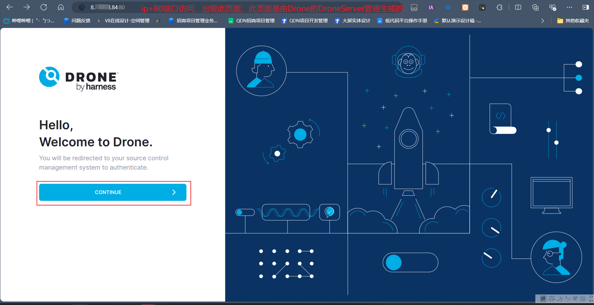

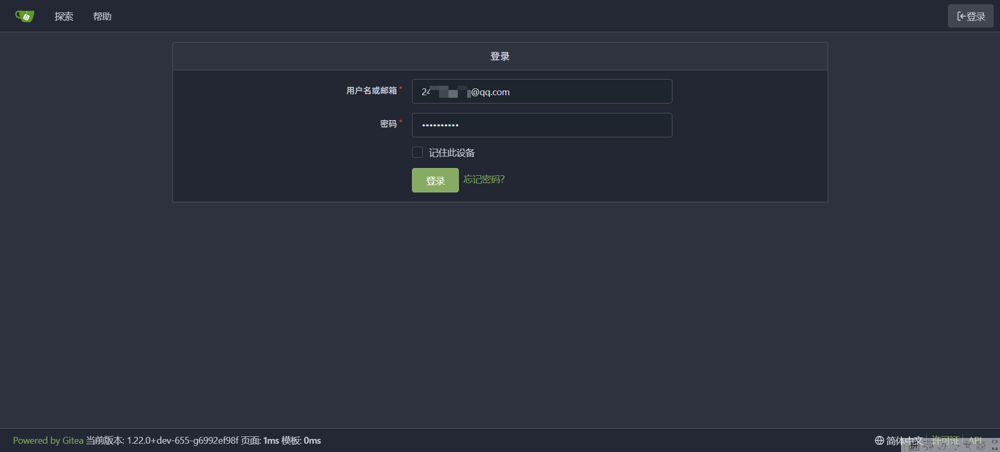

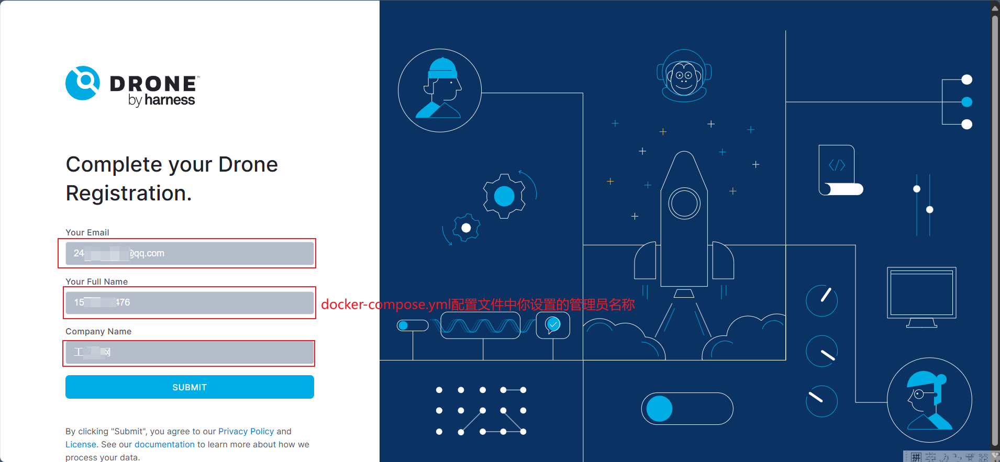

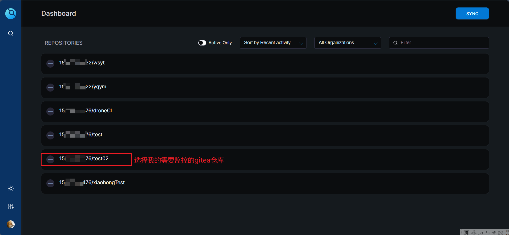

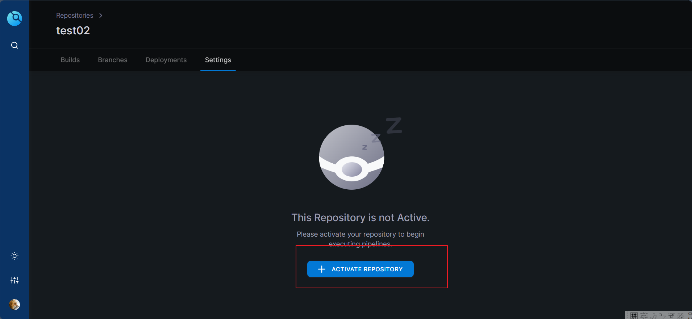

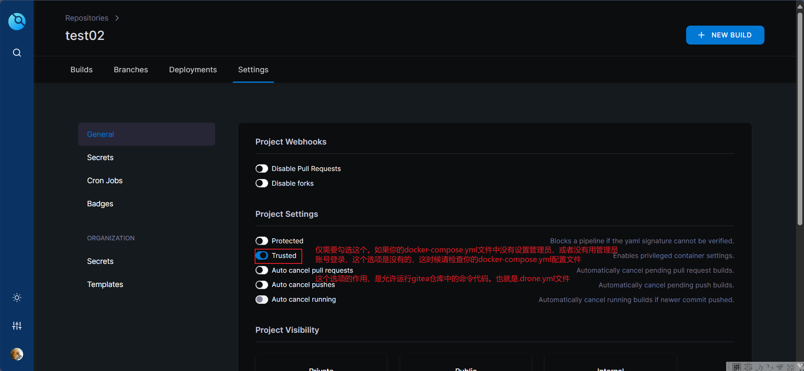

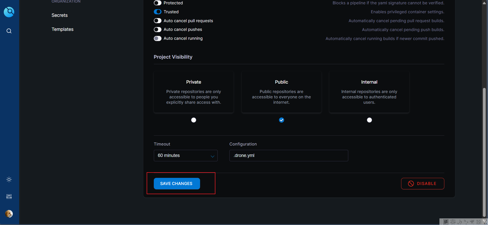

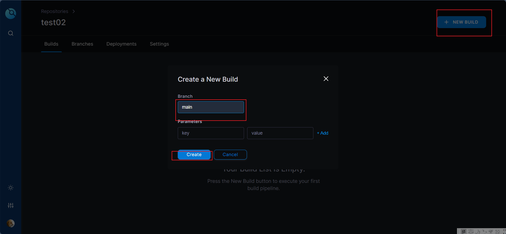

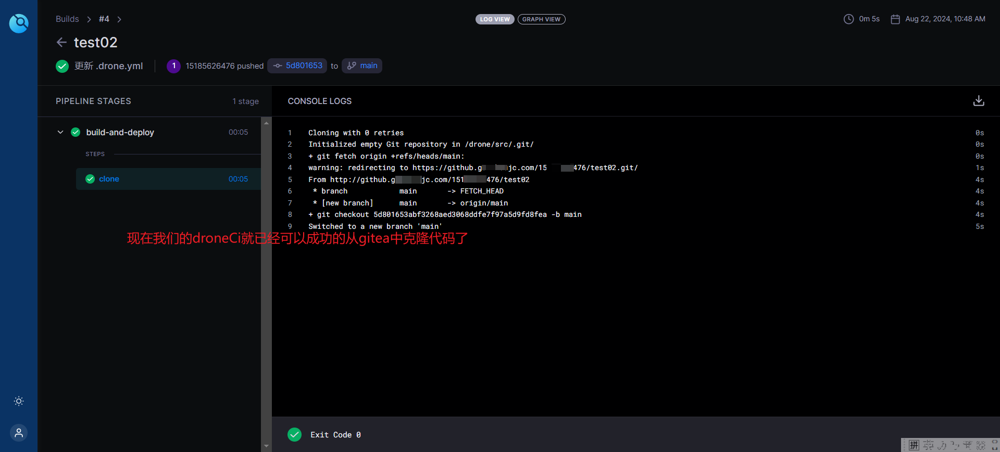

### 2、项目在服务器构建测试

进入gitea修改.drone.yml文件

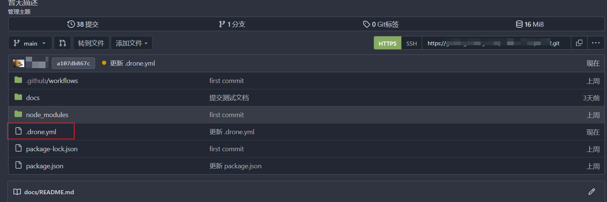

.drone.yml写入如下内容

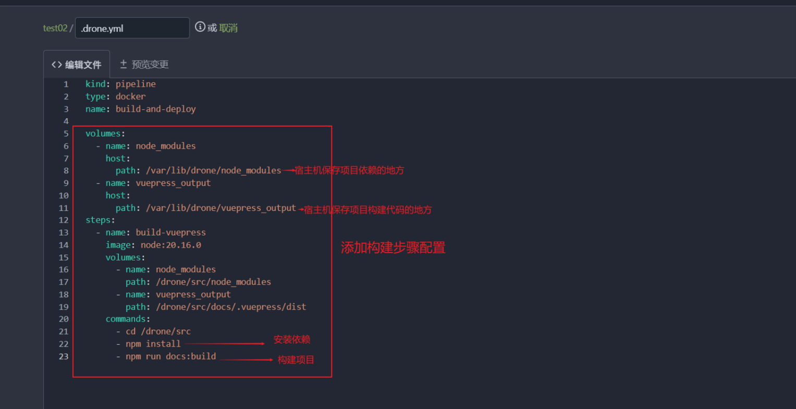

```bash
kind: pipeline
type: docker
name: build-and-deploy
volumes:
  - name: node_modules
    host:
      path: /var/lib/drone/node_modules
  - name: vuepress_output
    host:
      path: /var/lib/drone/vuepress_output
steps:
  - name: build-vuepress
    image: node:20.16.0
    volumes:
      - name: node_modules
        path: /drone/src/node_modules
      - name: vuepress_output
        path: /drone/src/docs/.vuepress/dist
    commands:
      - cd /drone/src
      - npm install
      - npm run docs:build
```

进入droneCi的服务页，查看构建情况

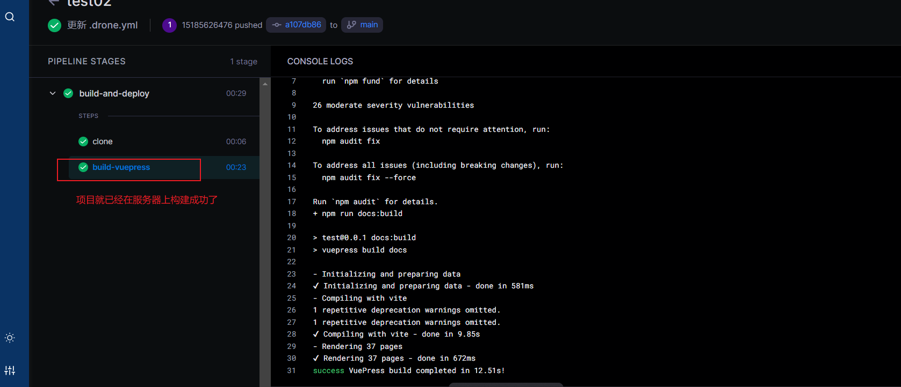

进入90端口，访问项目是否构建成功

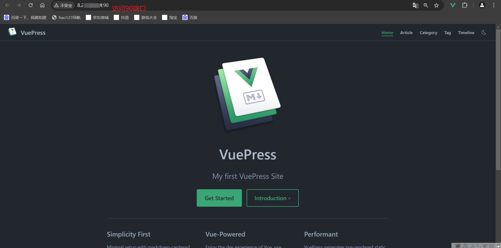