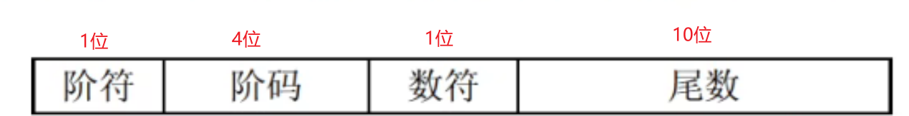

## 一、浮点数的公式

N = 2^E * F

E：阶码

F：尾数

## 二、小阶向大阶，损失更少

### 1. **精度**：

- 浮点数由三部分组成：符号位、指数部分和尾数部分。尾数的位数是固定的。
- 当小阶向大阶时，尾数部分的有效位数得以保留，减少了信息损失。

### 2. **范围**：

- 浮点数的范围是由指数决定的。小阶数值在小范围内，转向大阶数值时，意味着数值在更广的范围内可以表示。
- 转换时可能会涉及对数值的缩放，但由于尾数的位数不变，整体的精度损失较小。

### 3. **舍入误差**：

- 将小阶数转换为大阶数时，通常会涉及到加权平均，而这种过程会减少舍入误差。

### 总结

因此，小阶向大阶转换时，由于尾数的有效位数保持不变，导致相对精度损失较小。

## 三、浮点数的范围由阶码决定，精度由尾数决定

### 1. **浮点数的组成**：

- **符号位**：决定数值是正数还是负数。
- **阶码**（Exponent）：决定浮点数的范围。
- **尾数**（Mantissa 或 Significand）：决定浮点数的精度。

### 2. **范围**：

- 浮点数的阶码决定了它的表示范围。阶码的大小直接影响浮点数可以表示的最小和最大值。
- 例如，在 IEEE 754 标准中，单精度浮点数的阶码范围为 -126 到 127，这意味着可以表示的数值范围是相对较大的。

### 3. **精度**：

- 尾数决定了浮点数的精度。尾数部分的位数越多，表示的数字越精确。
- 对于 IEEE 754 单精度浮点数，尾数有 23 位（加上隐含的 1，总共 24 位），这决定了浮点数在其范围内的精度。

### 总结

- **阶码**决定了浮点数的范围（可以表示的大小），而**尾数**则决定了浮点数的精度（表示的细节）。这样的结构使得浮点数可以在很大范围内灵活地表示各种实数，同时尽量保持精度。

## 四、规格化就是将绝对值限定到[0.5,1)

### 规格化的过程：

1. **尾数部分**：在规格化的浮点数中，尾数通常表示为 1.x1.x1.x，其中 xxx 是尾数的小数部分。这样，尾数的值会在 [1,2)[1, 2)[1,2) 范围内。
2. **阶码调整**：为了确保尾数符合规格化的标准，阶码会相应地进行调整。例如，如果浮点数在计算过程中变成了非规格化（如小于 0.5），则需要调整阶码使其重新进入规格化范围。

### 为什么要规格化：

- 规格化使得浮点数在存储和计算时更高效，能够利用尾数的每一位来增加精度。
- 通过规范化，浮点数的表示可以更一致，从而减少表示的冗余，提升数值计算的准确性。

### 非规格化数：

当数值非常小，导致尾数无法保持在规格化范围内时，可能会出现非规格化数（denormalized numbers），此时尾数的绝对值会落在 [0,0.5)[0, 0.5)[0,0.5) 的范围内。