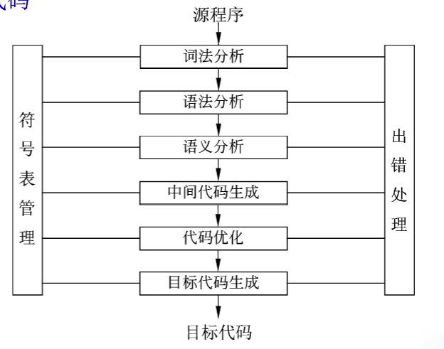
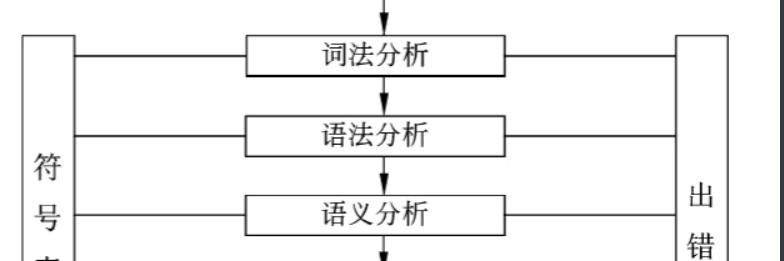

## 1、低级语言

机械医院-------->汇编语言

## 2、高级语言

java、c、c++、php、python、delphi、pascal

## 3、编译程序和解释程序

语言之间的翻译形式有很多：汇编、解释、编译

汇编语言------->汇编程序-------->执行

高级语言程序-------->解释程序/编译程序---------->执行

**编译程序**：所有源代码在一次编译过程中被转化为机器代码，生成可执行文件。此过程通常更快，但需要等待整个程序编译完成才能运行。

**解释程序**：逐行读取源代码，并实时执行。虽然启动时间较短，但每次执行时都需要解释源代码，整体效率相对较低。

## 4、编译方式

编译方式一共有5步：词法分析、语法分析、语义分析、中间代码生成、代码优化、目标代码生成

## 5、解释方式

解释方式一定是有：词法分析、语法分析、语义分析的

## 6、符号表：

