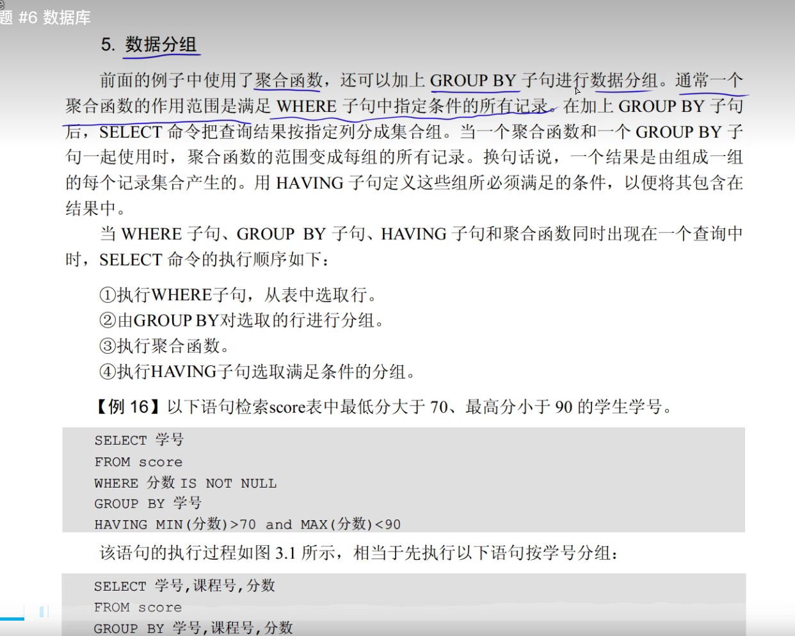

## 1、考试介绍
数据库的考点一般在51~56题

## 2、结构数据模型

### 2.1、层次模型

### 2.2、网状模型

### 2.3、关系模型

关系模型式一种二维表格结构来实现实体以及实体之间联系的数据模型。

### 2.4、例题

## 3、数据库的三级模式结构

三级模式

- 外模式（视图）
- 模式（基本表）
- 内模式（数据库存储文件）

## 4、两级映像

- 数据的物理独立性：概念模式和内模式之间的映像
- 数据的逻辑独立性：外模式和概念模式之间的映像

### 4.1、例题

## 5、关系模型种的基本术语

下图的关系模式为S(Sno,Sname,SD,Sage,Sex)

## 6、关系模型的定义

- 关系模型中数据的逻辑关系式一张二维表
- 关系模型操作又：选中、投影、链接、除、并、交、差等查询操作和增加、删除操作等

## 7、关系完整性约束

## 8、笛卡尔积

## 9、传统的集合运算

## 10、选择、投影、连接

这个两个，自己去看视频

## 11、自然连接

## 12、外连接

### 13、例题

## 13、投影、选择转sql

## 14、笛卡尔积转sql语言

 

## 15、自然连接转sql

## 16、例题：

## 17、数据定义语言

、

列级完整性约束

表级完整性约束

 

## 18、投影查询

desc降序

asc升序

## 19、聚合函数

