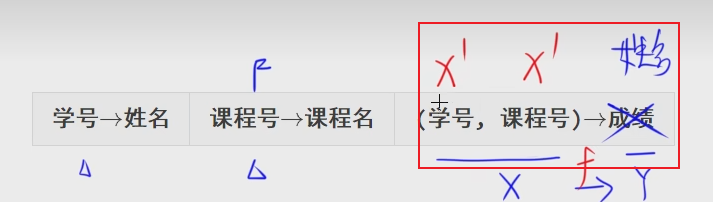

---

title: 数据库二阶段学习
date: 2024-9-09 14:27:01
permalink: /pages/shujukuerjieduanxuexi
categories: 
  - 软考
  - 数据结构
tags: 
  - 软件中级设计师
---

## 1、索引的建立与删除

## 2、关系模式

## 3、数据库的规范化

### 3.1、非平凡函数依赖

（学号，课程号）->成绩

像是上面这个，成绩不包含在（学号，课程号）这个里面的，就是非平凡的函数依赖

### 3.2、平凡的函数依赖

（学号，课程号）->课程号

### 3.3、完全函数依赖

（学号，课程号）->成绩

学号和课程号都不能单独的决定成绩，所以成绩是完全依赖于（学号，课程号）

学号 -> 姓名

姓名完全依赖于学号

### 3.4、部分函数依赖

学号可以直接决定姓名，所以是部分的函数依赖

### 3.5、传递依赖

## 属性的闭包

