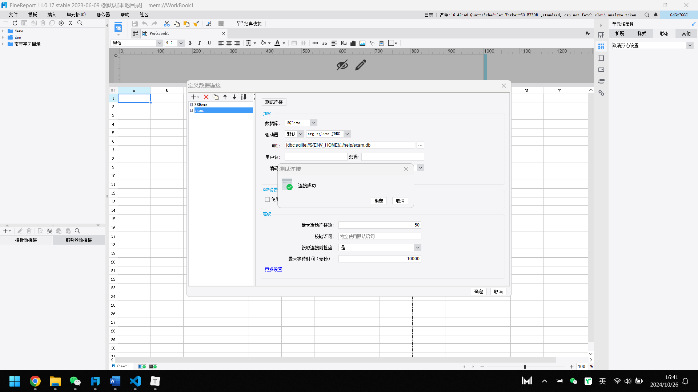
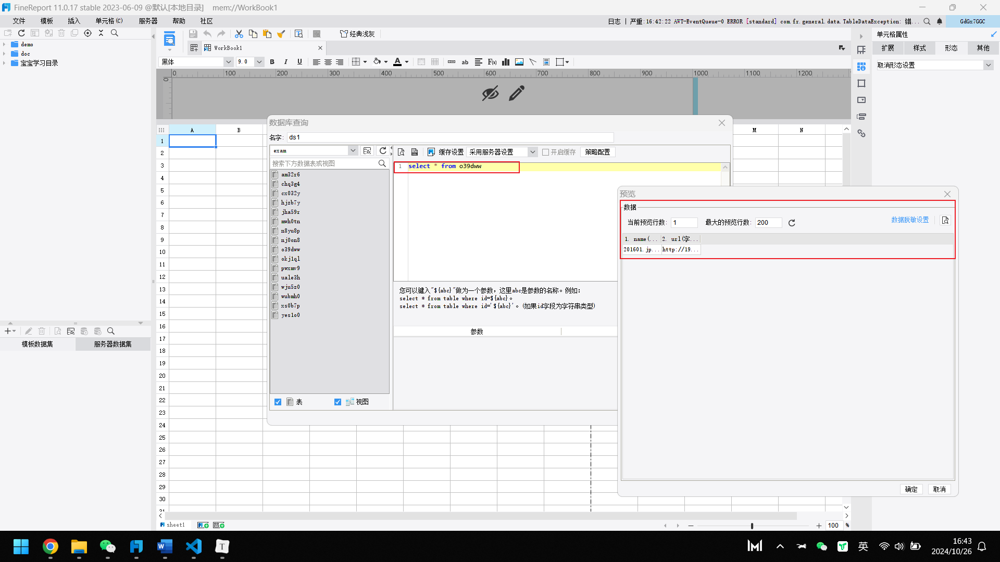
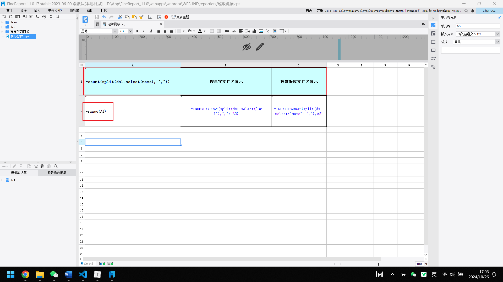
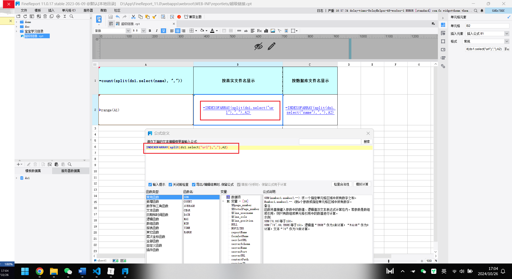
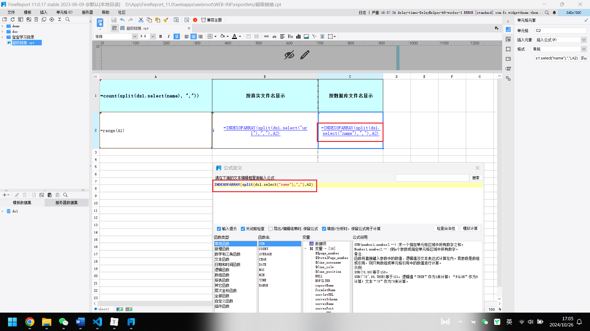
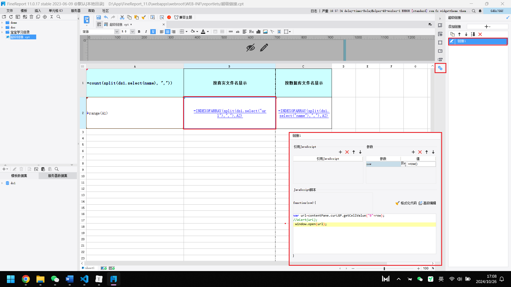
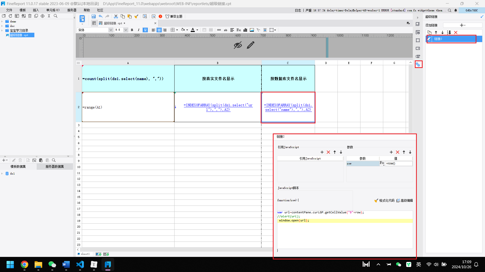
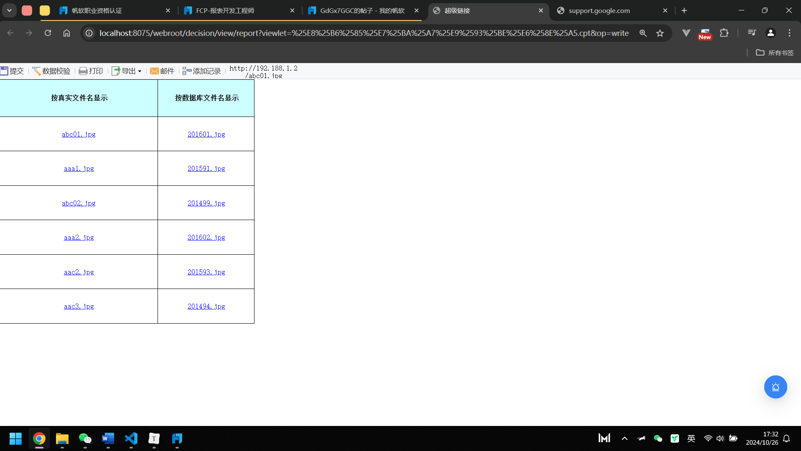
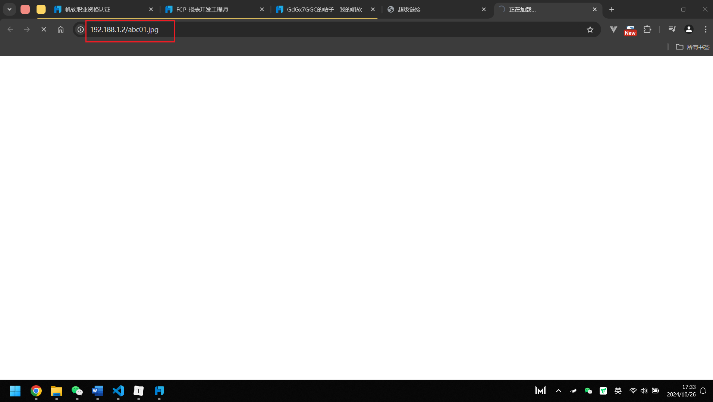

## 1、定义数据连接

## 2、新建数据查询

查询语句：select * from o39dww

## 3、关于特定单元格公式设置、文字填写与底色设置

解释：在 A1 单元格中输入公式“COUNT(SPLIT(ds1.select(name),","))”，在 A2 单元格中输入公式“RANGE(A1)”，同时将 A1、B1、C1 单元格的底色设置为蓝色。于 B1 单元格中填写“按真实文件名显示”，在 C1 单元格中填写“按数据库文件名显示”。

## 4、在B2单元格插入：INDEXOFARRAY(split(ds1.select("url"),","),A2)公式，在C2中插入：INDEXOFARRAY(split(ds1.select("name"),","),A2)公式。

## 5、在B2和C2单元格添加链接

## 6、效果展示

网页数据表格展示。

点击表格内容，可进行对应链接跳转

