## 1、定义数据连接

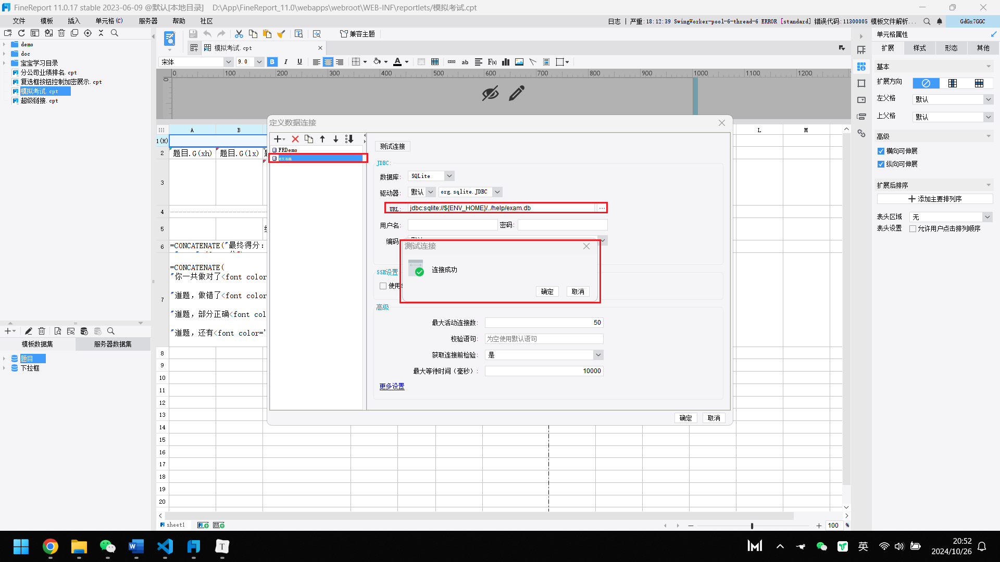

## 2、新建数据集，然后定义数据库查询（select n.* from nj0on8 n）

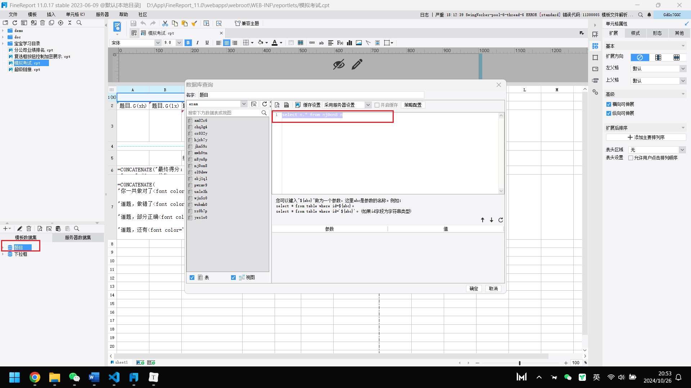

## 3、添加自定义的显示方式，能够借助单元格依据不同的题目类型，呈现出不一样的备注（比如单选、多选或者判断）。

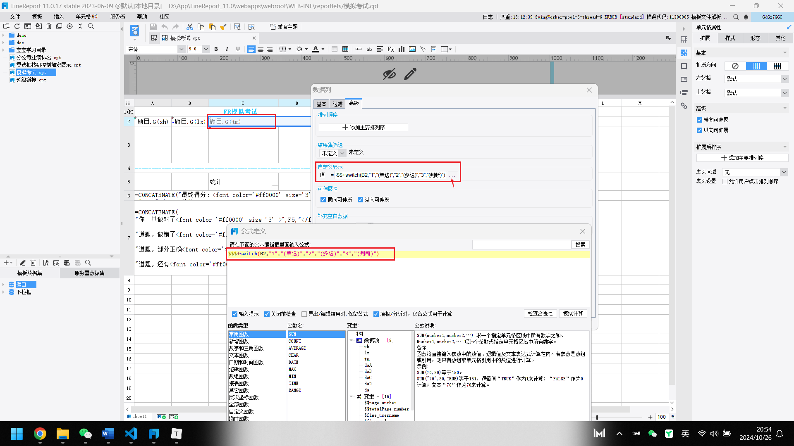

## 4、对选项表进行加工处理，运用 union 将这个选项的每一项都予以呈现，以用于数据字典的运用。

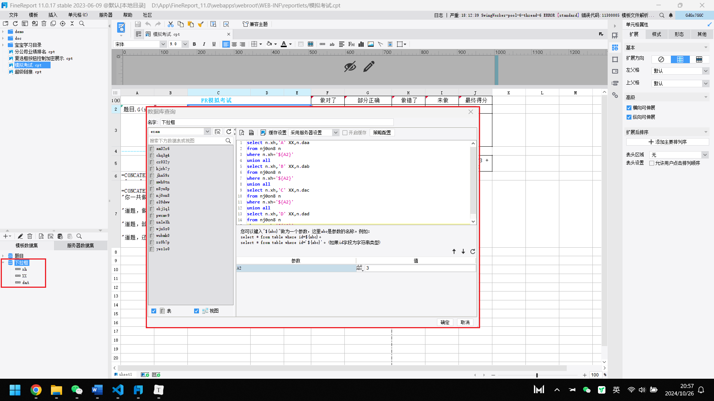

## 5、依据条件属性，按照不同的题目类型添加不同的控件，在题目类型为 1 以及 3 时则添加单选按钮组，而当题目类型为 2 时就添加多选按钮组。

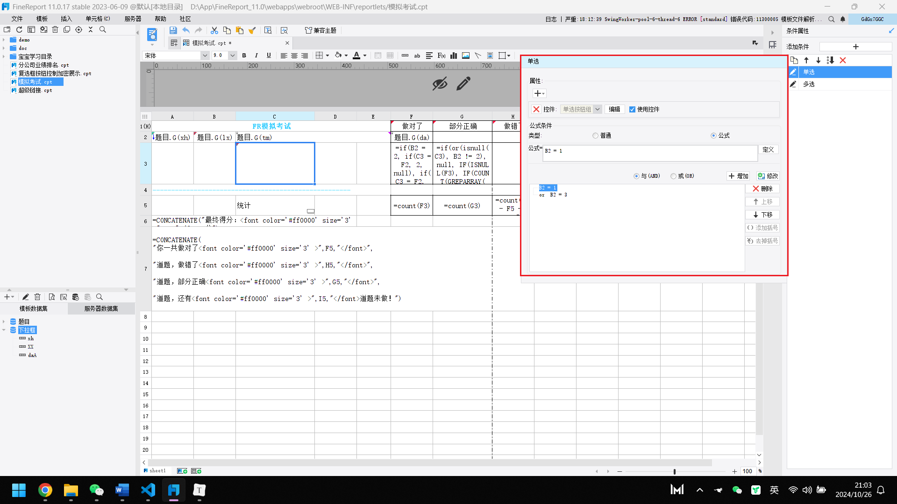

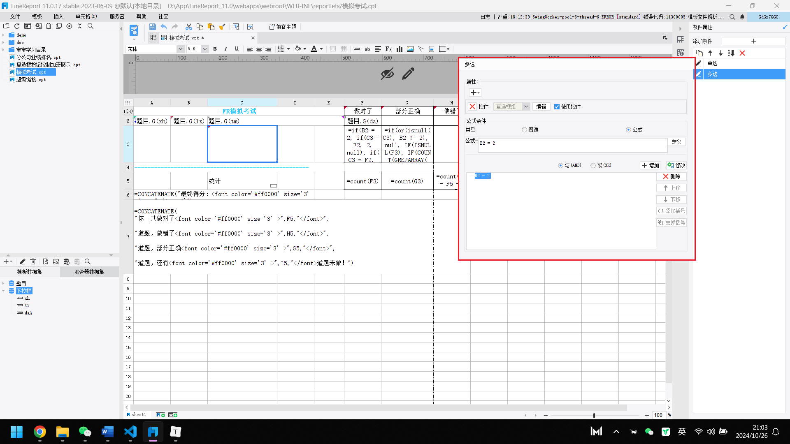

## 6、两个按钮组的数据字典都采用刚才提到的下拉框值，同时将展示列数设置为 1。对于复选框，由于是拼接的答案，所以要选择字符串形式，且不要有分隔符。

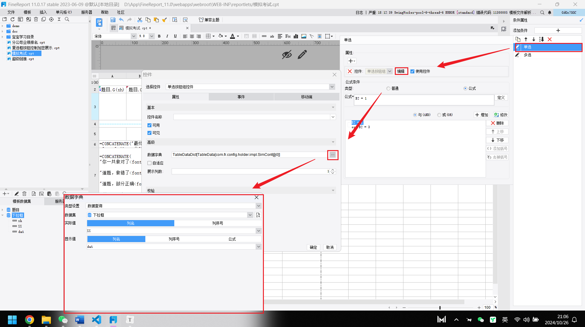

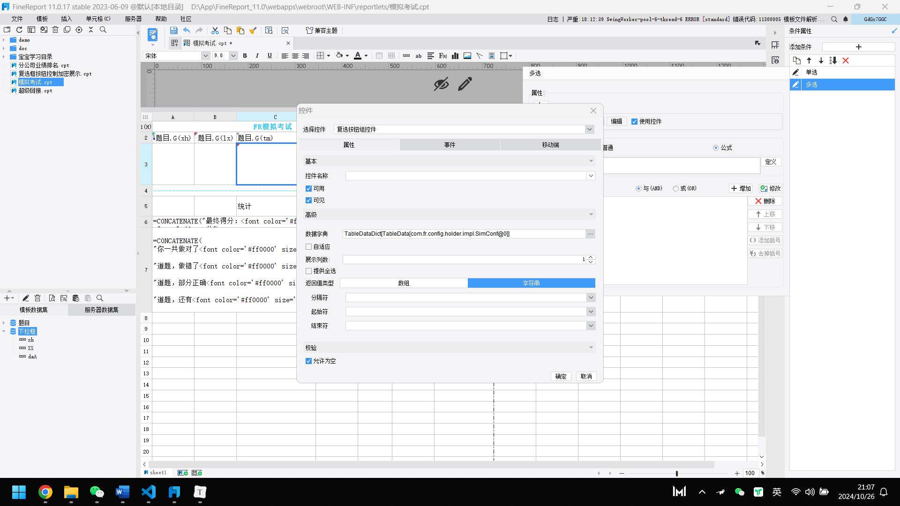

## 7、对“做对了”的数量进行统计，在题目类型属于多选题的情况下，要是所选择的答案与标准答案相同，那就表示做对了，可获得 2 分，不然的话就只能得 1 分。

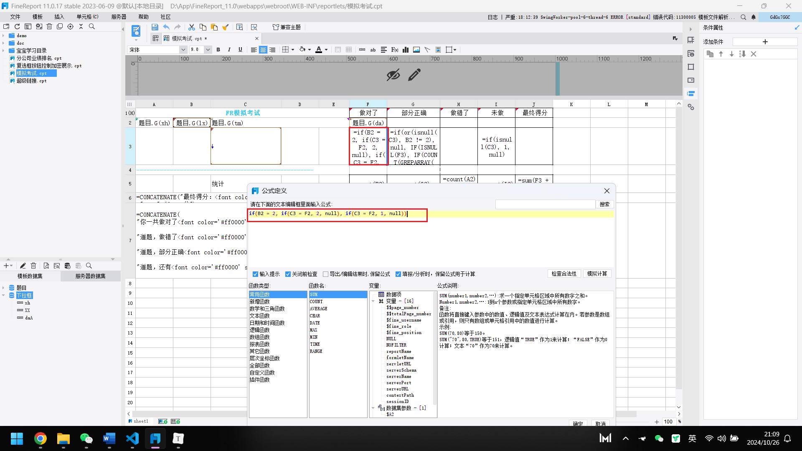

## 8、统计复选框“部分正确”的数量，利用GREPARRAY函数可以查看填写答案是否有和标准答案不一致的：

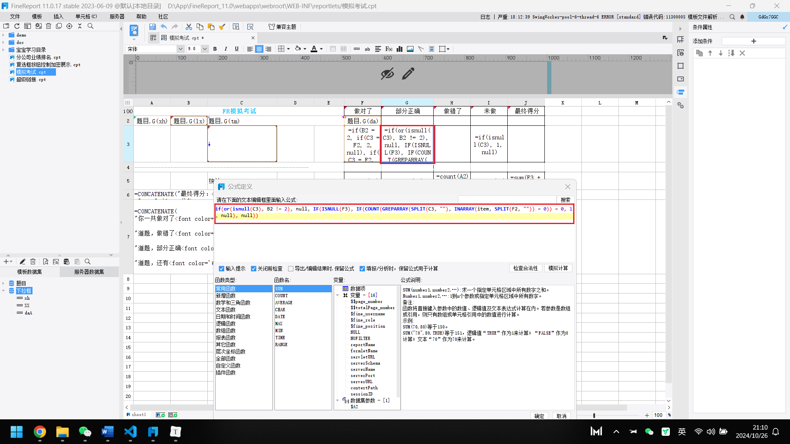

## 9、统计“未进行作答”的数量，在填写的答案为空的时候就进行一次统计。

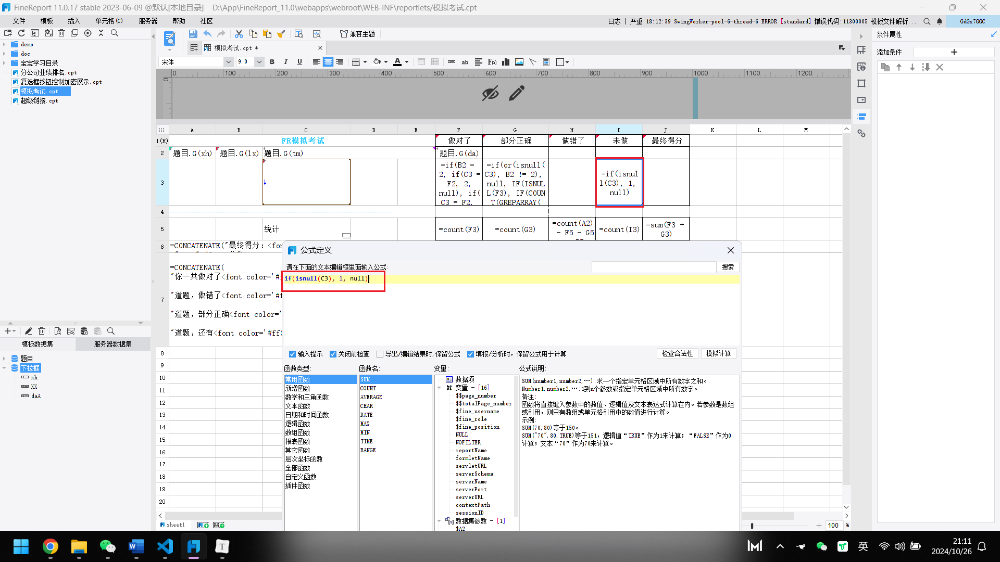

## 10、将所有的项目都分别统计其出现的次数，接着对“答错了”的数量进行统计，通过题目总数量减去做对了的数量再减去部分正确的数量以及未做的数量来得出。

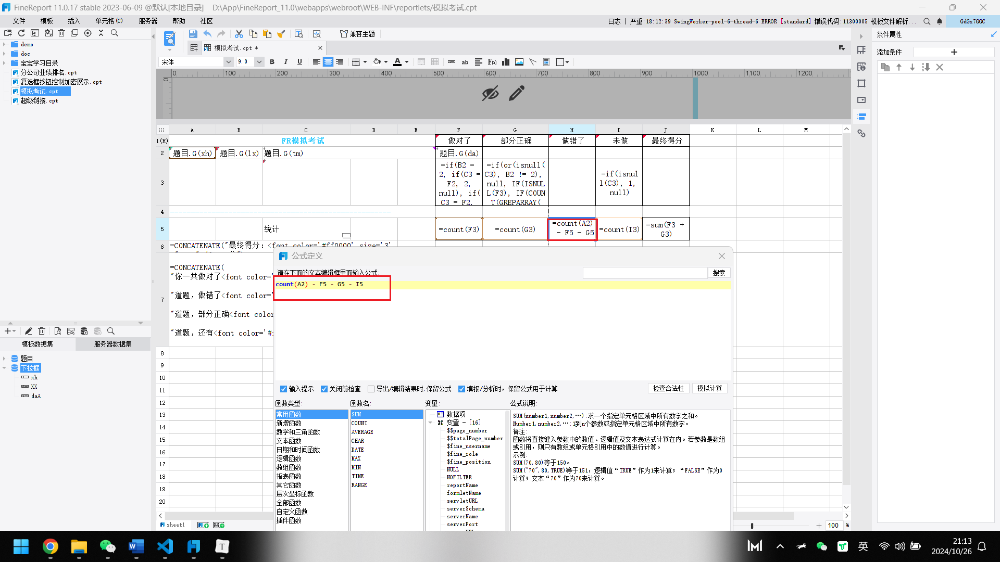

## 11、添加分割线，左父格设置成A2:

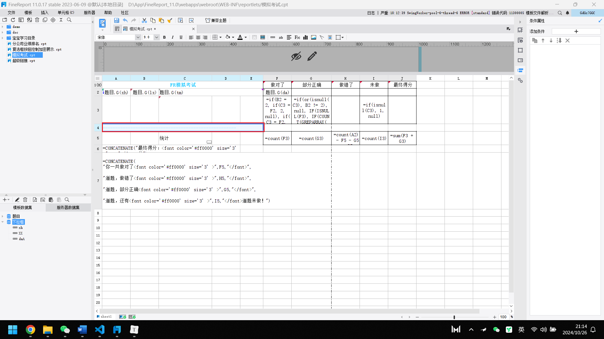

## 12、最终把得分予以显示，并且将单元格的属性设定为“以 HTML 进行显示”。

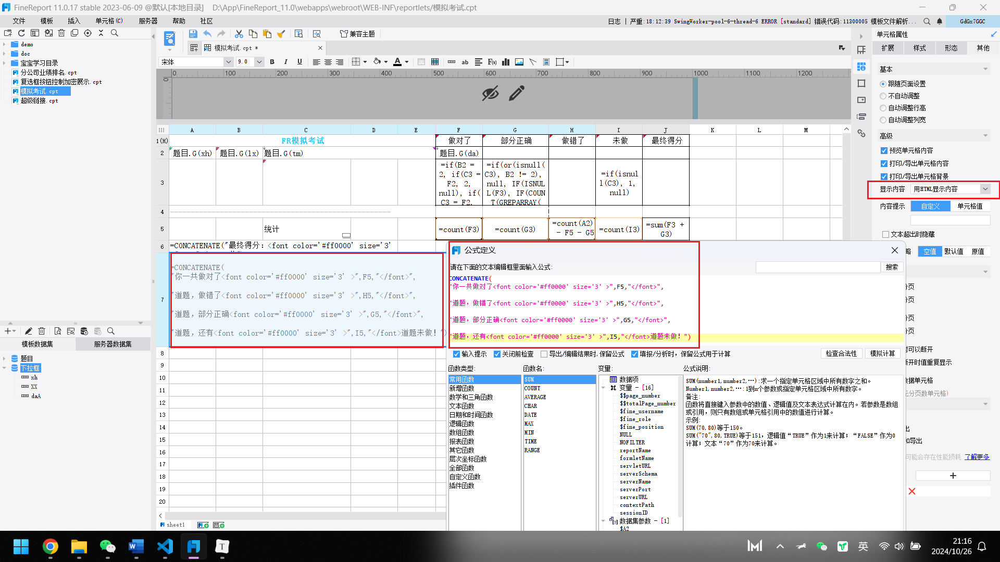

## 13、效果展示 

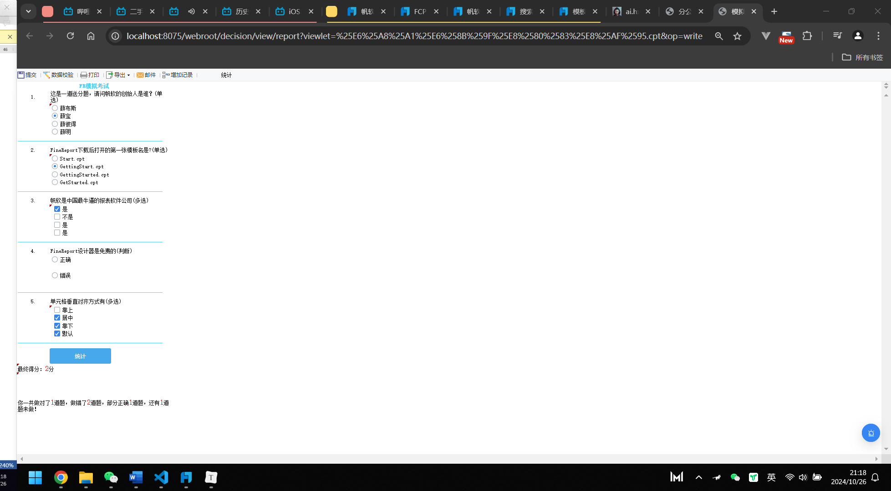