## 1、图形推理的题数占比

国考：10道题

省考：5~15道题

## 2、图形图例常见命题形式及观察

- 一排型
  - 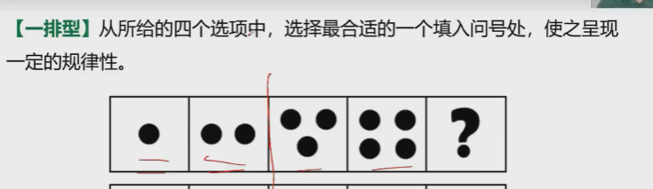
- 两组型
  - 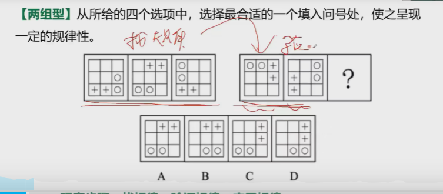
- 九宫格
  - 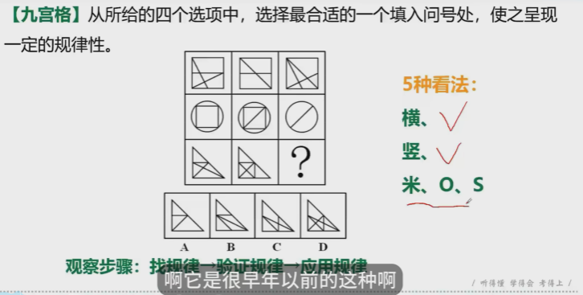
- 分组类
  - 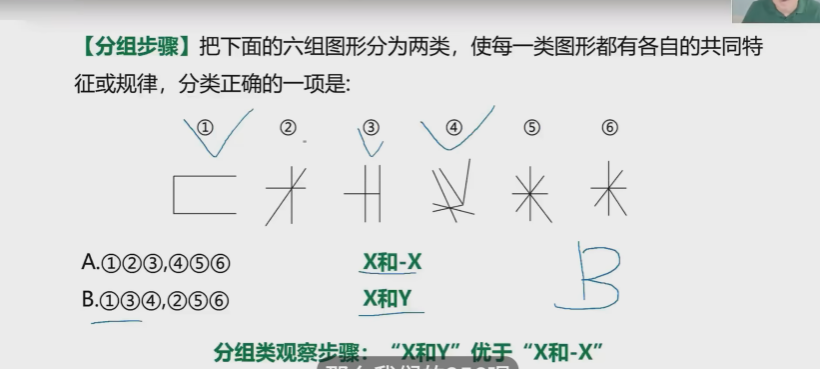
- 一图型
  - 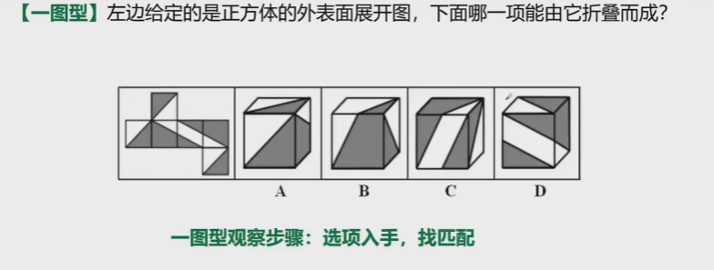

## 3、图形推理

- 平面图
  - 位置类
    - 平移
      - 方向【上、下、左、右、顺、逆】
      - 步数【相等、相差】
      - 方式【循环、往返】
    - 旋转
      - 方向【顺时针、逆时针】
      - 角度【45、60、90、180】
    - 翻转
      - 辨别
        - 两个图形时针不同，即为翻转
        - 两个图形时针相同，即为旋转
      - 方向
  - 样式类
  - 属性类
  - 数量类
- 立体图形
  - 立体视图
  - 正六面体

### 3.1、平面图———位置类

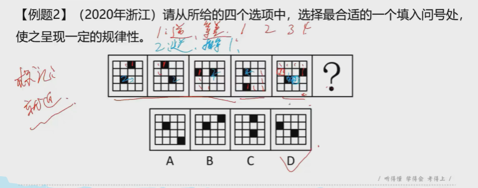

### 3.2、平面图———旋转类

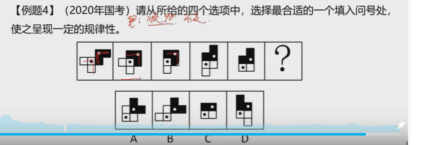

### 3.3、平面图———翻转类

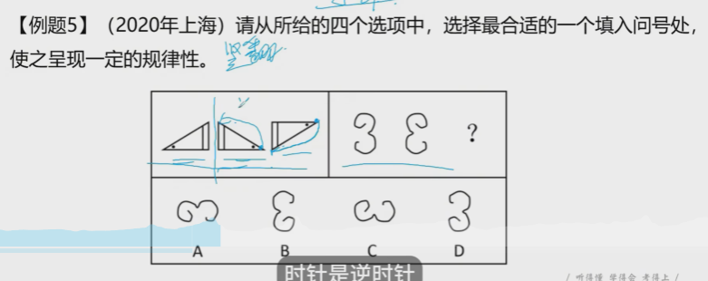

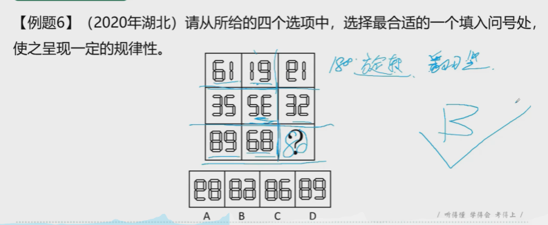

## 4、练习

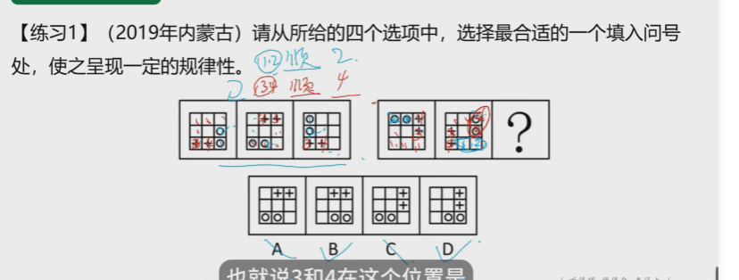

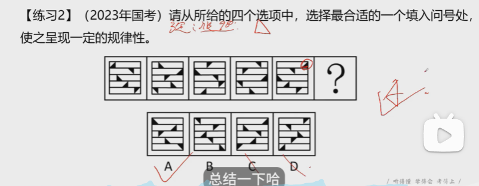

D

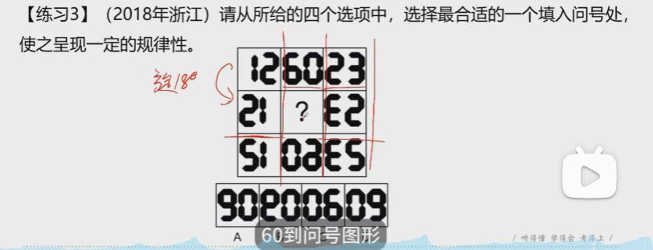