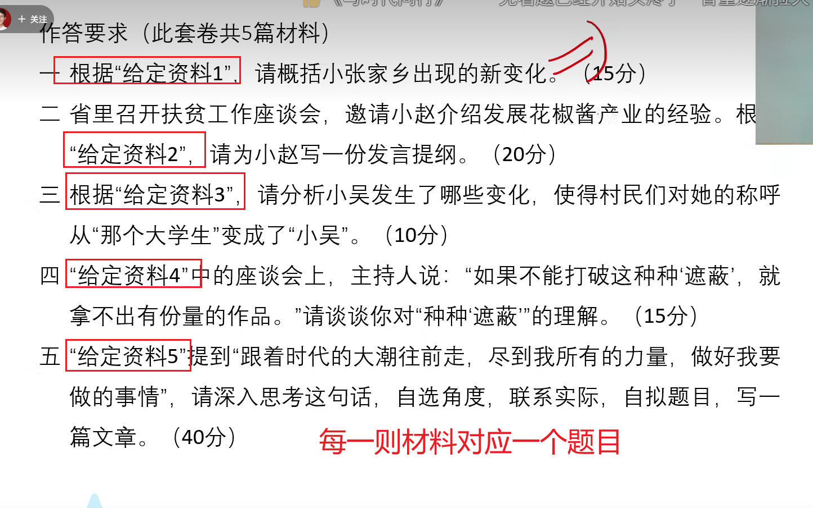
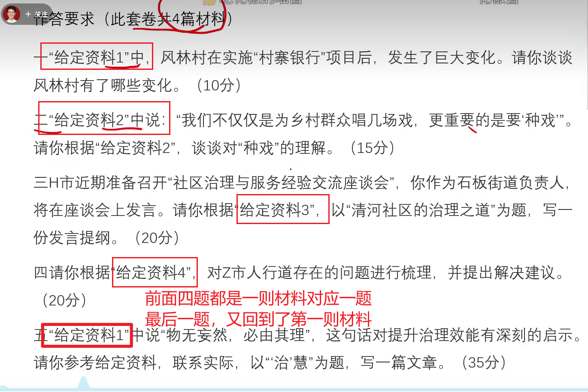
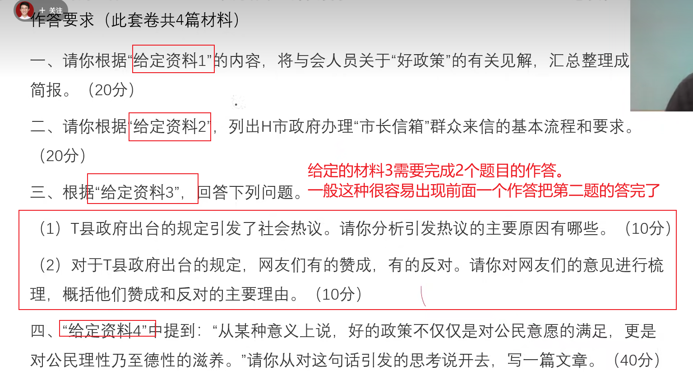
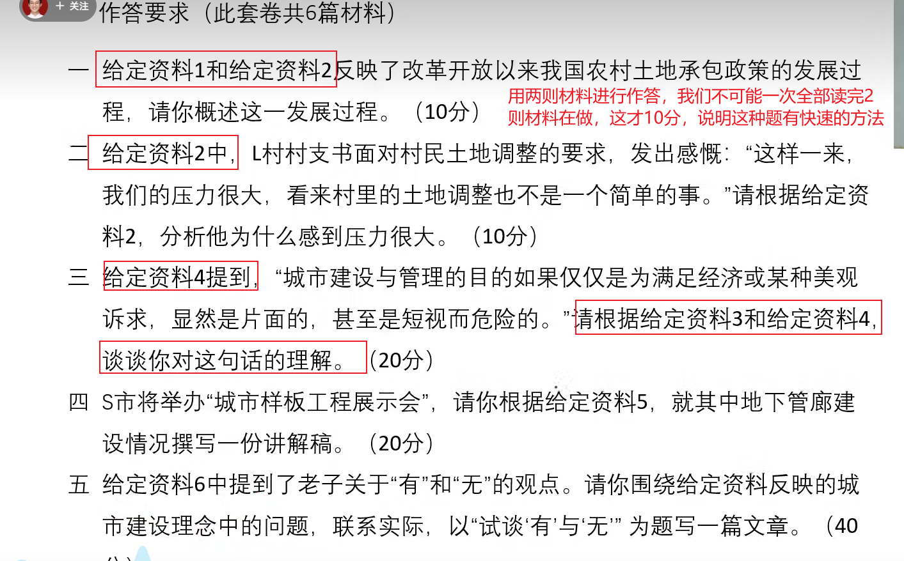
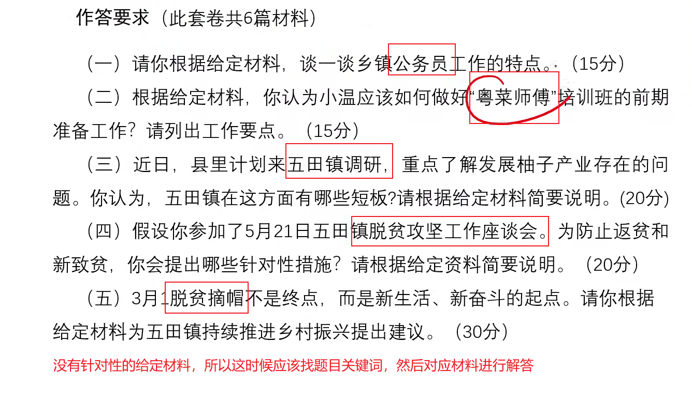

# 小马哥申论系统课

## 一、申论系统课课程内容

1、归纳概括题：常规与特俗，共10道

2、综合分析题：释义、理解、评论、比较等，共10道题

3、应用文：讲话稿、倡议书、公开信，共10道

4、对策启示题：提出对策与推出对策，共6道

6大作文：10道

总共讲解46套题，按照一套试卷大概4~5道题，这里大概有10套题

## 二、申论系统课课程特点

1、包含国考、联考、及独立命题省份真题

2、兼顾各种难度、各种材料，各种设问方式

3、部分题目收集了学院作答，对作答进行评析

4、无直播干扰因素，纯享版；

5、是套题刷题的补充，一定要刷题！（公考小马哥账号有100小时套题讲解视频）

## 三、关于申论学习的三点认知

1、申论是客观题

2、把握好原则性与灵活性

3、申论需要储备，但不是关键

## 四、学习申论最重要的事

动手写！！！

## 五、申论大纲

 申论试卷由注意事项、给定资料和作答要求三部分组成。  

**阅读理解能力**——能够理解给定资料的主要内容，把握给定资料各部分之间的关系，对给定资料所涉及的观点、事实作出恰当的解释。

**贯彻执行能力**——能够准确理解工作目标和组织意图，遵循依法行政的原 则，根据客观实际情况，及时有效地完成任务。

**解决问题能力**——对给定资料所反映的问题进行分析，并提出解决的措施或办法。  文字表达能力——熟练使用指定的语种，对事件、观点进行准确合理的说明、 陈述或阐释。

## 六、注意事项

1.本题本由给定资料与作答要求两部分构成。考试时限为180分钟。其中， 阅读给定资料参考时限为50分钟，作答参考时限为130分钟。  

2.请在题本、答题卡指定位置上用黑色字迹的钢笔或签字笔填写自己的姓名 和准考证号，并用2B铅笔在准考证号对应的数字上填涂。  

3.请用黑色字迹的钢笔或签字笔在答题卡上指定的区域内作答，超出答题区 域的作答无效！  

4.待监考人员宣布考试开始后，方可开始答题。  

5.所有题目一律使用现代汉语作答。未按要求作答的，不得分。  

6.监考人员宣布考试结束时，应立即停止作答，将题本、答题卡和草稿纸都 翻过来留在桌上，待监考人员确认数量无误、允许离开后，方可离开。严禁折叠 答题卡！

## 七、作答要求

---

包括第五题是大作文题，大作文的核心主题是什么呢【提升治理效能】

第三题中有很多治理吧，所以大作文可以结合第一则材料和第三则材料进行书写。

---

---

---

