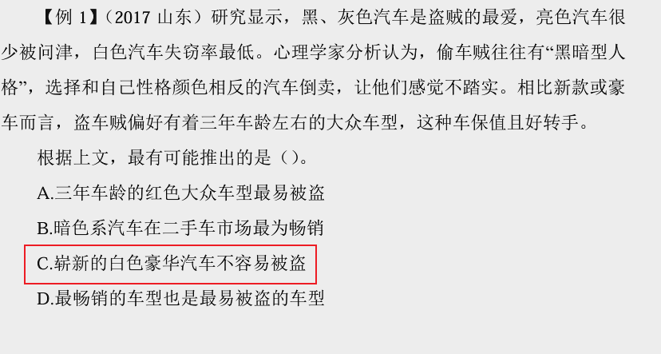
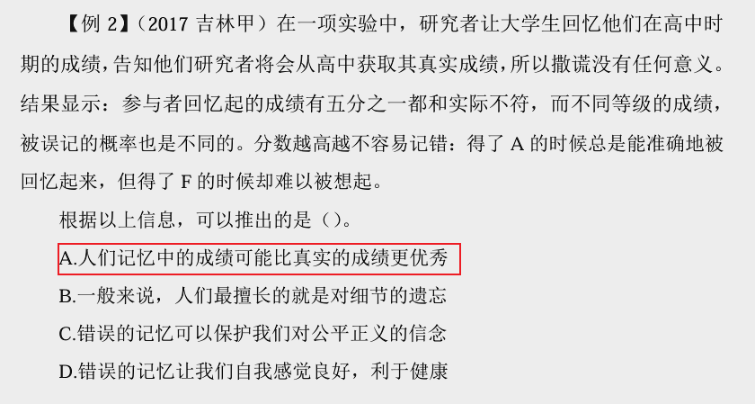
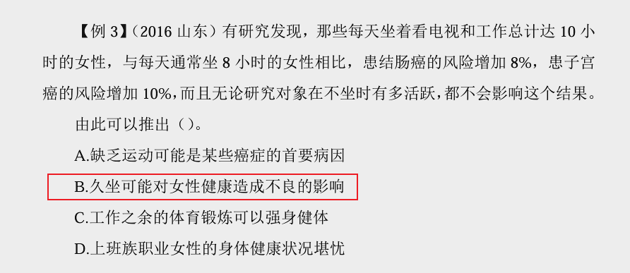
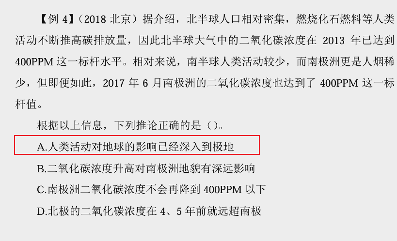
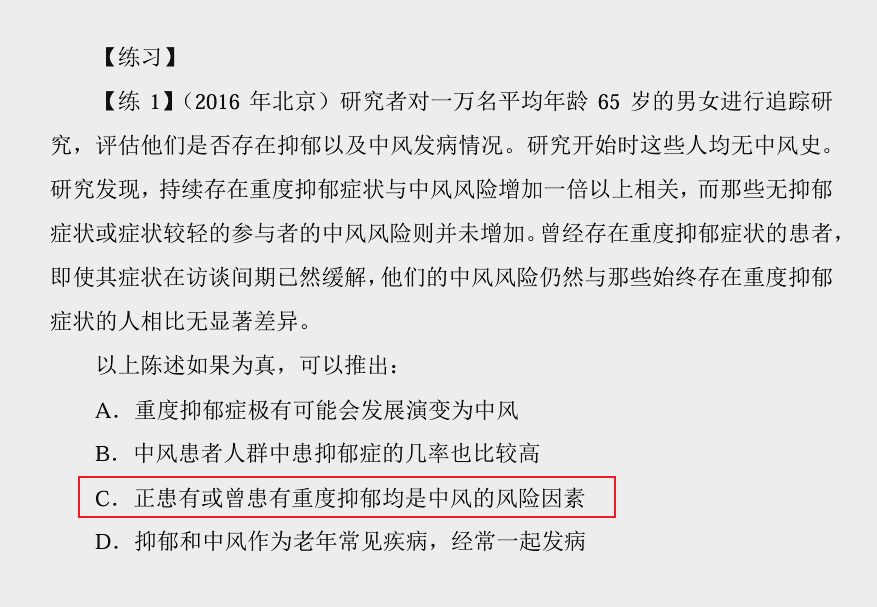
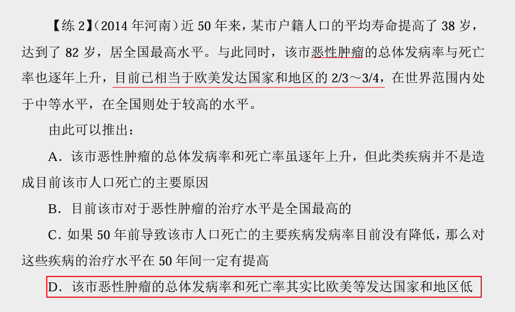
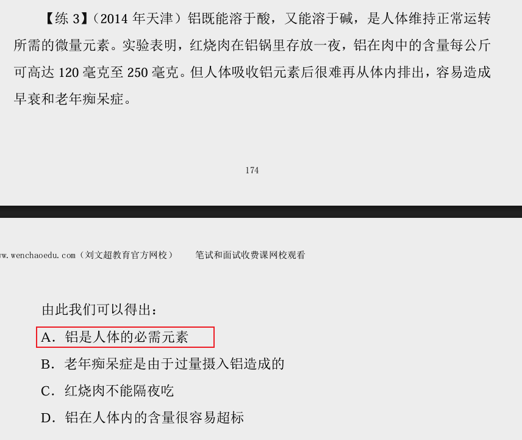
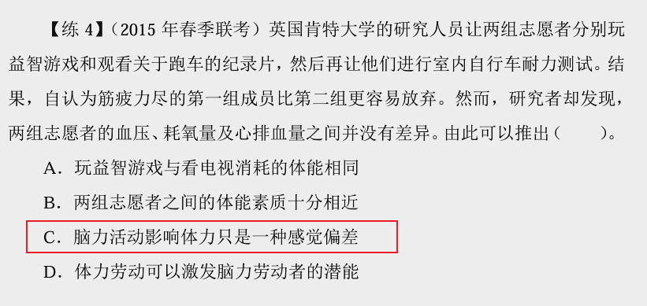
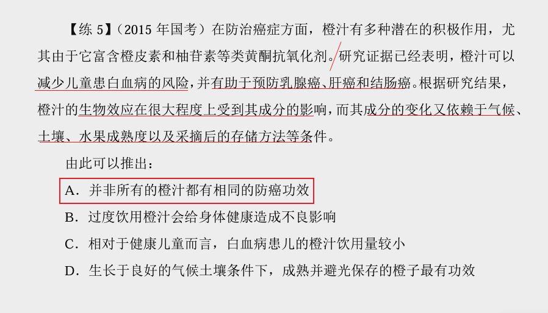

## 1、解释

1、题型特征

题干：类言语、无逻辑关联词  

问题：由此可以推出/不能推出？

2.日常结论题的做题方法是代入法，类似组合排列题。因为题目可以在任何 一句话处设置选项，考查非常细。

3.解题思路  

（1）不选  ①逻辑错误  ②无中生有  ③偷换概念  

（2）慎选  ①比较关系：比……、越来越……、更……  ②绝对词：一定、必须、肯定、只要就、只有才  ③程度：最/极大/很……  ④范围的扩大  

（3）优选  可能性的词汇：可能、有的、有些……

## 2、例题

---

---

---

---

---

---

