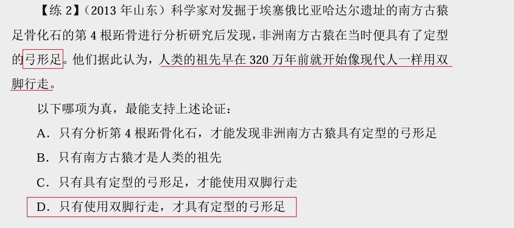

## 一、解释

加强题型：赞同  

削弱题型：反对  

### 1.1、论证的基础知识： 

1.论点：观点、态度、结论  

2.论据：证明观点正确的条件、原因、例子  

3.论证：论点与论据之间的联系 

公务员稳定→公务员是理想的职业  

论点：公务员是理想的职业  

论据：公务员职业稳定  

论证：稳定的职业都很理想  

---

论据：听课可以学到解题技巧  

论点：听课可以提升考试成绩 

 论证：掌握解题技巧可以提升考试成绩 

### 2、找论点 

1.关键词：因此，所以，认为，由此推出，据此可知……  

2.首尾句原则  

3.结合提问方式（问啥找啥） 

【注意】1.通过关键词找论点：题干中遇到因此、所以、认为、由此推出、 据此可知等表示结论、总结的词，紧跟着的句子是论点的概率很大。

2.首尾句原则：题干没有典型关键词，看首尾句是否有总结、概括的内容。  

3.结合提问方式：问啥找啥。

例如：  

（1）削弱专家观点，直接找专家观点即可。  

（2）加强反对者观点，从题干找反对者观点。 

这一堆文字，我也不理解@@@

## 二、加强类

### 1、解释

常见提问方式：  

如果以下各项为真，最能加强/支持/赞同/证明上述论断的是？  

以下哪项为真，是上述论断的前提/假设/必要条件  

如果以下各项为真，最不能加强上述论断的是？

### 2、搭桥（力度最强）

#### 2.1、解释

例：楼市成交量在增长，因此楼市价格会上涨  

1.楼市成交量的增长会带动楼价上涨  

2.楼市成交量会影响楼市价格  

3.加强题目中搭桥力度最强，因此加强题目中如果一个选项是搭桥，则可以 直接选择。 

题型特征：  

1.论点与论据话题不一致  

2.提问方式为前提、假设、必要条件时，优先考虑搭桥

选项特征：  同时包含论点和论据中的关键词，并肯定论点和论据之间的关系  

解题思维：  找论点→找论据→对比选项 

#### 	2.2、例题

---

---

---

---

---

---

---

---

### 3、补充论据

#### 3.1、解释

1.必要条件：选项为论点成立的必要条件（没它不行）  

提问方式为前提、假设、必要条件且无搭桥选项  

论点：常吃西红柿能够让我们延缓衰老  

A.西红柿中营养元素能够被人体吸收  

B.西红柿是饭桌上最常见的蔬菜  

2.解释：说明论点成立的原因  

3.举例：证明论点成立的例子

#### 3.2、例题

---

---

---

---

---

---

