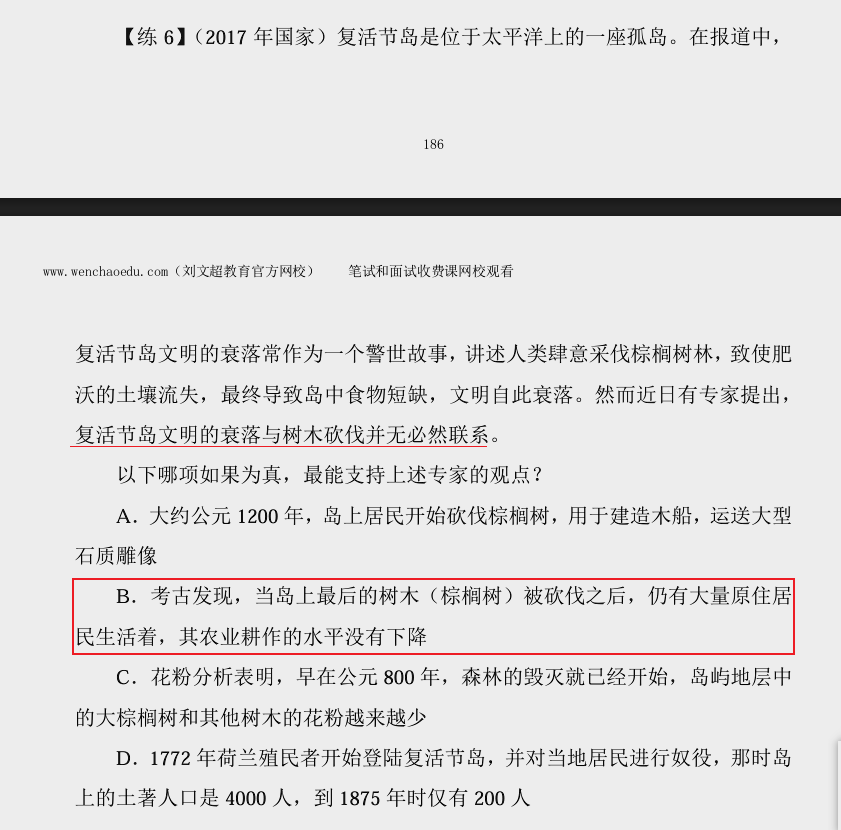
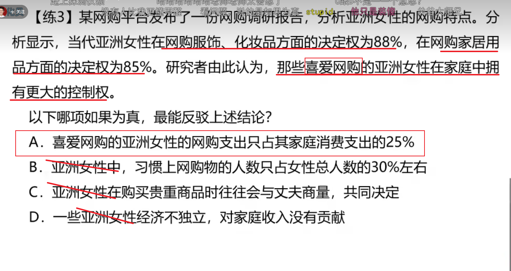

## 一、解释

加强题型：赞同  

削弱题型：反对  

### 1.1、论证的基础知识： 

1.论点：观点、态度、结论  

2.论据：证明观点正确的条件、原因、例子  

3.论证：论点与论据之间的联系 

公务员稳定→公务员是理想的职业  

论点：公务员是理想的职业  

论据：公务员职业稳定  

论证：稳定的职业都很理想  

---

论据：听课可以学到解题技巧  

论点：听课可以提升考试成绩 

 论证：掌握解题技巧可以提升考试成绩 

### 2、找论点 

1.关键词：因此，所以，认为，由此推出，据此可知……  

2.首尾句原则  

3.结合提问方式（问啥找啥） 

【注意】1.通过关键词找论点：题干中遇到因此、所以、认为、由此推出、 据此可知等表示结论、总结的词，紧跟着的句子是论点的概率很大。

2.首尾句原则：题干没有典型关键词，看首尾句是否有总结、概括的内容。  

3.结合提问方式：问啥找啥。

例如：  

（1）削弱专家观点，直接找专家观点即可。  

（2）加强反对者观点，从题干找反对者观点。 

这一堆文字，我也不理解@@@

## 二、加强类

### 1、解释

常见提问方式：  

如果以下各项为真，最能加强/支持/赞同/证明上述论断的是？  

以下哪项为真，是上述论断的前提/假设/必要条件  

如果以下各项为真，最不能加强上述论断的是？

### 2、搭桥（力度最强）

#### 2.1、解释

例：楼市成交量在增长，因此楼市价格会上涨  

1.楼市成交量的增长会带动楼价上涨  

2.楼市成交量会影响楼市价格  

3.加强题目中搭桥力度最强，因此加强题目中如果一个选项是搭桥，则可以 直接选择。 

题型特征：  

1.论点与论据话题不一致  

2.提问方式为前提、假设、必要条件时，优先考虑搭桥

选项特征：  同时包含论点和论据中的关键词，并肯定论点和论据之间的关系  

解题思维：  找论点→找论据→对比选项 

#### 	2.2、例题

---

---

---

---

---

---

---

---

### 3、补充论据

#### 3.1、解释

1.必要条件：选项为论点成立的必要条件（没它不行）  

提问方式为前提、假设、必要条件且无搭桥选项  

论点：常吃西红柿能够让我们延缓衰老  

A.西红柿中营养元素能够被人体吸收  

B.西红柿是饭桌上最常见的蔬菜  

2.解释：说明论点成立的原因  

3.举例：证明论点成立的例子

#### 3.2、例题

---

---

---

---

---

---

---

---

---

---

---

---

---

---

---

---

---

---

## 三、削弱类

### 1、否定论点解释

#### 1.1、常见提问方式

如果以下各项为真，最能质疑/反驳/削弱/反对上述论断的是？  

如果以下各项为真，最不能质疑上述论断的是？

削弱之否定论点（力度最强&最常考）  

选项特征：与论点表述的意思相反 

#### 1.2、解题步骤

（1）找出论点  

（2）想出与论点相反意思的表述  

（3）寻找对应选项

### 2、例题

---

---

---

---

---

---

---

---

### 3、拆桥

#### 3.1、解释

题型特征：

1.论点、论据话题不一致   

2.提问方式为“削弱论证”时，优先考虑拆桥   

选项特征：   同时包含论点和论据中的关键词，并否定论点和论据之间的必然联系   

西红柿中含有一种特殊的物质番茄红素，这是一种纯天然的强抗氧化剂。因 此，常吃西红柿能够让我们延缓衰老。  

番茄红素/强抗氧化剂不能让我们延缓衰老   

番茄红素/强抗氧化剂与延缓衰老无必然联系  

#### 3.2、例题

---

---

---

---

### 4、否定论据

#### 4.1、解释

题型特征：   

1.题干中出现支持方、反对方观点相反的情况，经常采用否定论据来削弱   

2.结论是预测（预测无法验证的历史或者未来）或者建议（典型提示词：建 议、应该等）时，经常采用否定论据来削弱   

选项特征：与论据表述的意思相反  

#### 4.2、例题

---

---

### 5、因果论证与另有它因（甚少）

#### 5.1、解释

论证中有一种特殊的类型——因果论证 

题型特征：论点中包含因果关系。 

常见句式：……是……的原因；……导致……；……使得……；……有助 于……；……有效增加（减少）……。 

削弱方式： 

 ①因果倒置：因果找反了。  如果论点为1是2的原因，用因果倒置削弱的话，2是1的原因。 

 例如：调研发现，某校很多喜欢打篮球的学生学习成绩都很好，于是得到一 个结论：打篮球可以提高学习成绩。  

因果倒置削弱：该学校规定，班级前十名的学生才被允许打篮球，其他人都 不许参加。要先学习好，才能打篮球好。  

---

②另有他因：对现有因果不赞成也不反对，而是指出还存在另外一种原因， 也同样导致了相同的结果。  

比如论点是：技术缺陷会导致产生部分残次品，另有他因可以说：工人操作 不熟练也可以导致产生部分残次品。  

另有他因并没有否定论点，从某种意义上说，它是承认了原论点中因果关系 的存在。只是提出了另外一种可能性，使原来的因果关系变得没那么紧密，仅仅 是一种可能性的削弱，其削弱力度在所有削弱中应该属于最弱的。  

因此，见到另有他因的选项不能盲目选择，一定要将四个选项读完后做比较， 在没有其他削弱方式的情况下，再选择另有他因。 

#### 5.2、例题

---

另有他因

---

---

