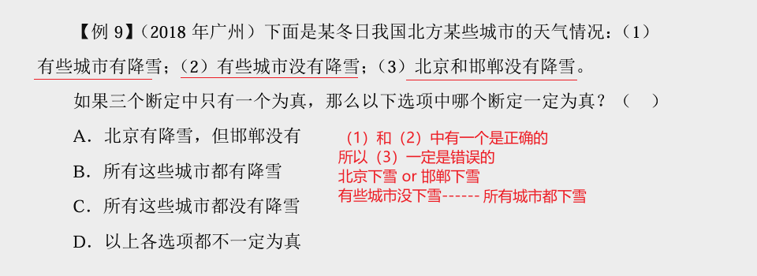

## 一、题型特征

题干中的论述有真有假，且真假未知

真假破案的解题突破口有两个逻辑关系，分别是矛盾关系和反对关系。

## 二、解题方法

1、找突破口：先矛盾，再反对  

2、看其余：一真其余全假，一假其余全真  

3、判断突破口中两句话的真假（可选）。

## 三、例题

## 四、矛盾关系

### **1、特点**：

矛盾包含一真一假

### **2、找矛盾的技巧**：

对象一致

例子：（我没考一百分，全班所有人都考了一百分，不是矛盾，因为对象不一致）

### **3、四组矛盾关系**：

**①**A与-A 

**②**A∩B与-（A∩B）=-A或-B  星期一和星期二我都去上班，矛盾，不都去 上班 

**③**A→B与A∩-B   （如果他好，我就好，他好→我好，矛盾，他好且我不 好；只有他好，我才好，我好→他好，矛盾，我好且他不好）

:::details 例题

（2012年吉林）张明说：如果选李明当教练，那么王芳就要当领队。  李红：我不同意。  以下哪项最符合李红的意思：  

A．选李明当教练，但不能让王芳当领队 

 B．如果选李明当教练，就不能让王芳当领队  

C．不选李明当教练，但要让王芳当领队 

 D．如果不选李明当教练，就要让王芳当领队

:::

**④**有的是与所有不是  有的不是与所有是 

### 4、例题

采用了第四个矛盾

---

采用了第三个矛盾

---

---

采用了矛盾一

---

采用了第三个矛盾

---

采用了第三个矛盾关系

---

## 五、反对关系

两种类型  

①有的是    和    有的不是   （必有一真）  

可以同真，不可同假  

记忆：有的有的必有一真  

---

②所有都是   和   所有都不是  （必有一假）  

可以同假，不可同真  

记忆：所有所有必有一假

### 1、例题

---

