## 一、翻译推理

### 1、解释

题型特征：  

1.题干和选项中出现比较明显的逻辑关联词  

2.提问方式是“可以推出”“不能推出”等 

例：

如果一个人在 A 城市乱扔垃圾就会被认为没有道德；

一个人如果没有 道德，A 城市里就没有人和他做朋友；

一个人如果在A城市没有朋友就寸步难 行，无法继续留在这里。

从上述叙述中，可以推出以下哪项结论：

解题思维：  

1.先翻译（将题干中逻辑关联词所在句子翻译成用箭头推出的关系）  

2.再推理

【注意】解题思维：  

1.先翻译：将题干中逻辑关联词所在句子翻译成用箭头表示的形式。即挑出 逻辑关联词所在的句子，将句子翻译成用箭头表示的形式，例如“如果天下雨， 那么地会湿”，“如果……那么……”是逻辑关联词，需要知道遇到这个关联词怎 么翻译。  

2.再推理：翻译完后用推理的方式，找出可以推出的选项。  

3.做题时，一般是先翻译，再推理。

### 2、翻译规则之“前推后”

#### 2.1、解释

如果……那么……  例句：如果你能考上公务员，那么我给你买雪糕。  

你考上公务员→给你买雪糕  你考上→我买

#### 2.2、常见关联词

等价关联词：（前→后）  

若……，则……；  

只要……，就……；  

为了……，一定（必须）……；  

所有……，都……；  

……是……的充分条件  

#### 2.3、例子

如果超哥不拖堂，那么我就放心了 -拖堂→放心  

为了成功，一定要奋斗啊  

上岸→听课  

凡是党中央的正确决定，我们都坚决拥护  

党中央→拥护

#### 2.4、逆否等价

推理规则之“逆否等价”A→B等价于-B→-A 

如果某人是北京人，那么一定是中国人  北京人→中国人 

1.如果张三是北京人，那么张三是不是中国人？  

2.如果李四不是北京人，那么李四是不是中国人？  

3.如果王五是中国人，那么王五是不是北京人？  

4.如果赵六不是中国人，那么赵六是不是北京人？  符号表示：A→B=-B→-A  

口诀：肯定箭头前必肯定箭头后  

否定箭头后必否定箭头前  

否前肯后无必然结论/不确定（可能、可能不）  

如果你报了班，就免费送你书。那不报班的同学有免费书吗？

#### 2.5、例子

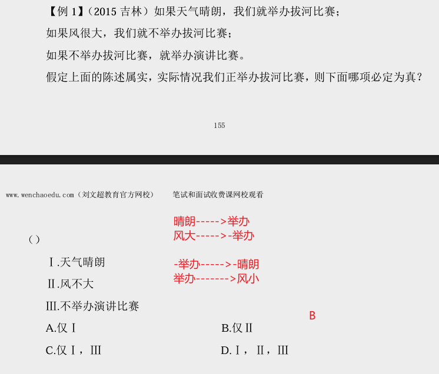

---

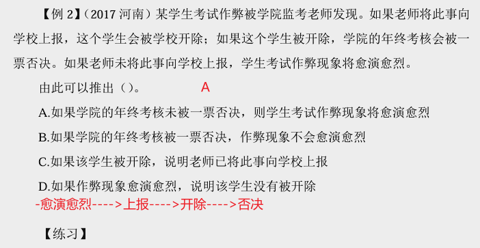

---

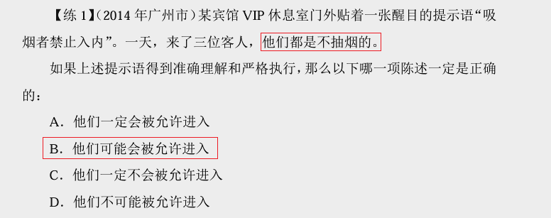

---

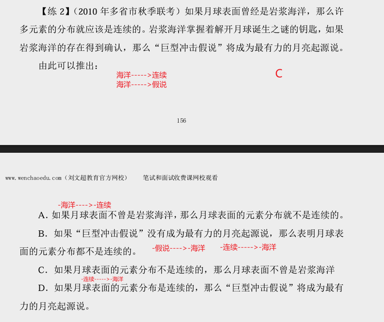

---

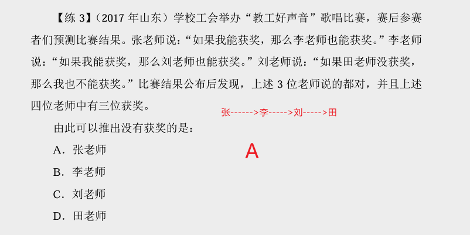

---

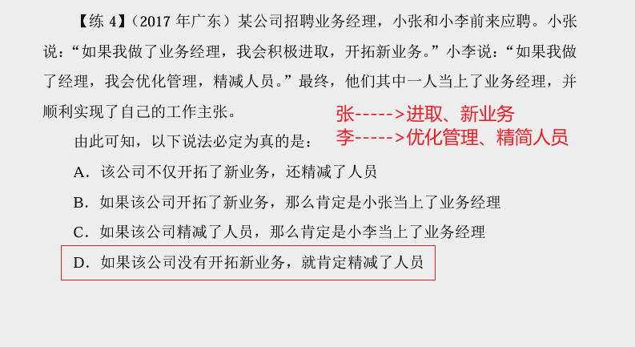

---

### 3、翻译规则之“后推前”

#### 3.1、解释

只有……才……  

例句：只有通过笔试，才能考上公务员。  

#### 3.2、常见关联词  

只有……才……  

不……不……  

除非……否则不……  

……是……的基础/假设/前提/关键  

……是……的必要/必不可少的条件  

#### 3.3、注意

1.除非A否则不B：B→A  除非A否则B：-B→A  

2.……是……的基础/假设/前提/关键  

……是……的必要/必不可少的条件  

谁必不可少谁放在箭头后面。

#### 3.4、例题

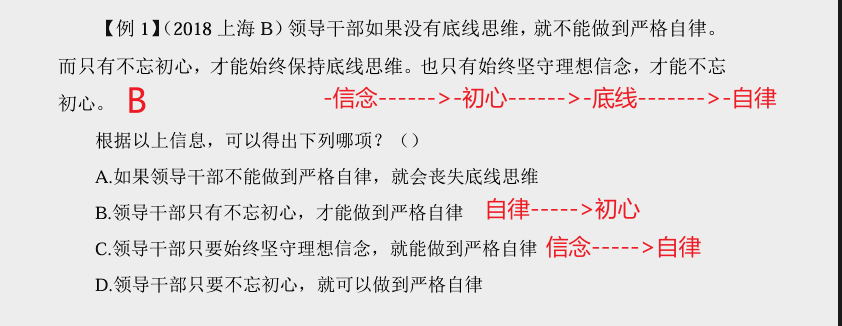

---

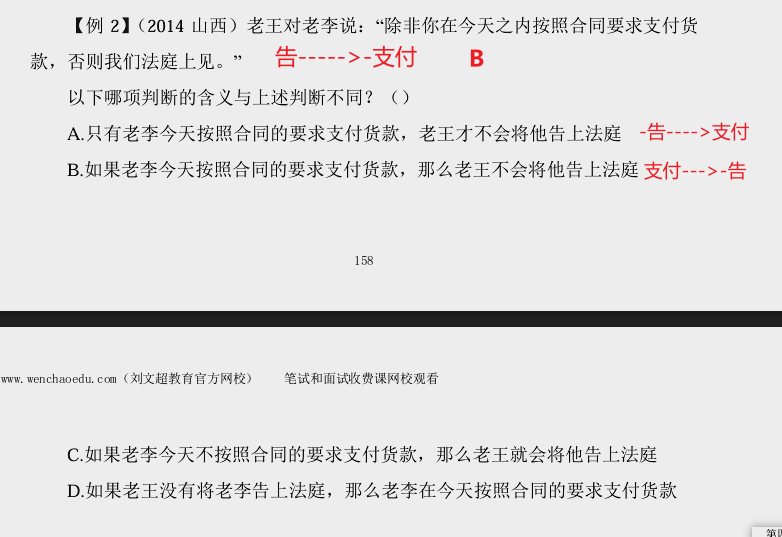

---

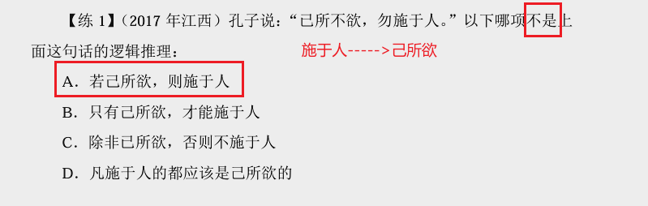

---

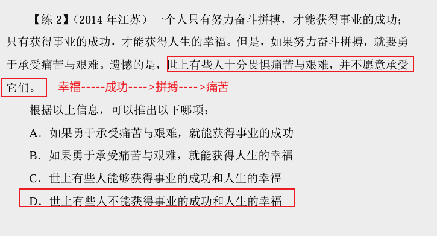

---

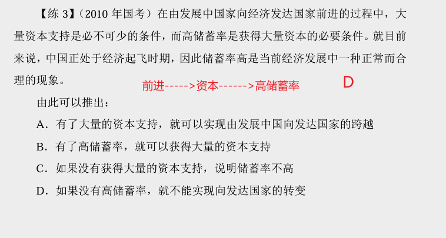

---

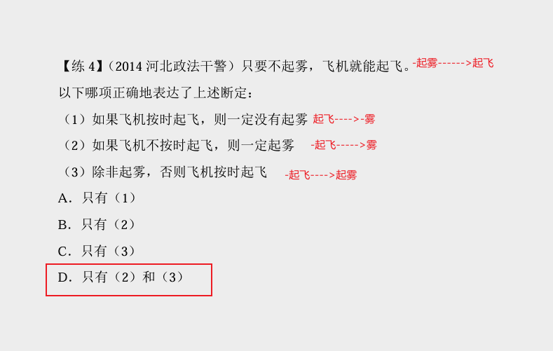

---

### 3、且和或

#### 3.1、解释

A且B：二者同时成立  

A或B：二者至少一个成立  

要么A，要么B：二者只有一个成立

例句：  

我长得帅并且有才华  

我参加国考或者参加省考  

要么张三是我老婆，要么李四是我老婆

#### 3.2、常见关联词： 

| 且           |
| ------------ |
| 和           |
| 既……又……     |
| 不仅……而且…… |
| ……但是……     |

| 或             |
| -------------- |
| 或者……或者……   |
| ……和……至少一个 |
| 要么……要么……   |
| ……和……只有一个 |

#### 3.3、或关系的解释

“或”的翻译：否1→1

“或”关系为真时，否定一项可以得到另一项为真

甲：今年我参加了国考或省考（国/省/都参加）  事实：国考没有甲能报的岗位，参加不了  请问甲会参加什么考试？ 

#### 3.4、例题

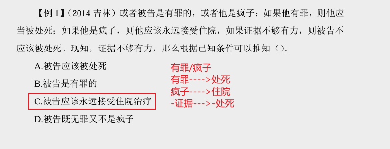

---

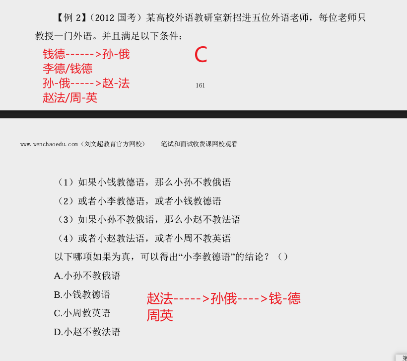

---

#### 3.5、摩尔根定律

##### 3.5.1、解释

（1）-（A且B）＝-A或-B  

（2）-（A或B）＝-A且-B  非号放进去，“且”变“或”，“或”变“且”

##### 3.5.2例题

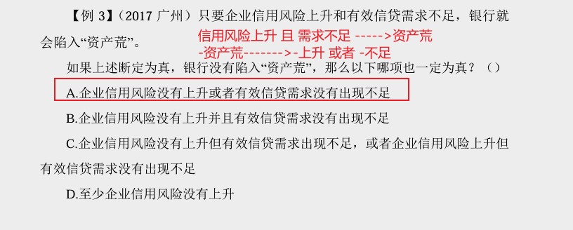

---

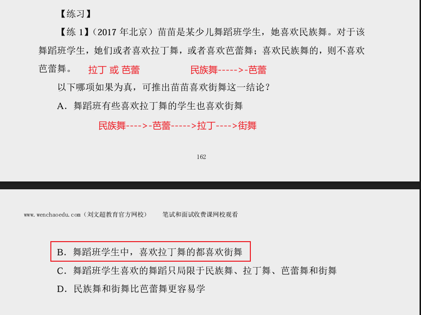

---

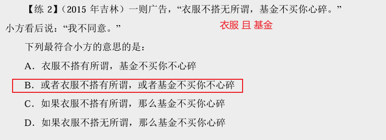

---

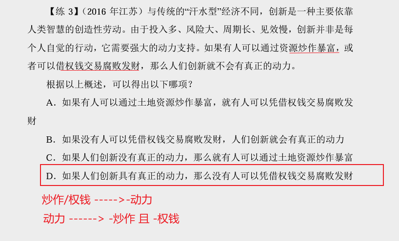

#### 3.6、总结

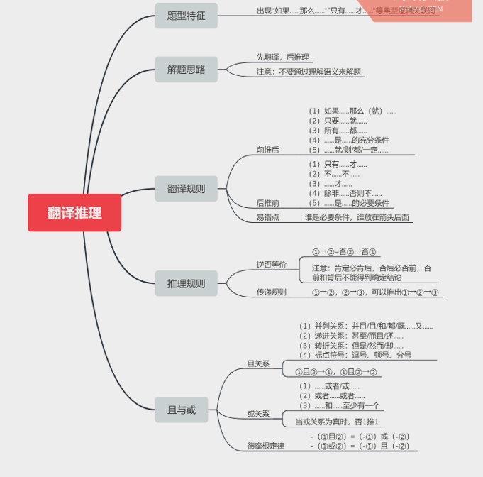