## 一、排除法、代入法

### 1、排除法

读一句排除一句

#### 1.1、例题

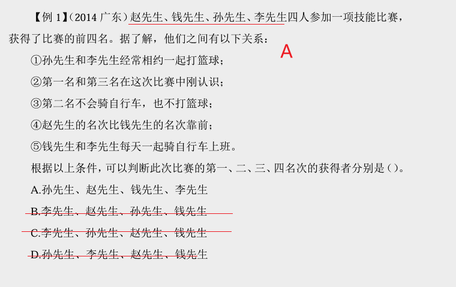

---

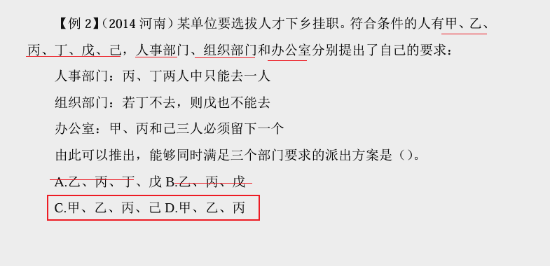

---

### 2、代入法

选项代入题干验证  

题干条件确定优先排除  

题干条件不确定尝试代入

#### 2.1、例题

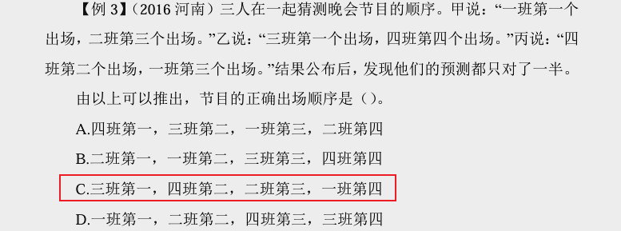

---

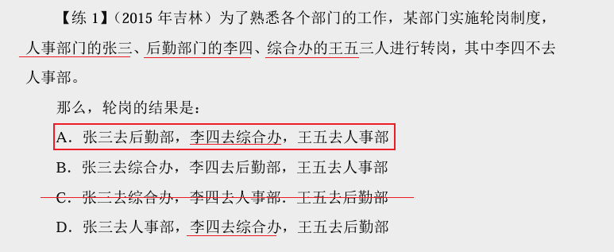

---

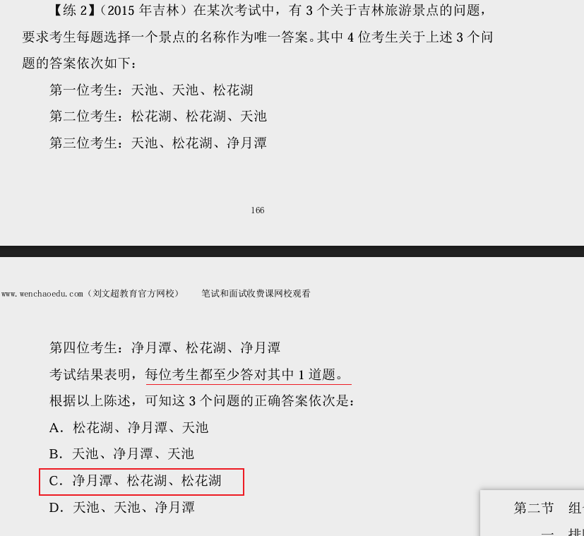

---

## 二、辅助法

1.最大信息（条件中出现次数最多的词）：   

以此作为推理起点  

2.符号：“＞”、“＜”  

往往涉及年龄、成绩、收入、身高等大小比较  

3.列表格

### 1、最大信息数例题

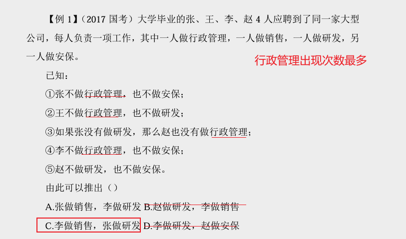

---

### 2、符号例题

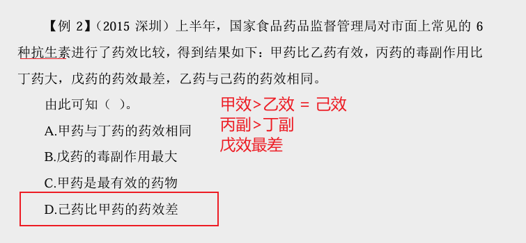

---

### 3、列表格例题

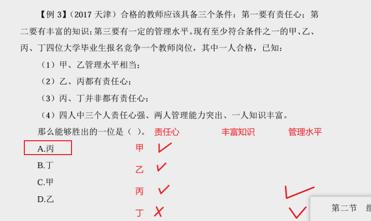

---

### 4、例题

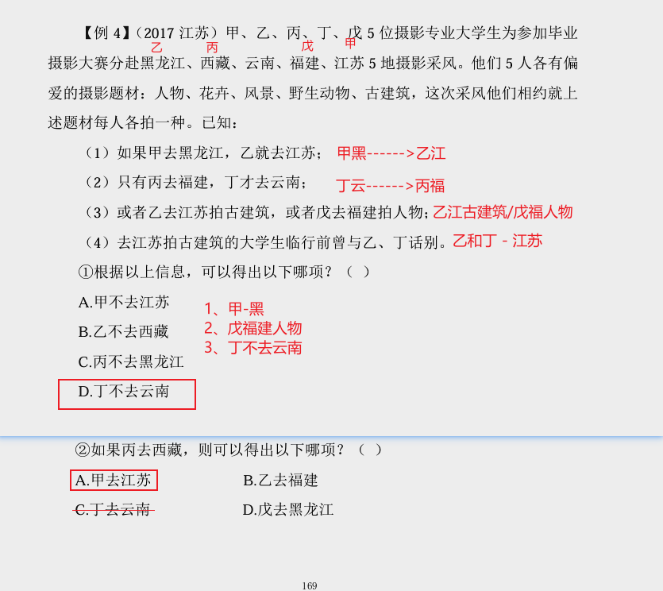

---

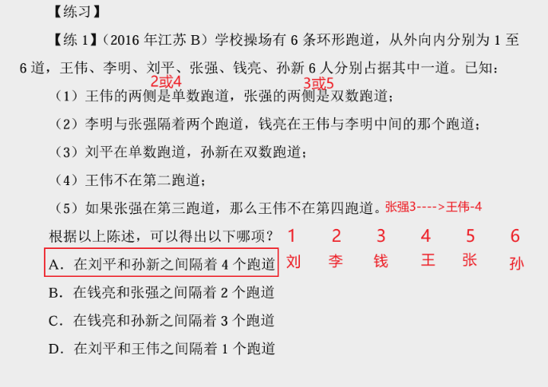

---

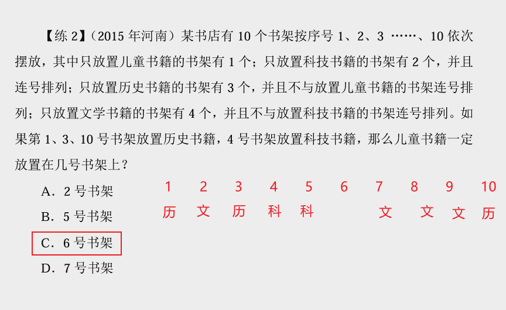

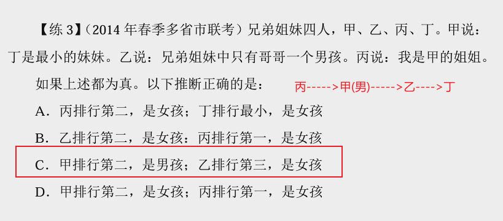

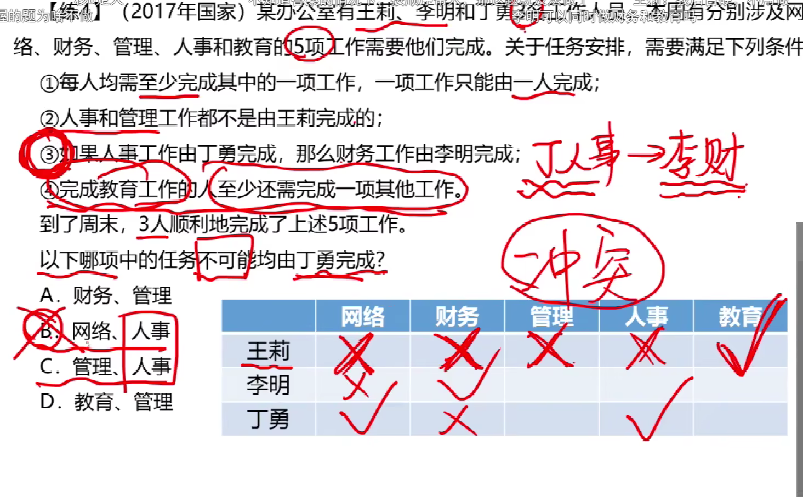

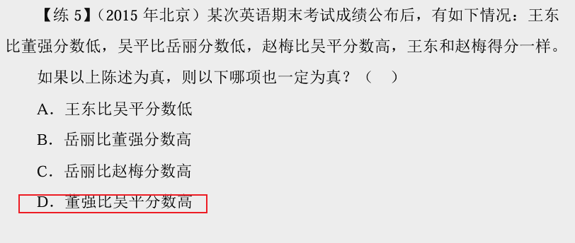