## 基期、现期

对比参照的时期成为基期，而相对与基期的称为现期

例如：今年比去年公司应收增加100万

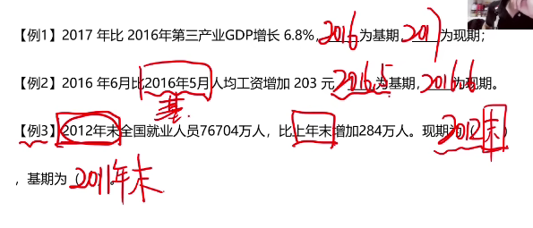

## 增长量

增长量是指基期量与现期量增长（或减少）的绝对量。

表述特征：……比……增长（下降）某个具体的值

增长量=现期量-基期量

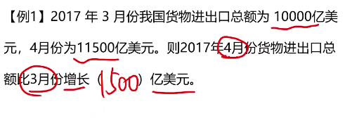

## 增长率

增长量与基期量的相对变化，即在基期量的基础上增长了多大的幅度

增长率又称为增幅、增速、增长幅度、增长速度等

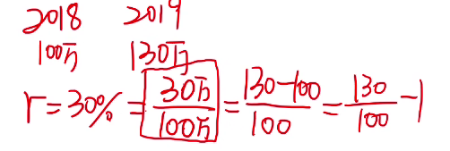

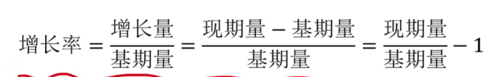

总共有6种出题方式

## 现期量、增长率

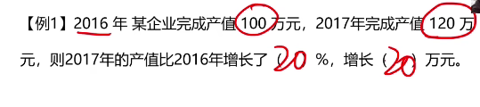

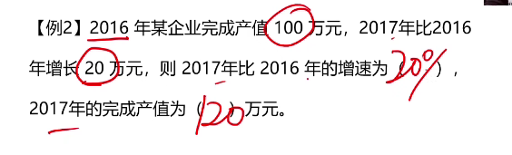

## 高频易错考点

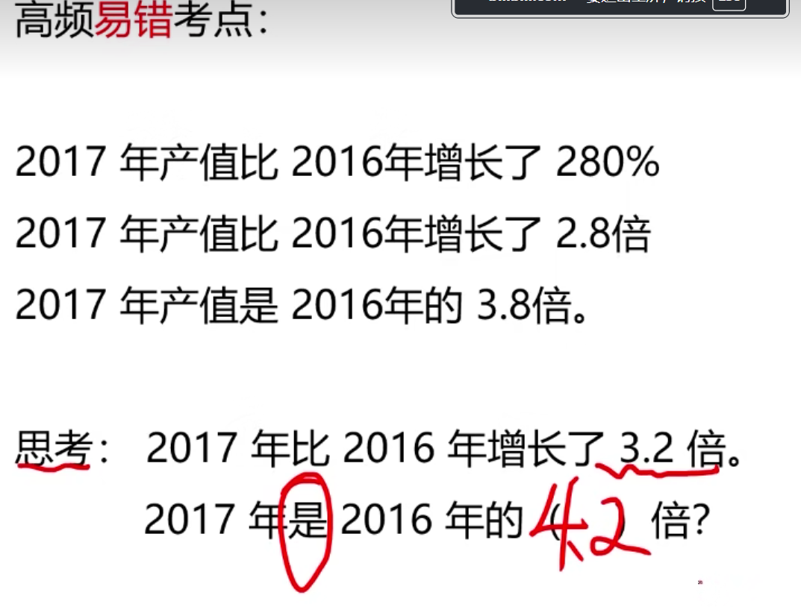

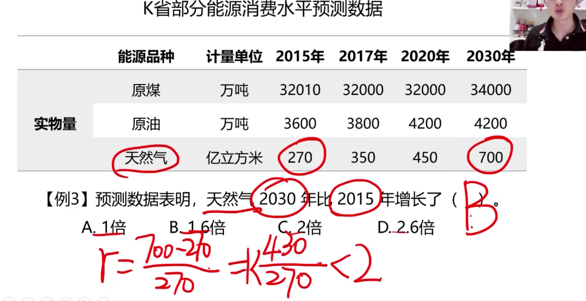

## 年增长量

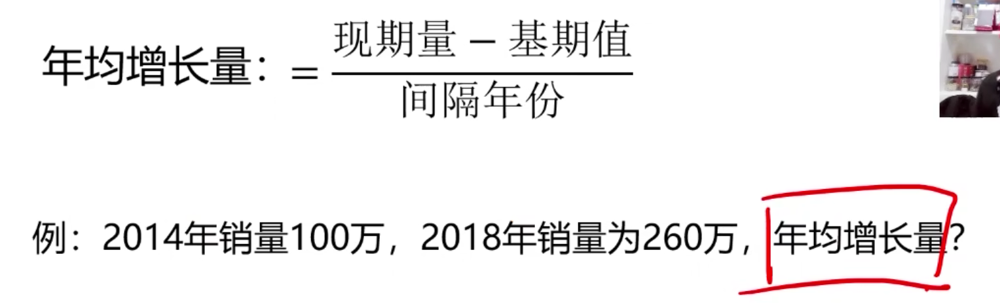

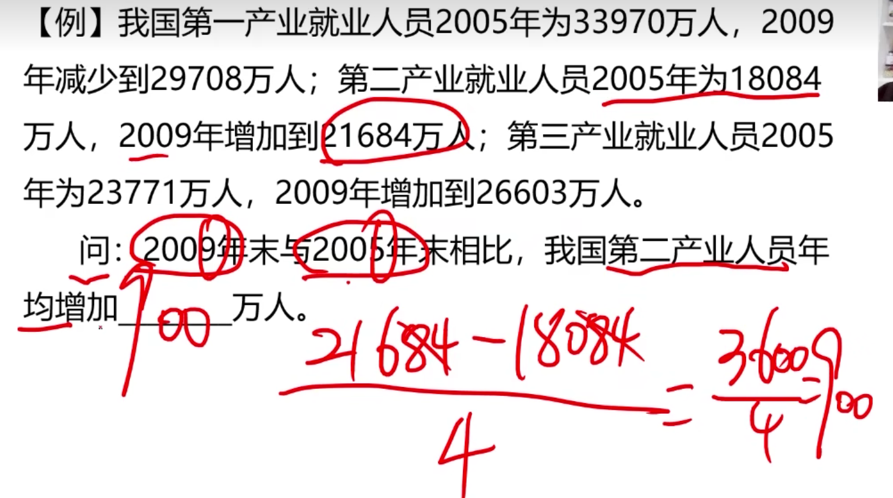

## 年均增长率

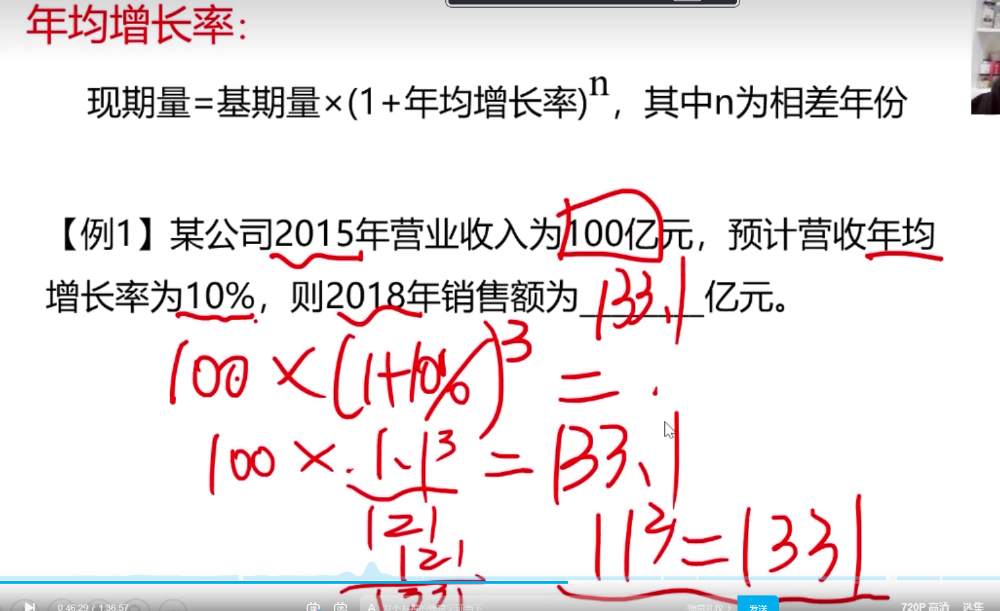

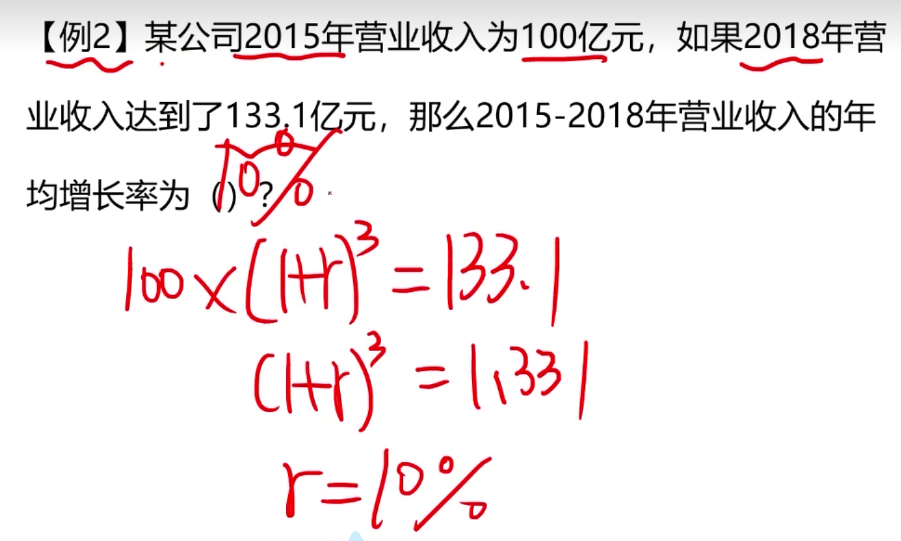

## 同比、环比

与历史同期相比较

现在统计周期和上一个统计周期相比较

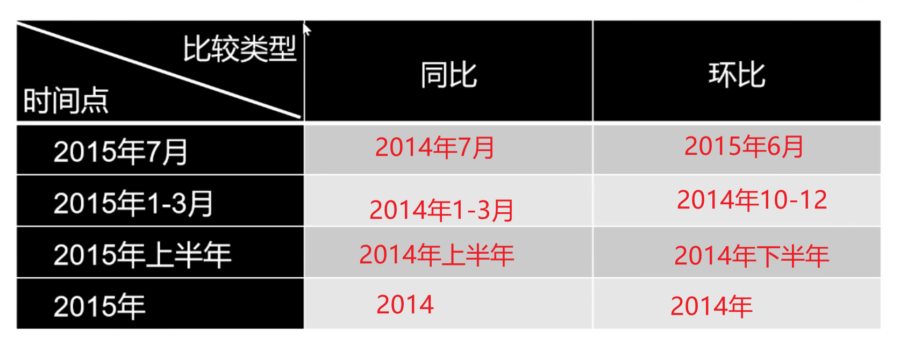

## 比重

指某部分在总体中所占的百分比，一般都是百分数的形式

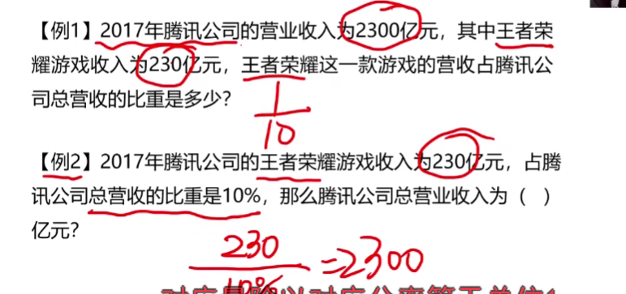

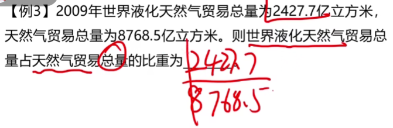

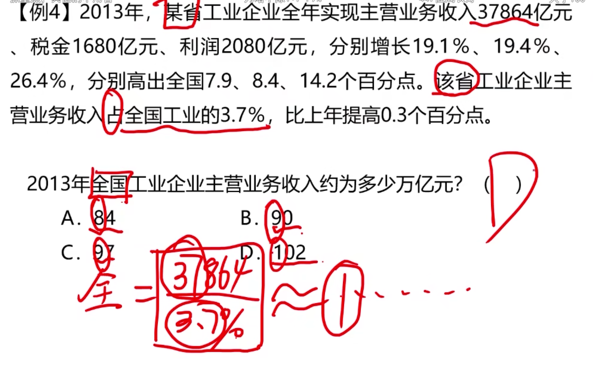

## 倍数

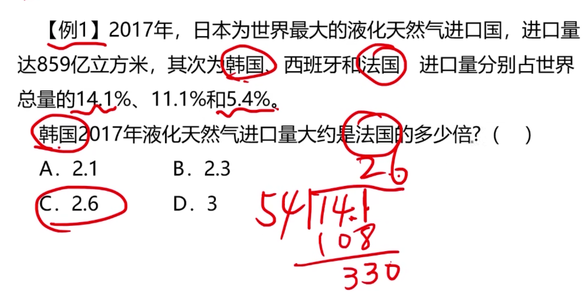

---

## 平均数

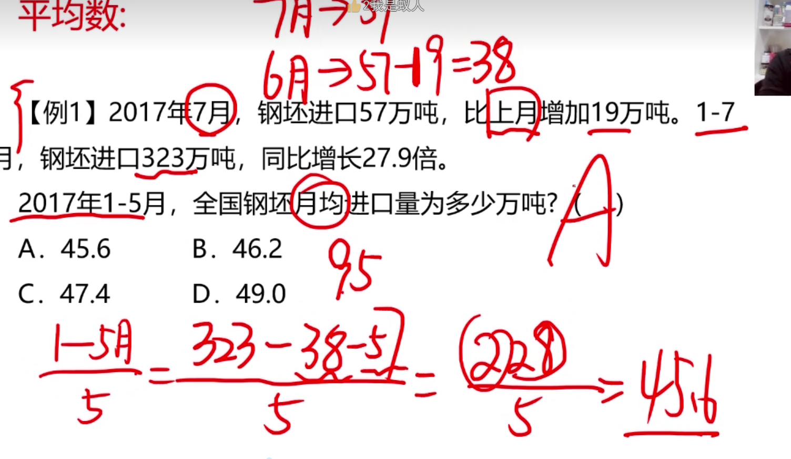

## 百分数

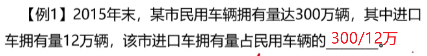

## 百分点

今年经济增速为6.9％，今年比去年怎加了1个百分点，去年增速是5.9%

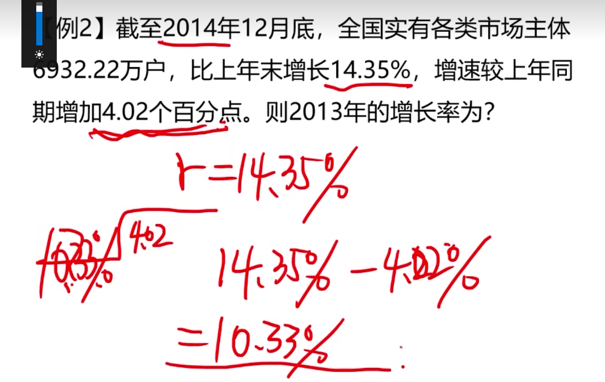

## 成数

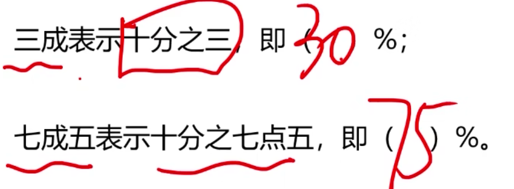

## 翻番

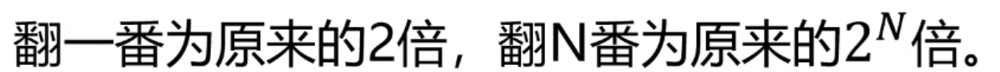

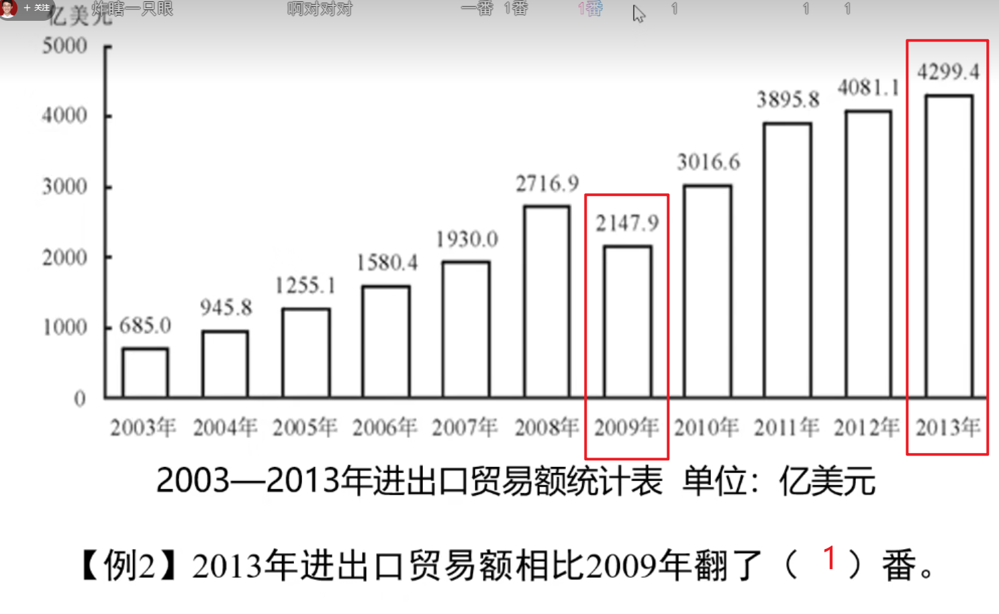

## 顺差和逆差

顺差 = 出口 - 进口

逆差 = 进口 - 出口

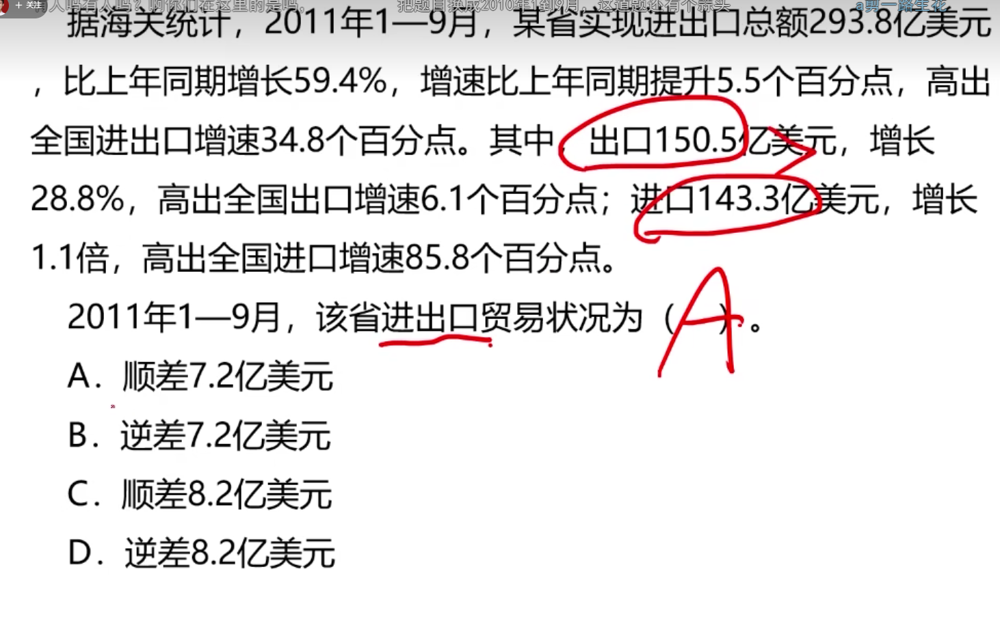

## 国内生产总值：GDP

GDP = 第一产业增加值 + 第二产业增加值 + 第三产业增加值

增加值改成GDP就行了

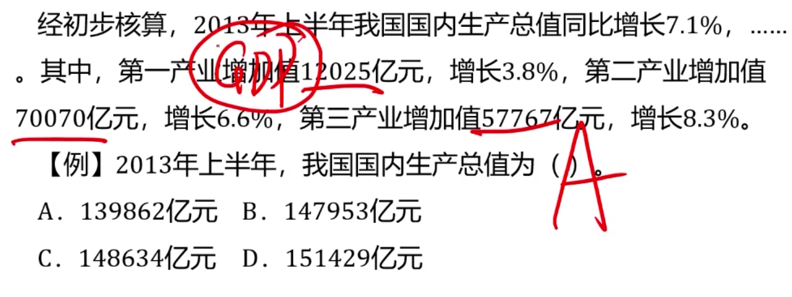

## 三大产业

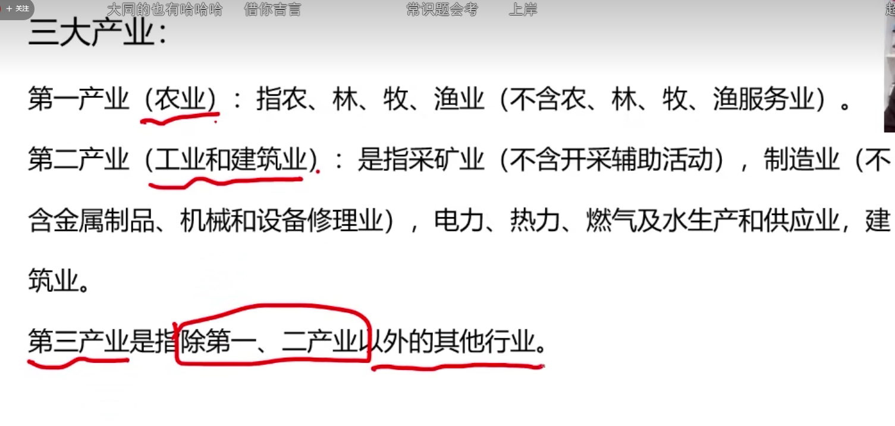

## 恩格尔系数

食品支出总额占个人消费支出总额的比重

这个比例越低，反应生活水平越高

当大于60%		贫穷

50%~60%		温饱

40%~50%		小康

30%~40%		相对富有

20%~30%		富足

20%以下		   极其富有

## 基尼系数

指国际上通用的，用以衡量一个国家或地区居民收入差距的常用指标，基尼系数介于0-1之间，基尼系数越大，表示不平等程度越高

国际上 0.4是红线

低于0.2	绝对平均

0.2~0.3	比较平均

0.3~0.4	相对合理

0.4~0.5	差距大

大于0.5	

中国的基尼系数0.488

## 五年计划

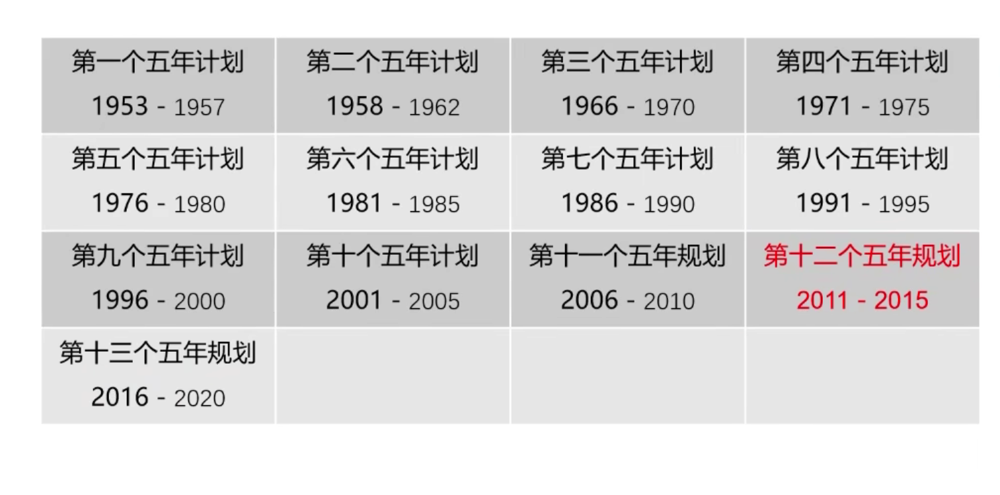