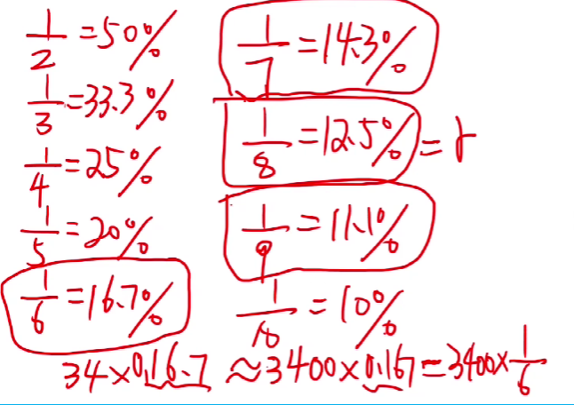
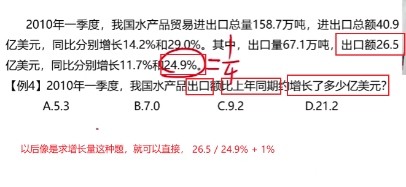
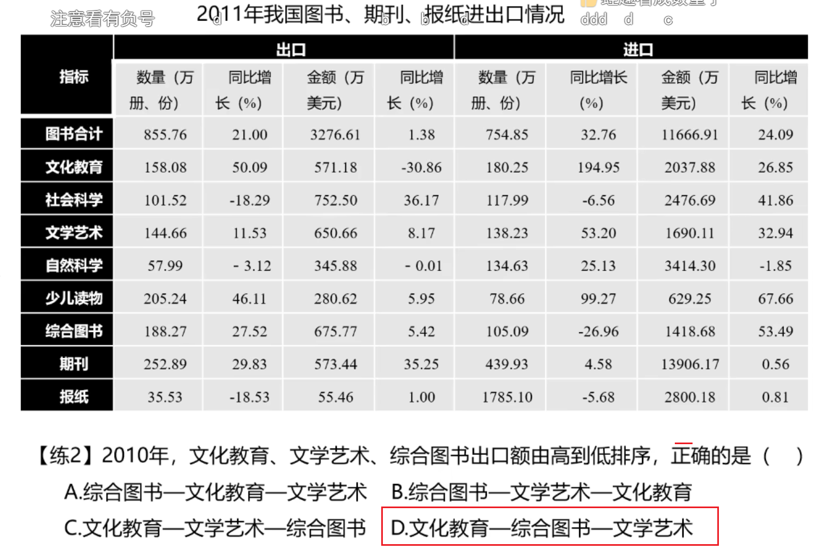
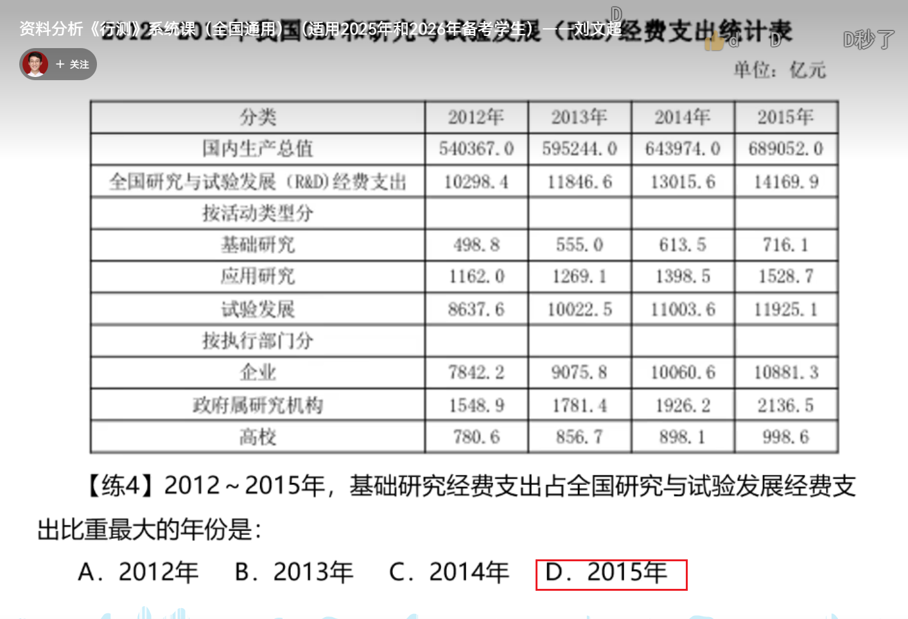

# 速算技巧

## 一、截位直除

### 1、多步连除

### 2、叠除估算法

#### 2.1、分开估算

**例题**

答案C

估算后面的那个 选项差距较小的时候

#### 2.2、乘法估算

 

### 3、特殊分数

 

答案B

---

答案C

---

答案A

---

答案B

---

---

## 二、分数比较

### 1、直除首位

### 2、变化速度

