## 一、基期量和现期量 

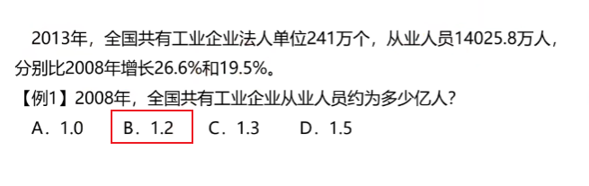

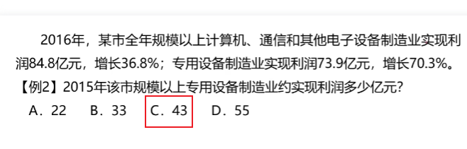

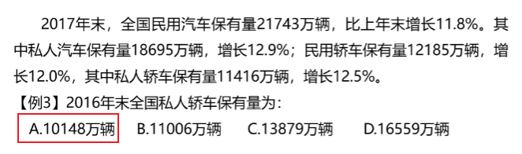

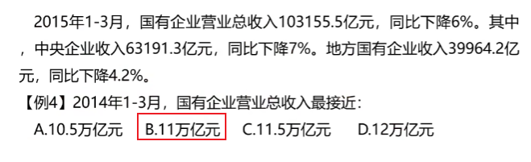

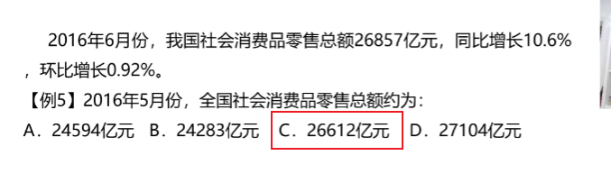

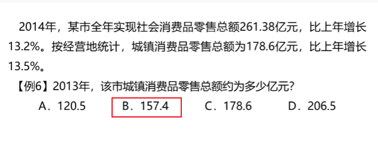

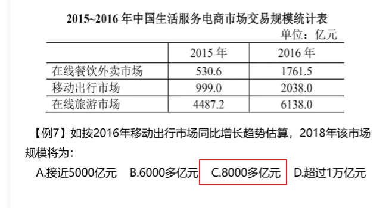

从999到2038，大概增长了一半，所以2017也差不多增长一半4000多，2018就是8000多

### 1、练习

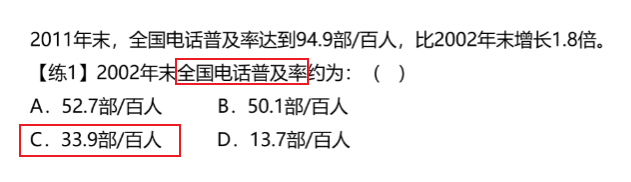

理解：2011年比2002年增长了1.8倍，就是相当于番了2.8番

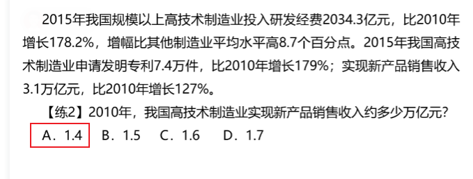

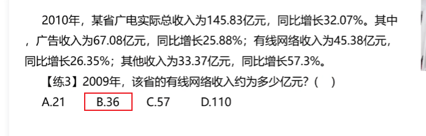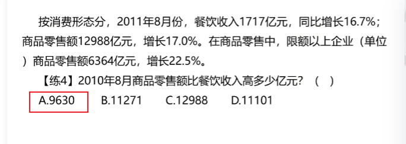

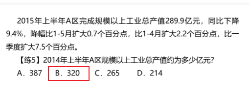

 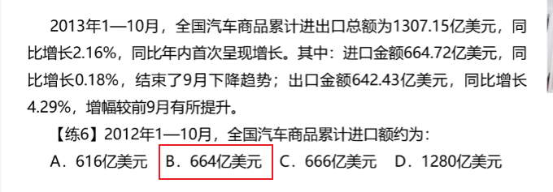

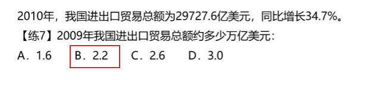

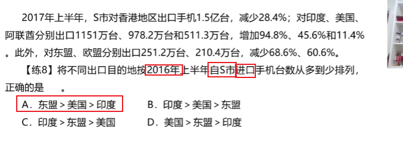

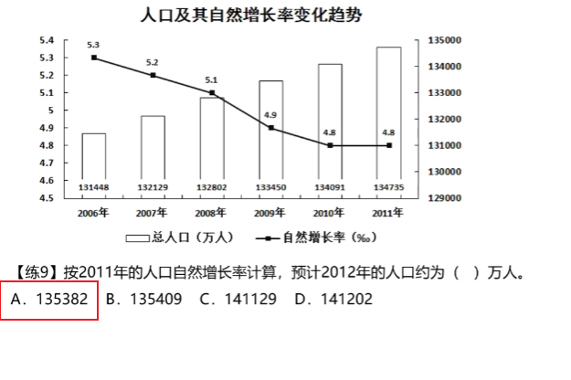

解法一：

134735 x 0.0048	---------->	134.735 x 4.8

这时候乘数扩大到5，扩大了大约4%，所以被乘数也需要减小4%

解法二：

自己看视频，我看不懂

## 二、间隔增长率

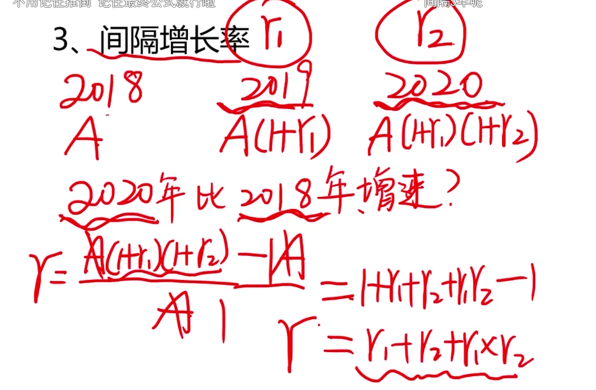

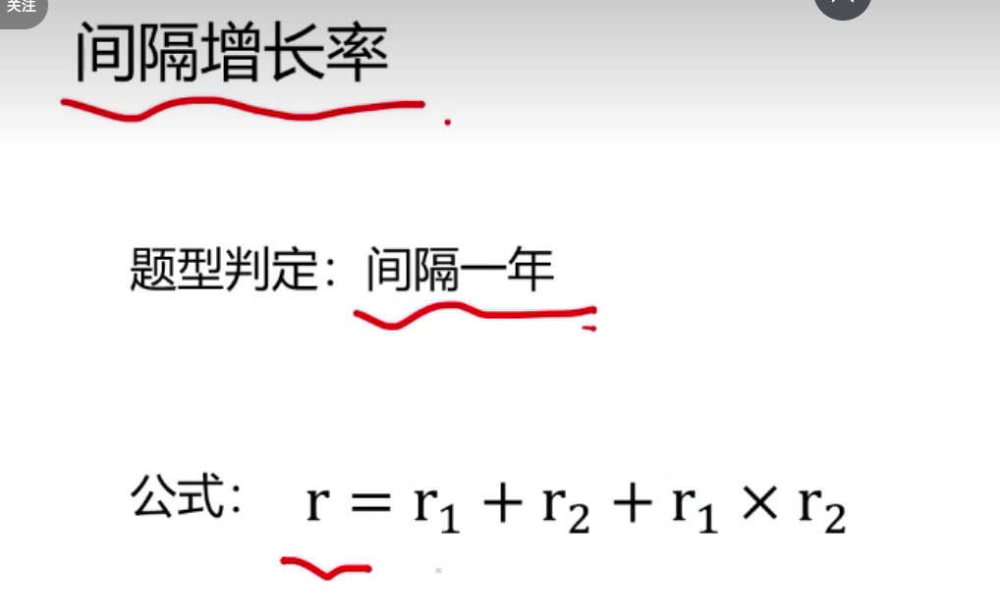

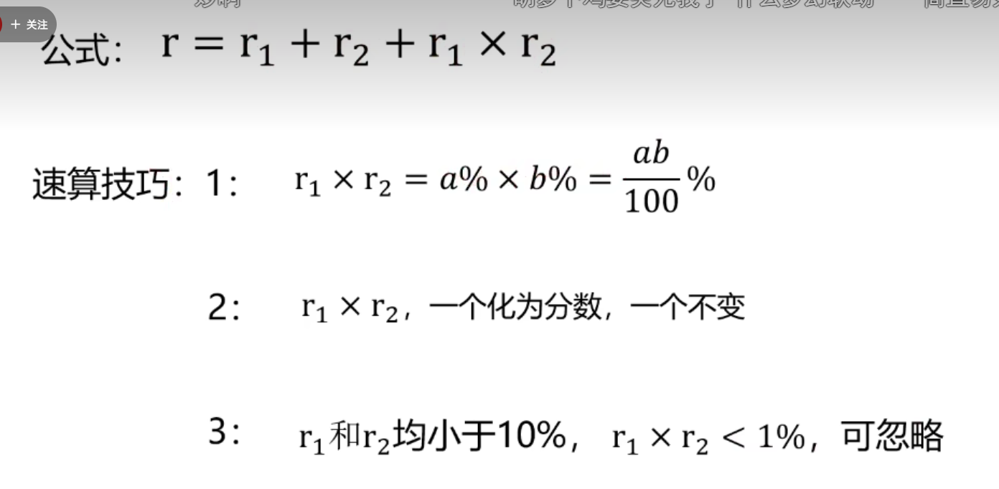

### 1、练习

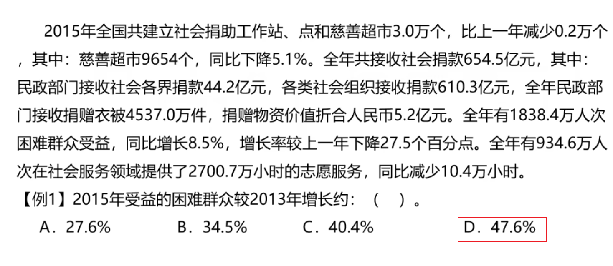

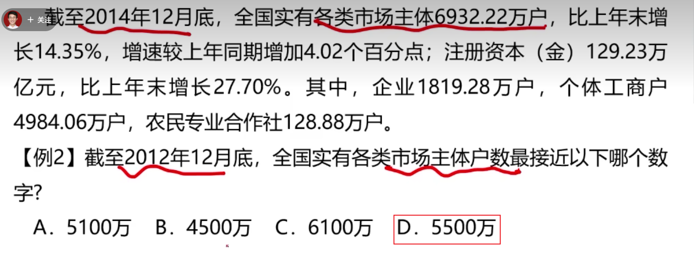

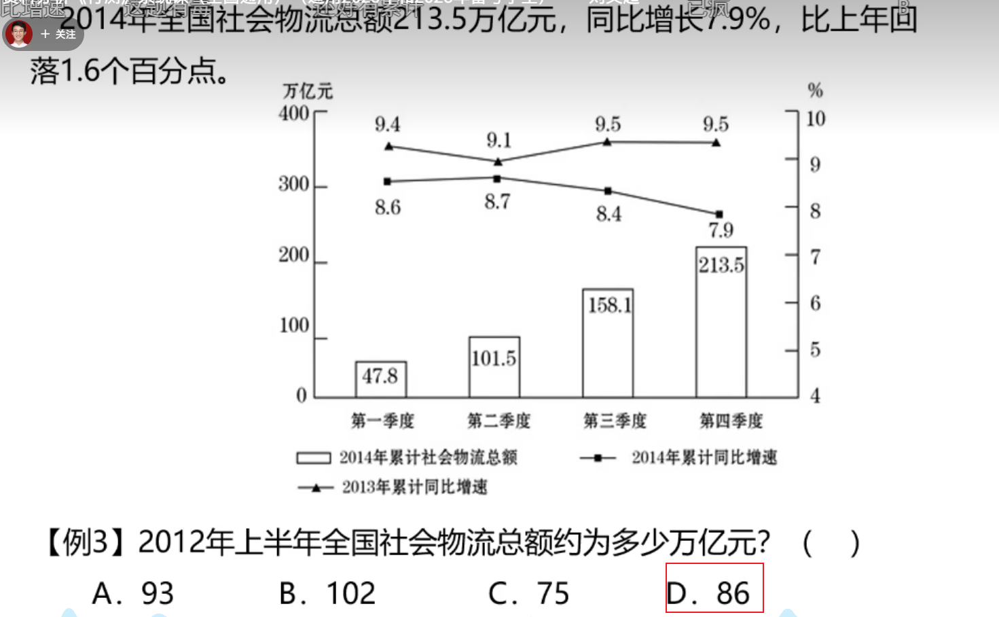

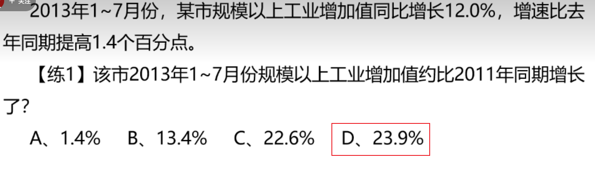

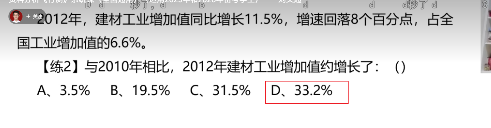

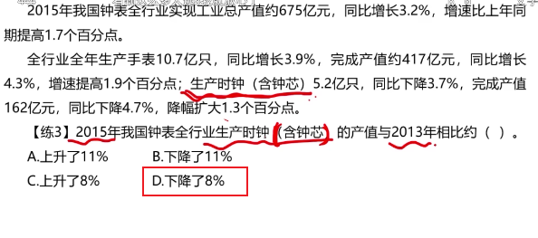

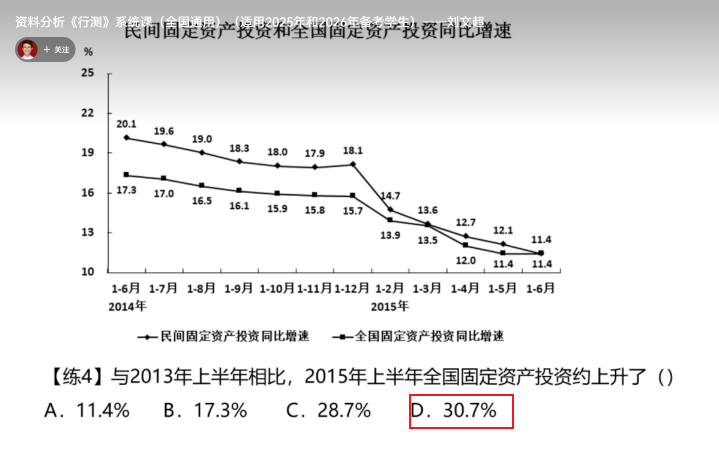

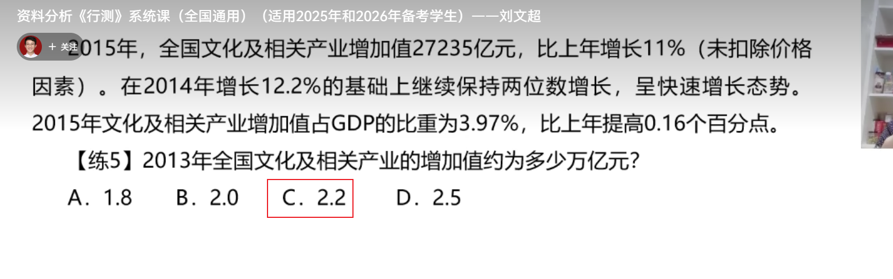

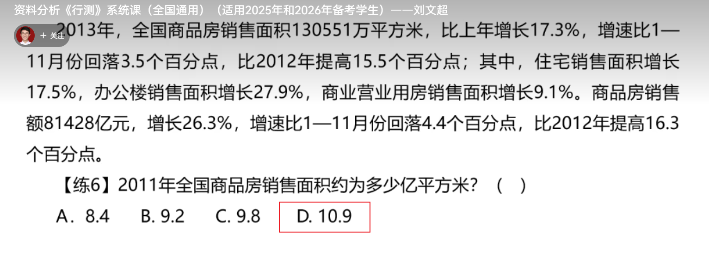