## 一、安装git

### 1、点击以管理员身

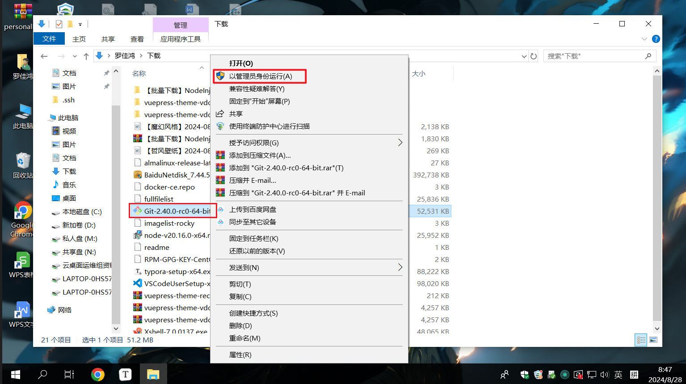

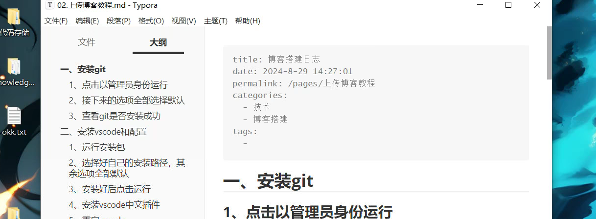

### 2、接下来的选项全部选择默认


### 3、查看git是否安装成功


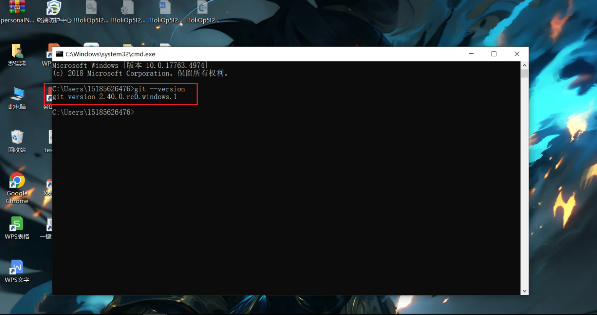

### 3.1、注册全局
git config --global user.name "username"    //（ "username"是自己的账户名，）

git config --global user.email "username@email.com"     //("username@email.com"注册账号时用的邮箱)

需要注意的是，设置了user.name之后，每次提交代码时Git都会将该用户名称与提交信息一同记录下来，因此建议将该值设置为自己的真实姓名或用户名，以方便其他开发者识别和联系到你。

## 二、安装vscode和配置

### 1、运行安装包

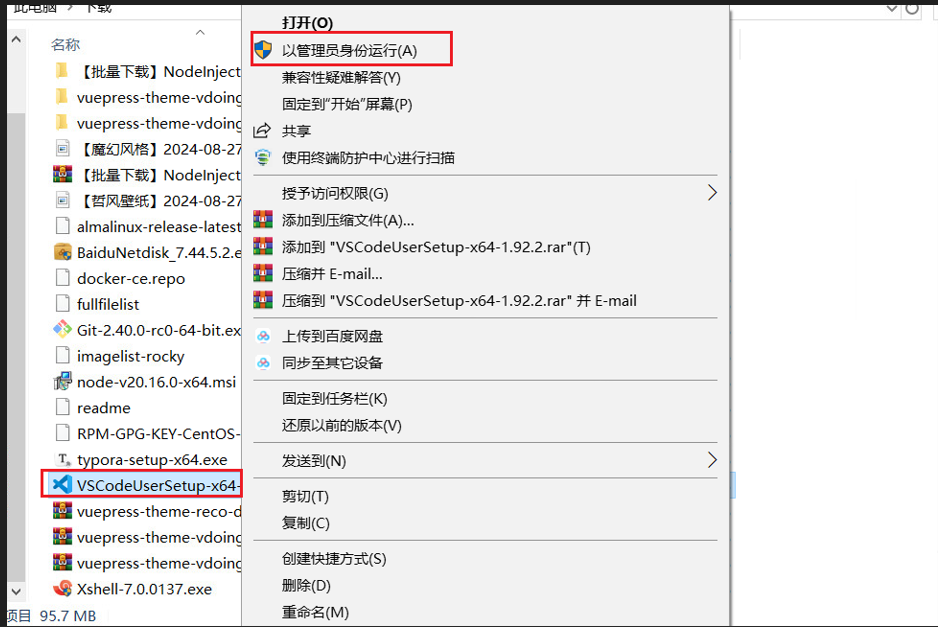

### 2、选择好自己的安装路径，其余选项全部默认


### 3、安装好后点击运行

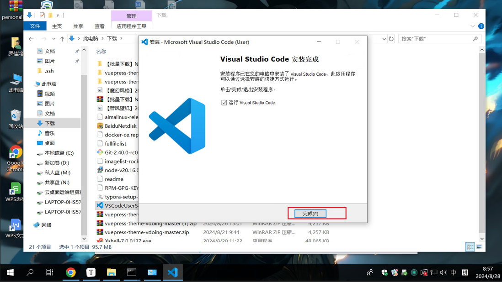

### 4、安装vscode中文插件

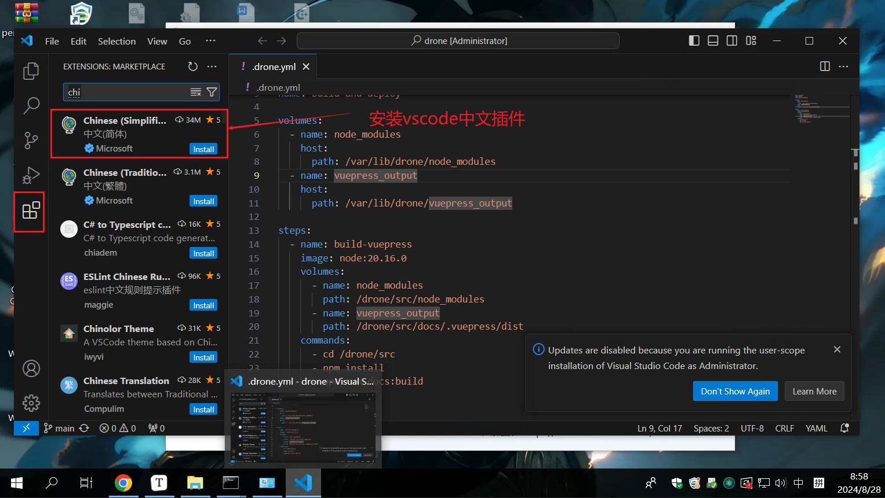

### 5、重启vscode

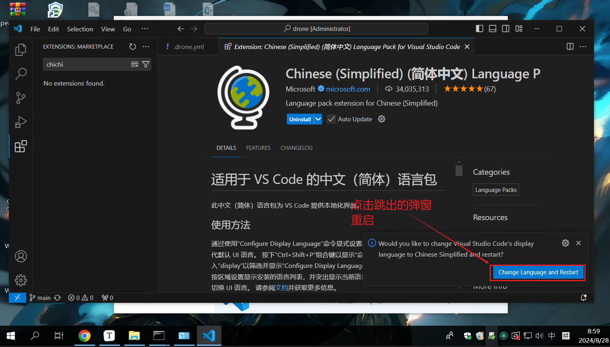

### 6、修改设置

不修改设置，无法提交代码到仓库

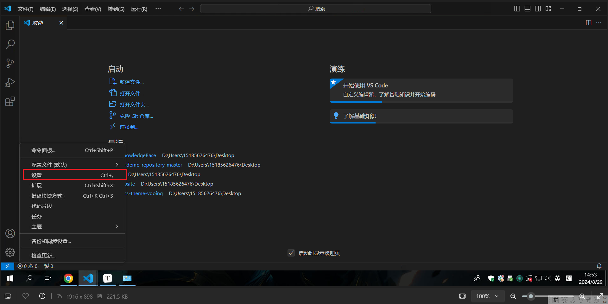

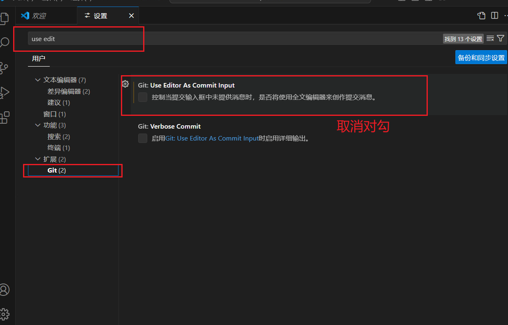


## 三、克隆仓库

### 1、填入仓库地址，拉去仓库

仓库地址：https://git.gzgcyw.com/15185626476/gcywKnowledgeBase.git

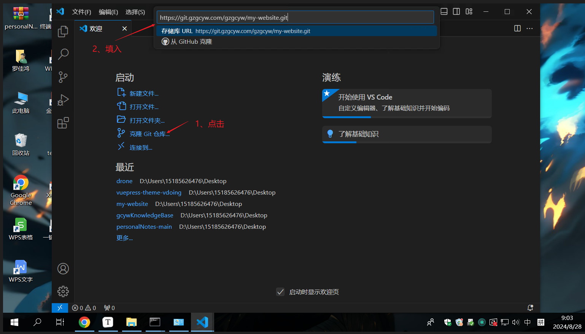

### 2、选择仓库存储的本地地址

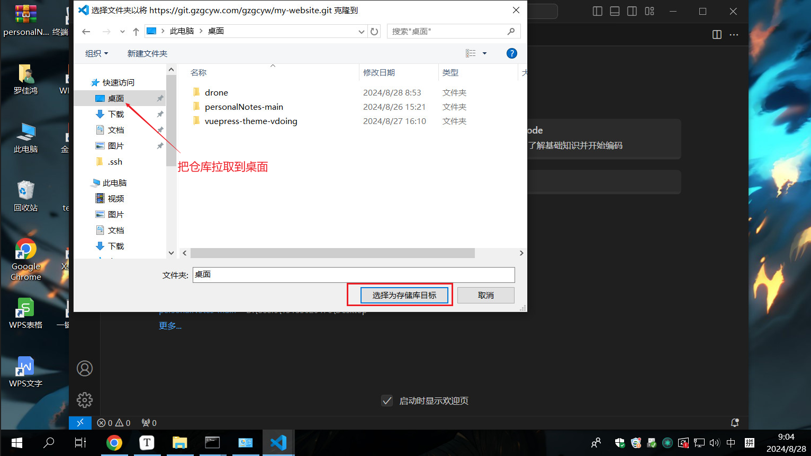

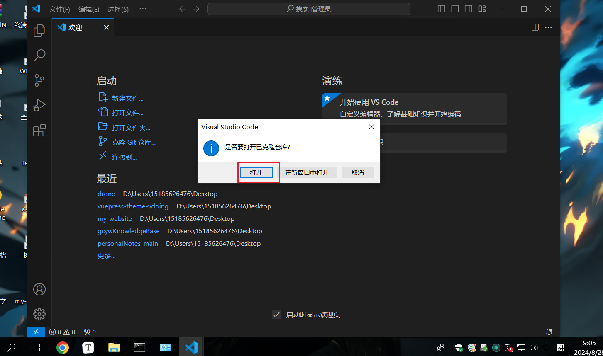

## 四、命令实现

1、拉取仓库代码

```
git clone  https://git.gzgcyw.com/15185626476/gcyw_knowledgebase.git
```

2、预更新仓库

```
git add .
```

3、推送代码

```
git push origin main
```


